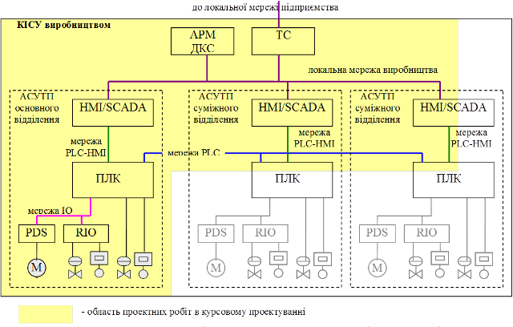

# 1. МЕТА І ЗАВДАННЯ КУРСОВОГО ПРОЕКТУВАННЯ

***Метою курсового проектування*** є закріплення студентами знань про зміст і послідовність проектування та набуття вмінь виконання проектно-розрахункових робіт на всіх стадіях проектування комп’ютерно-інтегрованих систем управління (***КІСУ***). Оволодіння технікою проектування КІСУ є одним із основних завдань вивчення дисципліни "Проектування комп’ютерно-інтегрованих систем". Успішне виконання курсового проекту сприятиме закріпленню та поглибленню знань, отриманих у процесі вивчення дисципліни, набуттю навичок виконання основних схем і креслень проектів, підготовці студентів до ви­конання дипломного проекту.

***Завдання до курсового проекту*** формується таким чином: "*Розробка проекту КІСУ (вказується виробництво) з підсистемою управління (вказується основне відділення)"*. Відповідно до завдання, курсове проектування передбачає проектні роботи над КІСУ всім виробництвом або технологічним комплексом (***ТК***), та зокрема над автоматизованою системою управління технологічним процесом (***АСУТП***), яка входить до її складу як підсистема. 

На рис.1 показана типова структура КІСУ виробництвом. Проектні роботи в курсовому проекті проводяться для АСУТП основного відділення та КІСУ в цілому, шляхом інтеграції існуючих АСУТП суміжних відділень. Таким чином в область проектних робіт входять: 

-           роботи над розробкою АСУТП основного відділення з використанням програмно-технічних засобів всіх рівнів управління: датчики, вторинні перетворювачі, виконавчі механізми, PDS, RIO, ПЛК та HMI/SCADA;

-           роботи над розробкою КІСУ виробництвом шляхом інтеграції АСУТП основного відділення, АСУТП суміжних відділень, підсистем диспетчерського управління та ведення централізованого архіву.  

Рис.1. Область проектних робіт в курсовому проектуванні в контексті типової структури КІСУ виробництвом

При розробці АСУТП основного відділення необхідно використовувати польові засоби (датчики, ВМ, частотні перетворювачі, тощо) як зі стандартним уніфікованими сигналами підключення до контролеру так і з цифровим інтерфейсом (***мережа IO***). Інтеграція програмно-технічних засобів на рівні КІСУ необхідно проводити з використанням промислових мереж рівня контролерів, локальних комп’ютерних мереж та програмних інтеграційних технологій.    

Виконання курсового проекту необхідно проводити з використанням стандартів, нормативної документації, довідників, методичних видань, каталогів та інструкцій користувача. Передбачається, що вибір програмно-технічних засобів та пошук технічної документації для них проводиться студентом самостійно, якщо інше не оговорюється в завданні. Така робота сприяє розвитку нави­чок самостійної роботи з літературою та з мережею Інтернет.