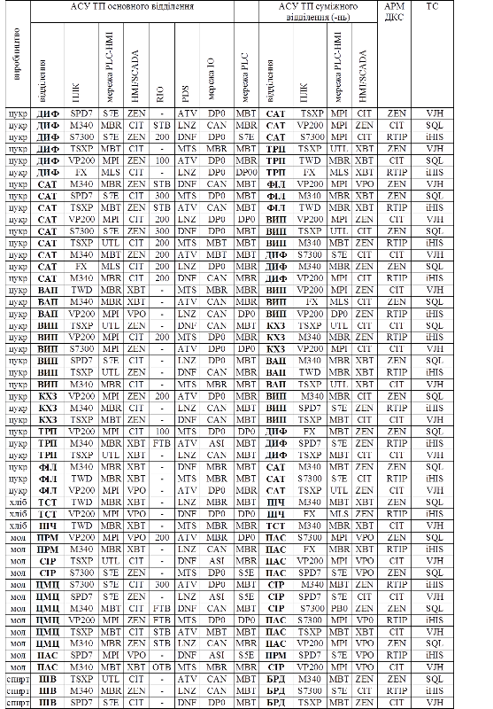
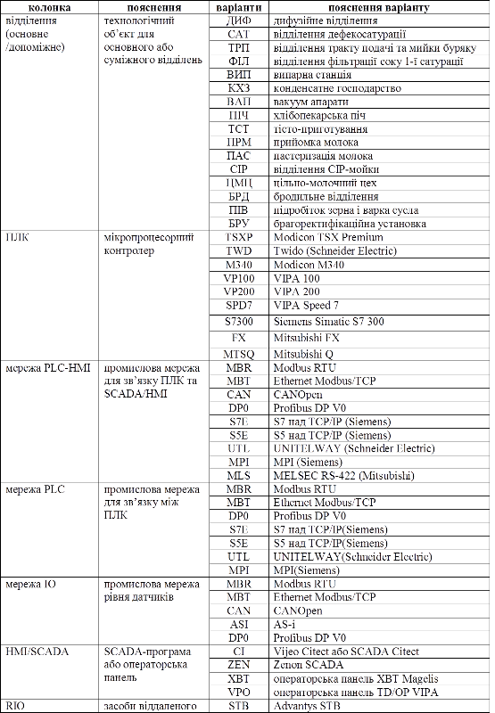

# 2. ТЕМАТИКА КУРСОВИХ ПРОЕКТІВ 

Тематика курсових проектів охоплює проекти КІСУ різними технологічними комплексами харчових підприємств, які розглядаються як технологічні об’єкти управління цих систем. До таких ТК належать як технологічні виробництва у цілому, так і окремі технологічні підсистеми цих виробництв: основний або допоміжний ТК, відділення, цех, лінія виробництва конкретного харчового продукту тощо.

Перелік орієнтовних назв тем наведений в додатку 2. Назва теми визначає тільки тип виробництва та основне відділення (ділянку) виробництва, тому в завданні додатково вказуються суміжні відділення або ділянки (див. рис.1), та додаткові вимоги до технічного та програмного забезпечення системи. Ці уточнення до тем наводяться в додатках Д2.1 з поясненнями в Д2.2. Перелік тем в додатку 2 є орієнтовним. Викладач, по необхідності, може змінити або добавити ряд вимог. Крім того, студент може вибрати або запропонувати свій варіант теми, наприклад при заздалегідь визначеній темі дипломного проекту.

# Додаток 2. Орієнтовний перелік тем для курсового проекту

**Цукрове виробництво.**

1.   Розробка проекту комп’ютерно-інтегрованої системи управління технологічним комплексом цукрового заводу з підсистемою управління трактом подачі та мийки.

2.   Розробка проекту комп’ютерно-інтегрованої системи управління технологічним комплексом цукрового заводу з підсистемою управління дифузійним відділенням.

3.   Розробка проекту комп’ютерно-інтегрованої системи управління технологічним комплексом цукрового заводу з підсистемою управління сокоочисним відділенням.

4.   Розробка проекту комп’ютерно-інтегрованої системи управління технологічним комплексом цукрового заводу з підсистемою управління фільтрами 1-ї сатурації.

5.   Розробка проекту комп’ютерно-інтегрованої системи управління технологічним комплексом цукрового заводу з підсистемою управління випарною станцією.

6.   Розробка проекту комп’ютерно-інтегрованої системи управління технологічним комплексом цукрового заводу з підсистемою управління конденсатним хазяйством.

7.   Розробка проекту комп’ютерно-інтегрованої системи управління технологічним комплексом цукрового заводу з підсистемою управління продуктовим відділенням.

8.   Розробка проекту комп’ютерно-інтегрованої системи управління технологічним комплексом цукрового заводу з підсистемою управління газовою піччю.

9.   Розробка проекту комп’ютерно-інтегрованої системи управління технологічним комплексом цукрового заводу з підсистемою управління приготуванням вапнякового молока.

**Виробництво хлібо-булочних виробів.**

10.      Розробка проекту комп’ютерно-інтегрованої системи управління технологічної лінії приготування хлібо-булочних виробів з підсистемою управління приготування, бродіння та формування тіста.

11.      Розробка проекту комп’ютерно-інтегрованої системи управління технологічної лінії приготування хлібо-булочних виробів з підсистемою управління тунельною піччю.

**Виробництво молочних продуктів.**

12.      Розробка проекту комп’ютерно-інтегрованої системи управління виробництвом цільномолочної продукції з підсистемою управління прийомкою молока.

13.      Розробка проекту комп’ютерно-інтегрованої системи управління виробництвом цільномолочної продукції з підсистемою управління відділення пастеризації.

14.      Розробка проекту комп’ютерно-інтегрованої системи управління виробництвом цільномолочної продукції з підсистемою управління кисломолочним цехом.

15.      Розробка проекту комп’ютерно-інтегрованої системи управління виробництвом цільномолочної продукції з підсистемою управління централізованою станцією мийки.

**Спиртове виробництво.**

16.      Розробка проекту комп’ютерно-інтегрованої системи управління виробництвом харчового етилового спирту з підсистемою управління приготування сусла.

17.      Розробка проекту комп’ютерно-інтегрованої системи управління виробництвом харчового етилового спирту з підсистемою управління бродильним відділенням. 

18.      Розробка проекту комп’ютерно-інтегрованої системи управління виробництвом харчового етилового спирту з підсистемою управління брагоректифікаційною установкою.

**Виробництво солоду.**

19. Розробка проекту комп 'ютерно-інтегрованої системи управління технологічним комплексом виробництва солоду з підсистемою управління процесами обробки, замочування та пророщення ячменю. 

20. Розробка проекту комп 'ютерно-інтегрованої системи управління технологічним комплексом виробництва солоду з підсистемою управління процесами сушіння та обробки солоду. 

**Виробництво пива.**

21. Розробка проекту комп' ютерно-інтегрованої системи управління технологічним комплексом виробництва пива з підсистемою управління процесами приготування сусла. 

22.  Розробка проекту комп' ютерно-інтегрованої системи управління технологічним комплексом виробництва пива з підсистемою управління процесами бродіння та дозрівання сусла (класичний спосіб). 

24.  Розробка проекту комп 'ютерно-інтегрованої системи управління технологічним комплексом виробництва пива з підсистемою управління процесами бродіння та дозрівання сусла (напівнеперервний спосіб). 

25.  Розробка проекту комп 'ютерно-інтегрованої системи управління технологічним комплексом виробництва пива з підсистемою управління процесами фільтрування, стабілізації та карбонізації пива.

26.  Розробка проекту комп 'ютерно-інтегрованої системи управління технологічним комплексом виробництва пива з підсистемою управління відділенням розливу пива. 

27.  Розробка проекту комп 'ютерно-інтегрованої системи управління технологічним комплексом виробництва пива з підсистемою управління мийки та дезінфекції (система СІР). 

Таблиця Д2.1.Уточнення до тем курсового проекту.

Таблиця Д2.2.Пояснення до таблиці Д.2.1.

