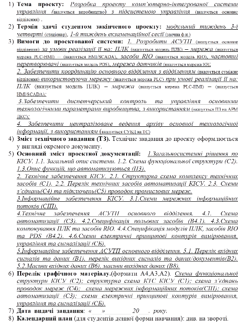

# 4. ЗМІСТ КУРСОВОГО ПРОЕКТУ

Нижче наведений зміст типового завдання на виконання курсового проекту.

| № пор. | Найменування етапів   курсового проекту                      | Термін виконання  |
| ------ | ------------------------------------------------------------ | ----------------- |
| 1      | 2                                                            | 3                 |
| 1      | Уточнення теми   проекта і виконання 1-го варіанта структурної схеми керування | до 15 жовтня      |
| 2      | Розробка ТЗ                                                  | до початку грудня |
| 3      | Захист ТЗ                                                    | середина грудня   |
| 4      | Розробка функціональної  структури                           | грудень           |
| 5      | Розробка схеми автоматизації                                 | грудень           |
| 6      | Розробка технічної структури  КІСУ                           | січень            |
| 7      | Формування переліку  вхідних/вихідних сигналів та даних      | січень            |
| 8      | Компонування засобів ПЛК та RIO                              | лютий             |
| 9      | Розробка схем з’єднань та підключень                         | лютий             |
| 10     | Розробка схем інформаційних потоків                          | лютий             |
| 11     | Розробка принципових схем  контурів вимірювання, управління та сигналізації | березень          |
| 12     | Формування масивів вхідних та  вихідних даних вузлів системи | березень          |
| 13     | Підготовка до захисту та захист  проекту                     | березень          |