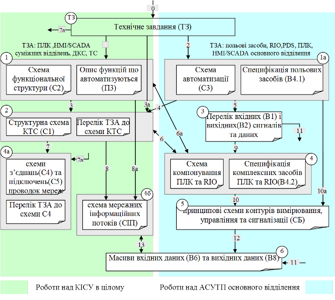

# 5. РЕКОМЕНДАЦІЇ ДО ПОСЛІДОВНОСТІ РОЗРОБКИ КУРСОВГО ПРОЕКТУ

Курсове проектування являється частиною життєвого циклу створення КІСУ і регламентується вітчизняними (ДСТУ) та міждержавними (ГОСТ) стандартами. Згідно ГОСТ 34.601-90 створення автоматизованих систем (до яких також відноситься КІСУ) складається з таких основних стадій:

1.   **Формування вимог до АС**.

2.   Розробка концепції АС.

3.   **Технічне завдання**.

4.   Ескізний проект.

5.   **Технічний проект**.

6.   **Робоча документація**.

7.   Введення в дію.

8.   Супровід.

Курсовий проект передбачає роботи які відносяться до 1-ї, 3-ї, 5-ї та 6-ї стадій створення. Формування вимог до АС та створення технічного завдання відноситься до передпроектних робіт, а технічний проект та робоча документація - до проектних. На кожній із стадій розробляється ряд документів, які регламентуються ГОСТ 34.201-89 та рядом супутніх нормативних документів. Вимоги до АС входять в технічне завдання. Таким чином курсовий проект повинен оформлюватися двома окремими документами:

1.   Технічне завдання.

2.   Проектна документація.  

Проектна документація в курсовому проекті включає документи технічного та робочого проекту. Після розробки технічного завдання (ТЗ), рекомендується наступна послідовність розробки (рис.2). Процес розробки КІСУ поділити на два проектні процеси: роботи над КІСУ в цілому та роботи над АСУТП основного відділення. На рис.2 кожний етап проекту має свій номер, який вказує на орієнтовну послідовність робіт. Етапи з однаковими номерами але з різними літерами можуть виконуватися паралельно.

Слід зазначити, що роботи над курсовим проектом як і над реальним технічним та робочим проектом мають ітераційний характер. Тобто навіть після виконання останнього етапу рекомендованої послідовності (наприклад пункт 6 з рис.2.) можливо виникне необхідність в поверненні до доопрацювання на перших етапах. Послідовність, вказана на рис.2. носить рекомендований характер і може бути змінена.  

 Рис.2. Орієнтовна послідовність розробки курсового проекту.