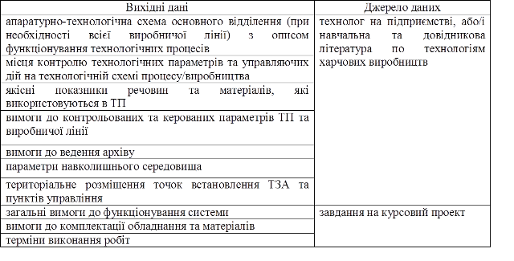

# 6. РЕКОМЕНДАЦІЇ ДО РОЗРОБКИ ОСНОВНИХ РОЗДІЛІВ ПРОЕКТУ

## 6.1. Формування вимог до АС та створення Технічного завдання

Технічне завдання (рис.2, ТЗ) розробляється на основі вихідних даних, які являють собою викладені характеристики об’єкту та вимог до нього (рис.2, стрілка з номером 0). 

Таблиця 1. Дані на базі яких створюється ТЗ.

 

Розробка технічного завдання регламентується стандартом ГОСТ 34.602-89. Більш детальний опис та приклад технічного завдання дається у [1],[3],[5] та відповідних методичних вказівках. 