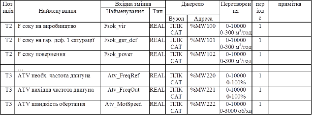
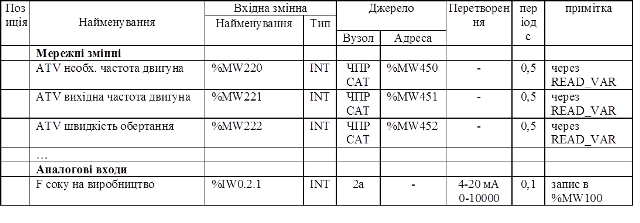
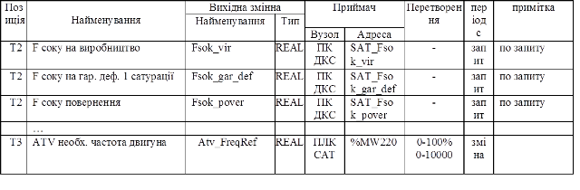

## 6.10. Формування масивів вхідних та вихідних даних

В курсовому проекті масиви вхідних даних (В6) та вихідних даних (В8) розробляють для двох мережних вузлів (визначаються керівником проекту). В залежності від вибраних вузлів, ці масиви розробляються на базі вихідних даних, які наведені в таблиці 21.  

Таблиця 21. Дані на базі яких розробляють масиви вхідних та вихідних даних.

| Вихідні дані                                                 | Джерело даних |
| ------------------------------------------------------------ | ------------- |
| Масиви даних, зображені на схемі інформаційних  потоків (рис.2, стрілка 13) | СІП           |
| Місця підключення польових засобів до ПЛК, RIO  (рис.2, стрілка 12) | СБ            |
| Характеристика вхідних та вихідних сигналів і  даних (рис.2, стрілка 11) |               |

Масиви В6 та В8 для вузлів повинні відображати перелік вхідних та вихідних даних, їх найменування, найменування змінних масиву, їх тип, найменування вузла джерела або приймача, характер та властивості попереднього перетворення даних (фільтрація, масштабування, тощо), періодичність читання/запису.   

Оформлення масивів рекомендується проводити в табличному вигляді, в довільній формі. Приклад фрагментів масивів наведені таб.22-24.  

Таблиця 22. Фрагмент масиву вхідних даних (В6) для ПК САТ.

Таблиця 23. Фрагмент масиву вхідних даних (В6) для ПЛК САТ. 

Таблиця 24. Фрагмент масиву вихідних даних (В6) для ПК САТ. 

