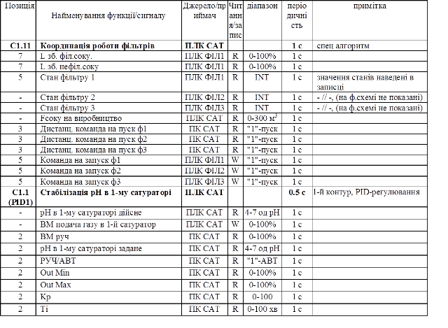

## 6.2. Розробка функціональної структури

Функціональна структура розробляється на основі вихідних даних, які являють собою викладені характеристики об’єкту (все виробництво) та вимог до нього (рис.2, стрілка з номером 1). Вихідні дані, на базі яких створюється функціональна структура наведені в таб.2.

Таблиця 2. Дані на базі яких створюється функціональна структура.

Характеристика функціональної структури повинна включати схему функціональної структури (С2) та опис автоматизованих функцій (П3).Функції, що повинні виконуватися системою (згідно ТЗ), розбивають на декілька вхаємопов’язаних інформаційними зв’язками під-функцій, згідно їх реалізації на окремих технічних засобах [1]. Ці функції та інформаційні зв’язки показуються на функціональній структурі. Схема функціональної структури виконується в довільній формі. Згідно ГОСТ 24.210-82 та РД 50-34.698.90 вона включає:

-     елементи функціональної структури ІАС (підсистем АС); автоматизовані функції та (або) задачі (комплекси задач); сукупність дій (операцій), які виконуються при реалізації автоматизованих функцій тільки технічними засобами (автоматично) або тільки людиною;

-     інформаційні зв’язки між елементами та з зовнішнім середовищем та короткою вказівкою змісту повідомлень та (або) сигналів, які передаються по зв’язкам, та при необхідності, зв’язки інших типів;

-     деталізовані схеми частин функціональної структури (при необхідності).

Варіанти виконання схем, та правила побудови подані в [1], [7]. В [7] функціональну структуру пропонується давати  у вигляді графових та блочних форм моделей інформаційних потоків. В курсовому проекті схему загальної функціональної структури КІСУ рекомендується показувати зі збереженням функціональної ієрархічності рівнів управління (див. рис.3). Наприклад: 0-й (нижній) рівень – рівень польових засобів, 1-й – рівень контролерів, 2-й рівень – рівень SCADA/HMI, 3-й рівень – рівень управління виробництвом. До схеми функціональної структури додається таблиця умовних позначень згідно Д3.1. Приклад таблиці показаний на таб.3.1.  

​    

Рис.3. Фрагмент функціональної структури КІСУ виробництвом цукру

Таблиця 3. Таблиця умовних позначень до схеми функціональної структури.

| Позначення       | Найменування                                                 |
| ---------------- | ------------------------------------------------------------ |
| польові ТЗА      | технічні  засоби автоматизації, які відносяться до польового рівня |
| ПЛК ДИФ          | мікропроцесорний  контролер для дифузійного відділення       |
| ПЛК САТ          | мікропроцесорний  контролер для 1-ї та 2-ї дефекосатурації   |
| ПЛК ФІЛ1         | мікропроцесорний  контролер для 1-го фільтру 1-ї сатурації   |
| ПК ДИФ           | АРМ  оператора дифузії (на базі комп’ютера)                  |
| ПК САТ           | АРМ  оператора дефекосатурації (на базі комп’ютера)          |
| ОП ФІЛ1          | операторська  панель для 1-го фільтру (входить до складу АРМ оператора фільтр. соку 1 сат) |
| ПК ДКС           | диспетчерсько-координуюча  станція – АРМ начальника зміни на базі комп’ютера |
| ТС ВЦ            | технологічний  сервер виробництва цукру - сервер архівів основних виробничих параметрів |
| Е1.0, E2.0, E5.0 | вимірювальне  перетворення                                   |
| V1.0, V2.0, V5.0 | управління  технологічним обладнанням та виконавчими механізмами |
| Y                | перетворення  та обробка інформації                          |
| C1.1, C2.1, C5.1 | автоматизоване  регулювання, управління технологічним процесом |
| С1.11            | координація  роботи фільтрів                                 |
| С1.12            | автоматизоване  управління відкачкою соку з холодного дефекатора |
| С1.2, С2.2, С5.2 | дистанційне  управління, формування завдання, настройка регуляторів |
| S1.1, S5.1       | автоматизоване  включення, відключення, переключення, блокування, запуск задач |
| S2.1             | автоматизована  задача управління фільтром                   |
| S1.2, S2.2, S5.2 | дистанційне  включення, відключення, переключення, блокування, запуск задач, зміна режимів  роботи регуляторів |
| I1.2, I2.2, I5.2 | відображення  для контролю за технологічним процесом         |
| I10.3            | відображення  для диспетчерського контролю за виробничим процесом |
| I10.11           | відображення  архівних даних по всьому виробництву           |
| R1.2, R5.2       | реєстрація  параметрів технологічного процесу                |
| R11.3            | реєстрація  основних виробничих параметрів                   |
| A1.2, А2.2, А5.2 | контроль  стану обладнання, технологічна сигналізація        |
| А10.3            | контроль  виробничих параметрів, контроль якості виробництва |
|                  |                                                              |

Інформаційні зв’язки (інформаційні потоки) між функціями та задачами можна показувати у вигляді стрілок, які вказують на напрямок передачі інформації, або без стрілок, якщо інформація передається в обидва боки. Інформаційні зв’язки, які передбачено реалізувати в курсовому проекті бажано помітити цифрами, для можливості посилання на них в текстовій частині.

Деталізовані схеми частин функціональної структури, наприклад окремі взаємопов’язані функції, які є результатом декомпозиції загальних функцій (викладених в ТЗ), можна показати у вигляді блочної моделі інформаційних потоків (рис.4). Необхідність зображення деталізованих схем узгоджується з керівником проекту.

Рис.4. Функціональна схема координованого управління роботою фільтрів 1-ї сатурації

В текстовій частині в описі автоматизованих функцій (П3) пояснюється та уточнюється схема функціональної структури. Зокрема необхідно вказати:

-     перелік функцій/задач та  вимоги до періодичності та тривалості їх виконання (беруться з ТЗ);

-     перелік сигналів та даних, які формують інформаційні зв’язки між функціями/задачами;

-     вимоги до періодичності відновлення сигналів та даних на входах функцій/задач. 

В курсовому проекті перелік функцій/задач та вимог до них планується приводити разом з переліком сигналів та даних у вигляді таблиці 4. Перелік сигналів та даних а також функції, які відносяться до польового рівня (наприклад Е1.0, V1.0, Y1.0, Y1.1 на рис.3) в даному розділі не вказуються, а наводяться в переліку В1 та В2 після розробки схеми автоматизації та технічної структури.     

В курсовому проекті до таблиці вносяться обов’язково ті функції, які відносяться до координації основної системи з суміжними. Внесення інших функцій узгоджується з керівником. 

Рекомендується таблицю виконувати в Excel, з метою перетворення її в відомість вхідних/вихідних змінних та даних для конкретного вузла системи або його функції. 

Таблиця 4. Перелік функцій/задач та сигналів/даних, пов’язаних з ними. 

