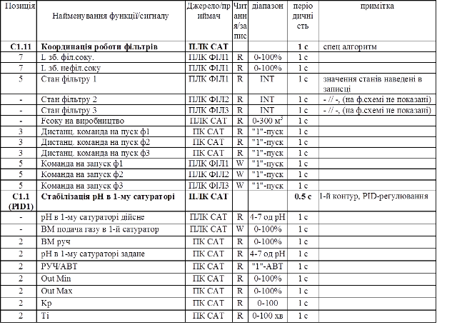
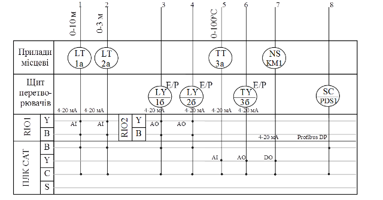
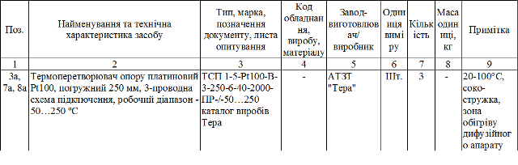

## 6.3. Розробка схеми автоматизації та підбір технічних засобів польового рівня

Розробка схеми автоматизації (С3) та підбір технічних засобів проводиться на основі вихідних даних, які являють собою викладені характеристики об’єкту (основне відділення) та вимог до нього (рис.2, стрілка з номером 2). 

Таблиця 4. Дані на базі яких розробляється схема автоматизації.

Схему автоматизації (С3) необхідно розробляти для основного відділення, якщо інше не передбачено завданням. Загальні правила побудови схеми автоматизації визначені ГОСТ 21.404-85 та РМ4.2-96, а також наведені в [2],[4],[5],[8],[9],[10]. Схему автоматизації з використанням ПЛК рекомендується виконувати по формі, даній в [2], [10].   

Схему автоматизації графічно поділяють на дві зони. У верхній зоні схеми (приблизно 2/3 за висотою) зображують машинно-апаратурну технологічну схему з необхідними комунікаціями, електрообладнанням та елементами системи автоматизації, що вбудовані в технологічне устаткування або механічно з'єднані з вбудованими засобами. У нижній зоні схеми (приблизно 1/3 за висотою) з деяким розривом від технологічної частини, у прямокутниках розташовують зображення решти технічних засобів системи автоматизації. 

Комунікації зображують на схемі однолінійно за допомогою умовних позначень залежно від призначення трубопроводу (ДСТУ Б А.2.41-95 Умовні позначення трубопроводів). Умовне позначення трубопроводу складається з графічного умовного позначення та літероцифрового чи цифрового позначення, яке характеризує вид середовища, що транспортується (літера або перша цифра), його призначення та (або) параметри (наступні цифри). Приклади: В1(2.1) – вода холодна; В2(2.2) – вода гаряча; В3(2.3) – вода аміачна. Видимі ділянки трубопроводів, що проектуються або існують, зображують суцільною товстою основною лінією, невидимі – штриховою тієї самої товщини. При зображенні трубопроводу на кресленні (схемі) літеро-цифрового чи цифрового позначення вказують на полицях ліній-виносок або безпосередньо над лінією трубопроводу, а в схемах автоматизації - найчастіше у розривах ліній трубопроводів: 

Рис.5. Позначення трубопроводів на схемах автоматизації

На комунікаціях технологічної схеми зображують ті запірні й дросельні органи, що стосуються роботи й обслуговування систем автоматизації. При обриві лінії, що зображує комунікації, біля місця обриву повинен бути напис, що пояснює, звідки або куди йде трубопровід: «до дифузії», «від фільтра». На лініях перетину трубопроводів, що зображують їх з’єднання, ставиться крапка. Відсутність крапки означає відсутність з’єднання. 

Умовними позначеннями показують: 

1) деталі трубопроводів (з’єднання, ізоляція, переходи, напрямок потоку, трійники) – за ГОСТ 2.784-70;

2) арматуру (клапани, вентилі, клапани редукційні, крани триходові) – ГОСТ 2785-70. Напрям потоку показують стрілками з кутом 60 о :

      

Рис.6. Позначення напрямів потоку 

У цілому, технологічна частина схеми автоматизації має бути виконана без зайвих ускладнень графічного характеру з тим, щоб вона була досить наочною, легко читалася і давала чітке уявлення про композицію даної машинно-апаратурної системи і взаємодії її елементів. Контури устаткування зображують тонкими лініями (до 0,5 мм), комунікації – ширшими (12 мм). 

Під час розробки схеми вирішується складний комплекс завдань: від аналізу технологічного процесу, як об'єкта керування, до вибору комплексу технічних засобів автоматизації (ТЗА) і їх розміщення. Зокрема вирішується питання підбору технічних засобів польового рівня, пристроїв зв’язку з об’єктом (ПЗО) для контролерів (ПЛК) та засобів розподіленого вводу/виводу (RIO). Підбір ТЗА інших рівнів управління (комп’ютерів різного виконання) а також комунікаційних складових ПЛК проводиться при розробці структури КТС    

Враховуючи безщитовий характер пунктів керування системи автоматизації, що проектується, у нижній частині схеми автоматизації ("підвал") прямокутники розташовуються у такій послідовності (згори донизу): "Прилади місцеві", "Щит перетворювачів", "RIOx", "ПЛКх", "ПКх" або "ОПх" (рис.7). "ПЛКх", "RIOx" та "ПКх"/"ОПх" – позначення відповідних контролерів, засобів віддаленого вводу/виводу (якщо такі присутні), комп’ютерів або операторських панелей на структурних схемах. Комп’ютери та операторські панелі на схемі автоматизації вказувати не обов’язково, оскільки вони показані на функціональній та технічних структурах. Якщо на схемі автоматизації показані контури контролю, регулювання та керування, що належать до різних підсистем КІСУ, то відповідні прямокутники повинні бути поділені на частини. 

Рис.7. Фрагмент виконання нижньої частини схеми автоматизації з засобами розподіленого вводу/виводу та ПЛК.

У всіх прямокутниках за винятком «Прилади місцеві» і «Щит перетворювачів» проводять горизонтальні лінії, кожна з яких відповідає певній функції ПЛК (RIO, ПК). Ці лінії розташовують у такій послідовності (згори донизу): 

- Y- перетворення інформації та обчислювальні функції (наприклад аналогово-цифрове перетворення); 
- I – індикація (для показуючих приладів); 
- R – реєстрація (наприклад, ведення архіву); 
- C – автоматичне регулювання (для ПЛК) або дистанційне регулювання (для ПК); 
- S – управління типу "увімкнено - вимкнено" (автоматичне або дистанційне);
- A – сигналізація; 
- B – передача інформації у систему іншого рівня керування (зв’язок по інтерфейсним каналам). 

Лінія функції B може також бути першою (найвищою), якщо зв’язок з нижнім рівнем управління проводиться по інтерфейсному каналу (наприклад зв’язок по Profibus з частотним перетворювачем PDS1 на рис.7.). Якщо якась із перерахованих функцій ПЛК (RIO,ПК) жодного разу не використовується, то відповідна горизонтальна лінія не проводиться. Кожна лінія функціонального зв’язку, що входить (виходить) у (з) прямокутник(а) ПЛК (RIO, ПК), повинна мати точки на перетині з відповідними горизонтальними лініями. Вхідні і вихідні лінії функціонального зв’язку одного контуру регулювання рекомендується розташовувати одну біля іншої, причому позиційний номер на датчиках, перетворювачах і командо-апаратах повинен бути однаковим. 

Для зручності при компонуванні ПЛК та RIO, рекомендується:

-     зліва біля всіх вхідних сигналів до прямокутника "Прилади місцеві" показувати діапазон вимірювальної величини; 

-     зліва  біля всіх вхідних та вихідних сигналів до прямокутника RIO або ПЛК показувати діапазон сигналу (наприклад 4-20 мА, Profibus DP на рис.7). 

Засоби автоматизації зображуються на схемі автоматизації відповідно до ГОСТ 21.404-85 та РМ4.2-96. Над штампом креслення за його шириною розташовують в один стовпчик згори донизу таблицю умовних позначень технологічних комунікацій, а також позначення відбірних пристроїв, приладів і засобів автоматизації, застосованих у схемі, але не передбачених ГОСТ 21.404-85. Розміри таблиці наведено у дод.Д3.1. Якщо креслення виконується на форматі А3 таблицю умовних позначень приводять окремим документом без штампу. 

Для інтелектуальних польових засобів, які зв’язуються по промисловим мережам, в переліку функціональних літер вказується "B". Однак для багатофункціональні інтелектуальних засобів, типу частотних перетворювачів, сервоприводів, тощо., замість перерахунку всіх функцій (наприклад SYIRCSAB для частотного перетворювача), можна вказувати тільки основні функції (SC або SIC для PDS1, рис.7). Якщо такі пристрої використовуються також в якості віддаленого вводу/виводу (наприклад використання аналогового входу частотного перетворювача), то пристрої показуються по правилам RIO або ПЛК.

Перелік всіх ТЗА польового рівня наводиться в специфікації (В4.1), яка йде окремим документом і виконується згідно ГОСТ 21.110-95. Правила виконання  специфікації наведена в додатку (Д3.3).

Таблиця 5.Специфікація приладів та засобів автоматизації польового рівня (В4.1)

 