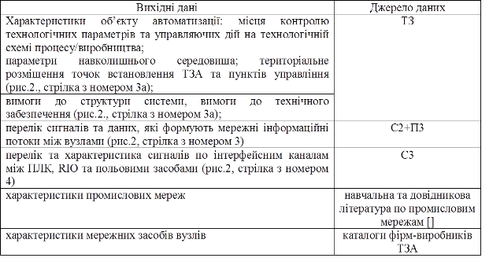
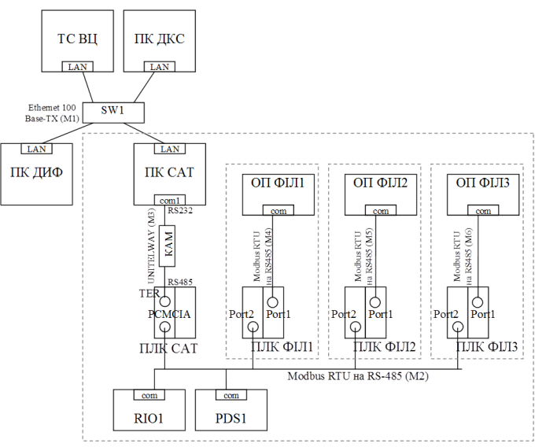

## 6.4.Розробка структури комплексу технічних засобів (КТС)

Розробка структурної схеми (С1) комплексу технічних засобів (КТС), підбір технічних засобів верхніх рівнів управління та комунікаційних модулів ПЛК та RIO проводиться на основі вихідних даних, які наведені в  таб. 6.

Таблиця 6. Дані на базі яких розробляється структурна схема КТС.

Враховуючи наявність ТЗА польового рівня на схемі автоматизації, на структурній схемі КТС їх можна не вказувати. Винятком є тільки ті ТЗА, які інтегруються в єдину систему з використанням промислових мереж. 

Розробка структури КТС передбачає:

-     вибір промислових та комп’ютерних мереж, на базі яких проводиться технічна інтеграція засобів;

-     створення мережної структури, в якій технічні засоби являються вузлами мережі;

-     вибір мережного обладнання (комунікаційні модулі, карти) для всіх мережних вузлів;

-     вибір мережних складових з функціями перетворення: репітерів, концентраторів, комутаторів, маршрутизаторів та шлюзів.   

Процес створення структури КТС може мати ітераційний характер. Спочатку проводиться аналіз функціональної структури, характер і напрямки інформаційних потоків між вузлами, оцінюється інформаційне навантаження. Враховуючи вимоги які дані в ТЗ, вибирається мережна структура та мережне обладнання. Мережна структура аналізується на придатність. Якщо вона не задовольняє по певним причинам вимогам (не вистачає ресурсів мережі або мережних засобів) - процес повторюється. Враховуючи, що в технічному завданні курсового проекту вже вказані промислові мережі рівня датчиків та рівня контролерів (відповідно до завдання до курсового проекту) – перша ітерація вже зроблена. Однак можлива ситуація в необхідності корекції ТЗ.          

Мережна структура відображається графічно на структурній схемі КТС (С1). Рекомендується виконувати схему на форматі А4. До схеми у вигляді окремого документу додається перелік елементів ТЗА (мережних вузлів) згідно додатку Д3.3.   

Структурну схему КТС КІСУ рекомендується зображати зі збереженням функціональної ієрархічності рівнів управління відповідно до схеми функціональної структури. Схема повинна містити інформацію про засоби (комунікаційні карти, модулі) та порти, через які кожен вузол підключається до загальної мережі а також додаткові перетворювачі. Приклад структурної схеми показаний на рис.8, приклад переліку елементів ТЗА наведений в таб. 7. 

Рис.8.Структурна схема КТС 

Таблиця 7. Відомість мережних технічних засобів.

| Позначення                 | Найменування                                                 | К-сть | Примітка                                                     |
| -------------------------- | ------------------------------------------------------------ | ----- | ------------------------------------------------------------ |
| 1                          | 2                                                            |       | 3                                                            |
| ПК ДКС                     | ПК начальника  зміни                                         | 1     | офісного виконання                                           |
| ПК САТ                     | ПК  оператора дефекосатурації                                | 1     | офісного виконання                                           |
| ПК ДИФ                     | ПК оператора  дифузії                                        | 1     | вже експлуатується Celeron 1,7  GHz, RAM 256Mb               |
| ПЛК  САТ                   | Програмований  логічний контролер відділення очистки         | 1     | TSX Premium (з Unity) з комм.  картою Modbus RS-485 TSX SCP 114 |
| ПЛК  ФІЛ1-3                | Програмований  логічний контролер фільтрації відділення очистки | 3     | вже експлуатується  TWD LCAA 40DRF з ком. модулем   TWD NOZ 485 T |
| ОП  ФІЛ1, ОП ФІЛ2, ОП ФІЛ3 | Операторська  панель фільтрації відділення очистки           | 3     | вже експлуатується  XBTN400                                  |
| PDS1                       | Частотний  перетворювач відкачка соку з хол. дефекатора      | 1     | ATV71 з інтегрованим Modbus RTU                              |
| RIO1                       | Віддалені  входи/виходи                                      | 1     | Advantys OTB на базі OTB  1S0DM9LP (Modbus RTU)              |
| КАМ                        | Комунікаційний  адаптер перетворювач RS-232<->RS-485         | 1     | TSX PCX 1031 (Schneider  Electric)                           |