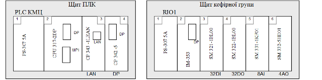

## 6.6. Компонування засобів ПЛК та RIO 

Проектне компонування ПЛК та RIO полягає в підборі всіх складових для даних програмно-технічних засобів.  В якості вихідних даних використовується наступна інформація.

Таблиця 14. Дані на базі яких проводять компонування.

| Вихідні дані                                                 | Джерело даних                     |
| ------------------------------------------------------------ | --------------------------------- |
| Перелік комунікаційних складових (комунікаційних  модулів, карт, опцій, тощо) ПЛК та RIO (стрілка 6 на рис.2) | С1                                |
| Перелік вхідних/вихідних сигналів (стрілка 9 на  рис.2)      | В1, В2                            |
| Перелік спеціальних функцій: контурів  регулювання з вказівкою закону регулювання, функцій управління осями,  тензометрія, тощо (стрілка 6а на рис.2) | С2                                |
| характеристики складових (модулів, блоків,  опцій) ПЛК, RIO, PDS | каталоги фірм-виробників ПЛК, RIO |

Особливості підбору складових для проектно-компонованих засобів залежить від типу ТЗА а також моделі. Однак можна виділити загальні критерії, по яким проводиться підбір. Для ПЛК це як правило наступні критерії (таб.15).

Таблиця 15. Критерії компонування ПЛК.

| Критерії                                                     | Складова, на вибір якої впливає критерій                     |
| ------------------------------------------------------------ | ------------------------------------------------------------ |
| перелік сигналів кожного з видів (аналогові  входи, аналогові виходи, дискретні входи типу "так/ні", дискретні  виходи типу "так/ні") | процесорний модуль (ЦПУ), тип та кількість  сигнальних модулів (в свою чергу кількість з’єднувачів, тип шасі тощо) |
| комунікаційні складові                                       | вибір процесорного модуля, комунікаційні модулі  та опції визначені вже в структурі КТС |
| перелік спеціальних функцій                                  | вибір процесорного модуля, вибір спеціальних  модулів        |
| живлення датчиків, ВМ, модулів ПЛК                           | вибір модуля живлення для ПЛК                                |

Інші критерії, які впливають на вибір типу ПЛК, не враховуються, оскільки марка ПЛК вказаний в завданні на курсовий проект. 

Для RIO критерії підбору аналогічні, за винятком вибору ЦПУ. Вибір інтерфейсного модуля для RIO проводиться на етапі побудови структури КТС.

В курсовому проекті рекомендується показати компонування ПЛК та RIO у вигляді схеми (рис.9).  

 

Після підбору модулів та корзини приступають до підбору додаткових аксесуарів (з’єднувачів, фіксаторів, тощо). На основі вибраних компонентів необхідно скласти специфікацію комплексних засобів автоматизації (В4.2). Правила оформлення специфікації наведені в додатку 3.2. 

Таблиця 16. Специфікація комплексних засобів автоматизації (В4.2)

| Поз. | Найменування та технічна характеристика засобу             | Тип, марка, позначення документу, листа опитування | Код обладнання | Завод-виготовлювач/  виробник | Одиниця виміру | Кількість | Маса одиниці, кг | Примітка |
| ---- | ---------------------------------------------------------- | -------------------------------------------------- | -------------- | ----------------------------- | -------------- | --------- | ---------------- | -------- |
| 1    | 2                                                          | 3                                                  | 4              | 5                             | 6              | 7         | 8                | 9        |
|      | ПРОГРАМОВАНИЙ  ЛОГІЧНИЙ КОНТРОЛЕР ПЛК КМЦ - Simatic S7-300 |                                                    |                |                               |                |           |                  |          |
|      | 1. Модуль живлення PS-307 5A                               | 6ES7307-1EA00-0AA0  Catalog Siemens ST 70 - 2011   |                | Siemens AG, Німеччина         | шт             | 1         |                  |          |
|      | 2. Процесорний модуль CPU 317-2  DP                        | 6ES7317-2AJ10-0AB0  Catalog Siemens ST 70 - 2011   |                | Siemens AG, Німеччина         | шт             | 1         |                  |          |
|      | 3.  Мікрокарта пам’яті 8 Мб                                | 6ЕS795З-8LP20-0AA0  Catalog Siemens ST 70 - 2011   |                | Siemens AG, Німеччина         | шт             | 1         |                  |          |
|      | 4. Комунікаційний  процесор Ethernet CP343-1 Lean          | 6GK7343-1CX10-0XE0  Catalog Siemens ST 70 - 2011   |                | Siemens AG, Німеччина         | шт             | 1         |                  |          |
|      | 5. Комунікаційний  процесор Profibus DP CP-342-5           | 6GK7342-5DA02-0XE0  Catalog Siemens ST 70 - 2011   |                | Siemens AG, Німеччина         | шт             | 1         |                  |          |
|      | 6.  Профільна шина, довжина 2000   мм                      | 390-1BC00  Catalog VIPA  System-300V               |                | VIPA, Німеччина               | шт             | 1         |                  |          |
|      | СИСТЕМА  РОЗПОДІЛЕНОГО ВВОДУ ВИВОДУ RIO1 - VIPA 300V       |                                                    |                |                               |                |           |                  |          |
|      | 1. Модуль живлення PS-307 6A                               | VIPA 307-2EA00  Catalog VIPA  System-300V          |                | VIPA, Німеччина               | шт             | 1         |                  |          |
|      | 2. Інтерфейс ний модуль Profibus DP IM-353                 | VIPA 353-1DP0  Catalog VIPA  System-300V           |                | VIPA, Німеччина               | шт             | 1         |                  |          |
|      | 3. Сигнальний модуль 32 DI SM321-1BL00                     | VIPA 321-1BL00  Catalog VIPA  System-300V          |                | VIPA, Німеччина               | шт             | 1         |                  |          |
|      | 4. Сигнальний модуль 32 DO SM322-1BL00                     | VIPA 322-1BL00  Catalog VIPA  System-300V          |                | VIPA, Німеччина               | шт             | 1         |                  |          |
|      | 5. Сигнальний модуль 8 АІ SM331-1KF01                      | VIPA 331-1KF01  Catalog VIPA  System-300V          |                | VIPA, Німеччина               | шт             | 1         |                  |          |
|      | 6. Сигнальний модуль 4 АО  SM332-5HD01                     | VIPA 332-5HD01  Catalog VIPA  System-300V          |                | VIPA, Німеччина               | шт             | 1         |                  |          |
|      | 7. Фронтальный штекер 40 контактів, пружинний              | VIPA 392-1BM01   Catalog VIPA  System-300V         |                | VIPA, Німеччина               | шт             | 3         |                  |          |
|      | 8. Фронтальный штекер 20 контактів, пружинний              | VIPA 392-1BJ00   Catalog VIPA  System-300V         |                | VIPA, Німеччина               | шт             | 1         |                  |          |

Кабелі та з’єднувачі, які використовуються для підключення даних ТЗА до промислових мереж вибираються на етапі розробки схем з’єднань та підключень проводок промислових мереж, тому тут не вказуються.  