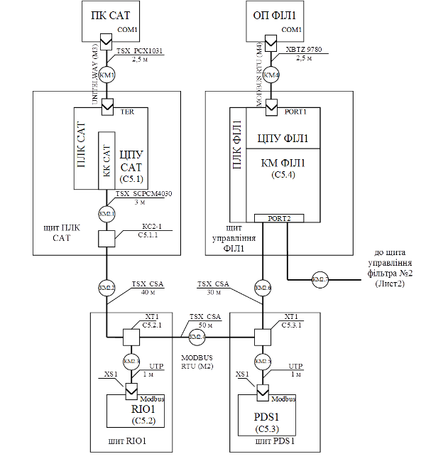

## 6.7. Розробка схем з’єднань та підключень проводок промислових мереж

Схеми з’єднань та підключень проводок промислових мереж розробляється на основі вихідних даних, наведених в таб.17.

Таблиця 17. Дані на базі яких розробляють схеми з’єднань та підключень.

| Вихідні дані                                                 | Джерело даних                                                |
| ------------------------------------------------------------ | ------------------------------------------------------------ |
| Характеристики об’єкту автоматизації: місця  контролю технологічних параметрів та управляючих дій на технологічній схемі  процесу/виробництва; параметри навколишнього середовища; територіальне  розміщення точок встановлення ТЗА та пунктів управління (рис.2., стрілка з  номером 7а); | ТЗ                                                           |
| Структура КТС та перелік мережних засобів (7)                | С1                                                           |
| Технічні характеристики, правила, обмеження на  підключення ТЗА до мереж | технічна документація на використання ТЗА,  довідникова документація на мережі [], нормативна документація на мережі |

Загальні рекомендації до підбору та виконанню електричних проводок наведені в РМ4-6-84 (частина 1). Правила стосовно виконання електричних проводок для промислових мереж визначені в технічній документації до цих мереж. 

Зображення електричних зв’язків між ТЗА, які використовуються для передачі по промисловим мережам проводиться з використанням схеми з’єднань (С4) та підключень (С5) проводок мереж. Загальне виконання схем з’єднань та підключень визначене стандартом ГОСТ 21.408-93 а також РМ4-6-92 (Частина 3).

В курсовому проекті дозволяється виконання схеми з’єднань проводок промислових мереж з зображенням на них підключень засобів (суміщений спосіб). Якщо суміщений спосіб дуже ускладнює читання схеми, схеми з’єднань доповнюються схемами підключень. 

На рис.10 показаний приклад схеми з’єднань, а на рис.11 – схеми підключень проводок промислових мереж. Підключення, яке необхідно деталізувати, на рис.10 вказується внизу під написами позначень комунікаційних модулів, коробок та клем. До схеми з’єднань додається перелік елементів, приклад якого даний в таблиці 18. 

Рис.10. Схема з’єднань проводок промислових мереж

Таблиця 18. Перелік елементів до схеми з’єднань.

| Позначення | Найменування                                                 | К-сть | Примітка |
| ---------- | ------------------------------------------------------------ | ----- | -------- |
|            | Комунікаційні адаптери та карти                              |       |          |
|            | КК САТ  – TSX SCP114 PCMCIA мультипротокольна карта RS-485   | 1     |          |
|            | КМ  ФІЛ1 – TWD NOZ 485 T, комунікаційний модуль RS-485 для Twido з підключенням під клемну  колодку (PORT2) | 1     |          |
|            | Коробки з’єднувальні                                         |       |          |
|            | КС2-1 -  TSX SCA 50 з вбудованим термінатором                | 1     |          |
|            | Клемні колодки                                               |       |          |
|            | XT1 (щит RIO1) з прохідними клемами та 3 контакти            | 1     |          |
|            | XT1 (щит PDS1) з прохідними клемами та 3 контакти            | 1     |          |
|            | Мережні з’єднувачі                                           |       |          |
|            | XS1 –  неекранований RJ-45 типу вилка                        | 2     |          |
|            | Мережні кабелі                                               |       |          |
|            | TSX SCPCM4030 – для підключення TSX  SCP114 до MODBUS RTU, 3 м | 1     |          |
|            | TSX PCX1031 – кабель з адаптером RS232-RS485,  SUB-D 9 пін з боку RS232, MiniDIN з боку RS485, 2.5 м | 1     |          |
|            | XBTZ 9780 –  для підключення панелі (RJ-45) до ПЛК (MiniDIN) | 1     |          |
|            | TSX CSA – кабель на базі подвійної екранованої витої пари    | 120   | м        |
|            | UTP – UTP кабель 4х2 CAT5e 0,5 мм PVC                        | 2     | м        |

 

Рис.11.Схеми підключень

 

 