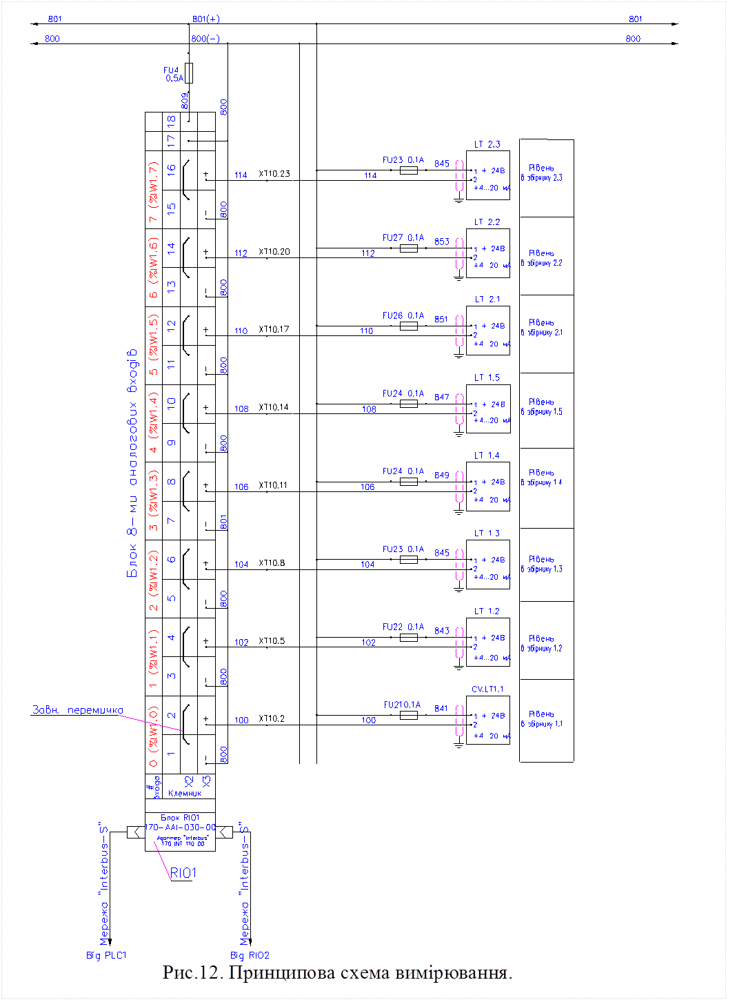

## 6.8. Розробка принципових схем контурів вимірювання, управління та сигналізації

Принципові схеми контурів вимірювання, управління та сигналізації (СБ) в курсовому проекті розробляють тільки для АСУТП основного відділення. Вихідні дані, на базі яких розробляють ці схеми наведені в таблиці 19.

Таблиця 19. Дані на базі яких розробляють принципові схеми.

| Вихідні дані                                                 | Джерело даних                             |
| ------------------------------------------------------------ | ----------------------------------------- |
| Специфікація польових засобів (рис.2, стрілка  10а), на основі якої з технічної документації вибираються принципові схеми | С3                                        |
| Специфікація комплексних засобів ПЛК та RIO  (рис.2, стрілка 10), на основі якої з технічної документації вибираються  правила підключення до них польових засобів | В4.2                                      |
| Технічні характеристики ТЗА                                  | технічна документація на використання ТЗА |

Принципові схеми виконуються згідно ГОСТ 21.408-93 та РМ 4.106. Принципи побудови принципових схем розглядалися в дисципліні "Основи проектування систем автоматизації з елементами САПР". Приклади виконання можна знайти в [14]. На рис.12 показаний приклад принципової схеми вимірювання.    

Рис.12. Принципова схема вимірювання.