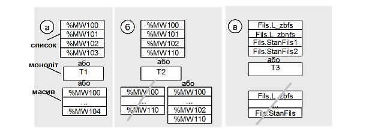
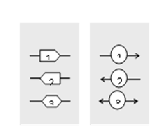
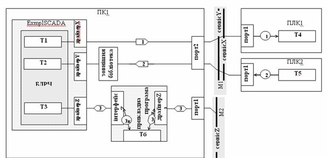
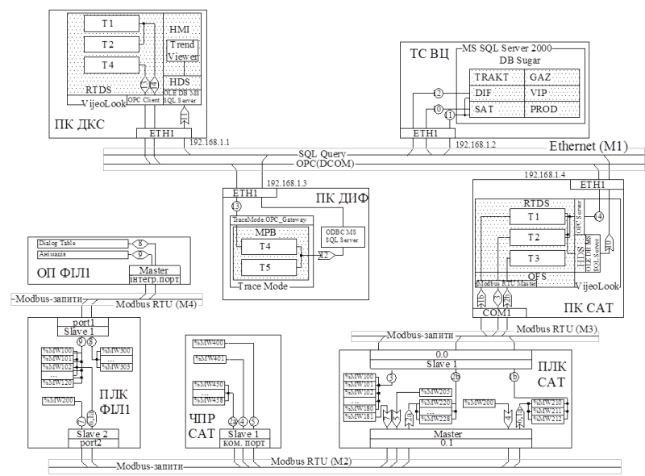

## 6.9. Розробка схеми мережних інформаційних потоків

Схеми мережних інформаційних потоків (СІП) розробляють для всієї КІСУ. Вихідні дані, на базі яких розробляють СІП наведені в таблиці 20.

Таблиця 20. Дані на базі яких розробляють схеми інформаційних потоків.

| Вихідні дані                                                 | Джерело даних                                                |
| ------------------------------------------------------------ | ------------------------------------------------------------ |
| Перелік ТЗА до схеми КТС з вказівкою ком.  модулів та портів (рис.2, стрілка 8) | С1                                                           |
| Перелік сигналів/даних між функціями/задачами  (рис.2, стрілка 8а) | С2                                                           |
| характеристики промислових мереж                             | навчальна та довідникова література по  промисловим мережам [] |
| характеристики мережних засобів вузлів                       | каталоги фірм-виробників ТЗА                                 |

 Основна задача схеми показати реалізацію інформаційних потоків з точки зору інформаційного забезпечення. Наочність дає змогу краще розуміти процеси обміну, які діють в системі, тому бажано особливо не нагнітати її надлишковою інформацією. Для грамотної побудови такої схеми, проектант повинен розуміти основні принципи роботи мережного обладнання, протоколів обміну, програмного забезпечення вузлів і т.д.

Основними елементами СІП є:

1) масиви даних процесу в межах баз даних, які приймають участь в загальносистемному, на певному рівні, обміні, тобто які циркулюють по обчислювальним мережам;

2)  інформаційні потоки, які забезпечують доставку даних з бази даних джерела в базу даних отримувачів; вони показані на функціональній схемі (С1) з відповідними номерами, що можуть співпадати, об’єднуватись, добавлятись;

3) мережні сервіси або протоколи, за допомогою яких реалізовані інформаційні потоки;

4) комунікаційні логічні канали пристроїв та програмного забезпечення, через які проходять інформаційні потоки: драйвер, логічний канал, адреса, тощо; 

5) уточнюючі характеристики інформаційних потоків: в графічній частині бажано показати хто ініціював запит (Клієнт, Видавець або Виробник) та напрямок передачі інформації; в текстовій – всю іншу інформацію, відповідно до вимог до ИО.

З точки зору функціональної схеми С1 ***масиви даних*** або ***блок даних*** – це відображення аргументів функцій в конкретній базі даних, конкретного вузла системи. Кожний інформаційний потік починається та закінчується масивом даних або операціями. Масивами даних можуть бути змінні бази даних контролера, змінні бази даних реального часу SCADA, записи в базах даних і т.д., які як правило об’єднані (згруповані) між собою по принципу: один масив даних спільний для одного інформаційного потоку. Таке об’єднання дозволяє графічно наглядно представити весь процес обміну, а інколи допомагає згрупувати змінні для зменшення навантаження на мережу. 

Масиви даних розміщуються в базах даних програмно-технічного засобу. Під базою даних розуміється виділена структурна одиниця даних. Фізично масиви даних можуть являти собою пам’ять контролера або його частини, виділені для обміну змінні програми або її частини, дисковий простір тощо. Для ідентифікації розміщення даних необхідно показати їх в складі засобу в порядку їх вкладеності: 

засіб -> програма -> частина програми (база даних) -> масив даних. 

Для ідентифікації складових масивів даних, в них вказуються назви змінних, або групи змінних, таблиці змінних, таблиці, масиви, записи тощо. Є декілька способів показати склад масивів. Перший спосіб – відобразити масив ***у вигляді списку***, тобто як повний перелік одиничних даних однакового формату (рис.13. – верхні блоки). Цей універсальний спосіб дає змогу побачити всі елементи з даного масиву без додаткової уточнюючої інформації. Такий спосіб рекомендується використовувати тільки при зображенні невеликої кількості даних в масиві, наприклад для засобів PDS, RIO. 

Більш економічний спосіб, з точки зору місця на кресленні, - ***монолітний***, тобто використання унітарного позначення всього масиву (рис.13 – середні блоки). Тоді весь масив позначається одним унікальним для цього креслення ідентифікатором, який розшифровується (розписується) в текстовій частині, наприклад в описі масивів інформації (П8) або/та в переліку вхідних (В6) і вихідних (В8) сигналів/даних. Цей спосіб рекомендується використовувати для позначення таблиць баз даних SCADA/HMI, ПО рівня MES, СУБД. При присутності одних і тих самих змінних в декількох інформаційних потоках, вони повторюються в різних масивах, що не видно на основному кресленні. В цьому випадку перехресні (стосовно потоків) дані можна виділити в окремі масиви як у монолітному вигляді так і в вигляді списку. 

Рис.13. Приклади зображення масивів даних: а, б – в ПЛК; в – в SCADA. 

Деякі дані можна представити у ***вигляді розірваного масиву*** з першим та кінцевим елементом. Таке зображення можливе у випадку, коли термінальні елементи (перший та останній в масиві) повністю визначають весь склад масиву даних. На рис.13 показані рекомендовані зображення масивів. Для ситуації (а) можливі всі три варіанти, оскільки змінні нумеруються і розміщені без розриву по номеру. Однак, якщо деякі з них присутні в різних інформаційних потоках, використання даних у вигляді моноліту та розірваного масиву себе не виправдовують. Крім, того, якщо існує розрив в номерах, слід вказати ключові номери елементів, як наприклад, на рис.13 (б). Такий спосіб зображення масиву рекомендується для даних ПЛК, RIO, PDS.  

Всі ці способи можна комбінувати. Так для змінних контролера найбільш підходить вигляд розірваного масиву, для тегів SCADA – список або моноліт. Для останніх вигляд розірваного масиву не підходить, оскільки дані між термінальними елементами не можна однозначно ідентифікувати (рис.13(в). З приводу зображення даних слід мати на увазі, що все наведене вище є рекомендаціями. Головне правило – дані повинні бути однозначно ідентифіковані і прив’язані до інформаційних потоків.

  

Рис.14. Приклади зображен-ня інформаційних потоків.

Мережні інформаційні потоки зображуються у вигляді лінії, на якій вказується його номер. Для уточнення інформації про інформаційний потік номер може бути вписаний в певну геометричну фігуру. Фігура може вказувати на тип сервісу. Наприклад, для Клієнт-Серверних моделей сервісів, з боку Клієнту (той, хто ініціює запит) можна вказати фігурну стрілку, яка вказує на напрямок передачі даних, а з боку Серверу – коло зі стрілками (рис.14). У всіх інших випадках можна вказувати коло. Для pull моделі Видавець-Абонент (Виробник-Споживач) фігурну стрілку можна вказати з боку Pull Publishing Manager. При двосторонньому обміні (читання/запис однакових змінних), при використанні одного і того ж сервісу, два і більше потоки можна умовно об’єднувати в один. При цьому зі сторони Клієнта вказується двостороння фігурна стрілка, а в текстовій частині інформація уточнюється. 

На кресленні вказуються ***комунікаційні сервіси***, якими "користуються" інформаційні потоки. Якщо сервіси однозначно визначаються протоколом, то вказується протокол обміну. Як правило необхідно вказувати прикладні сервіси і відповідно прикладні протоколи. Для спрощення в контексті правил побудови буде використовуватись слово "сервіс" а не "протокол". 

Кожний потік починається з масиву даних. Початком потоку умовно можна вважати бік його ініціювання. Далі в порядку слідування потоку вказуються комунікаційні засоби програмного забезпечення, що відповідає за обмін, тобто його інтерфейсна частина (драйвери пристроїв, бібліотеки обміну і т.д.). Якщо ці складові приховані від розробника системи і вважаються внутрішньою закритою складовою програмно-технічного засобу, то її вказувати не потрібно. Вказуються тільки ті частини програмного забезпечення, які неоднозначні і можуть бути замінені на альтернативні. 

На рис.15.10 показані три типові випадки (не повний перелік) слідування інформаційних потоків від масиву даних до зовнішнього порту комп’ютера. Всі вони користуються умовними інтерфейсними каналами прикладної програми, які будемо називати ***драйверами***. Для кожного драйверу можуть існувати настройки, які інколи необхідно уточнювати або на схемі, або в текстовій частині. Як мінімум на схемі потрібно показувати дійсну або умовну назву цього каналу.

Перший інформаційний потік починається з масиву даних Т1. Для передачі даних по мережі М1 використовується драйверХ, який являється інтерфейсною частиною прикладної програми ExmplSCADA. В даному випадку достатньо вказати тільки цей інтерфейс, можливо з деякими уточненнями. Якщо всі дані передаються через єдиний інтерфейс, який не можливо змінити, то драйверХ не вказується, оскільки інших варіацій бути не може.

Інколи драйвер прикладної програми використовує проміжну бібліотеку (програму, драйвер). Причому ім’я бібліотеки або її тип може відрізнятися. Для прикладу, якщо на рис.15 драйверY – це реалізація ОРС-клієнтського інтерфейсу, то необхідно вказати також ОРС-Сервер для реалізації потрібного протоколу мережі. В цьому випадку бібліотеку просто показують на шляху слідування потоку без його "розриву". Уточнення до бібліотеки можна вказати разом з її назвою. 

Рис.15. Приклад проходження інформаційних потоків

При необхідності в проміжній бібліотеці (програмі, драйвері) можна деталізувати внутрішню структуру. Так, наприклад, при використанні ОРС з декількома реалізованими протоколами обміну необхідно вказати який з них використовується даним інформаційним потоком (йде через нього), та настройки цього драйверу. В деяких випадках необхідно показати внутрішні дані цієї програми, через який проходить обмін. На рис.15 інформаційний потік 3 проходить через таку програму. Вона "розриває" потік, тому він реалізовується у вигляді двох потоків 3k та 3s. Всередині показаний допоміжний масив даних Т6. 

Після програмного забезпечення, драйверів, бібліотек, на шляху проходження потоку при необхідності вказуються адреси станцій (вузлів) на мережі та логічні канали або порти, які є інтерефейсними для програмно-технічного засобу. ***Логічний канал*** являється відображенням фізичного каналу, а його маркування залежить від реалізації та типу ПЗ. Якщо ніякого представлення каналу в останнього немає, в загальному випадку логічний канал може мати вигляд:

 *тип_комунікаційного_обладнання **:** номер_плати **.** номер_каналу*    

Такий вигляд необхідний для зрозумілої ідентифікації каналу. Логічні канали на одному пристрої не можуть мати один і той же ідентифікатор, однак можуть співпадати з логічними каналами інших пристроїв.

***Адреса***(-си) можуть прив’язуватися до логічних каналів. У випадках, коли на одному логічному каналі знаходиться декілька адрес, пристрій через нього може спілкуватися від різних адрес, а отже необхідно їх вказати на шляху інформаційних каналів. Коли канал використовується декількома драйверами (якщо таке можливо), адреси не прив’язуються до каналу, а прив’язуються до драйверу.

Після каналу всі потоки об’єднуються в одну ***інформаційну шину***, що являє собою використання єдиного комунікаційного сервісу, яким вони користуються. Окрім інформації про спосіб реалізації потоку, таке представлення може допомогти оцінити інформаційне навантаження на мережу. Одна мережа (фізична) та протокол може підтримувати декілька сервісів (протоколів). Інформаційні шини не обов’язково повинні відповідати сервісам протоколу одного рівня (наприклад прикладного), але повинні однозначно вказати чим "користуються" інформаційні потоки.

Інформаційний потік закінчується аналогічно, як і починався. Тому "початок" потоку є умовним і не обов’язково починається зі сторони клієнта. Оскільки в ПЛК1 та ПЛК2 (рис.15) немає явно виділених прикладних програм та драйверів, масив даних інформаційним потоком зв’язується безпосередньо з логічним каналом. Однак до цього каналу можна прив’язати мережну адресу, або логічний порт і т.д.  

На рис.16 показаний приклад схеми мережних інформаційних потоків.

Рис.16. Схема мережних інформаційних потоків.