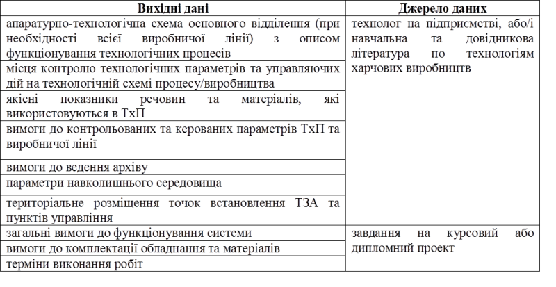

# 1. ЗАГАЛЬНІ ПОЛОЖЕННЯ

**1.1. Місце технічного завдання в життєвому циклі АС.** Стадія "Технічне завдання" являється частиною життєвого циклу створення автоматизованих систем (***АС***) зокрема інтегрованих автоматизованих систем (***ІАС***) і регламентується вітчизняними (ДСТУ) та міждержавними (ГОСТ) стандартами. Згідно ГОСТ 34.601-90 створення автоматизованих систем складається з таких основних стадій:

1.   Формування вимог до АС.

2.   Розробка концепції АС.

3.   Технічне завдання.

4.   Ескізний проект.

5.   Технічний проект.

6.   Робоча документація.

7.   Введення в дію.

8.   Супровід.

Формування вимог до АС та створення технічного завдання відноситься до передпроектних робіт, а технічний проект та робоча документація - до проектних. На кожній із стадій розробляється ряд документів, які регламентуються ГОСТ 34.201-89 та рядом супутніх нормативних документів. На стадії "Технічне завдання" розробляється однойменний документ, який регламентується ГОСТ 34.602-89. 

Згідно ГОСТ 34.602-89, технічне завдання (***ТЗ***) на автоматизовану систему управління (контролю, проектування та інш.) є основним документом, що визначає вимоги й порядок створення (розвитку, модернізації) автоматизованої системи, відповідно до якого проводиться її розробка й приймання при запровадженні в дію. ТЗ на АС розробляють на систему в цілому, призначену для роботи самостійно або в складі іншої системи. 

Додатково можуть бути розроблені ТЗ:

-     на частини АС; 

-     на підсистеми АС, комплекси задач АС і т.п., відповідно до вимог ГОСТ 34.602-89; 

-     на комплектуючі засоби технічного забезпечення й програмно-технічні комплекси у відповідності зі стандартами ЄСКД і СРПП;

-     на програмні засоби у відповідності зі стандартами ЕСПД;

-     на інформаційні вироби відповідно до ГОСТ 19.201 і НТД, що діє у відомстві замовника АС;

Згідно ГОСТ 34.602-89 проект ТЗ на АС розробляє розробник з участю замовника на основі технічних вимог. При конкурсній організації робіт варіанти ТЗ розглядаються замовником, який або вибирає кращий варіант, або на основі порівняльного аналізу підготовлює із участю потенційного розробника АС кінцевий варіант ТЗ.

**1.2. Місце технічного завдання в курсовому та дипломному проектуванні.** При курсовому та дипломному проектуванні розділ "Технічне завдання" розробляється після отримання завдання на проект [1]. Даний документ має значно спрощений зміст однак його структура повинна відповідати вимогам ГОСТ 34.602-89, за винятком деяких пунктів.  

Вважається, що студент пройшов практику на харчовому підприємстві, та має всі необхідні вихідні дані для формування технічного завдання. У іншому випадку, вихідні дані необхідно брати з довідникової літератури по харчовим виробництвам.  

Таблиця 1. Дані на базі яких створюється ТЗ.

 