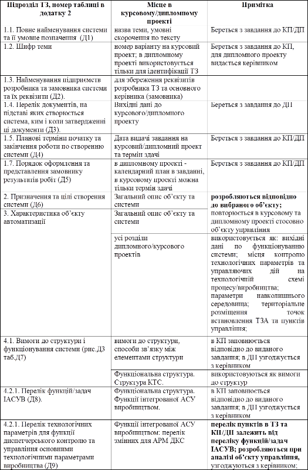

# 3. ЗВ’ЯЗОК ТЕХНІЧНОГО ЗАВДАННЯ З КУРСОВИМ/ДИПЛОМНИМ ПРОЕКТОМ

Таблиця 2. Зв’язок ТЗ з КП/ДП та рекомендації до заповнення.

 

**ЛІТЕРАТУРА**

1.   Проектування комп’ютерно-інтегрованих систем. Метод. вказівки до курс. проекту для студ. спец. 7.05020202 "Комп’ютерно-інтегровані технологічні процеси та виробництва" ден. та заоч. форм навч./ Уклад.: О. М. Пупена К.:НУХТ, 2011. 45 с.

2.   Пупена О.М., Ельперін І.В., Луцька Н.М., Ладанюк А.П. Промислові мережі та інтеграційні технології в автоматизованих системах: Навчальний посібник. – К.:Вид.-во "Ліра-К", 2011. - 552 с.

3.   Кулаков М.В. Технологические измерения и приборы для химических производств: Учебник для вузов по специальности "Автоматизация и комплексная механизация химико-технологических процессов". – 3-е изд., перераб. и доп. – М.: Машиностроение, 1983. – 424 с., ил.

4.   Дж. Фрайден. Современные датчики. Справочник. Москва: Техносфера, 2005. – 592 с.

5.   Справочник инженера по контрольно-измерительным приборам и автоматике. Под ред. А.В.Калиниченко: М.: "Инфа-Инженерия", 2008. – 576 с.

6.   Справочник по регулирующим клапанам 3-е изд. . Fisher Controls International LLC 2001. 296 с.

7.   Нестеров А. Л. Проектирование АСУТП. Книга 1 / Нестеров А. Л.: – СПб. Издательство: ДЕАН. 2006. – 

8.   Нестеров А. Л. Проектирование АСУТП. Книга 2. / Нестеров А. Л.: - СПб. Издательство: ДЕАН. 2009. – 

9.   Фёдоров Ю.Н. Справочник инженера по АСУТП: Проектирование и разработка. Учебно-практическое пособие. М.: - Инфра-инженерия, 2008. – 928 с.,12 ил. 

10.  Монтаж средств измерений и автоматизации: Справ. / Под ред. А. С. Клюева. – 3-е изд., перераб. и доп. – М.: Энергоатомиздат, 1988. – 728 с.

11.  Проектирование систем автоматизации технологических процессов: Справочное пособие / Под ред. А. С. Клюева. – 2-е изд. перераб. и доп. – М.: Энергоатомиздат, 1990. – 464 с.

12.  Трегуб В. Г., Ладанюк А. П., Плужников Л. Н. Проектирование, монтаж и експлуатация систем автоматизации в пищевой промышленности: Учебник для вузов. – М.: Агропромиздат, 1991. – 352 с.

13.  Трегуб В. Г., Ладанюк А. П. Проектирование, монтаж и эксплуатация систем автоматизации пищевых производств. – М.: Лег. и пищ. пром-сть, 1982. – 352 с.

14.  Трегуб В. Г. Проектування, монтаж та експлуатація систем автоматизації: Навч. посібник – К.: НМК ВО, 1990. – 80 с.

 