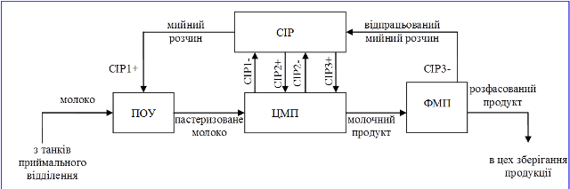
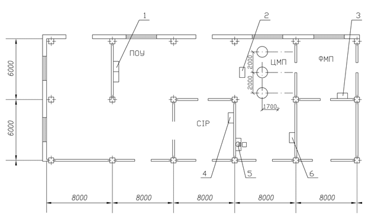
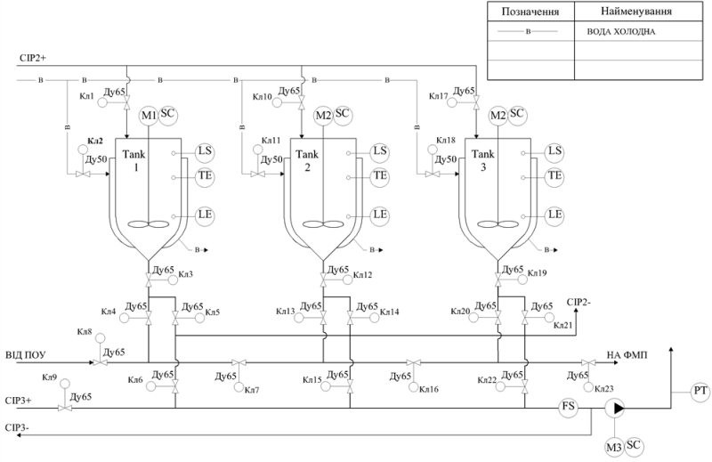

# 3. Характеристика об’єкту автоматизації

## 3.1. Опис роботи технологічної лінії виробництва цільномолочної продукції 

***Загальна структура.*** *Об’єктом автоматизації ІАСУВ є технологічна лінія виробництва цільномолочної продукції (рис.1) продуктивністю 50 т/добу, яка призначена для виробництва та фасування цільномолочних продуктів таких як молоко 2.5%, молоко 3.2%, кефіру 2.5%. Лінія складається з вузла пастеризації молока (ПОУ) продуктивністю 5000 л/год, цеху приготування цільномолочної продукції (ЦМП), станції приготування мийних розчинів (CIP) на 3 контури, цеху фасування молочних продуктів (ФМП).* 

*Рис.1. Схема технологічної лінії виробництва цільномолочної продукції*

***Виготовлення продукту.*** *Молоко з проміжних танків приймального відділення (танк Т1 для молока жирності 2.5%, Т2 – для молока жирності 3.2%) подається на вузол ПОУ, в якому пастеризується і охолоджується до заданої температури. Режим пастеризації залежить від кінцевого продукту.* 

*Пастеризоване молоко з ПОУ подається на приготування в вибраний оператором танк ЦМП. Завантаження необхідного танку проводиться шляхом відкриття/закриття необхідних клапанів. В танках продукт охолоджується, при необхідності добавляються додаткові компоненти (закваска). Після приготування, готовий молочний продукт подається в цех фасування ЦМП на потрібні автомати розливу. Розфасований продукт транспортерами завозиться в цех зберігання продукції, поки не відправиться на реалізацію.* 

***Мийка пастеризатора та ліній загрузки.*** Після кожної пастеризації молока та завантаження танків, ПОУ та трубопроводи завантаження повинні пройти мийку мийними розчинами з вузла CIP. Вузол ПОУ миється 1-м контуром CIP. Для цього перед початком мийки, відкриттям/закриттям потрібних клапанів прокладається шлях мийному розчину від станції CIP до ПОУ (CIP1+), потім по трубопроводам завантаження танків в ЦМП та відпрацьованому мийному розчину в зворотному напрямку (CIP1-). Мийний розчин повертається в станцію CIP для регенерації. 

***Мийка танків.*** Після кожного приготування продукту в танку та його вигрузки, танк необхідно помити. Танки миються 2-м контуром CIP. Для цього перед початком мийки, відкриттям/закриттям потрібних клапанів прокладається шлях мийному розчину від станції CIP до необхідного танку та відпрацьованому мийному розчину в зворотному напрямку (CIP2-).

**Мийка ліній вигрузки та фасовочних автоматів**. Лінії вигрузки повинні проходити мийку після кожної партії приготовленого продукту. Лінії вигрузки миються 3-м контуром CIP. Для цього перед початком мийки, відкриттям/закриттям потрібних клапанів прокладається шлях мийному розчину від станції CIP до трубопроводів вигрузки, до потрібного фасувального автомату та відпрацьованому мийному розчину в зворотному напрямку (CIP3-).  

***План приміщень.***

*Рис.**2**. План приміщень цехів лінії приготування цільномолочної продукції.*

## 3.2. Опис роботи цеху приготування цільномолочної продукції.

***Набір продукту.*** *Апаруторно-технологічна схема цеху приготування цільномолочної продукції а також точки вимірювання та управління зображені на рис.2.* 

*Продукт готується в танках* *Tank**1-**Tank**3, для чого з лінії набору від ПОУ прокладається шлях до конкретного танку. Стан клапанів для наборів танків:*

*Танк1: кл8, кл4, кл3 – відкриті, кл5, кл7, кл13, кл16 – закриті.*

*Танк2: кл8, кл7, кл12, кл13 – відкриті, кл4, кл14, кл16 – закриті.*

*Танк3: кл 8, кл7, кл16, кл18, кл20 – відкриті, кл 4, кл13, кл21, кл23*

*Молоко подається з ПОУ під тиском 4 бара. В ПОУ передбачене аварійне переключення на рециркуляцію у випадку закриття шляху для набору.*   

***Приготування продукту.*** *В танках повинні вимірюватися рівень, температура продукту та сигналізуватися аварійно високий рівень. Після набору, молоко охолоджується до заданої температури шляхом подачі в рубашку льодяної води (кл2, кл11, кл18). При приготуванні кефіру, після набору молока оператором цеху вкидається закваска і продукт приготовляється протягом заданого часу. При приготуванні та охолодженні продукту, в танках відбувається перемішування, необхідна частота обертів двигунів мішалки (М1-М3) залежить від типу продукту та його якісних показників.*  

***Вигрузка продукту.*** *Після приготування, продукт подається на ФМП для фасування. Стан клапанів для вигрузки кожного танку:*

*Танк1: кл3, кл5, кл6 – відкриті, кл4, кл24  – закриті* 

*Танк2: кл12, кл14, кл15 – відкриті, кл13, кл25 – закриті*

*Танк3: кл19, кл21, кл22 – відкриті, кл20, кл26 – закриті*

*Вигрузка відбувається під дією насосу, який нагнітає тиск в трубопроводі вигрузки до 4 бар. Для нормальної роботи фасувальних автоматів, тиск необхідно стабілізувати на рівні 2 бар, шляхом зміни частоти обертів двигуна М4. Проходження продукту на фасування повинен контролюватися сигналізатором протоку.*   

***Мийка обладнання.***  *Мийка танків проводиться 2 контуром СІР. Стан клапанів для мийки танків:* 

*Танк1: кл1, кл3, кл5, кл24, кл25, кл26 – відкриті,  кл4, кл6 – закриті* 

*Танк2: кл10, кл12, кл14, кл25, кл26 – відкриті, кл13, кл15, кл24 – закриті*

*Танк3: кл17, кл19, кл21, кл26 – відкриті,  кл20, кл22, кл25 – закриті*

*Мийка ліній вигрузки проводиться 3 контуром СІР. Стан клапанів для мийки ліній вигрузки: кл9 – відкритий, кл6, кл15, кл22 – закриті.*

*Мийка ліній загрузки проводиться 1 контуром СІР. Стан клапанів для мийки ліній загрузки: кл8,кл7,кл16,кл23 – відкриті, кл4,кл13,кл20 – закриті.*

*Об’єкт не відноситься до класу вибухонебезпечних. Середовище функціонування вологе, при зовнішній мийці обладнання може бути кислотне та лужне, виконання всіх технічних засобів встановлених по місцю повинно бути не менше IP65.*  

 

*Рис.3. Апаратурно-технологічна схема цеху приготування цільномолочної продукції*

