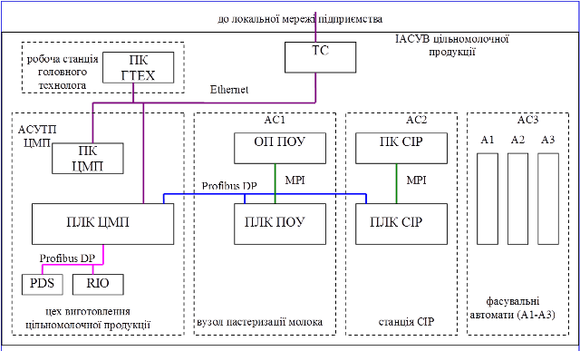
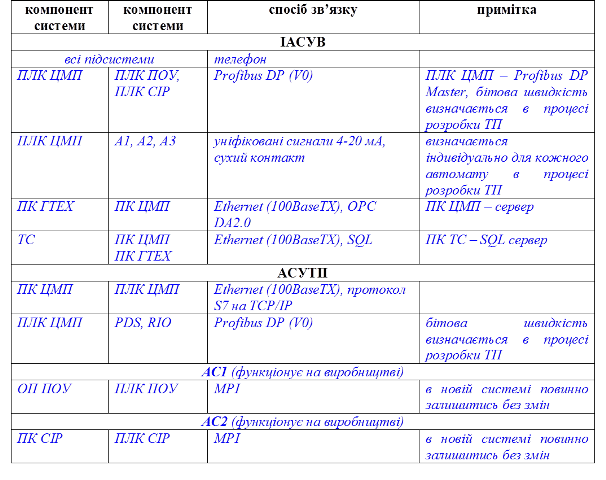
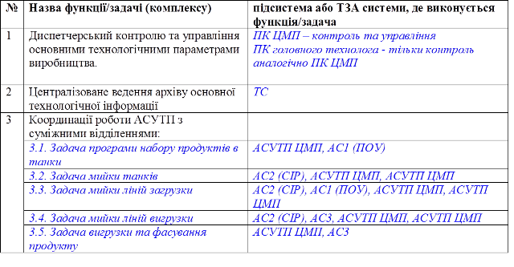
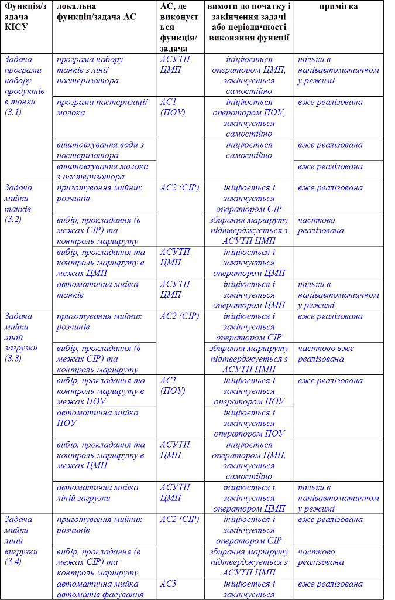

# 4.Вимоги до системи

## 4.1. Вимоги до системи вцілому.

**4.1.1. Вимоги до структури і функціонування системи.**

***Перелік підсистем, їх призначення та основні характеристики, вимоги до кількості рівнів ієрархії та степені централізації системи***. Технічна структура розроблювальної ІАСУВ наведена на рис.Д3. 

*Рис.Д3. Технічна структура ІАСУВ цільномолочної продукції* 

(пояснення до структури в курсовому проекті заповнювати не обов’язково)

*ІАСУВ повинна мати 2-х рівневу структуру: рівень технологічного процесу та рівень виробництва. На рівні технологічного процесу (ТП) в систему повинно входити 4-ри підсистеми:* 

-    *автоматизована система управління приготування цільномолочної продукції* *(АСУТП ЦМП);*

-    *автоматизована система управління пастеризаційно-охолоджувальною установкою (АС1 ПОУ);*

-    *автоматизована система управління* *CIP-станції* *(АС2 CIP).*

-    *фасувальні автомати цеху ФМП (А1-А3) які умовно об’єднані в АС3;* 

*Підсистеми АС1, АС2 та АС3 вже функціонують на виробництві, як повністю автономні, і після модернізації повинні бути включені в загальну структуру ІАСУВ виробництвом.* 

*Підсистема АСУТП ЦМП, яка розробляється як складова ІАСУВ для управління технологічним процесом приготування цільномолочної продукції, повинна мати 3-рівневу структуру:* 

-    *рівень датчиків (датчики, перетворювачі частоти PDS, розподілені засоби вводу/виводу);* 

-    *рівень контролерів (ПЛК ЦМП);*

-    *рівень* *SCADA**/**HMI* *(ПК ЦМП)*

*Система повинна бути функціонально та технічно розподіленою, при відсутності зв’язку всі підсистеми повинні працювати незалежно одна від одної. ПК ЦМП з функціями* *SCADA**/**HMI* *являється координуючою станцією для всієї лінії.* 

*Рівень виробництва повинен включати робочу станцію головного технолога з ПК ГТЕХ для контролю за основними виробничими параметрами та технологічний сервер (ТС) для ведення архіву по параметрам виробництва.* 

**Вимоги до способів та засобів зв’язку для інформаційного обміну між компонентами системи.**

Таблиця Д7.

**Вимоги до характеристик зв’язку систем АСУТП та КІСУ з суміжними системами.**

(в курсовому та дипломному проекті заповнювати не обов’язково)

*Вимоги до зв’язку АСУТП ЦМП з іншими підсистемами КІСУ наведені в таблиці Д7. У КІСУ виробництвом цільномолочної продукції повинен бути передбачений доступ до читання архівних технологічних даних виробництва на технологічному сервері (ТС) з використанням мережі Ethernet (окремий канал) та SQL запитів. Для узгодження та координації з рівнем управління підприємством повинен використовуватись телефонний зв’язок.*

**Вимоги до режимів функціонування системи**.

(в курсовому та дипломному проекті заповнювати не обов’язково)

*КІСУ повинна функціонувати в 2-х режимах: напівавтоматичний режим та автономний режим. В напівавтоматичному режимі, виконання програм набору, фасування продукту та мийки обладнання повинен ініціювати оператор АСУТП ЦМП. При цьому оператори АС1, АС2 та АС3 повинні підтвердити запуск цих* *задач локально. Перехід між кроками виконання програм а також стабілізацію заданих технологічних режимів повинно проводитись автоматично. В автономному режимі ініціювання кроків задач набору, приготування, фасування продукту та мийки обладнання повинен проводити оператор АСУТП ЦМП. При цьому АС1-АС3 функціонують як незалежні системи, і узгодження між ними проходить на рівні операторів з використанням телефонного зв’язку. У випадку збою роботи програм набору продукту та мийки або відсутності зв’язку по мережі Profibus DP між АСУТП ЦМП та АС1 чи АС2, КІСУ автоматично повинна перейти в автономний режим. Всі контури стабілізації технологічних параметрів АСУТП ЦМП повинні мати можливість працювати в двох режимах: автоматичному та ручному (з ПК). В ручному режимі станом виконавчих механізмів контурів повинен управляти оператор з ПК.*  

**Вимоги до діагностування** **системи.**

(в курсовому та дипломному проекті заповнювати не обов’язково)

*Всі збої в роботі технічних засобів АСУТП ЦМП, зв’язку з АС1-АС3 повинні відображатися у вікні тривог ПК ЦМП. Всі мережні компоненти Profibus DP, Ethernet (зокрема мережні комутатори, повторювачі), а також вузли цих мереж (зокрема ПЛК ЦМП, RIO та PDS) повинні мати індикаторні лампи для виявлення факту несправності.* 

**Перспективи розвитку, модернізації системи.**

(в курсовому та дипломному проекті заповнювати не обов’язково)

*КІСУ повинна мати можливість добавлення нових робочих станцій на рівні виробництва, добавлення нових автоматів з можливістю координації роботи їх з АСУТП ЦМП.* 

  **Д4.1.2. Вимоги до чисельності та кваліфікації персоналу системи та режиму його роботи.**

(в курсовому та дипломному проекті заповнювати не обов’язково)

*Для АС1, АС2, АС3 кількість операторів та їх кваліфікація повинні залишитись без змін.* 

*Для АСУТП ЦМП повинно бути передбачено 2 оператори на одну зміну: оператор цеху повинен відповідати за приготування продукту, оператор лінії за координацію роботи АСУТП ЦМП з іншими підсистемами КІСУ. Оператори повинні володіти базовими навиками роботи з ПК а також пройти підготовку та інструктаж по роботі лінії та підсистем КІСУ. Для оператора повинен бути передбачений 8-годинний робочий день.* 

  **4.1.3. Вимоги до показників призначення.**

(в курсовому та дипломному проекті заповнювати не обов’язково)

**4.1.4. Вимоги до надійності.**

(в курсовому та дипломному проекті заповнювати не обов’язково)

**4.1.5. Вимоги до безпеки.**

(в курсовому та дипломному проекті заповнювати не обов’язково)

**4.1.6. Вимоги до ергономіки та технічної естетики.**

(в курсовому та дипломному проекті заповнювати не обов’язково)

**4.1.7. Вимоги до експлуатації, технічного обслуговування, ремонту та збереження.**

(в курсовому та дипломному проекті заповнювати не обов’язково)

**4.1.8. Вимоги до захисту інформації від несанкціонованого доступу.**

(в курсовому та дипломному проекті заповнювати не обов’язково)

*У системі повинен бути передбачений захист інформації від несанкціонованого доступу неповноважних осіб. Способи і засоби захисту інформації, зокрема від несанкціонованого доступу, розробляються при проектуванні системи.* 

*Для АРМів операторів повинні бути передбачені 3 користувачі:* 

-    *адміністратор, з функціями керування користувачами та їх правами;*

-    *оператор, з можливістю доступу до даних процесу;*

-    *інженер, з можливістю настройки контурів управління та маштабування;*

*Незареєстровані користувачі мають право тільки на перегляд змінних активної дисплейної мнемосхеми.*   

**4.1.9. Вимоги до збереження інформації.**

(в курсовому та дипломному проекті заповнювати не обов’язково)

*У системі повинен бути передбачений захист від втрат (пропадання) інформації при аваріях, збоях і відмовах в роботі технічних засобів. Захист інформації від втрат при збоях і відмовах в роботі обладнання повинен реалізовуватися на рівні технічних засобів і програмного забезпечення.*

**4.1.10.**     **Вимоги до засобів захисту від зовнішніх дій.**

(в курсовому проекті заповнювати не обов’язково)

*Технічні засоби системи, які встановлені по місцю і не мають відповідного ступеню захисту повинні бути розташовані в окремих щитах, виготовлених з нержавіючої сталі.* 

*Захист технічних засобів системи від дії зовнішніх електричних і магнітних полів повинен бути достатнім для ефективного виконання технічними засобами свого призначення при функціонуванні системи.*

*Якщо характеристики середовища не відповідають вимогам умов експлуатації вибраних технічних засобів, то необхідно ухвалювати проектні рішення по захисту технічних засобів від неприпустимих зовнішніх дій. Шляхи захисту технічних засобів від неприпустимих зовнішніх дій:*

- *конструювання або застосування додаткових технічних засобів, наприклад, амортизаційних пристроїв, шаф-термостатів і т.д;*

-  *проектування приміщень з штучно регульованими або поліпшеними умовами експлуатації.*

**4.1.11.**     **Вимоги до патентної чистоти.**

(в курсовому проекті заповнювати не обов’язково)

*Вимоги до патентної чистоти не пред'являються.*

**4.1.12.**     **Вимоги до стандартизації та уніфікації.**

(в курсовому та дипломному проекті заповнювати не обов’язково)

При проектуванні системи повинен застосовуватися принцип стандартизації і уніфікації, який полягає в раціональному застосуванні типових, однотипних, уніфікованих і стандартних схемних рішень, конструктивів і комплектуючого устаткування.

## 4.2. Вимоги до функцій та задач системи

**4.2.1. Вимоги до функцій та задач (комплексу задач) ІАСУВ.**

**Перелік функцій/задач ІАСУВ.**

Таблиця Д8.

**Перелік технологічних параметрів для функції диспетчерського контролю та управління основними технологічними параметрами виробництва (1).**

Таблиця Д9. 

| **Технологічний параметр**                  | **джерело->** **приймач даних** | **періодичність** | **примітка**                                                 |
| ------------------------------------------- | ------------------------------- | ----------------- | ------------------------------------------------------------ |
| *Стан танків*                               | *ПЛК ЦМП -> ПК ЦМП*             | *5 с*             | *набір, приготування, вигрузка, мийка,  крок програми набору/мийки* |
| *Стан пастеризатору*                        | *ПЛК ПОУ -> ПК ЦМП*             | *5 с*             | *стан пастеризатору (зупинка, мийка,  пастеризація, аварія), крок пастеризації/мийки, тип продукту* |
|                                             |                                 |                   |                                                              |
| *Команда на запуск/зупинку мийки  контурів* | *ПК ЦМП -> ПЛК* *CIP*           | *по команді*      |                                                              |

 **Перелік технологічних параметрів для функції ведення архіву основної технологічної інформації (2).**

Таблиця Д10. 

| **Технологічний параметр**                   | **джерело->** **приймач  даних** | **періодичність**     | **примітка**                                                 |
| -------------------------------------------- | -------------------------------- | --------------------- | ------------------------------------------------------------ |
| *усереднена витрата молока на  пастеризацію* | *ПЛК ПОУ -> ТС*                  | *1 год*               | *по плинним значенням витратоміра з  ПЛК ПОУ, необхідне попереднє усереднення* |
| *кількість переробленого молока за  зміну*   | *ПЛК ПОУ -> ТС*                  | *по закінченню зміни* | *по значенням лічильника*   *на ПЛК ПОУ*                     |
|                                              |                                  |                       |                                                              |
| *кількість виготовленого продукту за  зміну* | *ПЛК ЦМП -> ТС*                  | *по закінченню зміни* | *по значенням лічильника*   *з ПЛК ПОУ в кінці пастеризації,  необхідна попередня обробка* |

**Перелік та вимоги до локальних функцій/задач АС координації роботи АСУТП ЦМП з суміжними відділеннями(3).**

Таблиця Д11.

**4.2.2. Вимоги до функцій та задач (комплексу задач) АСУТП ЦМП.**

**Перелік та вимоги до задач АСУТП ЦМП.**

Таблиця Д12. 

| **Найменування задачі**                                      | **вимоги до початку і закінчення задачі**                    | **примітка**                                                 |
| ------------------------------------------------------------ | ------------------------------------------------------------ | ------------------------------------------------------------ |
| *програма набору танків з лінії  пастеризатора*              | *ініціюється оператором, закінчується самостійно*            | *тільки в напівавтоматичному режимі,  при помилці або переходу в автономний режим - програма зупиняється, стан клапанів  не змінюється* |
| *вибір, прокладання та контроль  маршруту мийки обладнання в межах ЦМП* | *ініціюється і закінчується оператором*                      | *в напівавтоматичному режимі  проводиться контроль зібраного маршруту з замовленим в АС CIP* |
|                                                              |                                                              |                                                              |
| *програма приготування продукту*                             | *в напівавтоматичному режимі ініціюється програмою набору, в ручному  режимі – оператором; закінчується оператором* | *для молока та кефіру різні програми*                        |

**Перелік технологічних параметрів та функцій по відношенню до них.**

Позначення функцій: I – відображення, вказана періодичність оновлення; C – автоматизоване регулювання, вказана допустима статична похибка; A – сигналізація, вказані умови спрацювання; R – архівування, вказана періодичність запису та глибина архіву.

Таблиця Д13. 

| **Назва параметру**     | **Номінальне значення** | **Діапазон  зміни** | **Функція** |       |                       |                 |
| ----------------------- | ----------------------- | ------------------- | ----------- | ----- | --------------------- | --------------- |
| С                       | I                       | A                   | R           |       |                       |                 |
| *Температура в апараті* | *680С*                  | *0-75 0С*           | *±0.5 0С*   | *5 с* | *>75 0С**,*  *<60 0С* | *10 с,* *1 міс* |
|                         |                         |                     |             |       |                       |                 |
| *Час перемішування*     | *3 хв*                  | *0-10 хв*           | *-*         | *1 с* | *-*                   | *-*             |

   

## **4.3.** Вимоги до видів забезпечень

**4.3.1. Вимоги до математичного забезпечення.**

(в курсовому та дипломному проекті заповнювати не обов’язково)

**4.3.2. Вимоги до інформаційного забезпечення.**

(в курсовому проекті заповнювати не потрібно)

Загальні вимоги до способу організації зв’язку між компонентами системи наведені в 4.1.1 (Таблиця Д7). Для кодування технологічного обладнання, технічних засобів ПТК, фізичних або віртуальних автоматичних пристроїв, алгоритмів і програм повинна використовуватися єдина система кодування. Для зручності сприйняття інформації, що виводиться на вихідні пристрої, допустиме використовування технологічного смислового кодування за допомогою термінів і скорочень, прийнятих у Замовника. Форми вихідних відеокадрів (дисплеїв) і документів системи повинні узгоджуватися з Користувачем системи. 

#### Вимоги до інформаціного забезпечення АРМу оператору АСУТП.

Таблиця Д14. 

| **№** | **Призначення дисплейної мнемосхеми**                        | **примітка**                        |
| ----- | ------------------------------------------------------------ | ----------------------------------- |
| *1*   | *дисплейна мнемосхема виробничої лінії*                      | *основна мнемосхема*                |
| *2*   | *дисплейна мнемосхема цеха  цільномолочної продукції ЦМП*    |                                     |
| *3*   | *дисплейна мнемосхема списку  повідомлень тривог і подій*    |                                     |
| *4*   | *дисплейна мнемосхема архіву (журналу)  повідомлень тривог і подій* |                                     |
| *5*   | *дисплейна мнемосхема настройки  контурів регулювання*       |                                     |
| *6*   | *дисплейна мнемосхема трендів процесу*                       |                                     |
| *7*   | *дисплейна мнемосхема для налаштування  маштабування перетворювачів* | *доступний тільки для служби КВПіА* |

На всіх дисплейних мнемосхемах повинні бути передбачені:

-   кнопки меню для швидкого переходу на всі дисплейні мнемосхеми;

-   кнопка для виклику вікна реєстрації користувача;

-   вікно з останніми активними або непідтвердженими тривогами.  

На дисплейних мнемосхемах стандартних трендів повинні бути передбачені:

-   перегляд аналогових та дискретних змінних процесу, згідно таб. Д13 (функція R);

-   можливість переключення в режим реального часу та історичний режим з можливістю вибору початкової дати перегляду;

-   можливість групування змінних та збереження груп для швидкого їх виклику;

-   друк тренду на принтері АРМу.

На дисплейних мнемосхемах списку повідомлень тривог та подій повинна бути передбачена можливість підтвердження тривоги. Непідтверджені тривоги повинні мигати і сигналізуватися звуковим сигналом динаміку ПК до підтвердження тривоги. Додаткові вимоги до кольорової гами та категорій тривог повинні бути узгоджені з головним технологом в процесі розробки АРМу.

На дисплейних мнемосхемах журналу повідомлень повинні відображатися 10-20 останніх повідомлень. Повинна бути можливість перегляду журналу повідомлень за останній місяць. Форма повідомлення повинна бути узгоджена з головним технологом в процесі розробки АРМу.

#### Вимоги до інформаціного забезпечення АРМу ПК ГТЕХ.

Таблиця Д15. 

| **№** | **Призначення дисплейної мнемосхеми**                        | **примітка**                                |
| ----- | ------------------------------------------------------------ | ------------------------------------------- |
| *1*   | *дисплейна мнемосхема виробничої лінії*                      | *основна мнемосхема, аналогічна таб.Д14.1*  |
| *2*   | *дисплейна мнемосхема цеха  цільномолочної продукції ЦМП*    | *аналогічна таб.Д14.2, тільки відображення* |
| *3*   | *дисплейна мнемосхема списку  повідомлень тривог і подій*    | *аналогічна таб.Д14.3, тільки відображення* |
| *4*   | *дисплейна мнемосхема архіву (журналу)  повідомлень тривог і подій* | *аналогічна таб.Д14.4,*                     |
| *5*   | *дисплейна мнемосхема трендів процесу*                       | *аналогічна таб.Д14.6,*                     |
| *6*   | *дисплейна мнемосхема трендів виробництва*                   |                                             |
| *7*   | *дисплейна мнемосхема формування  звітів*                    |                                             |

На дисплейній мнемосхемі трендів виробництва повинні відображатися архівні дані перераховані в Таб.Д10.

На дисплейній мнемосхемі звітів повинна відображатися статична інформація про узагальнені показник, наведені в таб.Д16. Форми звітів повинні бути узгоджені з головним технологом в процесі розробки АРМу.

Таблиця Д16. 

| **№** | **Виробничі параметри в звіті**                              | **примітка**                                              |
| ----- | ------------------------------------------------------------ | --------------------------------------------------------- |
| *1*   | *кількість переробленого молока*                             | *за зміну/добу/місяць/рік та  вибраний оператором термін* |
| *2*   | *кількість виготовленого продукту*                           |                                                           |
| *3*   | *максимальними і мінімальними величинами  температур пастеризації* |                                                           |
| *4*   | *тривалість виготовлення продукції*                          |                                                           |

**4.3.3. Вимоги до лінгвістичного забезпечення.**

Мова написів та повідомлень на дисплейних мнемосхемах для всіх АРМ, супроводжувальної документації до системи повинна бути українська або російська. В повідомленнях тривог та подій повинна бути зрозуміло і стисло відображена суть повідомлення.  

**4.3.4. Вимоги до програмного забезпечення.**

Таблиця Д17. 

| **Тип програмного засобу** | **виробник**         | **назва**         | **примітки**                                           |
| -------------------------- | -------------------- | ----------------- | ------------------------------------------------------ |
| *SCADA для* *ПК ЦМП*       | *Schneider Electric* | *SCADACitect 7.2* | *-*                                                    |
| *ПЗ для  ПЛК* *ЦМП*        | *Siemens*            | *Step 7*          | *всі частини програми з відкритим доступом, мова* *LD* |
| *ПЗ для ПК ГТЕХ*           | *Schneider Electric* | *SCADACitect 7.2* | *-*                                                    |
| *ПЗ для ТС*                | *Microsoft*          | *MS SQL Server*   | *-*                                                    |

**4.3.5. Вимоги до технічного забезпечення.**

 *Таблиця Д18.*

| **Тип технічного  засобу**  | **виробник**         | **назва**      | **додаткові  вимоги**                                        |
| --------------------------- | -------------------- | -------------- | ------------------------------------------------------------ |
| *ПЛК ЦМП*                   | *VIPA*               | *VIPA SPEED7*  | *IP20, в щитовій*                                            |
| *ПК ЦМП*                    | *без обмежень*       | *без обмежень* | *на базі офісного ПК IP20, в щитовій*                        |
| *ПК ГТЕХ*                   | *без обмежень*       | *без обмежень* | *на базі офісного ПК IP20, в кабінеті головного технолога*   |
| *ТС*                        | *без обмежень*       | *без обмежень* | *на базі офісного ПК IP20, в кабінеті головного технолога*   |
| *PDS*                       | *Schneider Electric* | *Altivar 71*   | *IP20, в щитах по місцю*                                     |
| *RIO*                       | *VIPA*               | *VIPA* *300*   | *IP20, в щит**ах по місцю*                                   |
| *витратоміри-лічильники*    | *Si**e**mens*        | *без обмежень* | *IP65*                                                       |
| *інші датчики*              | *без обмежень*       | *без обмежень* | *IP65*                                                       |
| *виконавчі механізми  (ВМ)* | *без обмежень*       | *без обмежень* | *IP65, пневматичне (заслонки) або електричне (електроклапани) живлення* |
| *регулюючі органи (РО)*     | *без обмежень*       | *без обмежень* | *нерж сталь (виконання для молочної промисловості)*          |

**4.3.6. Вимоги до метрологічного забезпечення.**

(в курсовому проекті заповнювати не обов’язково)

**4.3.7. Вимоги до організаційного забезпечення.**

(в курсовому та дипломному проекті заповнювати не обов’язково)

# 5. Склад та зміст робіт по створенню системи.

(Даний розділ не заповнюється в курсовому та дипломному проекті).

# 6. Порядок контролю та прийомки системи

(Даний розділ не заповнюється в курсовому та дипломному проекті).

# 7. Вимоги до складу та змісту робіт по підготовці об’єкту автоматизації до вводу системи в дію

(Даний розділ не заповнюється в курсовому та дипломному проекті).