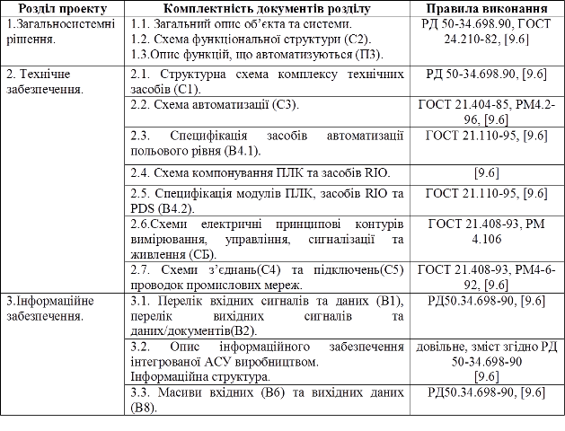

# 8.Вимоги до документування

## **8.1.** Проектна документація 

Створення та оформлення проектної документації проводити згідно РД 50-34.698-90 "Автоматизированные системы. Требования к содержанию документов" а також відповідних стандартів: єдиної системи програмної документації (ЕСПД); єдиної системи конструкторської документації (ЕСКД); системи проектної документації для будівництва (СПДС). 

Інформаційне забезпечення КІСУ *рекомендується*  оформляти у вигляді схеми мережних інформаційних потоків, згідно [9.6] (див. Джерела розробки даного ТЗ). Даний розділ дозволяється оформляти у вигляді таблиць або інших креслень, які розкривають зміст інформаційного забезпечення КІСУ згідно РД 50-34.698-90.

Вимоги до комплектності проектної документації наведені в таблиці Д19. 

Таблиця Д19. 

Проектна документація приводиться в паперовому вигляді. Креслення та схеми приводяться на форматах А4 або А3.  

## 8.2. Інструкції для користувача 

Додатково до проектної документації в електронному або паперовому вигляді подаються розділи (підрозділи) каталогів, інструкцій користувача, методичних вказівок, посібників з описом обладнання, яке використовується в проекті.  