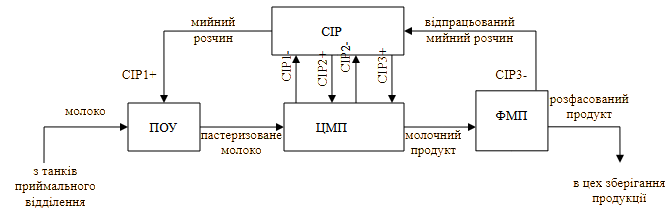
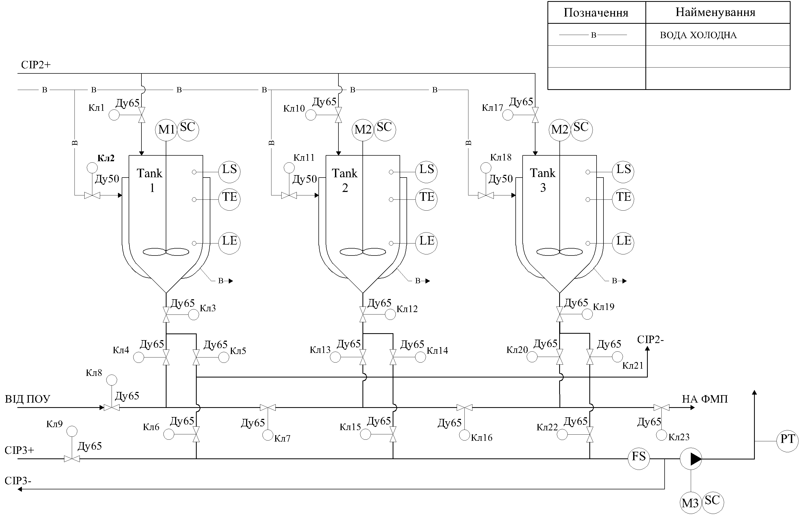
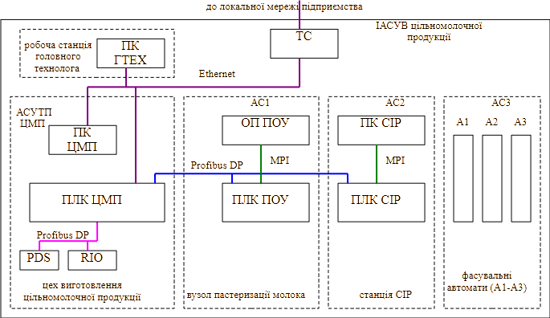

## 6.1. Аналіз об'єкта, існуючих систем керування АСКТП та формування вимог

### Загальні рекомендації щодо виконання розділу 

Спочатку проводять аналіз об'єкта та існуючих систем для визначення їх характеристик та формування вимог. Ці роботи відноситься до передпроектних робіт, на основі них розробляється технічне завдання. За вітчизняною практикою технічне завдання (ТЗ) на автоматизовану систему керування (контролю, проектування та інш.) є основним документом, що означує вимоги й порядок створення (розвитку, модернізації) автоматизованої системи, відповідно до якого проводиться  її розробка й приймання при запровадженні в дію. ТЗ на КІСК як на автоматизовану систему розробляють на систему в цілому, призначену для роботи самостійно або в складі іншої системи. Технічне завдання містить вихідні дані та вимоги до проектованої системи. На базі технічного завдання розробляється вся проектна документація а також всі види забезпечень розроблювальної системи та роботи по вводу її в дію. 

При курсовому проектуванні технічне завдання є підрозділом розділу 1 і розробляється після отримання завдання на проект. Вважається, що здобувач пройшов практику на харчовому підприємстві, та має всі необхідні вихідні дані для формування цього підрозділу. У іншому випадку, вихідні дані необхідно брати з довідникової літератури по харчовим виробництвам. У таблиці 2 наведені вихідні дані, які потрібні для розроблення технічного завдання.  

Таблиця 2. Дані на базі яких створюється ТЗ.

| Вихідні дані                                                 | Джерело даних                                                |
| ------------------------------------------------------------ | ------------------------------------------------------------ |
| технічні відомості про існуючі (впроваджені) АС в складі майбутньої КІСК | завдання на курсовий проєкт                                  |
| впроваджені функції в існуючих АС в складі майбутньої КІСК   | навчальна та довідникова література по технологіям харчових виробництв |
| апаратурно-технологічна схема основного відділення (при необхідності всієї виробничої лінії) з описом функціонування технологічних процесів,  та/або схема автоматизації | навчальна та довідникова література по технологіям харчових виробництв |
| місця контролю технологічних параметрів та управляючих дій на технологічній схемі процесу/виробництва | навчальна та довідникова література по технологіям харчових виробництв |
| вимоги до функцій та задач, виконуванні КІСК                 | завдання на курсовий проєкт, навчальна та довідникова література по технологіям харчових виробництв, керівник |
| вимоги до людино-машинного інтерфейсу, ведення архіву, тривог та інших фугкцій SCADA/HMI | навчальна та довідникова література по технологіям харчових виробництв |
| територіальне розміщення точок встановлення ТЗА та пунктів управління | навчальна та довідникова література по технологіям харчових виробництв |
| загальні вимоги до функціонування системи                    | завдання на курсовий проєкт                                  |
| вимоги до комплектації обладнання та матеріалів              | завдання на курсовий проєкт                                  |
| терміни виконання робіт                                      | завдання на курсовий проєкт                                  |

Приклад виконання розділу в курсовому проєкті наведений нижче, який по суті є скороченою версією ТЗ. Бланк завдання до курсового проєкту, згідно якого виконується завдання наведений в додатку 1. 

### Приклад виконання розділу

#### Загальні відомості про систему

Загальні дані щодо щодо розроблювальної системи наведені в таблиці 3

Таблиця 3. Загальні дані щодо розроблювальної системи

| Призначення                                                  | Найменування                                                 |
| ------------------------------------------------------------ | ------------------------------------------------------------ |
| Повне найменування системи                                   | Комп'ютерно-інтегрована система керування виробництвом цільно-молочної продукції |
| Умовне позначення системи                                    | КІСКВ                                                        |
| Найменування автоматизованої системи управління технологічним процесом основного відділення (як підсистеми КІСК) | автоматизована система керування приготування цільномолочної продукції |
| Умовне позначення АС                                         | АСКТП                                                        |
| Найменування автоматизованих систем керування технологічними процесами суміжних відділень | АС1 - автоматизована система керування пастеризаційно-охолоджувальною установкою ПОУ    АС2 - автоматизована система керування CIP-станції   АС3 – системи керування фасувальними автоматами |
| Найменування підсистеми IIoT                                 | Польовий доступ обслуговуючого персоналу до цифрового представлення обладнання |
| Умовне позначення підсистеми IIoT                            | IIoT                                                         |

КІСКВ є інтегрованою автоматизованою системою, яка призначена: 

- для координації роботи АСКТП та АС, шляхом видачі координуючих завдань та переводу їх з режиму в режим; 
- для забезпечення централізованого контролю за основними параметрами виробництва шляхом збору та відображення інформації з АСКТП та АС;
- для сигналізації аварійних ситуацій на ліній виробництва, переключення в безпечний стан виконавчих механізмів АСКТП, переключення в аварійний режим АСКТП та АС в аварійних ситуаціях; 
- для архівування основних виробничих параметрів АСКТП та АС з можливістю доступу до архівних даних з боку автоматизованої системи організаційно-економічного рівня; 
- для стабілізації заданих режимів приготування продуктів шляхом контролю технологічних параметрів, візуального представлення та видачі керуючих дій на виконавчі механізми, як в автоматичному режимі, так і в результаті дій операторів.

**Об’єктом керування КІСКВ** є взаємопов’язані процеси, що задіяні у виробництві цільномолочної продукції.

**Об’єктом керування АСКТП** є технологічні процеси приготування цільно-молочних продуктів с пастеризованого молока та вершків

**Цілями створення ІАСКВ є:** 

- зменшення простою обладнання і відповідно збільшення виходу товарної продукції; 
- запобігання аварійним ситуаціям, пов’язаним зі збоєм в одній із підсистем; 
- централізоване представлення найбільш важливих технологічних параметрів виробничого процесу для аналізу роботи системи в режимі реального часу та історії процесу; 
- зменшення впливу людського фактору на процеси виробництва продуктів.

**Цілями створення АСКТП в складі КІСКВ є**: 

- стабілізація режимних параметрів технологічного процесу для забезпечення якості продукту; 
- облік кількості переробленої сировини; 
- поліпшення умов праці обслуговуючого персоналу; 
- підвищення надійної роботи обладнання (насоси, двигуни) та їх захист в аварійних ситуаціях; 
- недопускання втрати продукту;

**Цілями створення підсистеми IIoT в складі КІСКВ є**: 

- підвищення спостережуваності технологічного процесу за рахунок додаткових точок збору телеметрії без втручання в існуючі ПЛК;
- забезпечення мобільного доступу до даних та обладнання через цифрові подання (цифрові двійники) з польових пристроїв;
- інтеграція з сервісами хмарної аналітики, ТОіР або іншими зовнішніми системами для обміну даними про стан обладнання;
- автономний контроль і аналіз стану вузлів безпосередньо на edge-рівні, з можливістю локального реагування при втраті зв’язку з SCADA або MES;
- забезпечення контекстної підтримки обслуговуючому персоналу через доступ до документації, історії подій та діагностики конкретної одиниці обладнання.

#### Характеристика об’єкту автоматизації

##### Опис роботи технологічної лінії виробництва цільномолочної продукції.

Об’єктом автоматизації КІСКВ є технологічна лінія виробництва цільномолочної продукції (рис.2) продуктивністю 50 т/добу, яка призначена для виробництва та фасування цільномолочних продуктів таких як молоко 2.5%, молоко 3.2%, кефіру 2.5%. Лінія  складається з вузла пастеризації молока (ПОУ) продуктивністю 5000 л/год,  цеху приготування цільномолочної продукції (ЦМП), станції приготування мийних розчинів (CIP) на 3 контури, цеху фасування молочних продуктів (ФМП). 

рис.2. Схема технологічної лінії виробництва цільномолочної продукції.

Молоко з проміжних танків приймального відділення (танк Т1 для молока жирності 2.5%, Т2 – для молока жирності 3.2%) подається на вузол ПОУ, в якому пастеризується і охолоджується до заданої температури. Режим пастеризації залежить від кінцевого продукту. 

Пастеризоване молоко з ПОУ подається на приготування в вибраний оператором танк ЦМП. Завантаження необхідного танку проводиться шляхом відкриття/закриття необхідних клапанів. В танках продукт охолоджується, при необхідності добавляються додаткові компоненти (закваска). Після приготування, готовий молочний продукт подається в цех фасування ЦМП на потрібні автомати розливу. Розфасований продукт транспортерами завозиться в цех зберігання продукції, поки не відправиться на реалізацію. 

Мийка пастеризатора та ліній загрузки. Після кожної пастеризації молока та завантаження танків, ПОУ та трубопроводи завантаження повинні пройти мийку мийними розчинами з вузла CIP. Вузол ПОУ миється 1-м контуром CIP. Для цього перед початком мийки, відкриттям/закриттям потрібних клапанів прокладається шлях мийному розчину від станції CIP до ПОУ (CIP1+), потім по трубопроводам завантаження танків в ЦМП та відпрацьованому мийному розчину в зворотному напрямку (CIP1-). Мийний розчин повертається в станцію CIP для регенерації. 

Після кожного приготування продукту в танку та його вивантаження, танк необхідно помити. Танки миються 2-м контуром CIP. Для цього перед початком мийки, відкриттям/закриттям потрібних клапанів прокладається шлях мийному розчину від станції CIP до необхідного танку та відпрацьованому мийному розчину в зворотному напрямку (CIP2-).

Мийка ліній вивантаження та фасовочних автоматів. Лінії вивантаження повинні проходити мийку після кожної партії приготовленого продукту. Лінії вивантаження миються 3-м контуром CIP. Для цього перед початком мийки, відкриттям/закриттям потрібних клапанів прокладається шлях мийному розчину від станції CIP до трубопроводів вивантаження, до потрібного фасувального автомату та відпрацьованому мийному розчину в зворотному напрямку (CIP3-).  

##### Опис роботи цеху приготування цільномолочної продукції.

Апаруторно-технологічна схема цеху приготування цільномолочної продукції а також точки вимірювання та керування зображені на рис.3. Продукт готується в танках `Tank1`-`Tank3`, для чого з лінії набору від ПОУ прокладається шлях до конкретного танку. Стан клапанів для наборів танків:

- Танк1: кл8, кл4, кл3 – відкриті, кл5, кл7, кл13, кл16 – закриті.

- Танк2: кл8, кл7, кл12, кл13 – відкриті, кл4, кл14, кл16 – закриті.

- Танк3: кл 8, кл7, кл16, кл18, кл20 – відкриті, кл 4, кл13, кл21, кл23

Молоко подається з ПОУ під тиском 4 бара. В ПОУ передбачене аварійне переключення на рециркуляцію у випадку закриття шляху для набору.     

Рис.3. Апаратурно-технологічна схема цеху приготування цільномолочної продукції.

В танках повинні вимірюватися рівень, температура продукту та сигналізуватися аварійно високий рівень. Після набору, молоко охолоджується до заданої температури шляхом подачі в сорочку льодяної води (кл2, кл11, кл18). При приготуванні кефіру, після набору молока оператором цеху вкидається закваска і продукт приготовляється протягом заданого часу. При приготуванні та охолодженні продукту, в танках відбувається перемішування, необхідна частота обертів двигунів мішалки (М1-М3) залежить від типу продукту та його якісних показників.  

Вивантаження продукту. Після приготування, продукт подається на ФМП для фасування. Стан клапанів для вивантаження кожного танку:

- Танк1: кл3, кл5, кл6 – відкриті, кл4, кл24  – закриті

- Танк2: кл12, кл14, кл15 – відкриті, кл13, кл25 – закриті

- Танк3: кл19, кл21, кл22 – відкриті, кл20, кл26 – закриті

Вивантаження відбувається під дією насосу, який нагнітає тиск в трубопроводі вивантаження до 4 бар. Для нормальної роботи фасувальних автоматів, тиск необхідно стабілізувати на рівні 2 бар, шляхом зміни частоти обертів двигуна М4. Проходження продукту на фасування повинен контролюватися сигналізатором протоку.    

Мийка танків проводиться 2 контуром СІР. Стан клапанів для мийки танків: 

- Танк1: кл1, кл3, кл5, кл24, кл25, кл26 – відкриті,   кл4, кл6  – закриті 

- Танк2: кл10, кл12, кл14, кл25, кл26 – відкриті, кл13, кл15, кл24  – закриті

- Танк3: кл17, кл19, кл21, кл26 – відкриті,   кл20, кл22, кл25  – закриті

Мийка ліній вивантаження проводиться 3 контуром СІР. Стан клапанів для мийки ліній вивантаження: кл9 – відкритий, кл6, кл15, кл22 – закриті.

Мийка ліній загрузки проводиться 1 контуром СІР. Стан клапанів для мийки ліній загрузки: кл8,кл7,кл16,кл23 – відкриті,  кл4,кл13,кл20 – закриті.

Об’єкт не відноситься до класу вибухонебезпечних. Середовище функціонування вологе, при зовнішній мийці обладнання може бути кислотне та лужне, виконання всіх технічних засобів встановлених по місцю повинно бути не менше IP65.   

#### Вимоги до системи

##### Вимоги до системи в цілому

Перелік підсистем, їх призначення та основні характеристики, вимоги до кількості рівнів ієрархії та степені централізації системи. Технічна структура розроблювальної КІСКВ наведена на рис.4. 

Рис.4. Технічна структура КІСКВ цільномолочної продукції.

КІСКВ повинна мати 2-х рівневу структуру: рівень технологічного процесу та рівень виробництва. На рівні технологічного процесу (ТП) в систему повинно входити 4-ри підсистеми: 

- автоматизована система керування приготування цільномолочної продукції (АСКТП ЦМП);
- автоматизована система керування пастеризаційно-охолоджувальною установкою (АС1 ПОУ);
- автоматизована система керування CIP-станції (АС2 CIP).
- фасувальні автомати цеху ФМП (А1-А3) які умовно об’єднані в АС3;  

Підсистеми АС1, АС2 та АС3 вже функціонують на виробництві, як повністю автономні, і після модернізації повинні бути включені в загальну структуру КІСКВ виробництвом.

Підсистема АСКТП ЦМП, яка розробляється як складова КІСКВ для керування технологічним процесом приготування цільномолочної продукції, повинна мати 3-рівневу структуру: 

- рівень датчиків (датчики, перетворювачі частоти PDS, розподілені засоби вводу/виводу);  
- рівень контролерів (ПЛК ЦМП);
- рівень SCADA/HMI (ПК ЦМП)

Система повинна бути функціонально та технічно розподіленою, при відсутності зв’язку всі підсистеми повинні працювати незалежно одна від одної.  ПК ЦМП з функціями SCADA/HMI являється координуючою станцією для всієї лінії.  

Рівень виробництва повинен включати робочу станцію головного технолога з ПК ГТЕХ для контролю за основними виробничими параметрами та технологічний сервер (ТС) для ведення архіву по параметрам виробництва. 

Таблиця 4. Вимоги до способів та засобів зв’язку між компонентами системи

| Компонент системи    | Компонент системи | Спосіб зв’язку                             | Примітка                                                     |
| -------------------- | ----------------- | ------------------------------------------ | ------------------------------------------------------------ |
| КІСКВ                | всі підсистеми    | телефон                                    |                                                              |
| ПЛК ЦМП              | ПЛК ПОУ, ПЛК CIP  | Profibus DP (V0)                           | ПЛК ЦМП – Profibus DP Master, бітова швидкість визначається в процесі проєктування |
| ПЛК ЦМП              | A1, A2, A3        | уніфіковані сигнали 4-20 мА, сухий контакт | Визначається індивідуально для кожного автомату              |
| ПК ГТЕХ              | ПК ЦМП            | Ethernet (100BaseTX), OPC DA2.0            | ПК ЦМП – сервер                                              |
| ТС                   | ПК ЦМП, ПК ГТЕХ   | Ethernet (100BaseTX), SQL                  | ПК ТС – SQL сервер                                           |
| АСКТП                | ПК ЦМП, ПЛК ЦМП   | Ethernet (100BaseTX), S7 на TCP/IP         |                                                              |
| ПЛК ЦМП              | PDS, RIO          | Profibus DP (V0)                           | Бітова швидкість визначається в процесі ТП                   |
| АС1 (на виробництві) | ОП ПОУ, ПЛК ПОУ   | MPI                                        | Повинно залишитися без змін                                  |
| АС2 (на виробництві) | ПК CIP, ПЛК CIP   | MPI                                        | Повинно залишитися без змін                                  |

##### Вимоги до функцій та задач КІСКВ

КІСКВ повинна виконувати функції/задачі, наведені в таблиці 5. Реалізація підфункцій та підзадач робиться в конкретній підсистемі.    

Таблиця 5. Перелік функцій/задач КІСКВ

| №    | Назва функції/задачі (комплексу)                             | Назва підфункції/підзадачі                | підсистема або ТЗА системи, де виконується функція/задача    |
| ---- | ------------------------------------------------------------ | ----------------------------------------- | ------------------------------------------------------------ |
| 1    | Диспетчерський контролю та управління основними технологічними параметрами виробництва. |                                           | ПК ЦМП – контроль та управління  ПК головного технолога - тільки контроль аналогічно ПК ЦМП. Деталізація в таблиці 6. |
| 2    | Централізоване ведення архіву основної технологічної інформації |                                           | ТС. Деталізація в таблиці 7.                                 |
| 3    | Координації роботи АСКТП з суміжними відділеннями:           |                                           | розподілена між кількома підсистемами (деталізація в таблиці 8) |
| 3.1. |                                                              | Задача програми набору продуктів в танки  | АСКТП ЦМП, АС1 (ПОУ)                                         |
| 3.2. |                                                              | Задача мийки танків                       | АС2 (CIP), АСКТП ЦМП, АСКТП ЦМП                              |
| 3.3. |                                                              | Задача мийки ліній загрузки               | АС2 (CIP), АС1 (ПОУ), АСКТП ЦМП, АСКТП ЦМП                   |
| 3.4. |                                                              | Задача мийки ліній вивантаження           | АС2 (CIP), АС3, АСКТП ЦМП, АСКТП ЦМП                         |
| 3.5. |                                                              | Задача вивантаження та фасування продукту | АСКТП ЦМП, АС3                                               |

Таблиця 6. Перелік технологічних параметрів для функції диспетчерського контролю та керування основними технологічними параметрами виробництва

| Технологічний параметр                   | Джерело → Приймач даних | Періодичність | Примітка                                                     |
| ---------------------------------------- | ----------------------- | ------------- | ------------------------------------------------------------ |
| стан танків                              | ПЛК ЦМП → ПК ЦМП        | 5 с           | набір, приготування, вигрузка, мийка, крок програми набору/мийки |
| стан пастеризатора                       | ПЛК ПОУ → ПК ЦМП        | 5 с           | стан пастеризатора (зупинка, мийка, пастеризація, аварія), крок пастеризації/мийки, тип продукту |
| ...                                      | ...                     | ...           | ...                                                          |
| команда на запуск/зупинку мийки контурів | ПК ЦМП → ПЛК CIP        | по команді    |                                                              |

Таблиця 7. Перелік технологічних параметрів для функції ведення архіву основної технологічної інформації

| Технологічний параметр                    | Джерело → Приймач даних | Періодичність       | Примітка                                                     |
| ----------------------------------------- | ----------------------- | ------------------- | ------------------------------------------------------------ |
| усереднена витрата молока на пастеризацію | ПЛК ПОУ → ТС            | 1 год               | по плинним значенням витратоміра з ПЛК ПОУ, необхідне попереднє усереднення |
| кількість переробленого молока за зміну   | ПЛК ПОУ → ТС            | по закінченню зміни | по значенням лічильника на ПЛК ПОУ                           |
| ...                                       | ...                     | ...                 | ...                                                          |
| кількість виготовленого продукту за зміну | ПЛК ЦМП → ТС            | по закінченню зміни | по значенням лічильника з ПЛК ПОУ в кінці пастеризації, необхідна попередня обробка |

Таблиця 8. Перелік та вимоги до локальних функцій/задач АС координації роботи АСКТП ЦМП з суміжними відділеннями

| Функція/задача КІСК                             | локальна функція/задача АС                            | АС, де виконується функція/задача | вимоги до початку і закінчення задачі або періодичності виконання функції | примітка                           |
| ----------------------------------------------- | ----------------------------------------------------- | --------------------------------- | ------------------------------------------------------------ | ---------------------------------- |
| Задача програми набору продуктів в танки (3.1)  | програма набору танків з лінії пастеризатора          | АСКТП ЦМП                         | ініціюється оператором ЦМП, закінчується самостійно          | тільки в напівавтоматичному режимі |
| (3.1)                                           | програма пастеризації молока                          | АС1 (ПОУ)                         | ініціюється оператором ПОУ, закінчується самостійно          | вже реалізована                    |
| (3.1)                                           | виштовхування води з пастеризатора                    |                                   | ініціюється самостійно                                       | вже реалізована                    |
| (3.1)                                           | виштовхування молока з пастеризатора                  |                                   |                                                              | вже реалізована                    |
| Задача мийки танків (3.2)                       | приготування мийних розчинів                          | АС2 (CIP)                         | ініціюється і закінчується оператором CIP                    | вже реалізована                    |
| (3.2)                                           | вибір, прокладання (в межах CIP) та контроль маршруту |                                   | збирання маршруту підтверджується з АСКТП ЦМП                | частково реалізована               |
| (3.2)                                           | вибір, прокладання та контроль маршруту в межах ЦМП   | АСКТП ЦМП                         | ініціюється і закінчується оператором ЦМП                    |                                    |
| (3.2)                                           | автоматична мийка танків                              | АСКТП ЦМП                         | ініціюється і закінчується оператором ЦМП                    | тільки в напівавтоматичному режимі |
| Задача мийки ліній загрузки (3.3)               | приготування мийних розчинів                          | АС2 (CIP)                         | ініціюється і закінчується оператором CIP                    | вже реалізована                    |
| (3.3)                                           | вибір, прокладання (в межах CIP) та контроль маршруту |                                   | збирання маршруту підтверджується з АСКТП ЦМП                | частково вже реалізована           |
| (3.3)                                           | вибір, прокладання та контроль маршруту в межах ПОУ   | АС1 (ПОУ)                         | ініціюється і закінчується оператором ПОУ                    | вже реалізована                    |
| (3.3)                                           | автоматична мийка ПОУ                                 |                                   | ініціюється і закінчується оператором ПОУ                    |                                    |
| (3.3)                                           | вибір, прокладання та контроль маршруту в межах ЦМП   | АСКТП ЦМП                         | ініціюється оператором ЦМП, закінчується самостійно          |                                    |
| (3.3)                                           | автоматична мийка ліній загрузки                      | АСКТП ЦМП                         | ініціюється і закінчується оператором ЦМП                    | тільки в напівавтоматичному режимі |
| Задача мийки ліній вивантаження (3.4)           | приготування мийних розчинів                          | АС2 (CIP)                         | ініціюється і закінчується оператором CIP                    | вже реалізована                    |
| (3.4)                                           | вибір, прокладання (в межах CIP) та контроль маршруту |                                   | збирання маршруту підтверджується з АСКТП ЦМП                | частково  реалізована              |
| (3.4)                                           | автоматична мийка автоматів фасування                 | АС3                               | ініціюється і закінчується оператором автомату               | вже реалізована                    |
| (3.4)                                           | вибір, прокладання та контроль маршруту в межах ЦМП   | АСКТП ЦМП                         | ініціюється оператором ЦМП, закінчується самостійно          |                                    |
| (3.4)                                           | автоматична мийка ліній вивантаження                  | АСКТП ЦМП                         | ініціюється і закінчується оператором ЦМП                    | тільки в напівавтоматичному режимі |
| Задача вивантаження та фасування продукту (3.5) | вибір, прокладання та контроль маршруту               | АСКТП ЦМП                         | ініціюється оператором ЦМП, закінчується самостійно          |                                    |
| (3.5)                                           | автоматичне фасування                                 | АС3                               | ініціюється і закінчується оператором автомату               | вже реалізована                    |

##### Вимоги до функцій та задач АСКТП ЦМП

Таблиця 9. Перелік та вимоги до задач АСКТП ЦМП

| Найменування задачі                                          | вимоги до початку і закінчення задачі                        | примітка                                                     |
| ------------------------------------------------------------ | ------------------------------------------------------------ | ------------------------------------------------------------ |
| програма набору танків з лінії пастеризатора                 | ініціюється оператором, закінчується самостійно              | тільки в напівавтоматичному режимі, при помилці або переходу в автономний режим - програма зупиняється, стан клапанів не змінюється |
| вибір, прокладання та контроль маршруту мийки обладнання в межах ЦМП | ініціюється і закінчується оператором                        | в напівавтоматичному режимі проводиться контроль зібраного маршруту з замовленим в АС CIP |
| ...                                                          | ...                                                          | ...                                                          |
| програма приготування продукту                               | в напівавтоматичному режимі ініціюється програмою набору, в ручному режимі – оператором; закінчується оператором | для молока та кефіру різні програми                          |
| ...                                                          | ...                                                          | ...                                                          |

Таблиця 10. Перелік функцій АСКТП

| Найменування функції                                     | вимоги до часу | примітка                                                     |
| -------------------------------------------------------- | -------------- | ------------------------------------------------------------ |
| регулювання температури в танках                         | <1 с           | тільки при вивантаженні на лінію, задане значення задається оператором |
| регулювання температури на виході охолоджувачів продукту | <1 с           | тільки при вивантаженні на лінію, задане значення задається оператором |
| ...                                                      | ...            | ...                                                          |

Таблиця 11. Перелік змінних процесу (I/O)

| №    | Найменування                                                 | Тип  | Діапазон | Примітка    |
| ---- | ------------------------------------------------------------ | ---- | -------- | ----------- |
| 1    | Температура продукту в танку                                 | AI   | 0-100 °С |             |
| 2    | Вихід на клапан регулювання подачі охолоджувальної води на теплообмінник охолодження | AO   | 0-100 %  |             |
| 3    | Стан кл3 "закритий"                                          | DI   | 0/1      |             |
| 4    | Кл3 команда "відкрити"                                       | DO   | 0/1      |             |
| 5    | Задане значення % обертів мішалки в танку                    | NAO  | 0-100%   | по Profibus |
| ...  |                                                              | ...  |          |             |

##### Вимоги до функцій та задач IIoT

При технічному обслуговуванні або ремонті обладнання, персонал за допомогою мобільного пристрою (смартфон/планшет) сканує QR-код нанесеному на устаткованні. Система надає доступ до:

- цифрового представлення об'єкта (з параметрами, датами ТО, подіями з журналу, поточним станом);
- документації: інструкцій, технічних паспортів, відеоінструкцій;
- можливості дистанційно контролювати або локально керувати агрегатом (через SCADA/API/OPC UA).

Таблиця 12. Перелік функцій та задач підсистеми IIoT

| Найменування функції                               | Час початку/завершення або період виконання | Підсистема або ТЗА, де виконується               | Примітка                                                     |
| -------------------------------------------------- | ------------------------------------------- | ------------------------------------------------ | ------------------------------------------------------------ |
| Ідентифікація обладнання за QR-кодом               | на вимогу користувача                       | мобільний пристрій + IIoT-шлюз                   | Використовується для запуску локального сеансу обслуговування |
| Отримання цифрового подання устатковання           | після ідентифікації                         | IIoT-шлюз / сервер цифрових двійників            | Містить параметри, історію подій, плани ТО                   |
| Доступ до технічної документації                   | після ідентифікації                         | IIoT-шлюз або хмарне сховище                     | Паспорти, інструкції, відео; доступ read-only                |
| Відображення поточного стану устатковання          | у реальному часі                            | мобільний пристрій через шлюз / API              | Інформація зчитується з контролера або SCADA                 |
| Дистанційне налагоджувальне  керування обладнанням | на вимогу користувача                       | мобільний пристрій  через IIoT-шлюз, SCADA / ПЛК | Керування можливе лише після авторизації в ручному режимі ВМ |
| Аутентифікація і контроль доступу                  | при кожному запиті                          | IIoT-шлюз або зовнішній сервіс авторизації       | Контроль рівнів доступу користувача                          |
| Реєстрація дій налагоджувального персоналу         | під час обслуговування                      | IIoT-шлюз або журнал подій у SCADA               | Фіксація дій, часу, користувача                              |

##### Вимоги до технічного забезпечення КІСК

Таблиця 13. Вимоги до апаратного забезпечення

| Тип технічного засобу | виробник           | назва        | примітки                                                 |
| --------------------- | ------------------ | ------------ | -------------------------------------------------------- |
| ПЛК ЦМП               | VIPA               | VIPA SPEED7  | IP20, в щитовій                                          |
| ПК ЦМП                | без обмежень       | без обмежень | на базі офісного ПК IP20, в щитовій                      |
| ПК ГТЕХ               | без обмежень       | без обмежень | на базі офісного ПК IP20, в кабінеті головного технолога |
| ТС                    | без обмежень       | без обмежень | на базі офісного ПК IP20, в кабінеті головного технолога |
| PDS                   | Schneider Electric | Altivar 71   | IP20, в щитах по місцю                                   |
| RIO                   | VIPA               | VIPA 300     | IP20, в щитах по місцю                                   |

Таблиця 14. Вимоги до програмного забезпечення

| Тип програмного засобу | виробник                 | назва             | примітки      |
| ---------------------- | ------------------------ | ----------------- | ------------- |
| SCADA для ПК ЦМП       | Schneider Electric Aveva | Plant SCADA       | -             |
| ПЗ для ПЛК ЦМП         | Siemens                  | Step 7 TIA Portal |               |
| ПЗ для ПК ГТЕХ         | Schneider Electric       | Plant SCADA       | -             |
| ПЗ для ТС              | немає обмежень           | SQL Server        | підтримка SQL |

##### Вимоги до технічного забезпечення IIoT

Таблиця 15. Вимоги до технічного забезпечення IIoT

| Компонент                   | Вимоги                                                       | Примітки                                                     |
| --------------------------- | ------------------------------------------------------------ | ------------------------------------------------------------ |
| QR-ідентифікація обладнання | Кожна одиниця обладнання повинна мати стійке до промислових умов маркування з QR-кодом, що містить URL цифрового подання. | Використовується для доступу до цифрового двійника через мобільний пристрій. |
| Мобільний інтерфейс         | Підсистема повинна забезпечувати користувачу інтерфейс доступу до цифрового подання через веб або мобільний застосунок. | Інтерфейс може бути браузерним або нативним, з адаптацією під розмір екрану. |
| Дані про обслуговування     | Повинна бути забезпечена інтеграція з ТОіР через стандартний API (наприклад, REST). | Дані включають графіки ТО, історію обслуговування, наявні заявки. |
| Дані з системи керування    | IIoT-шлюз повинен мати можливість читати/писати значення технологічних параметрів через SCADA або промисловий протокол. | Рекомендується використовувати OPC UA або S7 для інтеграції з ПЛК/SCADA. |
| Керування                   | Можливість дистанційного керування обладнанням повинна бути доступна лише після авторизації користувача. | Керування може включати запуск, зупинку, скидання аварії тощо. |
| Безпека                     | Підсистема повинна підтримувати автентифікацію та контроль доступу за ролями (наприклад, OAuth2, токени). | Неавторизовані дії повинні бути заблоковані. Усі дії фіксуються в журналі подій. |
