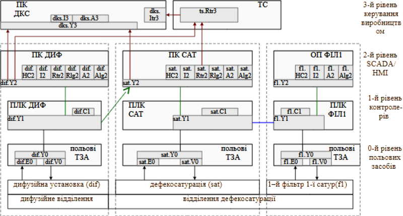
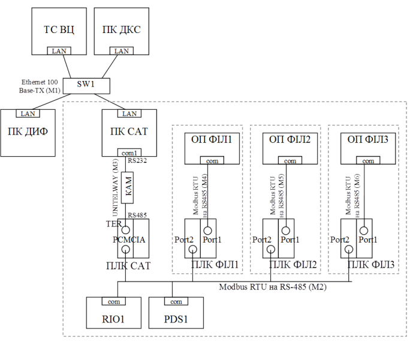
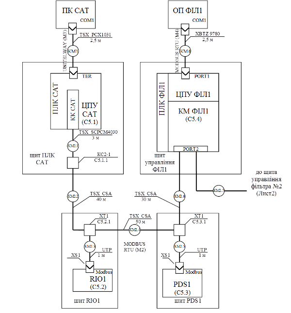
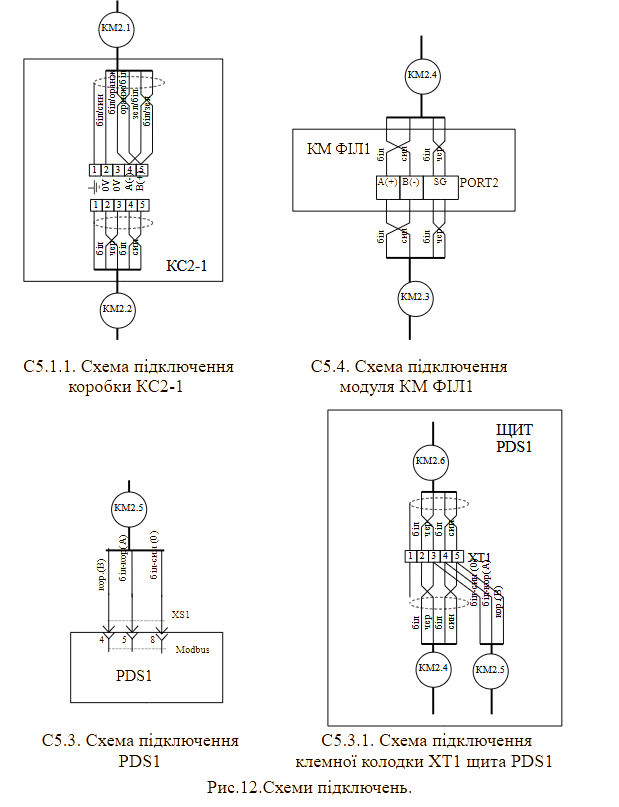
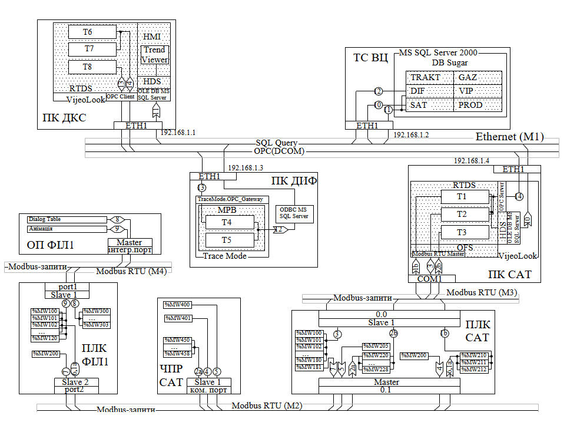

## 6.2. Розроблення загальносистемних рішень рівня керування виробничими операціями

### 6.2.1. Загальні рекомендації до виконання розділу 

Розділ 6.2 присвячено розробленню загальносистемних рішень рівня керування виробничими операціями. Він охоплює моделювання структури КІСК виробництвом у цілому: як з функціонального, так і з технічного та інформаційного погляду. Метою є формування логічної, технічної та інформаційної основи для реалізації функцій обробки та керування виробничими процесами.

У межах цього розділу здобувач має виконати:

- побудову функціональної структури КІСК, яка відображає розподіл функцій, задач і операцій між різними рівнями системи;
- розроблення структурної схеми комплексу технічних засобів (КТС), що показує апаратну реалізацію функціональної структури;
- створення схем з’єднань та підключень проводок мереж, які забезпечують фізичну взаємодію між ТЗА;
- опис інформаційної структури системи, яка фіксує, як і які дані циркулюють між вузлами, підсистемами та рівнями керування.

У цьому розділі не потрібно деталізувати функціонування підсистеми IIoT, однак необхідно відобразити технічні засоби, через які забезпечується її інтеграція з іншими частинами КІСК. Це особливо важливо в структурній схемі КТС, де мають бути вказані шлюзи, комутатори або інші мережні компоненти, які забезпечують взаємодію між рівнями SCADA, PLC та IIoT.

Усі матеріали цього розділу повинні бути логічно пов’язані між собою: функціональна структура має визначати необхідні функції, які реалізуються апаратно в структурній схемі, пов’язані між собою мережними з’єднаннями, та взаємодіють відповідно до описаної інформаційної структури.

Рекомендується виконувати схеми у єдиному стилі, дотримуючись ієрархічної організації (наприклад, L0–L3) та погодженої нотації, узгодженої з керівником проєкту. Усі позначення, абревіатури та скорочення мають бути пояснені окремою таблицею або виноскою.

### 6.2.2. Функціональна структура

Функціональна структура розробляється для КІСК виробництвом, якщо інше не оговорене в завданні або ТЗ до курсового проєкту. Вона створюється на основі вихідних даних, які є викладеними характеристиками об’єкту (все виробництво та ділянка основного відділення) та вимог до нього.  

Характеристика функціональної структури може включати схему функціональної структури та опис автоматизованих функцій. Функції, що повинні виконуватися системою (згідно ТЗ), розбивають на декілька взаємопов’язаних інформаційними зв’язками під-функцій, згідно їх реалізації на окремих технічних засобах. Ці функції та інформаційні зв’язки показуються на функціональній структурі. Схема функціональної структури виконується в довільній формі. Вона може включати:

- елементи функціональної структури КІСК (підсистем АС); автоматизовані функції та (або) задачі (комплекси задач); сукупність дій (операцій), які виконуються при реалізації автоматизованих функцій тільки технічними засобами (автоматично) або тільки людиною;
- інформаційні зв’язки між елементами та з зовнішнім середовищем та короткою вказівкою змісту повідомлень та (або) сигналів, які передаються по зв’язкам, та при необхідності, зв’язки інших типів;
- деталізовані схеми частин функціональної структури (при необхідності).

Схему загальної функціональної структури КІСК виробництвом рекомендується показувати зі збереженням функціональної ієрархічності рівнів керування (див. рис.5). Наприклад: 0-й (нижній) рівень – рівень польових засобів, 1-й – рівень контролерів, 2-й рівень – рівень SCADA/HMI, 3-й рівень – рівень керування виробництвом. До схеми функціональної структури додається таблиця умовних позначень, приклад якої показано в таблиці 16.

Таблиця 16. Таблиця умовних позначень до схеми функціональної структури.      

| Позначення                    | Найменування                                                 |
| ----------------------------- | ------------------------------------------------------------ |
| польові ТЗА                   | технічні засоби автоматизації, які відносяться до польового рівня |
| dif                           | відділення дифузії                                           |
| sat                           | дефекосатурації, не включаючи фільтри                        |
| f1, f2, f3                    | 1-й..4-йфільтри після 1-ї сатурації                          |
| ПЛК ДИФ                       | мікропроцесорний контролер для дифузійного відділення        |
| ПЛК САТ                       | мікропроцесорний контролер для 1-ї та 2-ї дефекосатурації    |
| ПЛК ФІЛ1                      | мікропроцесорний контролер для 1-го фільтру 1-ї сатурації    |
| ПК ДИФ                        | АРМ оператора дифузії (на базі комп’ютера)                   |
| ПК САТ                        | АРМ оператора дефекосатурації (на базі комп’ютера)           |
| ОП ФІЛ1                       | операторська панель для 1-го фільтру (входить до складу АРМ оператора фільтр. соку 1 сат) |
| ПК ДКС                        | диспетчерсько-координуюча станція – АРМ начальника зміни на базі комп’ютера |
| ТС ВЦ                         | технологічний сервер виробництва цукру - сервер архівів основних виробничих параметрів |
| dif.Е0, sat.E0, f1.E0         | вимірювальне перетворення                                    |
| dif.V0, sat.V0, f1.V0         | керування технологічним обладнанням та виконавчими механізмами |
| dif.Y0,sat.Y0, f1.Y0          | перетворення та обробка інформації на польовому рівні, включаючи цифрові інтерфейсі зв’язки |
| dif.Y1, sat.Y1, f1.Y1         | збір та обробка даних на рівні контролерів, включаючи цифрові інтерфейсні зв’язки |
| dif.C1, sat.C1, f1.C1         | автоматизоване регулювання та керування технологічним процесом, включаючи дискретне керування |
| dif.Y2, sat.Y2, f1.Y2, dks.Y3 | збір та обробка даних на рівні SCADA/HMI (база даних реально часу) |
| dif.HС2, sat.HС2, f1.HС2      | дистанційне керування, формування завдання, настройка регуляторів, включення, відключення, переключення, блокування, запуск задач, зміна режимів роботи регуляторів |
| dif.I2, sat.I2, f1.I2         | відображення для контролю за технологічним процесом          |
| dks.I3                        | відображення для диспетчерського контролю за виробничим процесом |
| dks.Itr3                      | відображення архівних даних по всьому виробництву            |
| dif.Rtr2, sat.Rtr2            | ведення трендового архіву технологічного процесу             |
| dks.Rtr3                      | ведення трендового архіву виробництва                        |
| dif.Rlg2, sat.Rlg2            | ведення журналу повідомлень                                  |
| dif.A2, sat.A2, f1.A2         | контроль стану обладнання, сигналізація (тривоги та події)   |
| dif.Alg2, sat.Alg2, f1.Alg2   | ведення журналу подій та тривог                              |

  

 Рис.5. Фрагмент функціональної структури інтегрованої КІСК виробництвом цукру.

Інформаційні зв’язки (інформаційні потоки) між функціями та задачами можна показувати у вигляді стрілок, які вказують на напрямок передачі інформації, або без стрілок, якщо інформація передається в обидва боки. Інформаційні зв’язки, які передбачено реалізовувати в курсовому проєкті можна маркувати цифрами, для подальшого посилання на них в текстовій частині.

Щоб не нагнітати схему великою кількістю функцій, їх можна об’єднувати по загальному функціональному призначенню, даючи їм позначення, наприклад, за правилами функціонального позначення на схемах автоматизації. Так, в прикладі на схемі (рис.8), для рівня польових ТЗА, можна виділити загалом три типи функцій: вимірювання або первинне перетворення (E); реалізація управляючих дій з використанням виконавчих механізмів (V); інші типи перетворення (Y). Усі інші функції можна буде вказати та деталізувати на схемах автоматизації. Всі функції рівня контролерів в прикладі виділені в дві групи: автоматичного керування (C), включаючи функції дискретного керування; збір та обробка даних на рівні контролерів (Y), включаючи цифрові інтерфейсні зв’язки. Усі інші групи функцій (наприклад сигналізація, архівування, тощо) в даному випадку не використовуються. Для рівня SCADA/HMI та диспетчерського керування, всі функції виділені в такі групи: збір та обробка даних реально часу (Y), дистанційне керування та зміна режимів роботи з ЛМІ (HC), відображення на засобах ЛМІ (I), ведення трендового архіву (Rtr), ведення журналу повідомлень (Rlg), ведення журналу подій та тривог (Alg), сигналізація (А).

Кожна з підсистем в прикладі має своє умовне позначення (`dif`, `sat`, `f1`). Враховуючи, що кожна підсистема функціонально складається з 3-х рівнів, групу функцій зручно позначати з комбінації: підсистема + функціональна група + функціональний рівень.    

Набір функцій кожного рівня для конкретної системи може відрізнятись. Так, наприклад, при використанні вбудованих регуляторів в перетворювачах частоти або RIO, на польовому рівні бажано показати ці групи функцій літерою `C`, в використання вторинних показуючи приладів - літерою `I`, пристроями байпасного керування - `HC`, і т.п. 

Функціональну структуру можна виконувати у будь-якому графічному редакторі, у тому числі в представленні Mermaid. У будь якому випадку, зовнішній вигляд та позначення елементів функціональної структури уточнюється здобувачем з керівником проєкту.

У текстовій частині в описі автоматизованих функцій (П3) пояснюється та уточнюється схема функціональної структури. Зокрема необхідно вказати:

- перелік функцій/задач та  вимоги до періодичності та тривалості їх виконання (беруться з ТЗ);
- перелік сигналів та даних, які формують інформаційні зв’язки між функціями/задачами;
- вимоги до періодичності відновлення сигналів та даних на входах функцій/задач.  

У даному розділі наводиться загальна концепція, тоді як деталізація вказується в розділі "Формування моделі обладнання L3 та нижче"

### 6.2.3. Структура КТС

Розроблення структурної схеми КТС, підбір технічних засобів верхніх рівнів керування та комунікаційних модулів ПЛК та RIO проводиться на основі вихідних даних, які наведені в ТЗ та функціональної структури. На структурній схемі КТС вказуються тільки ті ТЗА, які інтегруються в єдину систему з використанням промислових мереж. 

Розробка структури КТС передбачає:

-     вибір промислових та комп’ютерних мереж, на базі яких проводиться технічна інтеграція засобів;

-     створення мережної структури, в якій технічні засоби є вузлами мережі;

-     вибір мережного обладнання (комунікаційні модулі, карти) для всіх мережних вузлів;

-     вибір мережних складових з функціями перетворення: репітерів, концентраторів, комутаторів, маршрутизаторів та шлюзів.

-     вибір технічних засобів IIoT та їх інтегрування в КІСК   

Процес створення структури КТС може мати ітераційний характер. Спочатку проводиться аналіз функціональних вимог в ТЗ, оцінюється характер і напрямки інформаційних потоків між вузлами, оцінюється інформаційне навантаження. Враховуючи вимоги які дані в ТЗ, вибирається мережна структура та мережне обладнання. Мережна структура аналізується на придатність. Якщо вона не задовольняє по певним причинам вимогам (не вистачає ресурсів мережі або мережних засобів) - процес повторюється. Враховуючи, що в технічному завданні курсового проекту вже вказані промислові мережі рівня датчиків та рівня контролерів (відповідно до завдання до курсового проекту) – перша ітерація вже зроблена. Однак можлива ситуація в необхідності корекції ТЗ.          

Мережна структура відображається графічно на структурній схемі КТС (С1). Рекомендується виконувати схему в Mermaid або іншому редакторі, що зберігається в текстовому форматі. До схеми у вигляді окремого документу додається перелік елементів ТЗА (мережних вузлів).   

Структурну схему КТС КІСК рекомендується зображати зі збереженням функціональної ієрархічності рівнів керування відповідно до схеми функціональної структури. Схема повинна містити інформацію про засоби (комунікаційні карти, модулі) та порти, через які кожен вузол підключається до загальної мережі а також додаткові перетворювачі. Приклад структурної схеми показаний на рис.6, приклад переліку елементів ТЗА наведений в таб. 17. 

Рис.6.Структурна схема КТС 

Таблиця 17. Відомість мережних технічних засобів.

| Позначення                 | Найменування                                                 | К-сть | Примітка                                                     |
| -------------------------- | ------------------------------------------------------------ | ----- | ------------------------------------------------------------ |
| ПК ДКС                     | ПК начальника  зміни                                         | 1     | офісного виконання                                           |
| ПК САТ                     | ПК  оператора дефекосатурації                                | 1     | офісного виконання                                           |
| ПК ДИФ                     | ПК оператора  дифузії                                        | 1     | вже експлуатується Celeron 1,7  GHz, RAM 256Mb               |
| ПЛК  САТ                   | Програмований  логічний контролер відділення очистки         | 1     | TSX Premium (з Unity) з комм.  картою Modbus RS-485 TSX SCP 114 |
| ПЛК  ФІЛ1-3                | Програмований  логічний контролер фільтрації відділення очистки | 3     | вже експлуатується  TWD LCAA 40DRF з ком. модулем   TWD NOZ 485 T |
| ОП  ФІЛ1, ОП ФІЛ2, ОП ФІЛ3 | Операторська  панель фільтрації відділення очистки           | 3     | вже експлуатується  XBTN400                                  |
| PDS1                       | Частотний  перетворювач відкачка соку з хол. дефекатора      | 1     | ATV71 з інтегрованим Modbus RTU                              |
| RIO1                       | Віддалені  входи/виходи                                      | 1     | Advantys OTB на базі OTB  1S0DM9LP (Modbus RTU)              |
| КАМ                        | Комунікаційний  адаптер перетворювач RS-232<->RS-485         | 1     | TSX PCX 1031 (Schneider  Electric)                           |

### 6.2.4. Схеми з’єднань та підключень проводок промислових мереж

У курсовому проєкті схеми з’єднань та підключень проводок розробляються для промислових мереж IO та PLC-HMI АСКТП основного відділення, а також для промислових мереж PLC КІСК виробництва, якщо інше не оговорено в завданні (ТЗ). 

Загальні рекомендації до підбору та виконанню електричних проводок можна взяти зі стандартів ЄСКД. Правила стосовно виконання електричних проводок для промислових мереж визначені в технічній документації до цих мереж. Зображення електричних зв’язків між ТЗА, які використовуються для передачі по промисловим мережам проводиться з використанням схеми з’єднань та підключень проводок мереж. У курсовому проєкті дозволяється виконання схеми з’єднань проводок промислових мереж з зображенням на них підключень засобів (суміщений спосіб). Якщо суміщений спосіб дуже ускладнює читання схеми, вона доповнюються схемами підключень. На рис.7 показаний приклад схеми з’єднань, а на рис.8 – схеми підключень проводок промислових мереж. Підключення, яке необхідно деталізувати, на рис.7 вказується внизу під написами позначень комунікаційних модулів, коробок та клем. До схеми з’єднань додається перелік елементів, приклад якого даний в таблиці 19.   

Рис.7. Приклад схеми з’єднань проводок промислових мереж

Таблиця 19. Перелік елементів до схеми з’єднань.

| Позначення          | Найменування                                                 | К-сть | Примітка |
| ------------------- | ------------------------------------------------------------ | ----- | -------- |
|                     | Комунікаційні адаптери та карти                              |       |          |
| КК САТ              | TSX SCP114 PCMCIA мультипротокольна карта RS-485             | 1     |          |
| КМ  ФІЛ1            | TWD NOZ 485 T, комунікаційний модуль RS-485 для Twido з підключенням під клемну  колодку (PORT2) | 1     |          |
|                     | Коробки з’єднувальні                                         |       |          |
| КС2-1               | TSX SCA 50 з вбудованим термінатором                         | 1     |          |
|                     | Клемні колодки                                               |       |          |
| XT1 (щит RIO1)      | клемна колодка з прохідними клемами та 3 контакти            | 1     |          |
| XT1 (щит PDS1)      | клемна колодка з прохідними клемами та 3 контакти            | 1     |          |
|                     | Мережні з’єднувачі                                           |       |          |
| XS1                 | неекранований RJ-45 типу вилка                               | 2     |          |
|                     | Мережні кабелі                                               |       |          |
| КМ2.1               | TSX SCPCM4030 для підключення TSX  SCP114 до MODBUS RTU, 3 м | 1     |          |
| КМ1                 | TSX PCX1031 кабель з адаптером RS232-RS485,  SUB-D 9 пін з боку RS232, MiniDIN з боку RS485, 2.5 м | 1     |          |
| КМ4                 | XBTZ 9780 для підключення панелі (RJ-45) до ПЛК (MiniDIN)    | 1     |          |
| КМ2.2, КМ2.4, КМ2.6 | TSX CSA кабель на базі подвійної екранованої витої пари      | 120 м |          |
| UTP                 | UTP кабель 4х2 CAT5e 0,5 мм PVC                              | 2 м   |          |

 

Рис.8. Схеми підключень проводок промислових мереж

### 6.2.5. Інформаційна структура

У курсовому проєкті необхідно показати організацію збору та передачі інформації на рівні КІСК виробництвом та АСКТП основного відділення. 

Опис інформаційного забезпечення рекомендується доповнювати таблицями або схемами, які розкривають інформаційну структуру КІСК виробництвом та АСКТП. У якості графічного представлення інформаційної структури можна використати схеми мережних інформаційних потоків (рис.9), або аналогічні. Вимоги до представлення інформаційної структури в курсовому проєкті вказуються в завданні (ТЗ). Схеми та таблиці, які відображають інформаційну структуру, можна розробляти окремо для кожної із мереж або для всієї системи. 

рис.9. Приклад схеми мережних інформаційних потоків

Інформаційну структуру можна виконувати у будь-якому графічному редакторі. У випадку графічного представлення схеми інформаційних потоків у якості редактору рекомендується використовувати Mermaid.   