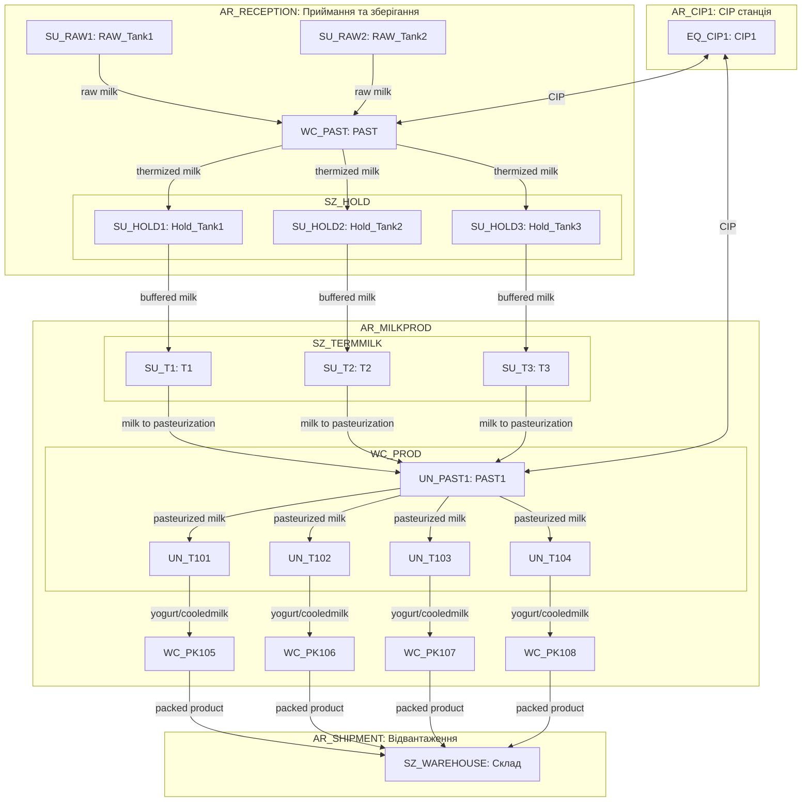
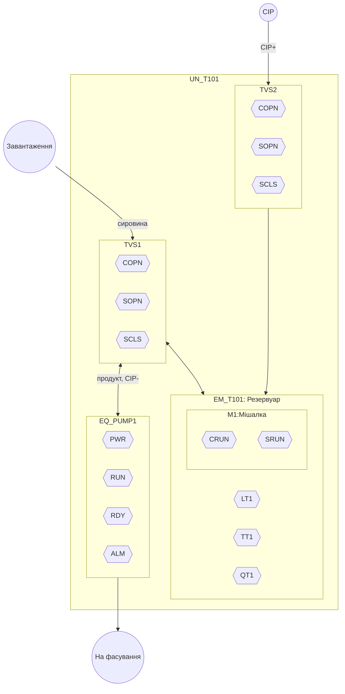
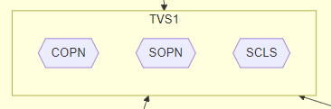
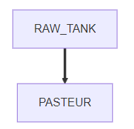

## 6.3. Формування моделі обладнання L3 та нижче

### 6.3.1. Загальні рекомендації до виконання розділу 

У межах курсового проєкту формування моделі обладнання (устатковання ) стосується побудови структурованого уявлення про об’єкти керування, їхню ієрархію, атрибути, взаємозв’язки та інтерфейси, що використовуються у підсистемах рівня L3 (керування виробничими операціями) та L2–L1 (АСКТП).

До складу робіт входить:

1. Декомпозиція устатковання відповідно до виробничої структури.
2. Класифікація устатковання за типами (запірні пневматичні клапани, регулюючі заслінки, датчики, агрегати, резервуари, лінії, тощо).
3. Означення інтерфейсу класу устатковання.
4. Означення функціональних елементів устатковання.

У даному розділі виконується тільки перші два пункти, наведені вище. Пункти 3 та 4 виконуються в наступному розділі курсового проєкту.

Варто черговий раз звернути увагу, що процес декомпозиції, так само як і виконання інших розділів в проєкті має ітераційний характер. Це значить, що в розділах наводяться результати діяльності, а зміст цих результатів з часом змінюється, на черговій ітерації виконання, за результатами наступних пунктів проєкту.   

### 6.3.2. Декомпозиція устатковання

 У результаті декомпозиції означується:

- перелік виділеного устатковання з символьним позначенням та зазначеними рівнем ієрархії 
- означення зв'язків з іншим устаткованням: ієрархічних в рольовій ієрархії, горизонтальних по потоку, блокувальних і т.п.
- визначення можливих входів/виходів з процесом: перелік датчиків, виконавчих механізмів, іншого устатковання, з яким є зв'язки або потенційно можуть з'явитися.   

Для декомпозиції устатковання треба добре розуміти виробництво та ділянку технологічного процесу, для якого проводиться декомпозиція. У якості вихідних даних добре підходять апаратурно-технологічні схеми та схеми автоматизації, які є частиною технічного завдання. Рекомендації щодо проведення декомпозиції наведені в конспекті лекцій, тут зробимо кілька рекомендацій щодо виконання в курсовому проєкті.   

Враховуючи що ієрархію устатковання необхідно розробити як для виробництва так і для основного технологічного процесу, рекомендується ієрархію показати двома або трьома окремими схемами/таблицями:

- верхні рівні устатковання (ERP<->MOM): `Enterprise -> Site -> Area`
- середні рівні устатковання (MES/MOM<->АСКТП): `Area -> Work Centers -> Units` 
- нижні рівні устатковання (АСКТП): `Unit -> Equipment Modules` 

Це дає змогу зробити необхідну деталізацію для кожного з рівнів.      

При графічному поданні для відображення всіх типів зв'язків між устаткованням, ієрархію рекомендується подавати через відображення вкладеності, тоді як інші зв'язки через лінії або стрілки. Наприклад в Mermaid для цього добре підходять схеми `flowchart`, де вкладеність можна показати через `subgraph`, що відображають структурну підлеглість (`area` → `work center` → `unit` → `equipment module`), а стрілками між об’єктами можна вказати на продуктові потоки (наприклад, молоко, йогурт) або енергетичні/допоміжні потоки (наприклад, CIP, холодоагент). 

У курсовому проєкті, рекомендується вказувати схему для підприємства та основного виробництва. На рис.10 наведено приклад фрагменту рольової структури підприємства з виробництва молочних продуктів у форматі `Mermaid` до рівня `Unit` включно, де показано як устатковання структуровано за цехами та модулями, а також відображено основні технологічні потоки між ними. У цій моделі: вся структура устатковання розподілена за функціональними ділянками (area), кожен об’єкт має рольовий префікс (`SU_`, `EQ_`, `WC_`, `SZ_` тощо). Стрілки позначають напрямки переміщення продукту між устаткованнями, що дозволяє поєднати фізичну структуру і логіку виробничого процесу в єдиній візуальній формі. Така схема корисна в розрізі проектування на рівні MOM. 

рис.10. Приклад відображення ієрархії устатковання в контексті виробничих потоків від рівня Site до рівня UNIT.

Для рівня АСКТП варто розглядати декомпозицію починаючи від робочого центру, який як правило є основним технологічним процесом, вказаним в завданні на курсовий проєкт. Якщо робочий центр має кілька технологічних одиниць (Unit), то варто робити схеми на кожну з них. На рис. 11 показаний приклад такої схеми для танка приготування продукту (`UN_T101`), в якому відображено типову внутрішню структуру устатковання до рівня `Control Module`.

рис.11. Приклад відображення ієрархії устатковання в контексті виробничих потоків від рівня UNIT до CM.

Під схемами варто наводити перелік умовних позначень, наприклад як це показано в таблиці 20. 

Таблиця 20. Перелік умовних графічних позначень

| Графічне позначення                                          | Найменування                              | Примітка                                                     |
| ------------------------------------------------------------ | ----------------------------------------- | ------------------------------------------------------------ |
|  | Устатковання що включає інше устатковання | включеність через влкадення, позначення в Mermaid `subgraph` |
|  | CM нижнього рівня                         | не має вкладених CM, позначення в Mermaid  `T101_PUMP_PWR{{PWR}}` |
|  | Вхідний / вихідний технологічний потік    | Місця підключення до суміжного устатковання                  |
|  | Матеріальний або енергетичний потік       |                                                              |

У даному розділі також необхідно описати аргументацію прийнятих рішень, в якій зазначити:

- які критерії були основними при проведенні декмопозиції
- рекомендації яких стандартів було враховано при декомпозиції
- які зв'язки між устаткованням було враховано 

Таблиця 21. Перелік позначень

| **Позначення**   | **Тип елемента**             | **Опис / Функція**                                |
| ---------------- | ---------------------------- | ------------------------------------------------- |
| `UN_T101`        | Unit                         | Технологічна одиниця (танк приготування продукту) |
| `EM_T101`        | Equipment Module             | Основний резервуар                                |
| `T101_LT1`       | Control Module (Датчик)      | Вимірювання рівня                                 |
| `T101_TT1`       | Control Module (Датчик)      | Вимірювання температури                           |
| `T101_QT1`       | Control Module (Датчик)      | Вимірювання витрати                               |
| `T101_M1`        | Control Module (Мішалка)     | Виконавчий механізм змішування                    |
| `T101_M1_CRUN`   | Control Module (Керування)   | Команда на запуск мішалки                         |
| `T101_M1_SRUN`   | Control Module (Датчик)      | Зворотний сигнал роботи мішалки                   |
| `T101_TVS1`      | Control Module (Клапан)      | Клапан для завантаження / відкачування            |
| `T101_TVS1_COPN` | Control Module (Керування)   | Команда відкрити клапан TVS1                      |
| `T101_TVS1_SOPN` | Control Module (Датчик)      | Датчик — положення “відкрито” для TVS1            |
| `T101_TVS1_SCLS` | Control Module (Датчик)      | Датчик — положення “закрито” для TVS1             |
| `T101_TVS2`      | Control Module (Клапан)      | Клапан подачі CIP-розчину                         |
| `T101_TVS2_COPN` | Вихід сигналу                | Команда відкрити клапан TVS2                      |
| `T101_TVS2_SOPN` | Вхід сигналу                 | Датчик — положення “відкрито” для TVS2            |
| `T101_TVS2_SCLS` | Вхід сигналу                 | Датчик — положення “закрито” для TVS2             |
| `EQ_PUMP1`       | Equipment Module             | Насосний агрегат                                  |
| `T101_PUMP_PWR`  | Вхід сигналу                 | Наявність живлення насоса                         |
| `T101_PUMP_RUN`  | Вхід сигналу                 | Стан: насос обертається                           |
| `T101_PUMP_RDY`  | Вхід сигналу                 | Насос готовий до роботи                           |
| `T101_PUMP_ALM`  | Вхід сигналу                 | Стан аварії насоса                                |
| `IN_PRODUCT`     | Умова/вузол (вхідний потік)  | Завантаження сировини                             |
| `IN_CIP`         | Умова/вузол (вхідний потік)  | Подача CIP-розчину                                |
| `OUT_PRODUCT`    | Умова/вузол (вихідний потік) | Продукт на фасування                              |

### 6.3.3. Класифікація устатковання за типами 

Після першого варіанту декомпозиції устатковання, необхідно визначити класи устатковання на рівні Unit (UN), Equipment Module (EM), та Control Module (CM), які є композитними, тобто включають в себе інші EM, CM. Це дасть змогу  надавати їм єдиний інтерфейс, єдиний перелік функціональних елементів (ФЕ) та описувати ФЕ їх однаковим автоматом станів. Прикладами класів таких CM є виконавчі механізми, а до EM - насосні агрегати, UN - реактори. 

У завданні до курсового проєкту вказуються вимоги щодо наявності певних типів виконавчих механізмів. Їх необхідно включити в цей перелік, але не обмежуватися ними.

У таблиці 22  показаний фрагмент відомості, в якій наведені класи устатковання, з зазначеними загальними властивостями та переліком устатковання, до яких вони належать. 

 Таблиця 22. Відомість класів та екземплярів устатковання

| Рівень | Позначення класу | Найменування              | Характеристики                                               | Устатковання класу                       |
| ------ | ---------------- | ------------------------- | ------------------------------------------------------------ | ---------------------------------------- |
| EM     | EM_PRESS         | Прес                      | Механізм для пресування насіння, керує приводами преса, живильника, маслосатнції (послідовність запуску та зупинки) контролює стан преса, загальні тривоги, має кілька режимів роботи | `EM_Press1`, `EM_Press1`, `EM_Press3`,   |
| CM     | DRVPR            | Головний привід для преса | Двигун керується перетворювачем частоти, контроль готовності, має керування по місцю, безпековий захист, контроль перевантаження за струмом | `Press1_M21`, `Press2_M48`, `Press3_M14` |
|        | ...              |                           |                                                              |                                          |

