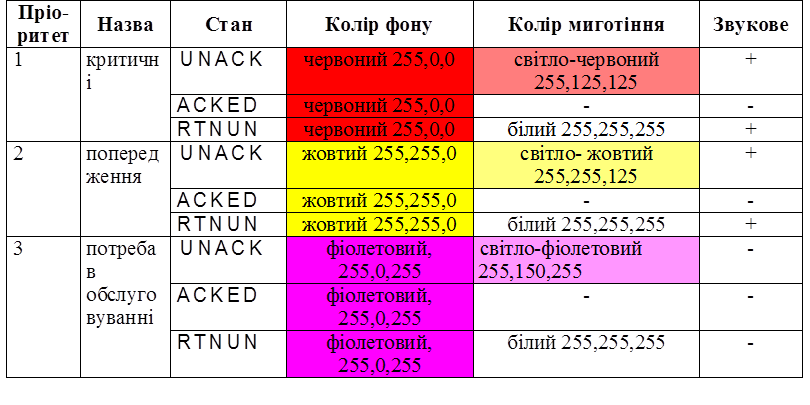
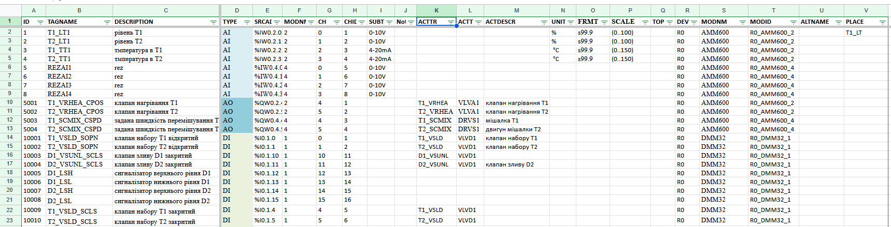

## 6.4. Проектування АСКТП

### 6.4.1. Загальні рекомендації до виконання розділу 

У межах даного курсового проєкту, проєктування АСТКП стосується частини, яка відноситься до математичного та програмного забезпечення PLC та SCADA/HMI.  Зокрема необхідно 

1. Означення інтерфейсу класів устатковання:
   - означення переліку входів/виходів зв'язку з процесом
   - означення конфігураційних параметрів
   - означення інтерфейсу керування та контролю
2. Означення функціональних елементів устатковання.
   - визначення функціональних елементів, 
   - визначення автомату станів функціональних елементів
   - визначення режимів роботи функціональних елементів та устатковання вцілому 
   - формування переліку тривог з їх описом та взаємними зв'язками
   - означити поширення режимів і станів в ієрархії

3. Означення процедур устатковання
   - означення автомату станів процедур, режими
   - означення режимів роботи, 
   - означення послідовності виконання
4. Сформувати майстердані 
   - сформувати перелік устатковання
   - означити правила найменування тегів, змінних в PLC, SCADA/HMI
   - сформувати перелік тегів I/O
   - зробити верифікацію тегів

### 6.4.2. Означення інтерфейсу класів устатковання 

Означення інтерфейсу класу устатковання варто почати з переліку входів/виходів зв'язку з процесом. Для кожного типу устатковання можна створити окремий лист електронної таблиці, де будуть наводитися усі необхідні дані.

Таблиця 23. Приклад таблиці означення входів/виходів устатковання 

| Позначення класу | Найменування класу | IOName : TYPE | IO Опис                              | Примітка     |
| ---------------- | ------------------ | ------------- | ------------------------------------ | ------------ |
| EM_PRESS         | Прес               | RMT : DI      | Дистанційний                         |              |
|                  |                    | SSA : DI      | Безпековий кінцевик                  |              |
|                  |                    | RDY : DI      | Головний привід Готовність           |              |
|                  |                    | LSTP : DI     | Головний привід Стоп                 |              |
|                  |                    | CRUN : DO     | Головний привід Включення контактора |              |
|                  |                    | SPD : NAI     | дійсне значення швидкості            | Через Modbus |
|                  |                    | CSPD : NAO    | ПЧ завдання на ПЧ                    | Через Modbus |
|                  |                    | SCUR : NAI    | струм                                | Через Modbus |

Означення конфігураційних параметрів передбачає створення переліку та опису тих параметрів, які необхідно задавати зі SCADA/HMI для налаштування роботи устатковання, наприклад: час відкриття/закриття, для контролю спрацювання чи імітації, таймаут спрацювання тривог, час між спрацюваннями датчика швидкості, тощо. 

Означення інтерфейсу керування та контролю передбачає створення переліку команд, які передбачаються для керування устаткованням зі SCADA/HMI та перелік станів. Даний перелік і команди будуть уточненні після означення функціональних елементів устатковання та їх автоматів стану. Також необхідно означити перелік режимів   

### 6.4.3. Означення функціональних елементів устатковання 

Визначення функціональних елементів - це процес декомпозиції устатковання згідно функціональних ознак. У якості критеріїв, за яким робиться декомпозиціям можна виділити наступні:

- наявність одного автомату станів з одним можливим активним станом в один момент часу
- реалізація виключно в межах устатковання однак за взаємодії через інтерфейс устатковання та іншими функціональними елементами
- чітке трактування призначення функціонального елементу 

Типовими функціональними елементами (ФЕ) можуть бути:

- операційний ФЕ, наприклад позиція клапану, або крутіння валу двигуна
- тривожні ФЕ, окремо для кожної тривоги
- комунікаційний ФЕ, взаємодія з комунікаціями   

Визначення автомату станів функціональних елементів

Рис.12. Приклад автомату станів для операційного функціонального елементу приводу

**Визначення режимів роботи функціональних елементів та устатковання в цілому**

**означити поширення режимів і станів в ієрархії**

Тривоги є функціональними елементами, кожен з яких означується своїм автоматом станів. Для тривог прийняті стандарти, в яких означені автомати станів та поведінка. Тому формування переліку тривог з їх описом та взаємними зв'язками зводиться до типових, зокрема:

- вимоги до автоматів станів тривог;

- перелік та призначення пріоритетів тривог;

- перелік класів тривог з їх означеннями;

- перелік груп тривог;

- вимоги до візуальної індикації (колір, символи тощо) та звукового оповіщення тривог;

- вимоги до функціональних можливостей дисплеїв тривог (зведення, відтермінованих, заблокованих і т. д.);

- вимоги до функціональних можливостей конфігурування тривог, зокрема задавання зон нечутливості, часу затримки тощо;

- вимоги до функціональних можливостей ведення журналу тривог, зокрема перелік обов’язкових полів, можливість записування приміток оператором, глибина журналу;

- вимоги до функціональних можливостей керування життєвим циклом підсистеми тривожної сигналізації.

Нижче наведено приклад спрощених вимог до тривог та подій. 

### 6.4.4. Приклад означення тривог 

Тривоги усіх класів та пріоритетів повинні включати автомат станів, означений стандартом ISA-18.2, а саме: 

- нормальний стан (NORM) – в якому процес або устатковання працює в межах нормальних характеристик;

- стан непідтвердженої тривоги (UNACK) – стає активним унаслідок ненормальних умов і ще не підтверджений оператором;

- стан підтвердженої тривоги (ACKED) – в якому тривога є активною, але оператор її підтвердив;

- повернена до нормального стану, непідтверджена тривога (RTNUN) – в якому процес уже перебуває в межах норми, але попередній активний стан тривоги не був підтверджений оператором.

У системі слід передбачити принаймні ті пріоритети тривог, що вказані в табл. 24.

Таблиця 24. Перелік обов’язкових пріоритетів

| Рівень | Назва                     | Призначення                                                  | Примітка                                                    |
| ------ | ------------------------- | ------------------------------------------------------------ | ----------------------------------------------------------- |
| 1      | Критична                  | для інформування про  критичні відхилення, які необхідно терміново усунути | найвищий пріоритет,  кілька хвилин на виправлення ситуації  |
| 2      | Попередження              | для інформування про  відхилення, які можуть згодом призвести до перед-аварійного стану | середній пріоритет,  десятки хвилин на виправлення ситуації |
| 3      | Потреба в  обслуговуванні | для інформування про  несправність устатковання або засобів автоматизації, які потребують втручання  обслуговуючого персоналу (КВПіА, механіки, електрики) | найнижчий пріоритет,  кілька годин на виправлення ситуації  |

Тривоги з найвищим пріоритетом слід відображати найвище в списку тривог на дисплеях зведення та банерах.

Для усіх тривог визначені класи, які наведені в табл.25. У дужках колонки назви класу вказується символ позначення класу. 

Усі тривоги оповіщаються операторові процесу, інші адресати вказані в примітці в табл. 26. 

Тривоги слід групувати за ознакою устатковання, або групи устатковання (зони процесу), за якими їх можна фільтрувати в дисплеях тривог. У табл. 27 наведено обов’язкові групи тривог.  

Таблиця 27. Перелік обов’язкових класів тривог

| Назва класу (символ позначення)                              | Призначення                                                  | Примітка                                                     |
| ------------------------------------------------------------ | ------------------------------------------------------------ | ------------------------------------------------------------ |
| технологічні критичні:  загальні (A), занадто високе значення (HIHI), занадто  низьке (LOLO) | пов’язані з  критичними відхиленнями від процесу             | які не належать до HIHI та LOLO, є  загальними критичними (A); пріоритет за  замовченням 1, якщо не вказано інше |
| технологічні  попередження: загальні (W), високе (HI), низьке (LO), відхилення  (DEV) | пов’язані з  відхиленнями від процесу                        | які не належать  до HI, LO та DEV, є  загальними попередженнями (W); пріоритет за  замовченням 2, якщо не вказано інше |
| устатковання: загальна  несправність (M)                     | пов’язані з  несправністю технологічного устатковання        | оповіщення чергових  механіків; пріоритет за замовченням 3, якщо не вказано інше |
| засобів КВПіА: загальна  несправність (KIP); не відкрився або не включився  (KNO); не  закрився або не відключився (KNC) | пов’язані з  несправністю датчиків або ВМ                    | оповіщення чергових  КВПіА; пріоритет за замовченням 3, якщо не вказано інше |
| електричні: загальна  несправність (ELE); не відкрився або не включився  (EON); не  закрився або не відключився (EOF) | пов’язані з  несправністю електрообладнання                  | оповіщення чергових електриків;  пріоритет за замовченням 3, якщо не вказано інше |
| системні ПЛК або SCADA/HMI: загальна помилка (E), помилка каналу ПЛК  (E0), помилка в SCADA/HMI (EH) | пов’язані з  несправністю складової верхнього рівня АСКТП (ПЛК, SCADA/HMI) | оповіщення спеціаліста  АСКТП; пріоритет за замовченням 3, якщо не вказано інше |
| СПАЗ (SIS)                                                   | пов’язані зі  спрацюванням системи протиаварійного захисту   | пріоритет за  замовченням 1, якщо не вказано інше            |

Таблиця 28. Перелік обов’язкових груп тривог

| Назва        | Призначення                                                  | Примітка |
| ------------ | ------------------------------------------------------------ | -------- |
| відділення 1 | усі тривоги  відділення 1, які не належать до жодної установки |          |
| відділення 2 | усі тривоги  відділення 2, які не належать до жодної установки |          |
| …            |                                                              |          |
| установка 1  | усі тривоги, які належать  до роботи установки 1             |          |
| установка 2  | усі тривоги, які належать  до роботи установки 2             |          |
| …            |                                                              |          |

Тривоги слід відображати на тривогових банерах, дисплеях зведення тривог, журналах тривог. 

Для кожної тривоги у списку активних тривог (дисплей зведення) повинні відображатися такі атрибути та значення:

- назва тривоги;

- повідомлення тривоги; 

- опис тривоги;

- стан тривоги;

- пріоритет тривоги; 

- час/дата, коли тривога стала активною;

- тип тривоги;

- плинне значення змінної процесу, яка спричинила тривогу; 

- уставка тривоги (для аналогових); 

- група тривоги;

- клас тривоги (за можливості інструментального середовища). 

Для кожної тривоги на дисплеї журналу тривог слід також додатково вказати:

- дату і час підтвердження тривоги;

- дату і час повернення до нормального стану. 

У списках активних тривог (активних, банерах, журналах) фони написів повинні змінюватися за кольором відповідно до пріоритету. У табл. 29 показано способи відображення та з оповіщення відповідно до пріоритету для кожного з станів, окрім нормального (в журналах завжди білий фон). Заблоковані тривоги не показуються у списках активних тривог.  

Таблиця 29. Вимоги до візуальної індикації кольором у списках тривог та звукового оповіщення тривог за пріоритетами 

У журналах тривог кольори фону використовувати не рекомендується.  

На дисплеях процесу над параметрами або/та устаткованням, яких стосується тривога, повинен з’явитися графічний символ, що відповідає за конкретний пріоритет та за можливості класу тривоги. Символ повинен включати відображення фігури пріоритету:

- прямокутник червоного забарвлення для 1-го пріоритету;

- трикутник жовтого забарвлення для 2-го пріоритету;

- ромб фіолетового забарвлення для 3-го пріоритету. 

Кольори та миготіння повинні відповідати кольорам з табл.29. За можливості рекомендується в написах символів вказувати символьні позначення класу тривоги. 

Тривоги, які належать до класів, що призначені для обслуговуючого персоналу (КВПіА, механіки), повинні повідомлятися через засоби дистанційного оповіщення (SMS, альтернативно – через сервіси інтернет-повідомлень) із зазначенням усіх атрибутів. 

Дисплеї зведення тривог повинні надавати можливості: 

- упорядкування тривог за хронологічним порядком;

- упорядкування тривог за пріоритетом;

- індивідуальне підтвердження кожної тривоги; 

- групове підтвердження кожної тривоги (за наявності дозволів);

- фільтрування тривог за пріоритетом;

- фільтрування тривог за групою або ділянкою процесу.

Дисплеї журналу тривог повинні надавати можливості забезпечувати фільтрацію за:

- ім'ям;

- часом або зміною стану;

- станом тривоги;

- пріоритетом;

- типом тривоги;

- групою тривоги або ділянкою процесу;

- класом тривоги (якщо є така можливість).

Дисплеї тривог мають надавати можливість виведення на друк усіх видимих на них тривог. 

Технологічні тривоги повинні зберігатися в журналі не менш ніж три роки. Усі інші тривоги повинні зберігатися не менш ніж один рік. Має бути можливість експортувати усі тривоги в формат "*.CSV". 

Повинна бути надана можливість блокувати будь-яку з тривог. Функція блокування доступна тільки авторизованим для цього користувачам. При блокуванні вказується причина блокування, яка заноситься в один із журналів. Перелік блокованих тривог повинен відображатися на одному з дисплеїв, на якому надається можливість розблокувати тривогу. 

Користувачі з правами технологів мають мати можливість змінити уставки тривог: граничні значення, затримку часу на спрацювання. 

У табл. 30 подано початкові налаштування технологічних тривог для аналогових (числових) змінних. Межі LOLO, LO, HO, HIHI вказують на межі відповідно аварійно низького, низького, високого та аварійно високого значення змінної. Усі зазначені тривоги мають спрацьовувати за замовченням через 2 с після переходу через межу. Значення "Deviation" (відхилення) вказує на максимальну величину відхилення змінної від заданого значення. Затримка на спрацювання тривоги – 5 с.

Усі тривоги повинні зберігатися в журнал і відображатися в списку та зведенні тривог.  

Таблиця 30. Налаштування аналогових (числових) тривог за змінними 

| Назва тегу | Опис                                              | межа LOLO | межа LO  | межа HI  | межа HIHI | Devia­tion | Пріо­ритети | Кла­си      |
| ---------- | ------------------------------------------------- | --------- | -------- | -------- | --------- | ---------- | ----------- | ----------- |
| HEA_TT1    | Т продукту на виході підігрівача попередження     | -         | 20 °С    | 75 °С    | -         | 1°С        | 2           | LO/ HI/ DEV |
| HEA_TT1    | Т продукту на виході підігрівача аварія           | 10 °С     | -        | -        | 80 °С     | -          | 1           | LOLO, HIHI  |
| HEA_TT2    | Т гарячої води на виході підігрівача попередження | -         | 0-100 °С | 0-100 °С | 0-100 °С  | -          | 2/2/1       | LO/ HI/ HI  |
| HEA_TT2    | Т гарячої води на виході підігрівача аварія       | 10 °С     | -        | -        | 65 °С     | -          | 1           | LOLO/HIHI   |

У табл. 31 вказано перелік тривог за дискретними змінними. 

Таблиця 31.Фрагмент переліку дискретних (типу так/ні) тривог

| Опис                                      | Умова спрацювання               | Пріоритет | Класи | Примітка    |
| ----------------------------------------- | ------------------------------- | --------- | ----- | ----------- |
| 3-ходовий клапан не перейшов у позицію T1 | T_LVS3 AND NOT T_LVS3_T1OPN     | 3         | KNO   | таймаут 5 с |
| 3-ходовий клапан не перейшов у позицію T2 | NOT T_LVS3 AND NOT T_LVS3_T2OPN | 3         | KNС   | таймаут 5 с |
| клапан зливу D1 не закрився               | D1_LVS1_ALCLS                   | 1         | KNС   |             |
| клапан зливу D1 не відкрився              | D1_LVS1_ALOPN                   | 1         | KNO   |             |

### 6.4.5. Означення процедур 

- **означення автомату станів процедур, режими**

рис.13. Приклад автомату станів для процедурного елементу.

- **означення режимів роботи,** 

- **означення послідовності виконання**

### 6.4.6. Означення майстерданих 

Означення майстерданих варто почати з означення правил найменування тегів. Рекомендації щодо найменування тегів дані в матеріалах лекцій. В розділ необхідно описати та обґрунтувати методику найменування.

Майстердані варто розробляти у вигляді електронних таблиць. Приклад майстерданих в Google Sheet наведений [за посиланням](https://docs.google.com/spreadsheets/d/1GvttNOH74X2o9y0fh_qxQCHhfdFszx7m/edit).

Перед означенням таблиці-аркуша тегів можна спочатку сформувати таблицю-аркуш з устаткованням з зазначенням класу, перелік і означення яких розроблено раніше. Перелік модна надати у вигляді окремого аркуша електронної таблиці, де будуть міститися усі майстердані, туди ж варто помістити і означені раніше класи. Для кожного утсатковання необхідно вказати:

- символьне позначення устаткування
- назву
- тип
- посилання на означення типу (наприклад на лист електронної таблиці)
- примітки
- розміщення
- інша інформація, наприклад ідентифікатор активу, який виконує цю роль, посилання на необхідну документацію, та інша проектна інформація

Надалі, необхідно створити аркуш таблиці з тегами. Надалі тег і змінна є сиснонімами. Для кожного тегу варто вказувати:	

- `TAGNAME` - унікальний ідентифікатор тегу відповідно до прийнятих правил ідентифікації 

- `DESCRIPTION` - опис тегу 

- `TYPE` - тип (клас) тегу. Тут варто використовувати умовні позначення, перелік яких надається в описі до таблиці, наприклад 

  - `AI` - AIVAR

  - `DI` - DIVAR

  - `AO` - AOVAR

  - `DO` - DOVAR

  - `NAI` - Network AIVAR (підклас)

  - `NAO` - Network AOVAR (підклас)

  - `NDI` - Network DIVAR (підклас)

  - `NDO` - Network DOVAR (підклас)	

- `UNIT` (не обов'язкове) - інженерні одиниці, може бути використаним при наступному розгортанні в SCADA/HMI (див відповідний розділ)

- `FRMT` (не обов'язкове) - формат відображення, може бути використаним при наступному розгортанні в SCADA/HMI (див відповідний розділ)		

- `SCALE` (не обов'язкове) - налаштування масштабування для аналогових величин; якщо заповнюється, то задається у форматі `(min..max)` , наприклад `(0..100)`. Виставляється у відповідних полях змінних ПЛК за замовченням.	

- `ALTNAME` (не обов'язкове) - альтернативне позначення технологічної змінної, наприклад яке використовується в інших схемах, наприклад в принципових або схемі автоматизації    

- `SRCADR` - адреса змінної каналу в ПЛК. Дана адреса задається в тому форматі, який потрібен для ПЛК.

- `MODNMB` - номер модулю в пристроях, острову або шасі, де знаходиться канал. В

- `CH` - номер каналу в модулі, відповідно до нумерації модуля. 

- `SUBTYPE` (не обов'язкове) - підтип каналу, наприклад `4-20mA`

- `DEV` - назва пристрою або острову або шасі, де знаходиться модуль з каналом. 

- `MODNM`  - символьне ім'я модуля на пристрої шасі або острові 

- `MODID` - повна символьна назва модуля в системі, може формуватися за назвою `DEV` + `MODNM` + `MODNMB`  

- `ACTTR` - назва ВМ або іншого комплексного засобу, в якому використовується змінна. Вказуються в тому випадку, якщо технологічна змінна є частиною ВМ (ACT). У цьому випадку, вона буде використовуватися при генеруванні структур та коду для ВМ.  

- `ACTTYPE` - назва типу ВМ або іншого комплексного засобу, в якому використовується змінна. 
- `ACTDESCR` - опис ВМ

Рис.14. Приклад зовнішнього вигляду таблиці з майстерданими

Усю таблицю необхідно привести у вигляді посилання на файл електронних таблиць відкритих форматів або Google Sheet документ. У записку необхідно навести фрагмент з описом полів та методикою використання.

- **зробити верифікацію тегів**
