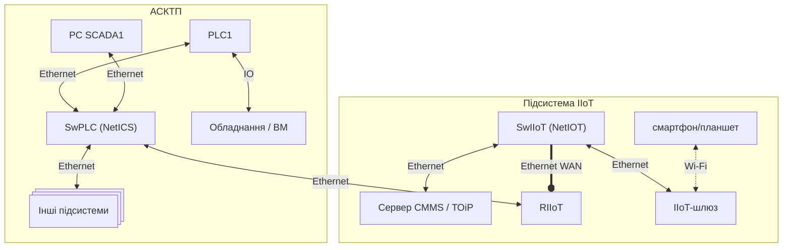
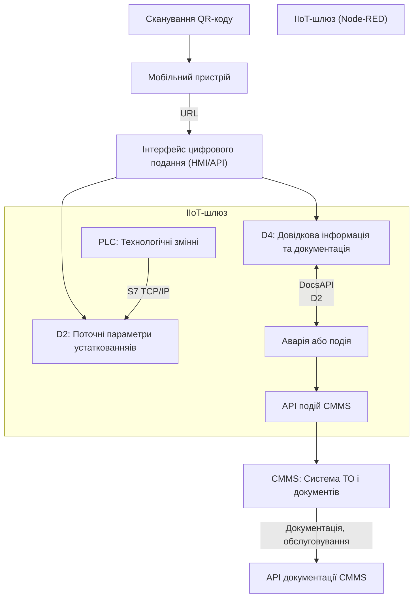
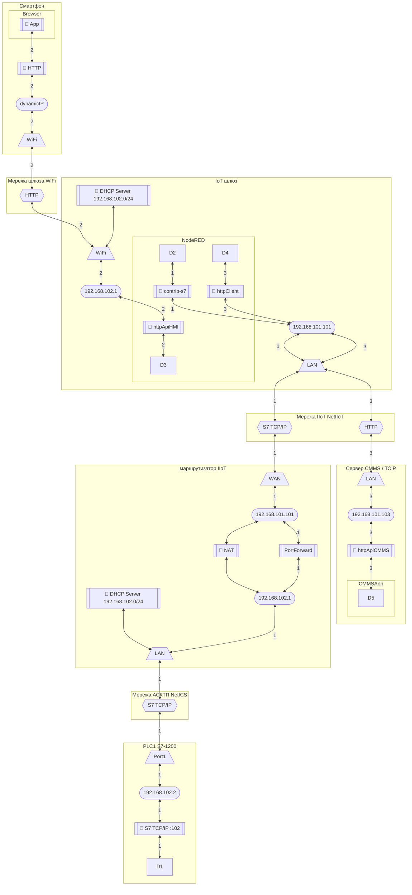
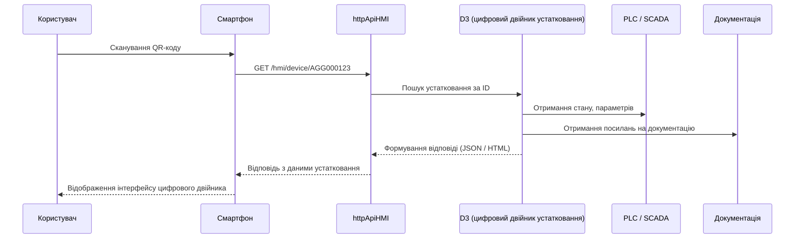

## 6.5. Проектування IIoT

### 6.5.1. Загальні рекомендації до виконання розділу 

Розділ 5 курсового проєкту присвячено проєктуванню підсистеми промислового Інтернету речей (IIoT) у складі комп’ютерно-інтегрованої системи керування (КІСК). Метою цього розділу є розроблення інформаційної інфраструктури, яка забезпечує збір, обробку та подання даних про устатковання безпосередньо в середовищі експлуатації — як правило, для задач моніторингу, обслуговування або локального керування.

Завдання підсистеми IIoT можуть охоплювати широкий спектр прикладних сценаріїв, орієнтовний перелік яких наведено в таблиці 1а. Це, зокрема:

- віддалене або локальне зчитування параметрів устатковання;
- передавання технічного стану або подій до зовнішніх систем (наприклад, CMMS, MOM, ERP);
- виведення поточних даних на мобільний або вбудований інтерфейс;
- доступ до супровідної документації;
- підтримка ручного налагоджувального керування;
- візуалізація історії обслуговування або подій;
- автоматизоване сповіщення персоналу про зміни стану або необхідність ТО.

У межах виконання цього розділу здобувач має:

- обґрунтувати вибір задачі, яку виконує підсистема IIoT;
- вказати устатковання, до якого вона прив’язана;
- побудувати структурну схему комплексу технічних засобів IIoT;
- описати потоки інформаційної взаємодії між вузлами підсистеми;
- означити інформаційну модель устатковання (структура параметрів, подій, документів);
- описати взаємодію з зовнішніми системами (за потреби), зокрема CMMS, MOM, ERP;
- сформувати правила доступу, збереження та обробки даних;
- у разі потреби — вказати елементи локального інтерфейсу користувача.

При цьому необхідно враховувати фізичну доступність засобів доступу (наприклад, Wi-Fi на місці обслуговування), відповідальність окремих вузлів за реалізацію функцій (зчитування, буферизація, маршрутизація, подання), а також обмеження безпеки, доступу та відмовостійкості.

Цей розділ має описовий характер, проте повинен містити конкретні логічні структури, таблиці та схеми, що відображають реалізацію підсистеми IIoT в обраному прикладі. Обсяг, складність та глибина опрацювання мають відповідати рівню автономності задачі, яку реалізує підсистема IIoT.

### 6.5.2. Приклад 

Розробляється підсистема промислового Інтернету речей (IIoT), що забезпечує інформаційну та функціональну підтримку обслуговуючого персоналу при виконанні технічного обслуговування та налагодження обладнання. Основна ідея полягає у створенні цифрового представлення кожної одиниці устатковання, з можливістю її ідентифікації, перегляду параметрів, отримання документації та виконання налагоджувальних дій.

У підсистемі IIoT реалізовано інфраструктуру, що забезпечує обслуговуючому персоналу доступ до актуальної інформації про обладнання безпосередньо на виробництві. Основна ідея полягає у поєднанні локального цифрового подання устатковання (з параметрами та станом), документації, історії обслуговування та доступу до керувальних функцій — через мобільний пристрій за допомогою QR-коду.

#### Технічна структура системи

- IIoT-шлюз — центральний елемент підсистеми, що реалізує зв’язок з обладнанням (PLC1), доступ до API, кешування довідкової інформації та взаємодію з CMMS;
- PLC — джерело поточних даних про устатковання;
- CMMS — система керування технічним обслуговуванням, що зберігає історію, документи та реєструє події;
- Node-RED — платформа логіки обробки подій, REST-API та обміну з CMMS;
- Мобільний пристрій персоналу — точка входу до цифрового двійника устатковання через QR-код;
- Локальні ресурси (D2, D4) — структури даних на шлюзі, що зберігають поточні значення параметрів та отримані з CMMS довідкові дані.

Структурна схема КТС показана на рис. 15.



рис.15. Структурна схема КТС підсистеми IIoT

#### Алгоритм виконання задачі

Хід взаємодії показаний на рис.16:

1. Ідентифікація устатковання. Персонал сканує QR-код, який містить URL на цифрове подання устатковання. Вебінтерфейс шлюзу надає доступ до пов’язаної інформації (поточний стан, документи, обслуговування).
2. Оновлення поточних параметрів. IIoT-шлюз періодично зчитує дані з PLC1 (струм, тиск, аварійні сигнали тощо) та оновлює локальні структури (`D2`). Ці значення доступні для перегляду або обробки.
3. Взаємодія з CMMS. У разі події (наприклад, спрацювання аварії) шлюз формує повідомлення і надсилає його в CMMS через API. Також шлюз періодично запитує з CMMS довідкову інформацію та документацію про устатковання (останні обслуговування, планові операції тощо).
4. Кешування документації. Отримана з CMMS документація (інструкції, креслення, паспорти) зберігається локально на шлюзі в структурі `D4`, що забезпечує доступ до неї навіть без активного інтернет-з'єднання.
5. Локальне керування (опційно). Якщо передбачено сценарій керування (наприклад, запуск CIP, скидання аварії), інтерфейс забезпечує авторизованому користувачу доступ до відповідних функцій.

Особливості реалізації

- Взаємодія здійснюється виключно через локальну Wi-Fi мережу шлюзу;
- Всі змінні та документи прив’язані до ID устатковання, який одночасно:
  - є ключем у PLC-структурі;
  - використовується в URL;
  - відображається в CMMS;
- Передача даних в CMMS — подієва, але може бути й періодичною;
- Безпека: реалізовано авторизацію, обмеження доступу, кешування мінімуму необхідних даних



рис.16. Логічна діаграма процесу взаємодії в підсистемі IIoT у форматі 

- QR → Phone → HMI — користувач отримує доступ до цифрового подання.

- PLC → D2 — зчитуються поточні параметри з ПЛК.

- CMMS → D4 — передаються інструкції, паспорти, планові дії.

- D2 → CMMS — при подіях (аварія, перевищення), шлюз передає дані назад у CMMS.

#### Інформаційна структура

Схема інформаційної структури показана на рис.17.



рис.17.  Інформаційна структура підсистеми IIoT у вигляді схеми інформаційних потоків, побудована в Mermaid (приклад реалізації для вузла D2, D3, D4)

#### Потік 2

Задача: Забезпечити інтерактивний доступ до цифрового подання устатковання з мобільного пристрою через зчитування QR-коду, без встановлення спеціальних застосунків, із використанням стандартного браузера.

Учасники потоку:

- Користувач (обслуговуючий персонал);
- Мобільний пристрій (смартфон / планшет);
- QR-код, нанесений на устатковання;
- Wi-Fi мережа шлюза (локальний доступ);
- IIoT-шлюз з вебінтерфейсом (Node-RED);
- Компонент `httpApiHMI` — точка входу до цифрового подання в Node-RED;
- D3 - Цифрове подання конкретного устатковання — один екземпляр, який формується на основі ID (AGG000123) і використовується в потоці 2 (HMI/API). Витягується з D2 або формується динамічно.

Послідовність взаємодії

1. Користувач сканує QR-код на устаткованняі за допомогою камери смартфона.

2. QR-код містить URL на локальний ресурс шлюзу, наприклад:

   ```
   http://192.168.102.1/hmi/device/AGG000123
   ```

3. Мобільний пристрій підключений до Wi-Fi шлюзу, отримує IP з DHCP шлюзу.

4. Браузер ініціює HTTP-запит до `httpApiHMI` на шлюзі:

   ```http
   GET /hmi/device/AGG000123
   ```

5. Компонент Node-RED `httpApiHMI` обробляє запит:

   - виконує пошук устатковання за ID (`AGG000123`);
   - витягує поточний стан (через `contrib-s7` або буфер);
   - формує відповідь (HTML або JSON), що включає:
     - параметри устатковання;
     - доступні дії;
     - посилання на документацію;
     - посилання на CMMS (якщо реалізовано)
     - інші поля (див. опис інформаційної структури устатковання)

6. Користувач бачить сторінку або інтерфейс, де:

   - відображається назва устатковання;
   - виведені поточні значення;
   - доступна кнопка скидання, перемикання режимів (якщо дозволено);
   - присутні посилання на технічну документацію.

Авторизація (опціонально)

- У запиті може перевірятися токен, або реалізовано просту сесію за IP/часом.
- Ролі: перегляд / перегляд + керування.

Формат відповіді (приклад, JSON)

```json
{
  "id": "AGG000123",
  "name": "Насос відкачки соку",
  "state": "Увімкнено",
  "mode": "Ручний",
  "tags": {
    "P_current": 1.4,
    "T_motor": 38.5
  },
  "docs": {
    "passport": "/docs/AGG000123/passport.pdf",
    "instruction": "/docs/AGG000123/manual.pdf"
  }
}
```



рис.18. Діаграма взаємодії

Таблиця 32. Інформація для реалізації доступу до цифрового подання устатковання

| №    | Назва устатковання          | ID устатковання | URL (у QR-коді)                           | Доступ (роль)       | Документація        |
| ---- | --------------------------- | --------------- | ----------------------------------------- | ------------------- | ------------------- |
| 1    | Насос відкачки соку         | AGG000123       | http://192.168.102.1/hmi/device/AGG000123 | оператор, наладчик  | паспорт, інструкція |
| 2    | Заслінка на сокопроводі     | AGG000124       | http://192.168.102.1/hmi/device/AGG000124 | перегляд            | креслення           |
| 3    | Транспортер стружки №1      | AGG000125       | http://192.168.102.1/hmi/device/AGG000125 | наладчик            | відеоінструкція     |
| 4    | Клапан CIP-маршруту         | AGG000126       | http://192.168.102.1/hmi/device/AGG000126 | наладчик            | технічна карта      |
| 5    | Пневмозаслінка охолоджувача | AGG000127       | http://192.168.102.1/hmi/device/AGG000127 | авториз. користувач | немає               |

Пояснення колонок:

- ID устатковання — єдиний ключ у цифровому середовищі IIoT та CMMS;
- URL (у QR-коді) — те, що зашивається в QR; відкривається в браузері;
- Доступ (роль) — ролі, які мають право на перегляд або дію;
- Документація — що буде відображено на сторінці: PDF, відео, креслення тощо;

#### Потік 1

Задача:  Забезпечити постійне або періодичне зчитування змінних з PLC, пов’язаних з устаткованняом, і збереження їх у цифровому поданні (моделі устатковання), яке згодом буде використано для візуалізації, аналізу або відображення у HMI/API.

Учасники потоку:

- PLC1 — джерело даних (теги, змінні);
- Node-RED (на IIoT-шлюзі) — середовище реалізації логіки;
- `contrib-s7` — вузол зчитування даних із PLC через S7 TCP/IP;
- D2 - Колекція всіх цифрових подань устаткованняів, загальнодоступний ресурс, у якому зберігаються або формуються дані по кожному устаткованняу. Це внутрішній об'єкт/сервіс, наприклад, `flow.D2`, `global.D2`, або внутрішній REST-ресурс `/api/devices`.

Сценарій роботи

1. Вузол `inject` або `interval` у Node-RED періодично (кожні 5 с) ініціює запит.
2. `contrib-s7` виконує зчитування заданих тегів із PLC:
3. Зчитані обробляються і зберігаються в моделі устатковання.
4. Збережені значення стають доступними для інших потоків, зокрема потоку 2 (HTTP-інтерфейс).

Особливості реалізації:

- Ідентифікатор устатковання (наприклад, `AGG000123`) означує, які теги слід зчитувати.
- Кілька устаткованняів: якщо є кілька об’єктів, можуть бути:
  - окремі вузли `s7` на кожен устатковання;
  - або одна сесія з розділенням за ID в функціях.

#### Потік 3

Задача. Забезпечити двосторонню синхронізацію між IIoT-шлюзом і CMMS:

- передача фактичного стану обладнання в систему обслуговування;
- отримання довідкових даних та документації з CMMS для локального використання в D4.

Учасники потоку:

- IIoT-шлюз - ініціатор обміну та сховище локальних даних
- Node-RED - логіка HTTP-запитів (клієнт і кешувач)
- httpClient - виконує POST/GET до API CMMS
- CMMS API - REST API для подій і довідкових даних
- D4 - локальна структура з кешем даних про обслуговування й документацію

Послідовність дій (двосторонній обмін)

- Від шлюзу до CMMS:

1. Node-RED аналізує змінні або події.
2. Формується структура з deviceId, подією, параметрами.
3. `http request` → `POST /api/events` або подібне.
4. Отримується відповідь з ID події (опціонально).

- Від CMMS до шлюзу:

1. Після певного інтервалу або запиту — Node-RED ініціює `GET /api/devices/AGG000123/info`.
2. CMMS відповідає JSON-структурою з:
   - останнім обслуговуванням;
   - переліком операцій;
   - посиланнями на документацію.
3. Дані зберігаються в локальному ресурсі `D4`.
4. Потім використовуються в потоці 2 (перегляд через мобільний пристрій).

Приклад даних від шлюзу до CMMS:

```json
{
  "deviceId": "AGG000124",
  "eventType": "WARNING",
  "timestamp": "2025-05-15T20:45:00Z",
  "data": {
    "vibrationLevel": 12.3,
    "runtimeHours": 1542
  }
}
```

Приклад даних від CMMS до шлюзу:

```json
{
  "deviceId": "AGG000124",
  "lastService": "2025-05-01",
  "servicePlan": "Щомісячна перевірка приводів",
  "documents": [
    { "type": "інструкція", "url": "/docs/AGG000124/manual.pdf" },
    { "type": "схема", "url": "/docs/AGG000124/wiring.dxf" }
  ]
}
```

Інтервал оновлення:

- До CMMS — подієво або періодично (кожні 5–15 хвилин).
- Від CMMS — періодично (наприклад, кожні 12 год), або на запит.

D4 (локальний кеш)

- Зберігається як `flow.D4["AGG000124"]` або в зовнішньому json/yaml.
- Оновлюється при успішному запиті до CMMS.
- Використовується у потоці 2 (вивід документації, плану ТО тощо).

#### Організація доступу до документації в рамках потоку 3

У структурі відповіді CMMS, окрім метаданих устатковання, передаються посилання на актуальну технічну документацію, наприклад:

```json
"documents": [
  { "type": "інструкція", "url": "/docs/AGG000124/manual.pdf" },
  { "type": "схема", "url": "/docs/AGG000124/wiring.dxf" }
]
```

Але посилання — це лише URI, не самі документи. Щоб документація була доступною офлайн, її потрібно фізично зберігати на шлюзі (edge-кешування). Це відбувається в кілька кроків:

Таблиця 33.

| Крок | Що виконується                                               |
| ---- | ------------------------------------------------------------ |
| 1    | Шлюз ініціює запит до CMMS на `/devices/{id}/info`, де отримує список документів |
| 2    | Node-RED `httpClient` завантажує кожен документ по URL       |
| 3    | Документи кешуються в локальній директорії, наприклад `/public/docs/AGG000124/` |
| 4    | Локальний вебсервер шлюзу (Node-RED) публікує цю директорію  |
| 5    | Посилання в інтерфейсі користувача ведуть на локальні URL, доступні по Wi-Fi |

Приклад структури на шлюзі:

```
/public/docs/
 └── AGG000124/
     ├── manual.pdf
     ├── wiring.dxf
     └── instruction.mp4
```

- Доступ за локальним посиланням:

  ```
  http://192.168.102.1/docs/AGG000124/manual.pdf
  ```

Доступ і контроль:

- Завантаження документів виконується періодично або при першому зверненні;
- Валідація авторизації (наприклад, токен CMMS API) виконується шлюзом;
- Старі документи можуть видалятися при синхронізації (за контрольним хешем або timestamp).

Для надійного доступу до документації в умовах обмеженого або локального з’єднання, посилання на документи з CMMS повинні супроводжуватись їх фізичним завантаженням та кешуванням на шлюзі з розміщенням у відкритому каталозі для HMI-інтерфейсу.

#### Означення інформаційних моделей обладнання 

Інформаційна модель обладнання — це логічне представлення об’єкта устатковання, що поєднує поточний стан, супровідну інформацію, історію обслуговування та прив’язку до зовнішніх систем. Він формується на IIoT-шлюзі та є основним джерелом інформації, що відображається в інтерфейсі при запиті з мобільного пристрою.

Структура цифрового подання обладнання має включати наступні поля:

Таблиця 34.

| Поле        | Опис                                                         |
| ----------- | ------------------------------------------------------------ |
| `id`        | Унікальний ідентифікатор устатковання (відповідає QR-коду та запису в CMMS) |
| `name`      | Назва устатковання                                           |
| `status`    | Поточний стан (робота, аварія, зупинка)                      |
| `mode`      | Поточний режим (автоматичний, ручний, відключено)            |
| `updatedAt` | Час останнього оновлення                                     |
| `metrics`   | Поточні параметри (струм, температура, тиск тощо)            |
| `events`    | Коротка історія останніх подій (опціонально)                 |
| `docs`      | Список доступних документів (локальні або з CMMS)            |
| `cmmsLink`  | Гіперпосилання на сторінку устатковання в CMMS               |

Приклад JSON-подання

```json
{
  "id": "AGG000124",
  "name": "Електропривід заслінки на сокопроводі",
  "status": "FAULT",
  "mode": "manual",
  "updatedAt": "2025-05-15T21:00:00Z",
  "metrics": {
    "motorCurrent": 3.44,
    "temperature": 72.1
  },
  "events": [
    { "type": "WARNING", "timestamp": "2025-05-14T19:15:00Z" },
    { "type": "SERVICE_COMPLETED", "timestamp": "2025-05-10T09:10:00Z" }
  ],
  "docs": [
    { "type": "manual", "url": "/docs/AGG000124/manual.pdf" },
    { "type": "wiring", "url": "/docs/AGG000124/wiring.dxf" }
  ],
  "cmmsLink": "https://cmms.company.local/devices/AGG000124"
}
```

 Зберігання та оновлення

- Структура зберігається в оперативній пам’яті Node-RED (наприклад, у `flow.D2["AGG000124"]`);
- Поля `metrics` оновлюються періодично на основі даних з PLC;
- Поля `docs` і `events` — при синхронізації з CMMS;
- `cmmsLink` задається статично або формується за шаблоном.

### 6.5.3. Перевірка повноти реалізації підсистеми IIoT

Підсистема IIoT має забезпечувати повноцінну функціональність, достатню для досягнення поставленої задачі (див. таблицю 1а). Оскільки така підсистема є складовою комп’ютерно-інтегрованої системи керування, її реалізація повинна враховувати не лише збір і відображення даних, але й взаємодію з іншими компонентами системи — як технічними (ПЛК, шлюзи, мережа), так і інформаційними (CMMS, MOM, ERP, SCADA, архіви).

Нижче наведено перелік основних елементів, які повинні бути реалізовані або чітко описані у розділі 6.5. Якщо певні компоненти відсутні, здобувач має обґрунтувати їх недоцільність у межах обраної задачі. Оцініть, чи ваша реалізація включає наступне:

-  Сформульована задача підсистеми IIoT, яка виконується (обрана з таблиці 1а або інша прикладна)
-  Визначене устатковання, до якого відноситься реалізована підсистема (назва, ID, розміщення)
-  Побудована структурна схема комплексу технічних засобів підсистеми IIoT
-  Описані основні інформаційні потоки, зокрема:
  -  зчитування даних з устатковання;
  -  взаємодія з користувачем (якщо передбачена);
  -  обмін з іншими системами (CMMS, MOM, ERP, SCADA)
-  Означена структура інформаційної моделі устатковання (параметри, події, документація, ідентифікатор)
-  Реалізовані механізми формування або кешування даних локально на шлюзі
-  Забезпечено організацію доступу: адресація, структура запиту, обмеження доступу
-  Реалізовано логіку обміну з принаймні однією з інформаційних підсистем вищого рівня (CMMS, MOM, ERP)
-  У разі взаємодії з користувачем — описано формат інтерфейсу, спосіб доступу, приклад подання

Наведений перелік може бути використано як основа для самоперевірки, а також для оцінювання повноти реалізації підсистеми IIoT у курсовому проєкті.