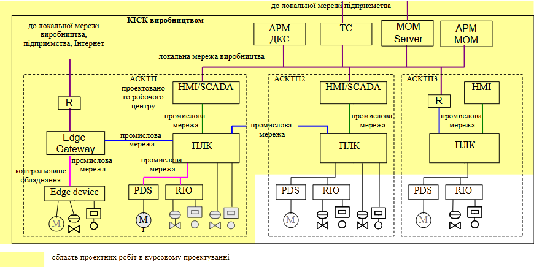

# 1. Загальні відомості

Мета дисципліни проектування комп'ютерно-інтегрованих систем керування - підготовка студентів до самостійного розв’язання практичних і прикладних задач побудови КІСК з використанням промислових мереж та сучасних технологій інтеграції, виконання проектних робіт по виконанню таких систем.  Предметом вивчення навчальної дисципліни є стандарти та протоколи в області промислових мереж; технології інтеграції в комп’ютерно-інтегрованих системах та правила їх побудови; нормативні документи та правила виконання графічних, розрахункових та пояснювальних матеріалів, необхідних для організації та виконання процесів проектування, монтажу, впровадження та експлуатації комп’ютерно-інтегрованих систем управління технологічними комплексами харчової промисловості.

Згідно з вимогами освітньо-професійної програми «Комп’ютерні технології та програмування в автоматизованих системах управління» здобувачі повинні набути здатності отримувати компетентності:

- інтегральна – Здатність розв’язувати складні задачі і проблеми автоматизації та комп’ютерно-інтегрованих технологій у професійній діяльності та/або у процесі навчання, що передбачає проведення досліджень та/або провадження інноваційної діяльності та характеризується комплексністю та невизначеністю умов і вимог;

- ЗК2. Здатність генерувати нові ідеї (креативність).
- ЗК5. Здатність використання інформаційних і комунікаційних технологій.
- ЗК6. Здатність розробляти проєкти та керувати ними.

- ФК1. Здатність здійснювати автоматизацію складних технологічних об’єктів та комплексів, створювати кіберфізичні системи на основі інтелектуальних методів управління та цифрових технологій з використанням баз даних, баз знань, методів штучного інтелекту, робототехнічних та інтелектуальних мехатронних пристроїв.
- ФК2. Здатність проєктувати та впроваджувати високонадійні системи автоматизації та їх прикладне програмне забезпечення, для реалізації функцій управління та опрацювання інформації, здійснювати захист прав інтелектуальної власності на нові проєктні та інженерні рішення.
- ФК4. Здатність аналізувати виробничо-технологічні системи і комплекси як об’єкти автоматизації, визначати способи та стратегії їх автоматизації та цифрової трансформації.
- ФК5. Здатність інтегрувати знання з інших галузей, застосовувати системний підхід та враховувати нетехнічні аспекти при розв’язанні інженерних задач та проведенні наукових досліджень.
- ФК7. Здатність застосовувати спеціалізоване програмне забезпечення та цифрові технології для розв’язання складних задач і проблем автоматизації та комп’ютерно-інтегрованих технологій.
- ФК8. Здатність розробляти функціональну, технічну та інформаційну структуру комп’ютерно-інтегрованих систем управління організаційно-технологічними комплексами із застосуванням мережевих та інформаційних технологій, програмно-технічних керуючих комплексів, промислових контролерів, мехатронних компонентів, робототехнічних пристроїв та засобів людино-машинного інтерфейсу.

Здобувачі повинні досягти таких програмних результатів навчання:

- ПРН02. Створювати високонадійні системи автоматизації з високим рівнем функціональної та інформаційної безпеки програмних та технічних засобів.
- ПРН03. Застосовувати спеціалізовані концептуальні знання, що включають сучасні наукові здобутки, а також критичне осмислення сучасних проблем у сфері автоматизації та комп’ютерно-інтегрованих технологій для розв’язування складних задач професійної діяльності.
- ПРН05. Розробляти комп’ютерно-інтегровані системи управління складними технологічними та організаційно-технічними об’єктами, застосовуючи системний підхід із врахуванням нетехнічних складових оцінки об’єктів автоматизації.
- ПРН06. Вільно спілкуватися державною та іноземною мовами усно і письмово для обговорення професійних проблем і результатів діяльності у сфері автоматизації та комп’ютерно-інтегрованих технологій, презентації результатів досліджень та інноваційних проєктів.
- ПРН07. Аналізувати виробничо-технічні системи у певній галузі діяльності як об’єкти автоматизації і визначати стратегію їх автоматизації та цифрової трансформації.
- ПРН09. Розробляти функціональну, організаційну, технічну та інформаційну структури систем автоматизації складними технологічними та організаційно- технічними об’єктами, розробляти програмно-технічні керуючі комплекси із застосовуванням мережевих та інформаційних технологій, промислових контролерів, мехатронних компонентів, робототехнічних пристроїв, засобів людино-машинного інтерфейсу та з урахуванням технологічних умов та вимог до управління виробництвом.
- ПРН10. Розробляти і використовувати спеціалізоване програмне забезпечення та цифрові технології для створення систем автоматизації складними організаційно-технічними об’єктами, професійно володіти спеціальними програмними засобами.
- ПРН11. Дотримуватись норм академічної доброчесності, знати основні правові норми щодо захисту інтелектуальної власності, комерціалізації результатів науково-дослідної, винахідницької та проєктної діяльності.
- ПРН12. Збирати необхідну інформацію, використовуючи науково-технічну літературу, бази даних та інші джерела, аналізувати і оцінювати її.

# 2. Мета і завдання курсового проектування

**Метою** курсового проектування є закріплення студентами знань про зміст і послідовність проектування та набуття вмінь виконання проектних робіт на всіх стадіях проектування комп’ютерно-інтегрованих систем управління (КІСК). Оволодіння технікою проектування КІСК є одним із основних завдань вивчення дисципліни "Проектування комп’ютерно-інтегрованих систем керування". Успішне виконання курсового проекту сприятиме закріпленню та поглибленню знань, отриманих у процесі вивчення дисципліни, набуттю навичок виконання основних схем і креслень проектів, підготовці студентів до ви­конання дипломного проекту.

Завдання до курсового проекту формується таким чином: "Розроблення проекту КІСК (вказується виробничий цех або виробництво) з підсистемою керування (вказується робочий центр)". Відповідно до завдання, курсове проектування передбачає проектні роботи над КІСК всім виробництвом або окремим виробничим цехом, та зокрема над автоматизованою системою керування технологічним процесом (АСКТП), яка входить до її складу як підсистема. 

На рис.1 показаний приклад структури КІСК виробництвом. Проектні роботи в курсовому проекті проводяться для однієї з АСКТП та КІСК в цілому, шляхом інтеграції існуючих АСКТП суміжних відділень, а також підключенням додаткових контрольованих засобів через IoT. Таким чином в область робіт курсового проекту входять: 

- передпроектні роботи, що включають аналіз об'єкту, існуючих систем АСКТП та формування технічних вимог до проектованої системи
- проектування мереж та програмного забезпечення КІСК виробництвом або виробничим цехом, шляхом інтеграції АСКТП, підсистем диспетчерського керування, MES/MOM, серверів архівування, тощо
- проектування інформаційного забезпечення рівнів L3 та нижче 
- проектування мереж та програмного забезпечення АСКТП одного з робочих центрів виробництва;
- проектування системи промислового інтернету речей для рішення задач моніторингу стану обладнання, або інших завдань     

рис.1. Область проектних робіт в курсовому проекті.

# 3. Тематика курсових проєктів

Тематика курсових проектів охоплює проекти КІСК різними виробництвами, які відносяться до виробничих майданчиків в цілому або окремого цеху (з точки зору ISA-95/IEC 62264).

Перелік орієнтовних назв тем наведений в Таблиці 1. Назва теми означує тип виробництва, основне відділення (ділянку, робочий центр) виробництва (див. рис.1) та додаткові вимоги до технічного та програмного забезпечення системи. Перелік наведених в таблиці 1 тем є орієнтовним. Викладач, за необхідності, може змінити або добавити ряд вимог. Крім того, здобувач може вибрати або запропонувати свій варіант теми, наприклад при заздалегідь відомій темі дипломного проекту.

Таблиця 1. Орієнтовний перелік тем для курсового проєкту.

| Варіант | Виробництво    | Робочий центр                             | ПЛК     | Пром. мережа  | HMI/SCADA   | PDS        |
| ------- | -------------- | ----------------------------------------- | ------- | ------------- | ----------- | ---------- |
| 1       | Цукрове        | Дифузійне відділення                      | VIPA    | S7 TCP/IP     | SCADA zenon | Altivar    |
| 2       | Цукрове        | Дифузійне відділення                      | M340    | Modbus RTU    | Plant SCADA | Lenze      |
| 3       | Цукрове        | Дифузійне відділення                      | S7 1500 | S7 TCP/IP     | SCADA zenon | Danfoss    |
| 4       | Цукрове        | Дифузійне відділення                      | M580    | Modbus TCP/IP | Plant SCADA | Mitsubishi |
| 5       | Цукрове        | Дифузійне відділення                      | S7 1200 | Profinet      | SCADA zenon | Altivar    |
| 6       | Цукрове        | Дифузійне відділення                      | FX5     | на вибір      | на вибір    | на вибір   |
| 7       | Цукрове        | Сатураційне відділення                    | M340    | Modbus RTU    | SCADA zenon | Danfoss    |
| 8       | Цукрове        | Сатураційне відділення                    | VIPA    | S7 TCP/IP     | Plant SCADA | Lenze      |
| 9       | Цукрове        | Сатураційне відділення                    | M580    | Modbus TCP/IP | SCADA zenon | Altivar    |
| 10      | Цукрове        | Сатураційне відділення                    | S7 1200 | Profinet      | Plant SCADA | Lenze      |
| 11      | Цукрове        | Сатураційне відділення                    | S7 1500 | S7 TCP/IP     | SCADA zenon | Danfoss    |
| 12      | Цукрове        | Сатураційне відділення                    | M580    | Modbus TCP/IP | Plant SCADA | Mitsubishi |
| 13      | Цукрове        | Сатураційне відділення                    | M340    | Modbus TCP/IP | SCADA zenon | Altivar    |
| 14      | Цукрове        | Сатураційне відділення                    | FX5     | на вибір      | на вибір    | на вибір   |
| 15      | Цукрове        | Сатураційне відділення                    | M340    | Modbus RTU    | SCADA zenon | Danfoss    |
| 16      | Цукрове        | Продуктове відділення                     | M241    | Modbus RTU    | Plant SCADA | Mitsubishi |
| 17      | Цукрове        | Продуктове відділення                     | M340    | Modbus RTU    | SCADA zenon | Altivar    |
| 18      | Цукрове        | Продуктове відділення                     | S7 1200 | Profinet      | Plant SCADA | Lenze      |
| 19      | Цукрове        | Випарне відділення                        | M580    | Modbus TCP/IP | SCADA zenon | Danfoss    |
| 20      | Цукрове        | Випарне відділення                        | S7 1200 | Profinet      | Plant SCADA | Mitsubishi |
| 21      | Цукрове        | Випарне відділення                        | S7 1500 | Profinet      | SCADA zenon | Altivar    |
| 22      | Цукрове        | Випарне відділення                        | VIPA    | S7 TCP/IP     | Plant SCADA | Lenze      |
| 23      | Цукрове        | Випарне відділення                        | M580    | Modbus TCP/IP | SCADA zenon | Danfoss    |
| 24      | Цукрове        | Випарне відділення                        | M340    | Modbus RTU    | Plant SCADA | Mitsubishi |
| 25      | Цукрове        | Конденсатне господарство                  | S7 1200 | Profinet      | SCADA zenon | Altivar    |
| 26      | Цукрове        | Конденсатне господарство                  | M340    | Modbus RTU    | Plant SCADA | Lenze      |
| 27      | Цукрове        | Конденсатне господарство                  | M580    | Modbus TCP/IP | SCADA zenon | Danfoss    |
| 28      | Цукрове        | Тракт подачі та мийка                     | S7 1200 | Profinet      | Plant SCADA | Mitsubishi |
| 29      | Цукрове        | Тракт подачі та мийка                     | M340    | Modbus RTU    | SCADA zenon | Altivar    |
| 30      | Цукрове        | Тракт подачі та мийка                     | M580    | Modbus TCP/IP | Plant SCADA | Lenze      |
| 31      | Цукрове        | Фільтраційне відділення                   | M340    | Modbus RTU    | SCADA zenon | Danfoss    |
| 32      | Цукрове        | Фільтраційне відділення                   | M241    | Modbus RTU    | Plant SCADA | Mitsubishi |
| 33      | Цукрове        | Фільтраційне відділення                   | S7 1200 | Profinet      | SCADA zenon | Altivar    |
| 34      | Хлібопекарське | Відділення приготування тіста             | M241    | Modbus RTU    | Plant SCADA | Lenze      |
| 35      | Хлібопекарське | Відділення приготування тіста             | S7 1200 | Profinet      | SCADA zenon | Danfoss    |
| 36      | Хлібопекарське | Відділення випікання                      | M241    | Modbus RTU    | Plant SCADA | Mitsubishi |
| 37      | Молочне        | Відділення приймання та зберігання молока | S7 1200 | Profinet      | SCADA zenon | Altivar    |
| 38      | Молочне        | Відділення приймання та зберігання молока | M340    | Modbus RTU    | Plant SCADA | Lenze      |
| 39      | Молочне        | CIP-мийка                                 | M580    | Modbus TCP/IP | SCADA zenon | Danfoss    |
| 40      | Молочне        | CIP-мийка                                 | S7 1500 | S7 TCP/IP     | Plant SCADA | Mitsubishi |
| 41      | Молочне        | Цільномолочне виробництво                 | S7 1500 | S7 TCP/IP     | SCADA zenon | Altivar    |
| 42      | Молочне        | Цільномолочне виробництво                 | VIPA    | S7 TCP/IP     | Plant SCADA | Lenze      |
| 43      | Молочне        | Цільномолочне виробництво                 | M340    | Modbus TCP/IP | SCADA zenon | Danfoss    |
| 44      | Молочне        | Цільномолочне виробництво                 | S7 1200 | Profinet      | Plant SCADA | Mitsubishi |
| 45      | Молочне        | Цільномолочне виробництво                 | M580    | Modbus TCP/IP | SCADA zenon | Altivar    |
| 46      | Молочне        | Цільномолочне виробництво                 | M340    | Modbus RTU    | Plant SCADA | Lenze      |
| 47      | Молочне        | Пастеризаційно-охолоджувальна установка   | VIPA    | Profinet      | SCADA zenon | Danfoss    |
| 48      | Молочне        | Пастеризаційно-охолоджувальна установка   | M340    | Modbus TCP/IP | Plant SCADA | Mitsubishi |
| 49      | Спиртове       | Відділення підробітки і варки             | M580    | Modbus TCP/IP | SCADA zenon | Altivar    |
| 50      | Спиртове       | Відділення підробітки і варки             | M340    | Modbus RTU    | Plant SCADA | Lenze      |
| 51      | Спиртове       | Відділення підробітки і варки             | VIPA    | S7 TCP/IP     | SCADA zenon | Danfoss    |
| 52      | Спиртове       | Відділення бродіння                       | M580    | Modbus TCP/IP | Plant SCADA | Mitsubishi |
| 53      | Спиртове       | Відділення бродіння                       | VIPA    | S7 TCP/IP     | SCADA zenon | Altivar    |
| 54      | Спиртове       | Відділення бродіння                       | M340    | Modbus RTU    | Plant SCADA | Lenze      |
| 55      | Спиртове       | Брагоретифікаційна установка              | M580    | Modbus RTU    | SCADA zenon | Danfoss    |
| 56      | Спиртове       | Брагоретифікаційна установка              | VIPA    | S7 TCP/IP     | Plant SCADA | Mitsubishi |
| 57      | Спиртове       | Брагоретифікаційна установка              | M340    | Modbus TCP/IP | SCADA zenon | Altivar    |
| 58      | Пивоварне      | Солодове відділення                       | M580    | Modbus TCP/IP | Plant SCADA | Danfoss    |
| 59      | Пивоварне      | Солодове відділення                       | M340    | Modbus RTU    | SCADA zenon | Altivar    |
| 60      | Пивоварне      | Солодове відділення                       | FX5     | на вибір      | на вибір    | на вибір   |
| 61      | Пивоварне      | Сусловарильне відділення                  | S7 1500 | S7 TCP/IP     | SCADA zenon | Lenze      |
| 62      | Пивоварне      | Сусловарильне відділення                  | S7 1200 | Profinet      | Plant SCADA | Danfoss    |
| 63      | Пивоварне      | Сусловарильне відділення                  | FX5     | на вибір      | на вибір    | на вибір   |
| 64      | Пивоварне      | Бродильне відділення                      | VIPA    | Profinet      | Plant SCADA | Lenze      |
| 65      | Пивоварне      | Бродильне відділення                      | M340    | Modbus TCP/IP | SCADA zenon | Danfoss    |
| 66      | Пивоварне      | Бродильне відділення                      | S7 1200 | Profinet      | Plant SCADA | Altivar    |
| 67      | Пивоварне      | Бродильне відділення                      | M580    | Modbus TCP/IP | SCADA zenon | Danfoss    |
| 68      | Пивоварне      | Відділення фільтрації сусла               | FX5     | на вибір      | на вибір    | на вибір   |
| 69      | Пивоварне      | Відділення фільтрації сусла               | S7 1200 | Profinet      | SCADA zenon | Mitsubishi |
| 70      | Пивоварне      | CIP-мийка                                 | M241    | Modbus TCP/IP | Plant SCADA | Altivar    |
| 71      | Пивоварне      | CIP-мийка                                 | VIPA    | S7 TCP/IP     | SCADA zenon | Danfoss    |

Також додатково видається завдання щодо розроблення підсистеми IIoT.

Таблиця 1а. Орієнтовні IIoT-завдання 

| №    | Назва функції IIoT                                   | Типові датчики                       | Тип підключення            | Протокол          | Інтеграція з                  |
| ---- | ---------------------------------------------------- | ------------------------------------ | -------------------------- | ----------------- | ----------------------------- |
| 1    | Моніторинг вібрації                                  | вібраційний датчик (IMU, MEMS)       | аналоговий / цифровий      | MQTT / Modbus RTU | SCADA, хмара,                 |
| 2    | Контроль температури шаф                             | цифрові термодатчики (DS18B20)       | 1-Wire / Modbus            | MQTT / HTTP       | SCADA                         |
| 3    | Облік електроспоживання                              | цифровий лічильник енергії           | RS-485 / LoRa              | Modbus / MQTT     | аналітика, архів              |
| 4    | Виявлення відкриття шаф                              | геркон, індуктивний датчик           | дискретний                 | MQTT / OPC UA     | журнал тривог                 |
| 5    | Контроль рівня в ємностях                            | ультразвуковий / гідростатичний      | аналоговий / LoRa / NB-IoT | MQTT / OPC UA     | SCADA, цифровий двійник       |
| 6    | Моніторинг мікроклімату                              | комбіновані датчики CO₂ / T / RH     | I²C / UART / LoRa          | MQTT              | SCADA, CMMS                   |
| 7    | Присутність персоналу в зоні дії                     | BLE-маячки, RFID                     | Bluetooth / NFC            | MQTT              | MES, журнал безпеки           |
| 8    | Визначення стану обладнання за шумом                 | мікрофон із edge-обробкою            | аналоговий + edge          | MQTT              | хмара / локальна ML-аналітика |
| 9    | Підрахунок спрацювань виконавчих механізмів          | лічильник імпульсів, дискретні входи | дискретний                 | MQTT / OPC UA     | архів, техобслуговування      |
| 10   | Виявлення протікання                                 | датчик вологості ґрунту, тиску       | аналоговий / цифровий      | MQTT              | SCADA, аварійна сигналізація  |
| 11   | Контроль якості повітря у виробничих приміщеннях     | датчики PM2.5, VOC, O₂               | LoRa / UART                | MQTT / HTTP       | система вентиляції, SCADA     |
| 12   | Ідентифікація тари через мітки                       | RFID-рідери, QR-сканери              | NFC / UART                 | MQTT / HTTP       | MES, SCADA                    |
| 13   | Облік часу роботи персоналу з обладнанням            | BLE-маячки, RFID                     | BLE / NFC                  | MQTT              | MES, аналітика OEE            |
| 14   | Виявлення надмірної тривалості простою               | програмне опитування станів          | логічний рівень            | MQTT / OPC UA     | архів подій, SCADA            |
| 15   | Контроль рівня шуму на виробництві                   | SPL-датчики (звуковий тиск)          | аналоговий                 | MQTT / OPC UA     | SCADA, охорона праці          |
| 16   | Виявлення забруднення фільтрів у системах вентиляції | датчики тиску до/після фільтра       | аналоговий                 | MQTT              | CMMS, SCADA                   |
| 17   | Збір подій від ручних перемикачів або кнопок         | дискретні входи                      | дискретний                 | MQTT              | архів, HMI                    |
| 18   | Контроль стану дверей / люків                        | магнітні датчики                     | дискретний                 | MQTT              | SCADA, сигналізація           |
| 19   | Збір стану аварійного живлення / джерел живлення     | цифрові входи від ДБЖ                | дискретний                 | MQTT              | SCADA                         |
| 20   | Температурний моніторинг розподільчих щитів          | термопари / цифрові датчики          | аналоговий / цифровий      | MQTT / Modbus     | SCADA                         |
| 21   | Облік циклів CIP-мийки (час, температура, витрата)   | температурні, витратоміри, таймер    | аналоговий / цифровий      | MQTT / OPC UA     | SCADA, MES                    |

Таблиця 1б. Типи виконавчих механізмів (орієнтовно)

| №    | Тип виконавчого механізму                            | Живлення ВМ                          | Керування                                                    | Зворотний зв'язок                               | Керування по місцю    |
| ---- | ---------------------------------------------------- | ------------------------------------ | ------------------------------------------------------------ | ----------------------------------------------- | --------------------- |
| 1    | Електропривод насоса з частотним перетворювачем (ПЧ) | 3×380 В змінного струму              | аналогове (уставка швидкості), дискретне (запуск, скидання аварії) | готовність, аварія, фактична швидкість, струм   | руч/авт               |
| 2    | Клапан з електроприводом без нормального положення   | 24 В пост. або 230 В змінного струму | дискретне: 'відкрити', 'закрити'                             | датчик відкрито, датчик закрито, аварія         | руч/авт               |
| 3    | Клапан нормально закритий з соленоїдом               | 24 В пост. або 230 В змінного струму | дискретне: 'відкрити'                                        | стан 'відкрито', аварія                         | без ручного керування |
| 4    | Привід мішалки або дозатора (двигун без ПЧ)          | 3×380 В змінного струму              | дискретне: 'вмикання', аварійна зупинка                      | стан 'працює', аварія, перевантаження           | руч/відкл/авт         |
| 5    | Вентиль подачі стисненого повітря                    | 24 В постійного струму               | дискретне: 'відкрити'                                        | немає (керування без підтвердження)             | без ручного керування |
| 6    | Заслінка з пневмоприводом і кінцевими вимикачами     | пневматичне + 24 В кінцевики         | дискретне: 'відкрити', 'закрити'                             | датчик відкрито, датчик закрито, аварія         | руч/авт               |
| 7    | Реверсивний транспортер                              | 3×380 В змінного струму              | дискретне: 'вперед', 'назад', аварійна зупинка               | напрям руху, аварія                             | руч/відкл/авт         |
| 8    | Запірна заслінка з ручним дублюванням                | 230 В змінного струму                | дискретне: 'відкрити', 'закрити'; режим: 'ручний/автомат'    | стан заслінки, активний режим, блокування       | руч/авт               |
| 9    | Привід перемішування з контролем обертів             | 3×380 В змінного струму              | аналогове: уставка швидкості; дискретне: запуск              | фактична швидкість, аварія, розбіжність         | руч/відкл/авт         |
| 10   | Двигун з мінімальним керуванням (пуск/стоп)          | 3×380 В змінного струму              | дискретне: 'пуск', 'стоп'                                    | стан 'вкл', аварія                              | руч/авт               |
| 11   | Клапан з аналоговим позиціонером (регулюючий)        | 24 В постійного струму               | аналогове: уставка положення, скидання                       | фактичне положення, аварія, блокування          | руч/авт               |
| 12   | Двоступеневий пальник (газ/мазут)                    | 230 В змінного струму                | дискретне: ступінь 1, ступінь 2, скидання аварії             | робота ступеня 1/2, аварія, відсутність полум’я | руч/відкл/авт         |
| 13   | Шибер подачі пари                                    | пневматичне + 24 В кінцевики         | дискретне: 'відкрити', 'закрити'                             | датчик відкрито, закрито, тиск у приводі        | руч/авт               |
| 14   | Вентилятор із регулюванням оборотів                  | 3×380 В змінного струму              | аналогове: уставка швидкості, дискретне: запуск              | фактична швидкість, аварія, стан                | руч/відкл/авт         |
| 15   | Автоматичний відвідник конденсату                    | 24 В постійного струму               | дискретне: 'відкрити'                                        | стан 'в роботі', аварія                         | без ручного керування |
| 16   | Клапан регулювання тиску                             | пневматичне                          | аналогове: уставка тиску                                     | датчик тиску, стан регуляції                    | руч/авт               |
| 17   | Електропідігрівач рідини                             | 3×380 В змінного струму              | аналогове: уставка температури, запуск                       | фактична температура, аварія перегріву          | руч/авт               |
| 18   | Заслінка рециркуляції повітря                        | 230 В змінного струму                | дискретне: 'відкрити', 'закрити'                             | датчик положення, сигнал від датчика CO₂        | руч/авт               |
| 19   | Станція дозування реагенту                           | 230 В змінного струму                | аналогове: уставка дози, дискретне: запуск                   | спожитий об’єм, аварія, стан                    | руч/авт               |
| 20   | Блок електромагнітних клапанів для розподілу повітря | 24 В постійного струму               | дискретне: окремі сигнали на кожен клапан                    | стан кожного клапана (відкр/закр)               | руч/авт               |

# 4. Порядок видачі завдання на курсовий проєкт

Студентам денної форми навчання завдання на виконання курсового проек­ту видається на початку жовтня 9-го семестру. До грудня студент повинен розробити першу частину курсового проекту – технічне завдання (ТЗ), яке після узгодження з керівником буде кінцевим варіантом завдання на другу частину - робочий проект. Студентам заочної форми навчання завдання на виконання курсового проек­ту видається на початку вивчення дисципліни "Проектування комп’ютерно-інтегрованих систем". Розроблене ТЗ є обов’язковим для допуску до іспиту з дисципліни "Проектування комп’ютерно-інтегрованих систем" як для денної, так і заочної форми навчання.

# 5. Зміст курсового проєкту

Передрпроектні роботи оформлюються в розрахунково-пояснювальній записці як розділ 1 "Аналіз об'єкту та існуючих систем керування АСКТП та формування вимог". Передпроектні роботи включають в себе:

- аналіз об'єктів керування, тобто виробництва в цілому та проектованого робочого центру
- аналіз існуючих АСКТП
- формування технічних вимог до проектованої системи  

Розроблені документи по проектуванню КІСК в цілому входять до розділу 2 "Розроблення загальносистемних рішень рівня керування виробничими операціями" і передбачають виконання наступних робіт:

- декомпозиція задач та формування ієрархії обладнання рівнів L4 (ERP) та L3 (MOM)
- вибір технічного та програмного забезпечення для системи керування виробничими операціями 
- розроблення структури комплексу технічних засобів системи керування виробничими операціями
- розроблення інформаційної структури рівня L3 системи керування виробничими операціями     

Проектування інформаційного забезпечення рівнів L3 та нижче (розділ 3) передбачає виконання наступних робіт:

- декомпозиція задач та формування ієрархії обладнання рівнів L3 та нижче
- визначення типів (класів) обладнання
- формування інтерфейсів, автоматів станів та описів алгоритмів роботи обладнання
- формування таблиць майстерданих для АСКТП 

Проектування АСКТП вибраного робочого центру (розділ 4) передбачає виконання наступних робіт:

- розроблення структури комплексу технічних засобів АСКТП
- розроблення схем підключення мереж АСКТП
- розроблення інформаційної структури АСКТП

 Проектування IIoT (розділ 5) передбачає виконання наступних робіт:

- розроблення структури комплексу технічних засобів IIoT рішення
- розроблення інформаційної структури IIoT рішення
- опис інтегрування з платформою та/або сервісами 

Передбачається, що вибір програмно-технічних засобів  та пошук технічної документації для них проводиться здобувачем самостійно, якщо інше не оговорюється в завданні. Така робота сприяє розвитку нави­чок самостійної роботи з літературою та з мережею Інтернет.

Таким чином курсовий проект має включати наступні розділи:

Вступ.

Розділ 1. Аналіз об'єкта, існуючих систем керування АСКТП та формування вимог

Розділ 2. Розроблення загальносистемних рішень рівня керування виробничими операціями

Розділ 3. Формування моделі обладнання L3 та нижче

Розділ 4. Проектування АСКТП 

Розділ 5. Проектування IIoT

# 6. Рекомендації до виконання окремих розділів курсового проєкту
