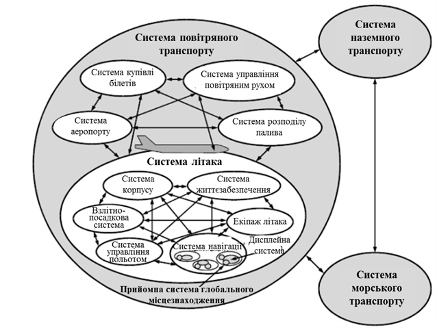
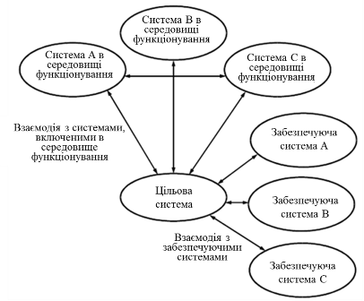
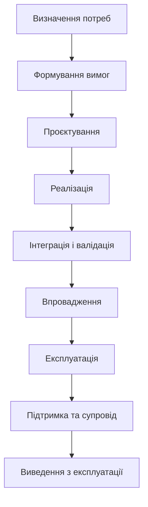
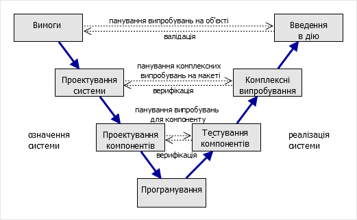
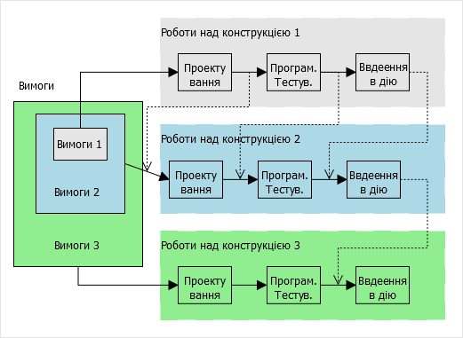
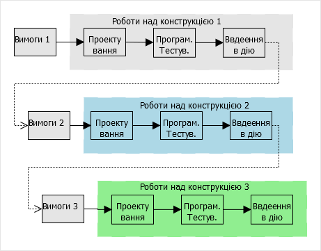
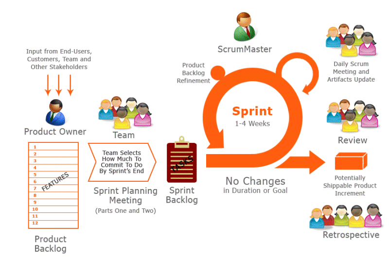
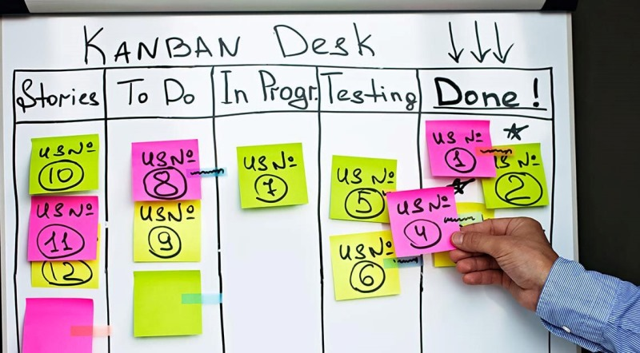

# 1. Особливості розроблення комп'ютерно-інтегрованих систем керування (КІСК)

## 1.1. Комп'ютерно-інтегровані системи керування як автоматизовані системи

Комп'ютерно-інтегровані системи керування у вітчизняній практиці прийнято називати автоматизованими. Нагадаємо про такі визначення:

- Система автоматизована (АС, автоматизована система) - це організаційно-технічна система, що складається із засобів автоматизації певного виду (чи кількох видів) діяльності людей та персоналу, що здійснює цю діяльність. 
- Система керування (управління) автоматизована - АС, призначена для автоматизації процесів збирання та пересилання інформації про об’єкт керування, її перероблення та видачі керівних дій на об’єкт керування. 
- Система керування(управління) технологічним процесом автоматизована*** (***АСК ТП, АСУ ТП) АС, призначена для оптимізації керування технологічними процесами виробництва.
- Система керування підприємством автоматизована*** (***АСКП, АСУП) - інтегрована АС, призначена для ефективного керування виробничо-господарчою діяльністю підприємства.
- Системи інтегрована автоматизована (ІАС) – сукупність двох і більше взаємопов’язаних АС, в якій функціювання однієї (кількох) з них залежить від функціювання іншої (інших) так, що цю сукупність можна розглядати як єдину АС.

Життєвий цикл інтегрованої автоматизованої системи, які і будь-якої автоматизованої системи, включає сукупність взаємозв’язаних процесів створення та послідовної зміни станів системи від формування вихідних вимог до неї, до кінця експлуатації та утилізації комплексу засобів автоматизації. 

При створенні нової або вдосконалення існуючої АС проектні та інжинірингові організації керуються стандартами та іншими нормативними документами. АС може створюватися:

1) для нового технологічного об’єкта керування (надалі об’єкта);

2) для об’єкта, який реконструюється або розширюється;

3) для об’єкта, який технічно переобладнається; 

4) для діючого і без його реконструкції;

Для перших трьох випадків, розробка АС являється частиною будівельно-монтажних і пуско-налагоджувальних робіт по створенню об’єкту, тому стадійність створення АС визначається стадійністю розробки будівельного об’єкта. 

## 1.2. Життєвий цикл комп'ютерно-інтегрованих систем керування

### Системно-інженерний підхід

Більшість сучасних практик та стандартів проектування та розроблення систем базуються на системно-інженерних підходах. Один із базових стандартів, на які спираються ці практики є ДСТУ ISO/IEC 15288:2005 "Інформаційні технології. Системна інженерія. Процеси життєвого циклу системи". Згідно цього стандарту ***Система*** (system) - це комбінація взаємодіючих елементів, організованих для досягнення однієї або декількох поставлених цілей.

Сприйняття та визначення конкретної системи, її архітектури та системних елементів залежить від інтересів і обов'язків спостерігача. Система, яка становить інтерес для однієї особи, може розглядатися іншою особою як елемент розглянутої ним системи. І навпаки, вона може розглядатися як частина зовнішнього середовища системи, що представляє інтерес для третьої особи.

На рис. 1.1 представлена множина прикладів сприйняття системи літака і його експлуатаційного середовища. На рисунку проілюстровані наступні аспекти:

-           важливість певних меж, які впливають на формування значущих потреб і практичних рішень;

-           ієрархічне сприйняття фізичної структури системи;

-           об'єкт будь-якого рівня ієрархічної структури може розглядатися як система;

-           система включає повністю інтегровану, певну множину підлеглих систем;

-           характерні властивості на кордоні системи виникають в результаті взаємодії між системними елементами;

-           люди можуть розглядатися як зовнішні користувачі стосовно системи (наприклад, екіпаж літака по відношенню до навігаційної системи) і як елементи в рамках системи (наприклад, екіпаж літака по відношенню до самого літака);

-           система може розглядатися як окремий, ізольований від зовнішнього середовища об'єкт (тобто як продукт), або як упорядкований набір функцій, здатних взаємодіяти з навколишнім середовищем (тобто як набір послуг).

Якими б не були кордони системи, концепції і моделі для них є універсальними і дозволяють практикуючим фахівцям пов'язувати або адаптувати окремі приклади життєвих циклів зі своїми системними принципами. Взаємозв’язок (взаємодія) між системами проводиться через ***інтерфейси***. 

У стандарті ISO/IEC 15288:2005 люди розглядаються і як користувачі і як елементи системи. У першому випадку користувач є одержувачем результатів функціонування системи. У другому випадку людина є оператором, який виконує задані системні функції. Таким чином, людина одночасно або поперемінно може виступати як в якості користувача, так і елемента системи.



Рис.1.1. Стандартне представлення системи літака в середовищі його використання з точки зору системного підходу (фрагмент ISO/IEC 15288:2005)

Умовна особа (людина або організація), роль якої по відношенню до системи визначається її інтересами, називається ***зацікавленою особою*** (***stakeholder***).

Виділяючи систему із зовнішнього світу, спостерігач часто виділяє в зовнішньому світі інші системи, з якими взаємодія ця система. Щоб відрізняти ту систему, яка цікавить спостерігача від інших систем, в ISO/IEC 15288:2005 її прийнято називати ***цільовою системою*** (***system-of-interest***). Роль інших систем в зовнішньому світі відносно цільової системи можуть бути також уточнені: забезпечуючи система, система в середовищі функціонування. 

***Системи в середовищі функціонування (system in operational environment)*** – це ті системи, які безпосередньо зв’язані з виконанням цільовою системою своїх функцій в процесі її функціонування. Взаємозв’язок систем в середовищі функціонування з цільовою системою проводиться через інтерфейси. 

***Забезпечуючими системами*** (***еnabling system***) – називають системи, які забезпечують створення, розвиток, функціонування і утилізацію цільової системи протягом її життєвого циклу.   Протягом життєвого циклу цільової системи потрібні спеціальні послуги від систем, які не є безпосередньою частиною середовища функціонування. Кожна з таких систем забезпечує частину (наприклад, стадію) життєвого циклу цільової системи. Такими системами можуть бути, наприклад, системи проектування, виробництва складових цільової системи, системи навчання, системи обслуговування цільової системи і т.д. Поняття забезпечуючої системи тісно зв’язано з життєвим циклом цільової системи.   



Рис.1.2. Система що розглядається, середовище функціонування і забезпечуючі системи (фрагмент ISO/IEC 15288:2005)

### Життєвий цикл систем

***Життєвий цикл системи*** (***system life cycle***) – період часу, протягом якого розвивається система, змінюючи свій стан, починаючи від замислу і закінчуючи списанням. Слід розрізняти життєвий цикл системи і життєвий цикл проекту. 

***Стадія життєвого циклу*** – період в межах життєвого циклу системи, що відноситься до стану системного опису або безпосередньо до самої системи. Стадії відносяться до періоду значного просунення системи і досягнення запланованих термінів протягом життєвого циклу. Вони можуть перекривати одна одну, можуть застосовуватися для побудови структур, за допомогою яких процеси життєвого циклу використовуються для моделювання безпосередньо життєвого циклу.

Не зважаючи на різницю в життєвих циклах різних систем, існує базовий набір стадій життєвого циклу, які складають повний життєвий цикл будь-якої системи. Кожна стадія має певну ціль і вклад в повний життєвий цикл і розглядається при плануванні і виконанні життєвого циклу системи. У таблиці 1.1 представлені приклади стадій життєвого циклу, які найбільш часто зустрічаються. У таблиці відображені принципові цілі кожної з стадій і можливі варіанти рішень, що використовуються для керування досягненнями і ризиками, пов'язаними з розвитком системи протягом життєвого циклу. 

Організації (забезпечуючі системи) проводять стадії життєвого циклу різними способами, усуваючи протиріччя між стратегією здійснення бізнесу та стратегією зменшення ризиків. Паралельне проходження стадій або їх проходження в різному порядку може призвести до форм життєвого циклу з абсолютно різними характеристиками. Часто в якості альтернативних варіантів використовуються послідовна, інкрементна або еволюційна форми життєвого циклу (див. нижче), в окремих випадках можуть бути розроблені комбінації цих форм.

Таблиця 1.1 Приклад стадій, їх цілей і основних схем рішень 

| Стадія життєвого циклу     | Основна ціль                                         | Приклади рішень для управління досягненням цілі та ризиками  |
| -------------------------- | ---------------------------------------------------- | ------------------------------------------------------------ |
| Визначення потреб          | Виявлення та формалізація потреб зацікавлених сторін | Опитування, інтерв'ю, аналіз ринку, дослідження проблем      |
| Формування вимог           | Визначення технічних і функціональних вимог          | Створення специфікацій, сценаріїв використання, моделювання  |
| Проєктування               | Розробка архітектури системи                         | Архітектурне моделювання, прототипування, аналіз альтернатив |
| Реалізація (розроблення)   | Створення компонентів системи                        | Програмування, розробка обладнання, юніт-тестування          |
| Інтеграція і валідація     | Перевірка відповідності системи вимогам              | Інтеграційне тестування, системне тестування, сертифікація   |
| Впровадження (розгортання) | Введення системи в експлуатацію                      | Інсталяція, налаштування, початкове навчання користувачів    |
| Експлуатація               | Підтримка ефективного функціонування системи         | Моніторинг, обслуговування, підтримка користувачів           |
| Підтримка та супровід      | Виправлення, оновлення, удосконалення системи        | Випуск оновлень, виправлення помилок, адаптація до нових умов |
| Виведення з експлуатації   | Завершення використання системи                      | План ліквідації, перенесення даних, утилізація або архівація |

У різних стадіях життєвого циклу можуть брати участь різні організації, залежно від їхньої ролі, компетенцій і відповідальності. Це можуть бути як внутрішні підрозділи підприємства, так і зовнішні постачальники, підрядники, консультанти. Нижче у таблиці 1.2 подано приклади типових учасників для кожної стадії життєвого циклу.

Таблиця 1.2 – Приклади організацій, залучених на різних стадіях життєвого циклу

| Стадія життєвого циклу     | Приклади типових учасників (організацій, структур)           |
| -------------------------- | ------------------------------------------------------------ |
| Визначення потреб          | Замовник, бізнес-аналітики, маркетингові служби              |
| Формування вимог           | Системні аналітики, технічні консультанти, відділ стандартизації |
| Проєктування               | Проєктно-конструкторські бюро, системні інтегратори, архітектори систем |
| Реалізація (розроблення)   | Розробники ПЗ, виробники обладнання, розробники щитів        |
| Інтеграція і валідація     | Випробувальні лабораторії, тестувальники, служби контролю якості |
| Впровадження (розгортання) | Пусконалагоджувальні організації, монтажні служби, служба впровадження |
| Експлуатація               | Оператори, технічна служба замовника, виробничий персонал    |
| Підтримка та супровід      | Сервісні компанії, служба технічної підтримки, група оновлення ПЗ |
| Виведення з експлуатації   | ІТ-служба, служба безпеки, екологічна служба, архівні підрозділи |

Такий розподіл дозволяє ефективно керувати відповідальністю, забезпечувати якість на всіх етапах життєвого циклу та інтегрувати зусилля різних сторін у єдину цілісну систему розвитку. Тим не менше, кожна з цих стадій керується організацією, яка відповідає за дану стадію, при цьому велику увагу треба приділяти розгляду доступної інформації по планам та рішенням життєвого циклу, прийнятим на попередніх стадіях. Аналогічним чином організація, відповідальна за цю стадію, веде записи прийнятих рішень і припущень, які відносяться до наступних стадій в даному життєвому циклі.

Велику частину робіт по стадіях життєвого циклу можуть виконати організації, які прийнято називати **системними інтеграторами** – це компанії або підрозділи, що спеціалізуються на об'єднанні різнорідних технічних і програмних компонентів у єдину функціональну систему. Вони можуть брати участь у формуванні вимог, проєктуванні архітектури, підборі сумісного обладнання, реалізації та налаштуванні програмно-технічних комплексів, а також у проведенні інтеграційного тестування, введенні системи в експлуатацію та її подальшому супроводі. Завдяки своєму досвіду і знанню технологій різних виробників, системні інтегратори забезпечують узгоджене функціонування усіх елементів комп’ютерно-інтегрованої системи керування.   

### Процеси життєвого циклу систем

Стадії життєвого циклу створюють структуру робіт для деталізованого моделювання життєвих циклів системи при використанні процесів життєвого циклу системи. ***Процес*** – сукупність взаємозв’язаних і взаємодіючих видів діяльності, які перетворюють входи у виходи. Процеси і дії життєвого циклу відбираються, відповідним чином налаштовуються і використовуються протягом стадії життєвого циклу для повного задоволення цілей і результатів на цій стадії.

Стандарт ISO/IEC 15288:2005 означує множину процесів, названих процесами життєвого циклу, за допомогою яких може бути змодельований життєвий цикл системи. Процеси життєвого циклу системи поділяються на чотири групи процесів:

- ***Процеси угоди*** означують дії, необхідні для досягнення угоди між двома організаціями. У результаті здійснення процесу придбання забезпечуються умови для ведення справ з постачальником продукції, використовуваної як діючою системою та службами її підтримки, так і елементами системи, що розробляється в рамках проекту. У результаті процесу поставки забезпечуються умови для керуванняпроектом, результатом якого є продукт або послуга, що поставляються стороні яка придбає.
- ***Процеси підприємства*** управляють здатністю організації набувати і поставляти продукцію або послуги за допомогою запуску проектів, їх підтримки та контролю. Процеси підприємства забезпечують ресурси та інфраструктуру, необхідні для здійснення проектів, і гарантують досягнення цілей і виконання зобов'язань організації за угодами. Ці процеси не розглядаються як вичерпна сукупність бізнес-процесів, які уможливлюють стратегічне керуваннядіяльністю організації.
- ***Проектні процеси*** використовуються для встановлення та виконання планів, оцінки фактичних досягнень і просувань проекту у відповідності з планами і для контролю виконання проекту аж до його завершення. Окремі процеси проекту можуть здійснюватися в будь-який момент життєвого циклу і на будь-якому рівні ієрархії проектів як у відповідності з проектними планами, так і з урахуванням непередбачених обставин. Рівень точності і формалізації, з якою здійснюються процеси проекту, залежить від складності самого проекту і проектних ризиків. 

- ***Технічні процеси*** використовуються для визначення вимог до системи, перетворення цих вимог в ефективний продукт, що дозволяє здійснювати, при необхідності, стійке відтворення цього продукту, використовувати його для забезпечення необхідних послуг, підтримувати забезпечення цими послугами і видаляти продукт, коли він вилучається з обігу. Технічні процеси визначають сукупність робіт, які дозволяють у рамках завдань підприємства та проекту оптимізувати прибуток і зменшувати ризики, що виникають внаслідок прийняття технічних рішень та здійснення відповідних дій. 

Таким чином, життєвий цикл системи є складною організацією процесів, які можуть виконуватися паралельно в часі, бути ітеративними (повторюються), рекурсивними (ініціюють запуск таких саме процесів на нижньому рівні) і мають залежні від часу характеристики.     

Спосіб керування цими процесами означується прийнятою в організаціях методологією розробки. Під методологією розробки розуміють сукупність методів, які використовуються для розроблення системи. Методології часто включають загальний філософський підхід, означення життєвого циклу, передбачають набір практик, які будуть використовуватися та організацію робіт. Під практиками розуміються процеси, способи та технології для їх виконання. 

Основою методології є прийнята модель життєвого циклу проекту, яким займається організація. ***Модель життєвого циклу*** – структурна основа процесів і дій, яка відноситься до життєвого циклу, яка також слугує в якості загального посилання для встановлення зв’язків та взаєморозуміння сторін.  Нагадаємо, що проект може охоплювати певні стадії життєвого циклу системи. Серед великої кількості моделей життєвого циклу можна умовно виділити три фундаментальних: водоспадна (каскадна), інкрементна та еволюційна. Кожна з цих моделей може використовуватися самостійно або в комбінації з іншими. Варто відмітити, що це не єдина класифікація моделей життєвого циклу. 

Надалі розглянемо деякі з моделей, але не в контексті життєвих циклів систем а – програмних проектів, враховуючи, що стадії експлуатації та виведення з обслуговування не використовується. 

### Водоспадна модель (Waterfall Model) 

***Водоспадна*** (каскадна) модель життєвого циклу передбачає, що всі процеси виконуються в межах означених стадій, розміщених послідовно в часі. Весь цикл передбачає одноразове поступове проходження стадій — від означення вимог до експлуатації (рис. 1.3). Після кожної стадії приймається важливе рішення (так званий *gate*) про перехід до наступної, і повернення до попередньої стадії не передбачається. Можливе паралельне виконання окремих робіт (етапів), але в межах однієї стадії.




Рис.1.3. Приклад каскадної моделі.

Типовим життєвим циклом подібного плану є той, що описаний у ГОСТ 34.601-90, який до недавнього часу діяв і в Україні. Водоспадна модель є зручною для розрахунку ресурсів, однак у чистому вигляді рідко здійсненна. Вона має низку недоліків:

- передбачається, що всі стадії виконуються ідеально; помилки на ранніх стадіях однозначно призводять до серйозних наслідків на наступних, які неможливо усунути без повернення назад;
- неможливо внести зміни до вимог, що з’являються після стадії «Формування вимог», оскільки це суперечить послідовності означених стадій;
- продукт (систему, ПЗ) можна використовувати лише наприкінці життєвого циклу проєкту;
- виникає потреба у залученні певного виду ресурсів у великих обсягах лише на окремих етапах.

Водоспадну модель, як правило, застосовують тоді, коли є значний досвід розробки подібних систем і напрацьовані практики. Вона популярна при створенні фізичних систем, у яких практично неможливо внести зміни в «залізо», якщо вони не були означені на ранніх стадіях. Нині цю модель використовують із певними модифікаціями, зокрема V-модель.

### V-model 

Класична водоспадна модель погано справляється з проблемами, що виникають на заключних стадіях життєвого циклу. Наслідком даних проблем стає зниження якості поставленого товару, причому часто не стільки з позицій якості виготовлення (наприклад, стабільності і безвідмовності роботи), а в частині відповідності очікувань замовника щодо вирішення його задач. Саме ця особливість підштовхувала практиків до модифікації каскадної моделі, з метою уникнення відриву рішень, виконаних на початкових стадіях аналізу і проектування від заключних стадій випробувань, впровадження та супроводу програмного продукту. Однією з таких модифікацій стала V-подібна модель життєвого циклу - ***V-model***. 

Назва моделі пішла від форми латинської букви V, яка показує форму лінії часу, що перегнута навпіл в точці, де стадії означення систем переходять в стадії реалізації та впровадження. Для програмних систем цю модель можна представити як на рис.1.4. У даному випадку час вважається логічним, тобто не по ходу виконання робіт, а по ходу проходження процесів, які використовуються.  Перелом потрібен для того, щоб показати суть верифікації і валідації: виготовлення частин та системи проводить перевірку через механізм верифікації (перевірки відповідності формальних вимог), а впровадження - через валідацію (задоволення вимог замовника). 

                                
 Рис.1.4.Приклад V-моделі

Враховуючи, що перевірка (тестування) передбачає більш чітку формалізацію вимог, які потрібно використовувати при верифікації та валідації, вияв та виправлення помилок проводиться на ранніх стадіях реалізації системи. Крім того, у результаті більш чіткого постановлення вимог, зменшується ступінь невизначеності на стадіях означення системи.     

### Інкрементні моделі (Incremental Model) 

***Інкрементні*** моделі життєвого циклу передбачають заплановане нарощування продукту (конструкції).  На рис. 1.5 показаний приклад життєвого циклу для програмного продукту.  Життєвий цикл проекту починається з видачі повного набору вимог, після чого йде розробка першої конструкції по всім стадіям, яка реалізовує тільки частину з вимог.Далі виконують роботи над іншою конструкцією, в якій реалізовують іншу частину вимог і т.д., поки буде не завершено створення задуманої системи, яка б задовольняла усім вимогам. Кожна конструкція включає реалізацію вимог попередньої і нових, таким чином нарощуючи свій функціонал.   




Рис.1.5. Інкрементна модель

Для кожної конструкції виконують необхідні процеси, роботи і завдання. Наприклад, аналіз вимог і створення архітектури можуть бути виконані відразу для всіх конструкцій, тоді як розробку технічного проекту програмного засобу, його програмування і тестування, введення в дію (розгортання) і кваліфікаційні випробування (валідацію) виконують при створенні кожної з наступних конструкцій. 

У даній моделі при розробленні кожної конструкції, роботи і задачі процесів виконують послідовно, або частково паралельно з перекриттям. Тобто, роботи над різними конструкціями можуть виконуватися паралельно, при цьому вихідна інформація якихось процесів розроблення для однієї конструкції може виконуватися як вхідна для іншої (на рис.1.5 показано пунктирними лініями). 

Процеси супроводу та експлуатації можуть бути реалізовані паралельно з процесом розроблення. Процеси замовлення і постачання, а також допоміжні і організаційні процеси зазвичай виконують паралельно з процесом розроблення.

Серед переваг інкрементної моделі можна виділити:

- чітке розуміння усіх вимог на усіх ітераціях, оскільки вони не змінюються;
- придатність для використання проміжного продукту (конструкції) за короткий час;
- природний поділ системи на нарощувані компоненти (інкремент);
- можливості виділення ресурсів на кожній ітерації за необхідності;
- простіше навчання персоналу;
- можливість внесення невеликих змін та виправлення помилок в уже працюючу систему на наступних ітераціях.

З іншого боку, чітке означення усіх вимог та можливостей, які передбачає модель, не дає можливості вносити в них зміни.  Одним із видів інкрементальних моделей можна виділити RAD, в якій вимоги реалізовуються паралельно кількома командами розробників після чого відбувається їх інтеграція.  


### Еволюційні моделі (Iterative Model)

У ***еволюційних*** (ітеративних, Iterative) моделях систему також розробляють у вигляді окремих конструкцій, але на відміну від інкрементних, вимоги означуються на кожній ітерації. Тобто на початковій ітерації формують тільки частину вимог, які відомі на той час. Після розробки конструкції, яка задовольняє цим вимогам, повертаються знову до етапу означення вимог для нової конструкції, і т.д. Графічно ця модель для ПЗ представлена на рис.1.6.     




Рис.1.6  Еволюційна модель. 

При такому методі для кожної інструкції роботи і задачі процесу розробки виконують послідовно або паралельно з частковим перекриванням. 

Серед переваг використання даної моделі модна навести наступні:

- придатність для використання проміжного продукту за короткий час;
- можливості виділення ресурсів на кожній ітерації за необхідності;
- простіше навчання персоналу;
- задіяння замовника у формування вимог перед кожною ітерацією;
- можливість внесення змін при зміні в технологіях;
- можливість внесення невеликих змін та виправлення помилок в уже працюючу систему на наступних ітераціях.

Серед можливих недоліків можна назвати підвищені вимоги до замовника, що передбачає постійне задіяння його в процесах. Крім того, не маючи повний перелік вимог практично не можливо розрахувати необхідний часу розробки всього проекту та необхідних для цього ресурсів (час, бюджету).   

Один із видів еволюційної моделі є ***спіральна***. У ній після кожної ітерації (витка спіралі) проводиться аналіз ризиків для створення нової конструкції. Тобто на кожній ітерації проводиться аналіз і приймається рішення, чи варто взагалі робити наступний виток (ітерацію). Для аналізу ризиків може використовуватися модель (прототип).     

### Методології розробки Agile

На сьогоднішній день для більшості невеликих ІТ-компаній характерне використання неформальних методологій розробки ІТ-продуктів, що відомі під загальною назвою ***Agile development*** або «гнучкі методи розробки». Вони базуються на так званому «Маніфесту Agile», який звучить так:

- люди і взаємодія важливіше процесів та інструментів;

- працюючий продукт важливіше за вичерпну документацію;

- співпраця з замовником важливіше узгодження умов контракту;

- готовність до змін важливіше проходження за попереднім планом;


Даний маніфест розкривається в наступних принципах:

1. Найвищим пріоритетом є задоволення потреб замовника, завдяки регулярному і ранньому постачанню готового програмного забезпечення.

2. Зміна вимог вітається, навіть на пізніх стадіях розробки.
3. Agile-процеси дозволяють використовувати зміни для забезпечення замовнику конкурентної переваги.

4. Працюючий продукт слід випускати якомога частіше (з періодичністю від кількох тижнів до кількох місяців).

5. Працюючий продукт - основний показник прогресу.

6. Протягом всього проекту розробники і представники бізнесу повинні щодня працювати разом.

7. Над проектом повинні працювати мотивовані професіонали.

8. Щоб робота була зроблена, необхідно створити для професіоналів умови, забезпечити підтримку і повністю довіритися їм.

9. Безпосереднє спілкування є найбільш практичним і ефективним способом обміну інформацією як з самою командою, так і всередині команди.

10. Інвестори, розробники і користувачі повинні мати можливість підтримувати постійний ритм нескінченно. Agile допомагає налагодити такий стійкий процес розробки.

11. Постійна увага до технічної досконалості і якості проектування підвищує гнучкість проекту.

12. Простота - мистецтво мінімізації зайвого клопоту - вкрай необхідна.

13. Найкращі вимоги, архітектурні та технічні рішення народжуються у самоорганізованих командах.

14. Команда повинна систематично аналізувати можливі способи поліпшення ефективності і відповідно коригувати стиль своєї роботи.


У випадку Agile складно говорити про проходженні компанією будь-якої певної моделі ЖЦ розробки ПЗ. Хоча, по суті, така розробка потрапляє в клас еволюційних моделей, що характеризуються розробкою продукту в ході декількох ітерацій, де безперервно і паралельно йдуть процеси аналізу і коригування результатів роботи.

Серед ризиків може бути створений у результаті постійної взаємодії всіх учасників хаос, що  впливає на всі сфери розробки. Тому використовуючи Agile потрібно  розуміти обмеження: команди повинні бути невеликі, учасники повинні бути компетентні та мотивовані, ітерації короткі з максимально зрозумілими  цілями, встановлені чіткі обмеження за часом і кінцевий результат  повинен бути очевидним. 

Боротьба з невизначеністю проходить шляхом планування на короткі періоди. Правило таке: чим вища невизначеність - тим коротша ітерація. На початку кожної ітерації  неминуче виконується контроль, ретроспектива, оцінка та аналіз  результатів, планування наступної ітерації.

До Agile відносять ряд практик, підходів і методологій, у тому числі Scrum - каркас для керування проектами та Kanban - метод керування розробкою .

Останнім часом найбільш відомим і популярним методом такої "швидкої" розробки є методологія ***Scrum***. Творці методології відзначають, що ключовим принципом Scrum є прийняття розробником факту можливості змін вимог замовника в ході роботи, зміни його розуміння цілей проекту в ході його виконання. Тому в даній методології, замість занурення в розуміння проблеми замовника на початкових стадіях, що виконує проект команда фокусується на можливостях надати продукт або, як мінімум його частини, як можна швидше, а потім терміново відреагувати на знову з'явилися (уточнені) вимоги.

На відміну від основних моделей життєвого циклу розробки ПЗ, методологія Scrum не наказує певну послідовність розробки продукту і не означує склад робіт. Замість цього дана методологія жорстко фіксує час ітерації («спринту»), за яке повинні бути отримані конкретні результати, так званий «інкремент продукту» (Potentially shippable increments, PSIs). При цьому склад необхідних компонентів і функціональності «інкремент продукту» означується командою безпосередньо перед початком «спринту», за допомогою інструменту, званого «беглог проекту» - переліку вимог, що підтримує їх пріоритизації за важливістю для стейкхолдерів проекту. Самі вимоги до продукту записуються у вигляді «користувацьких історій» (User stories) - спеціального шаблону, який застосовується і в інших методологіях Agile:

```
Як <роль> я хочу <мета/дія>, щоб отримати <цінність>
```

Методологія Scrum має на увазі повторення «спринтів» до того, поки всі вимоги, описані в «беглозі проекту», не будуть реалізовані в продукт що поставляється.

В Методології Scrum існують три ключових ролі:

1. Власник продукту (Product owner) - це людина, яка представляє в проекті зацікавлених осіб (Stakeholders). Він висловлює команді вимоги і побажання замовника і саме він здійснює документування вимог до майбутнього продукту.

2. Команда розробників (Scrum Team) - це система, що самоорганізується з групи осіб, відповідальних за розробку і постачання інкрементів продукту до кінця кожного завершення ітерації розробки - спринту.

3. Скрам майстер (Scrum master) - це людина, відповідальна за усунення перешкод для можливостей команди виконати завдання в строк. При цьому Скрам майстер не є керівником команди/проекту, в традиційному розумінні функції керівництва, але в той же час є буфером між командою і її зовнішнім оточенням.


Графічно методологія Scrum представлена на рис.1.7.

 


 Рис.1.7 Методологія Scrum

Метод ***Kanban*** передбачає керування роботами за допомогою віртуальної дошки, яка розбита на колонки, що вказує на стан виконання певного завдання. При необхідності виконання завдання, воно виставляється  у ліву колонку. Потім виконавець, або відповідальна особа по мірі виконання завдання переносить його з колонки в колонку, поки воно не досягне правої крайньої колонки, що буде вказувати на завершення виконання завдання.   



рис.1.8. Керування роботами з використанням методу  Kanban 

Для успішної реалізації Kanban рекомендується користуватися практиками:

1. Візуалізуйте. Візуалізація процесів роботи допомагає в правильному розумінні змін, що плануються і допомагає впроваджувати їх згідно з планом. Типовим способом візуалізувати процес роботи є використання дошки з колонками і картками. Колонки на дошці позначають різні кроки процесу роботи.

2. Обмежуйте задачі в процесі виконання. Використовується система «витягування» на частинах, або всьому процесі роботи. Враховується, що робота, котра перебуває в стані виконання на кожному кроці робочого процесу (колонці), є обмеженою, і що нова робота «витягується» на крок, коли з'являється місце в колонці кроку.

3. Керуйте потоком. Кожен перехід між станами в потоці моніториться, вимірюється і звітується. Активне керування потоком дозволяє оцінити позитивні та негативні ефекти змін у системі.

4. Зробіть політики явними. Поки механізм чи процес не стане явним, часто важко чи неможливо здійснювати обговорення щодо його вдосконалення. Без явного розуміння, як все працює, будь-які обговорення проблем стають емоційними та суб'єктивними. З явним розумінням можливо перейти до більш раціональних, емпіричних та об'єктивних обговорень проблем.

5. Створіть цикли зворотного зв'язку. Організації що не створили другий рівень зворотнього зв'язку — перегляд операцій, — зазвичай не бачать вдосконалення процесу поза локалізованим рівнем команди.

6. Вдосконалюйте співпрацюючи, розвивайтесь експериментально (використовуючи моделі та науковий метод. Метод Канбан пропагує малі поступові, постійні та еволюційні зміни які приживаються. Коли команди мають спільне розуміння теорій про роботу, процес, ризики, вони більш ймовірно будуть здатними виробити спільне розуміння проблем та запропонувати вдосконалення які будуть результатом консенсусу.

Kanban може використовуватися для керування будь-якими роботами, а не тільки розробкою систем чи ПЗ. Є багато безкоштовних, або частково-безкоштовних застосунків, з інтуїтивно зрозумілим інтерфейсом, наприклад Trello (https://trello.com). 

## 1.3. Загальний підхід до розробки комп'ютерно-інтегрованих систем керування

### Основні концепції

Комп'ютерно-інтегрована система керування може бути складною ієрархічною системою і включати в себе декілька підсистем автоматизованого керування різними класами об’єктів. Хоч ці підсистеми відносяться до класу автоматизованих систем, послідовність розробки, механізми та комплектність документації для них можуть значно відрізнятися між собою. Так скажімо, розробленням підсистем АСКП, АСКВ (автоматизовані системи керування виробництвом), АСКТП займаються люди різної кваліфікації, що значно ускладнює її створення однією організацію-підрядником. Необхідно також врахувати масштабність та складність таких робіт, адже КІСК може створюватися для всього підприємства. 

По суті, створення КІСК – це створення автоматизованої системи шляхом інтеграції вже існуючих та/або розроблювальних підсистем. Враховуючи цю особливість, проектування КІСК пропонується проводити в двох площинах: на рівні підсистем та на рівні системи вцілому. Тобто пропонується відокремити процеси проектування автоматизованих систем, як самостійних частин, однак узгоджених на загальносистемному рівні. Такий підхід дає наступні можливості:

-    інтегрувати існуючі АС в КІСК, не змінюючи комплектність та склад їх документації;

-    відокремити життєві цикли підсистем як незалежних АС між собою, що дає можливість проводити поетапне створення та введення в дію КІСК;

-    прилучати до робіт декілька організацій-субпідрядників, з визначеними межами та обов’язками їх робіт)  

Відповідно до запропонованого підходу, життєвий цикл КІСК включає в себе життєві цикли всіх АС, що є її підсистемами, та процеси їх інтеграції в єдине ціле. Надалі під абревіатурою АС будемо розуміти ті АС, які планується інтегрувати як підсистему в складі єдиної КІСК. 

Надалі під процесом створення комп'ютерно-інтегрованої системи керування будемо розуміти сукупність взаємопов’язаних процесів функціональної, інформаційної, технічної та програмної інтеграції існуючих або/та розроблювальних АС, для досягнення заданої мети. Результатом такого процесу є комп'ютерно-інтегрована система керування (КІСК), яка крім АС включає додаткові засоби, а інколи підсистеми, які служать для досягнення загальносистемних цілей. КІСК можна розглядати як частковий випадок інтегрованих автоматизованих систем, що включає вертикальну інтеграцію рівнів АСКТП, АСКП та АСКВ.

При запропонованому підході створенням інтегрованої автоматизованої системи може займатись окрема організація, а сама система супроводжуватися окремим комплектом документації. 

На сьогоднішній день участь в проектних роботах різних організацій залучається на конкурсній (тендерній) основі. Враховуючи це, передпроектні роботи повинні фінансуватися замовником, за окремим договором. В будь якому випадку, кожна стадія, а навіть ряд етапів робіт по розробці окремої системи може проводитись різними організаціями за окремими договорами. Організації, що запрошені до конкурсу на розробку АС/КІСК будемо називати потенційними розробниками.  

### Послідовність розробки КІСК 

Розглянемо як створення КІСК взаємопов’язане з життєвими циклами всіх АС, що входять до неї. На рис.1.9 показана загальна схема, де КІІСК показана як інтегрована автоматизована система (ІАС).  Передпроектні роботи проводяться паралельно організаціями розробниками АС та КІСК. Серед АС окремо виділяються існуючі системи, які необхідно інтегрувати в єдину АС. Для неї пункти 3-7а є опціональними, оскільки їх інтеграція в єдину систему можлива без модернізації. Це рекомендована блок схема життєвого циклу розробки КІСК через представлення у вигляді водоспадної моделі. Схема на рис.1.9 є спрощеною, оскільки на ній не показані ітерації та характерні зв'язки для інших моделей.  

При розробці АС та КІСК різними організаціями, ми рекомендуємо стадію технічне завдання на АС виконувати після узгодження технічного проекту ІАС. В іншому випадку – можлива неузгодженість рішень (навіть на рівні ТЗ) між АС та КІСК, що приведе до проблем в реалізації. Нижче більш детально розглянуті основні стадії розробки КІСК, та їх взаємозв’язок з стадіями АС. 


Рис.1.9. Життєвий цикл КІСК

На першій стадії замовник проводить дослідження об’єктів автоматизації та формує вимоги до них: характеристику об’єктів автоматизації, опис вимог до АС, обмеження допустимих затрат на розробку, введення в дію та експлуатацію, очікуваний ефект, умови створення і функціонування системи. Дослідження об’єкту може проводитись з участю інших компетентних організацій, наприклад потенційних розробників АС/ІАС, як правило при фінансуванні замовника. Слід зазначити, що виділення АС в складі ІАС повинно проводитись вже на даному етапі.

В процесі дослідження об’єктів формуються вимоги до АС. Паралельно ведеться дослідження об’єктів на загальносистемному рівні. Потенційними розробниками ІАС оцінюються результати досліджень АС та формуються вимоги до ІАС. Загальний перелік функцій та вимог поставлених на загальносистемному рівні та вся необхідна інформація входять до складу вихідних даних на ІАС. Сформовані вихідні дані та вимоги оформлюються в довільній формі у вигляді тактико-технічного завдання на кожну АС та ІАС в цілому, яке вміщує:

-    пропозицію організації-замовника до потенційної організації-розробника на проведення робіт по створенню АС/ІАС;

-    вимоги замовника до АС/ІАС;

-    умови та ресурси на створення АС/ІАС

При дослідженні існуючих АС, що повинні входити до складу розроблювальної ІАС необхідно звернути увагу на такі особливості:

-    наявність сервісної підтримки даної АС та програмно-технічного комплексу на базі якого вона розроблена; 

-    працездатність та надійність існуючої АС в цілому та окремих її складових;

-    використання відкритих стандартів технологій зв’язку для можливості доступу до її інформаційних ресурсів;

-    можливість нарощування або заміни апаратних та програмних складових.

Процес формування вихідних даних та вимог для АС/ІАС носить ітераційний характер. Після їх отримання, потенційні організації-розробники, перевіряють однозначність, узгодженість та цілісність вихідних матеріалів, що може привести до необхідності уточнення вихідних даних замовником. 

На етапах Розробка концепції ІАС потенційні організації-розробники АС/ІАС, при участі організації-замовника  при необхідності проводять:

-    детальне вивчення об’єкту автоматизації та необхідні науково-дослідні роботи (НДР);

-    оцінку можливості реалізації вимог замовника;

Кожна з потенційних організацій розробників АС/ІАС проводить розробку альтернативних варіантів концепції створюваної системи та планів їх реалізації, оцінку необхідних ресурсів для їх реалізації та забезпечення функціонування, оцінку переваг та недоліків кожного варіанту, визначення порядку оцінки якості та умов прийомки системи, оцінку очікуваних ефектів, орієнтовну вартість системи. 

Розмежування між областю проектування АС та ІАС проводиться вже на етапі формування вимог, однак потенційний розробник ІАС може прийняти участь і в конкурсі на розробку АС. При аналізі концепцій кожної з організацій-конкурсантів, враховується сумісність рішень з концепціями по розробці ІАС)

Вибір альтернативних програмно-технічних засобів для АС та ІАС можна проводити по наступним критеріям:

-    взаємна апаратна та програмна сумісність засобів АС; 

-    технічний рівень програмного/технічного засобу;

-    рівень забезпечення необхідної надійності;

-    рівень повноти програмних засобів та простота конфігурування;

-    ступінь захисту від проникнення в систему;

-    досвід застосування даного обладнання на аналогічних об’єктах;

-    рівень довіри до поставщика обладнання та програмного забезпечення;

-    здатність поставщика обладнання взяти на себе роль розробника;

-    адекватність ціни та запропонованих засобів або виконуваних послуг; 

## Запитання для самоперевірки

1. Що означає термін "комп’ютерно-інтегрована система керування (КІСК)"?
2. У чому полягає відмінність між АСКТП, АСУП та ІАС?
3. Яка роль системного підходу при проєктуванні КІСК?
4. Як стандарт ISO/IEC 15288 описує поняття "система"?
5. Чим відрізняється система, що розглядається (system-of-interest), від забезпечуючої системи?
6. Як взаємодіють системи в середовищі функціонування з цільовою системою?
7. Що таке життєвий цикл системи згідно з ISO/IEC 15288?
8. Назвіть основні стадії життєвого циклу системи.
9. Які основні цілі стадії "визначення потреб"?
10. Якими методами може здійснюватися формування вимог до системи?
11. Що включає етап проєктування системи?
12. Які роботи проводяться на стадії реалізації (розроблення)?
13. У чому полягає відмінність між валідацією і верифікацією?
14. Що включає стадія впровадження системи?
15. Які основні завдання супроводу та обслуговування системи?
16. Що таке "проектний процес" у контексті системної інженерії?
17. Чим відрізняються технічні процеси від процесів угоди?
18. Які функції виконують системні інтегратори у життєвому циклі КІСК?
19. Чим відрізняється життєвий цикл системи від життєвого циклу проєкту?
20. Які форми життєвого циклу систем згадуються в лекції?
