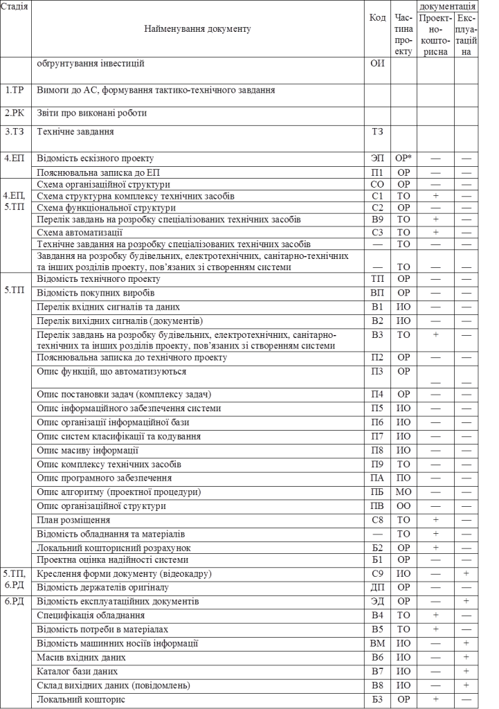
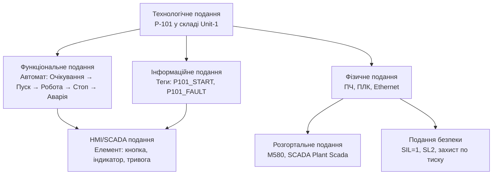

# 2. Особливості комплектування проектної документації для (КІСК)

## 2.1. Розроблення документації згідно вітчизняних практик

### Прийнята стадійність в українському інжинірингу  

В Україні здебільшого послуговувалися і послуговуються стандартом ГОСТ 34.601-90 "Інформаційна технологія. Комплекс стандартів на автоматизовані системи. Автоматизовані системи. Стадії створення", який останні кілька десятків років періодично відміняються. На момент написання він діє на території України, а також часто використовується при проектуванні систем керування. Він зв'язаний з іншими стандартами ГОТС групи 34, тому безпосередньо впливає і на комплектність документації.

Згідно стандарту ГОСТ 34.601-90 процес створення АС представляє собою сукупність впорядкованих в часі взаємозалежних, об’єднаних в стадії, етапи робіт, виконання яких необхідно і достатньо для створення АС, яка відповідає заданим вимогам. Стадії та етапи створення автоматизованих систем виділяються як частини процесу створення для раціонального планування та організації робіт, які закінчуються заданим результатом. 

Склад та правила виконання робіт на стадіях та етапах визначають у відповідній документації організацій, які приймають участь в створенні конкретних видів автоматизованих систем. В роботах по створенню автоматизованих систем можуть приймати участь наступні організації: організація замовник; організація розробник; організація постачальник; організація ген-проектувальник об’єкта автоматизації; організації проектувальники різних частин об’єкта автоматизації; будівельні, монтажні та налагоджувальні організації. 

Згідно цього ж стандарту в загальному випадку створення автоматизованих систем складається з наступних стадій:

1. Формування вимог до АС;

2. Розробка концепції АС;

3. Технічне завдання;

4. Ескізний проект;

5. Технічний проект;

6. Робоча документація;

7. Введення в дію;

8. Супроводження. 

Перші три стадії відносяться до передпроектних робіт, стадії 4-6 а також частково 7 - до проектних робіт. Кожна стадія складається з етапів. Стадії та етапи, які виконуються організаціями-учасниками робіт по створенню АС, встановлюються в договорах і технічному завданні на основі даного стандарту. Допускається виключати стадію "Ескізний проект" та окремі етапи робіт на всіх стадіях, об’єднувати стадії "Технічний проект" та "Робоча документація" в єдину стадію "Техно-робочий проект". В залежності від специфіки виконуваних АС та умов їх створення допускається виконувати окремі етапи робіт до завершення попередніх стадій, паралельне в часі виконання етапів робіт, включення нових етапів робіт. 

Нижче розглянемо етапи робіт на кожній стадії створення АС, згідно стандарту ГОСТ 34.601-90.

Ця стадія **Формування вимог** складається з наступних етапів:

1. Дослідження об’єкту та обумовлення необхідності створення АС.

2. Формування вимог до АС.

3. Оформлення звіту про виконану роботу та заявки на розробку АС (тактико-технічного завдання).

При дослідженні об’єкту проводять збір даних про об’єкт автоматизації, оцінку якості функціонування об’єкту, виявлення проблем, вирішення яких можливе засобами автоматизації. В кінці дослідження роблять техніко-економічну оцінку цілесообразності створення АС. При позитивному результаті проводять підготовку вихідних даних для формування вимог АС: характеристику об’єкта автоматизації, опис вимог до системи, обмеження допустимих затрат на розробку, введення в дію та експлуатацію, очікуваний ефект, умови створення і функціонування системи. Виконанні роботи висвітлюються в звіті. В кінці стадії формують заявку на розробку АС (тактико-технічне завдання).

На стадії **розробки концепції** виконується такі етапи робіт:

1. Вивчення об’єкту.

2. Проведення науково-дослідних робіт.

3. Розробка варіантів концепції АС, яке задовольняє вимогам користувача.

4. Оформлення звіту про виконану роботу. 

На даних етапах організація розробник проводить детальне вивчення об’єкту автоматизації та необхідні науково-дослідні роботи (НДР), які пов’язані з пошуком шляхів та оцінкою можливості реалізації вимог. Після цього проводиться розробка альтернативних варіантів концепції створюваної АС та планів їх реалізації, оцінку необхідних ресурсів для їх реалізації та забезпечення функціонування, оцінку переваг та недоліків кожного варіанту, визначення порядку оцінки якості та умов прийомки системи, оцінку очікуваних ефектів. Всі роботи зводяться в звіті про виконану роботу.

На стадії **технічне завдання** проводиться розробка, оформлення, узгодження та затвердження технічного завдання на АС в цілому та при необхідності на його окремі частини.

На стадії ескізний проект визначаються: функції АС; функції підсистем, їх цілі та ефекти; склад комплексів задач та окремих задач; концепція інформаційної бази, її укрупнена структура; функції системи керування базою даних; склад обчислювальної системи; функції та параметри основних програмних засобів. Після цього проводять розробку документації в обсязі, необхідному для опису повної сукупності прийнятих проектних рішень та достатньому для подальшого виконання робіт по створенню АС. Види документів розробляються згідно ГОСТ 34.201-89.  

Згідно прийнятих проектних рішень розробляють документацію в обсязі, яка достатня для виконання   

Стадія **технічний проект** складається з таких етапів:

1. Розробка проектних рішень по системі та її частинам.

2. Розробка документації на АС та її частини;

3. Розробка та оформлення документації на поставку виробів для комплектування АС та технічних вимог (технічних завдань) на їх розробку.

4. Розробка завдань на проектування в суміжних частинах проекту об’єкта автоматизації.

На першому етапі даної стадії проводять розробку загальних рішень по системі та її частинам, функціонально-алгоритмічній структурі системи, по функціям персоналу та організаційній структурі, по структурі технічних засобів, по алгоритмам рішення задач та використовуваним мовам, по організації та веденню інформаційної бази, системі класифікації та кодування інформації, по програмному забезпеченню. Результати висвітлюють в документації згідно ГОСТ 34.201-89. 

На 3-му етапі проводять підготовку та оформлення документації на поставку вимог для комплектування АС, визначення технічних вимог та складання ТЗ на розробку виробів, які не виготовлюються серійно.

На 4-му етапі проводять розробку завдань на проектування в суміжних частинах проекту об’єкта автоматизації для проведення будівельних, електротехнічних, санітарно-технічних та інших підготовчих робіт, пов’язаних зі створенням АС.

Стадія **робоча документація** складається з двох етапів:

1) Розробка робочої документації на систему та її частини.

2) Розробка або адаптація програмного забезпечення.

На першому етапі проводять оформлення робочої документації згідно ГОСТ 34.201-89, узгодження та затвердження. Робоча документація повинна вміщувати всі необхідні та достатні відомості для забезпечення виконання робіт по введенню АС в дію та її експлуатації, а також для підтримки рівня експлуатаційних характеристик (якості) системи у відповідності з прийнятими проектними рішеннями. 

На другому етапі проводять розробку програм та програмних засобів системи, вибір, адаптацію та (або) прив’язку програмних засобів що придбаються, розробку програмної документації згідно ГОСТ 19.101.

Стадію **введення в дію** виконують у 8 етапів:

1. Підготовка об’єкта автоматизації до вводу АС в дію;

2. Підготовка персоналу.

3. Комплектація АС виробами що поставляються.

4. Будівельно-монтажні роботи.

5. Пусконалагоджувальні роботи.

6. Проведення попередніх випробувань.

7. Проведення досвідної експлуатації.

8) Проведення приймальних випробувань. 

На першому етапі проводять роботи по організаційній підготовки об’єкта автоматизації до вводу АС в дію, в тому числі:

- реалізацію проектних рішень по організаційній структурі АС;

- забезпечення підрозділів об’єкта керування інструктивно-методичними матеріалами;

- впровадження класифікаторів інформації.

На другому етапі після підготовки персоналу проводять також перевірку його здатності забезпечити функціонування АС.

На 3-му етапі забезпечують отримання комплектуючих засобів серійного та одиничного виробництва, матеріалів та монтажних виробів (програмними та технічними засобами, програмно-технічними комплексами, інформаційними виробами), проводять вхідний контроль їх якості. 

На етапі будівельно-монтажних робіт проводять:

-  виконання робіт по будівництву спеціалізованих будівель (приміщень) для розміщення технічних засобів та персоналу АС;

-  створення кабельних каналі;

-  виконання робіт по монтажу технічних засобів та ліній зв’язку;

-  випробування змонтованих технічних засобів;

-  здачу технічних засобів для проведення пусконалагоджувальних робіт;

На етапі пусконалагоджувальних робіт проводять:

- автономну наладку технічних та програмних засобів;

- завантаження інформації в базу даних та перевірку системи її введення;

- комплексну наладку всіх засобів системи.

На етапі проведення попередніх випробувань проводять:

- випробування АС на працездатність та відповідність технічному завданню у відповідності з програмою та методикою попередніх випробувань;

- усунення несправностей та внесення змін в документацію на АС, в тому числі експлуатаційну у відповідності з протоколом випробувань;

- оформлення акту про прийомку АС в досвідну експлуатацію.

На етапі проведення досвідної експлуатації проводять:

- досвідну експлуатацію АС;

- аналіз результатів досвідної експлуатації АС;

- доробку (при необхідності) технічних засобів АС;

- оформлення акту про завершення досвідної експлуатації.

На етапі проведення приймальних випробувань проводять:

- випробування на відповідність технічному завданню у відповідності з програмою та методикою приймальних випробувань;

- аналіз результатів випробувань АС та усунення недоліків, виявлених при випробуваннях;

- оформлення акту про прийомку АС в постійну експлуатацію.

Стадія **супроводження** проходить в два етапи:

1. Виконання робіт у відповідності з гарантійними обов’язками.

2. Післягарантійне обслуговування.

На першому етапі проводяться роботи по усуненню недоліків, виявлених при експлуатації АС протягом встановлених гарантійних термінів, внесенню необхідних змін в документацію по АС.

На другому етапі проводять роботи по:

-  аналізу функціонування системи;

-  виявленню відхилень фактичних експлуатаційних характеристик АС від проектних значень;

-  встановленню причини відхилень;

-  встановленню виявлених недоліків по забезпеченню стабільності експлуатаційних характеристик АС;

-  внесенню необхідних змін в документацію на АС.

Відповідно до ГОСТ 34.601-90 п.2.2. допускається:

- виключати стадію "Ескізний проект";

- виключати окремі етапи робіт на всіх стадіях;

- для невеликих об’єктів об’єднувати стадії "Технічний проект" та "Робоча документація" в одну стадію – "Техно-робочий проект".

Крім того, в залежності від специфіки створюваних АС та умов їх створення допускається:

- виконувати окремі етапи робіт до завершення попередніх стадій;

- паралельне в часі виконання етапів робіт;

- включення нових етапів робіт.

У загальному наведений вище порядок виконання стадій характерний для так званої "водоспадної моделі" організації життєвого циклу системи, однак можуть бути і інші моделі.

### Розробка документації на стадіях 

На стадіях життєвого циклу автоматизованої системи, зокрема при її створенні, розробляється ряд документів, які зводяться в певний вид документації. Правила створення документації регламентується стандартом ГОСТ 34.201-89 "Інформаційна технологія. Комплекс стандартів на  автоматизовані системи. Види, комплектність і позначення документів при  створенні автоматизованих систем". Згідно даного стандарту документація на автоматизовану систему – комплекс взаємопов’язаних документів, в якому повністю описані всі рішення по створенню та функціонуванню системи, а також документів, які підтверджують відповідність системи вимогам технічного завдання та готовність її до експлуатації (функціонування). 

Проектно-кошторисна документація на АС – частина документації на АС, яка розробляється для виконання будівельних та монтажних робіт, які пов’язані зі створенням АС. 

Робоча документація на АС – частина документації на АС, яка необхідна для виготовлення, будівництва, монтажу та наладки автоматизованої системи в цілому, а також програмно-технічних, програмно-методичних комплексів та компонентів технічного, програмного та інформаційного забезпечення, що входять в систему. 

Створення АС об’єкта керування проводиться по документам таких видів забезпечення:

-  технічне забезпечення (ТО);

-  інформаційне забезпечення (ИО);

-  організаційне забезпечення (ОО);

-  математичне забезпечення (МО);

-  програмне забезпечення (ПО);

-  алгоритмічне забезпечення (АО);

Технічне забезпечення АС (ТО) – сукупність технічних засобів системи та експлуатаційної документації, здатних забезпечити функціонування системи в повному обсязі.

Інформаційне забезпечення АС (ИО) – набір документів та даних, які вміщують:

-  перелік і характеристики змінних, які відображають фактичний стан об’єкта керування та автоматизованої системи;

-  опис правил класифікації та кодування інформації та її груп;

-  опис масивів вхідної та вихідної інформації;

-  форми документів, відеокадрів, які використовуються в системі.

Математичне забезпечення (МО) – сукупність методів, моделей та алгоритмів, які використовуються в системі. МО реалізується у вигляді програм спеціального ПО.

Програмне забезпечення АС (ПО) – сукупність програм та експлуатаційної програмної документації, необхідних для реалізації АС при використанні технічного забезпечення системи. Загальне програмне забезпечення – частина програмного забезпечення, яка:

-  поставляється в комплексі з засобами обчислювальної техніки;

-  придбається на ринку програмних продуктів.

Спеціальне програмне забезпечення – частина програмного забезпечення, яка розробляється спеціально при створенні даної системи для реалізації основних та додаткових функцій АС. Це програмне забезпечення створюється на базі загального ПО.

Організаційне забезпечення (ОО) – опис структур АС, інструкції оперативному персоналу, на основі яких персонал повинен функціонувати в складі автоматизованого технологічного комплексу.

Перелік найменувань документів, що розробляються та їх комплектність на систему та її частини повинен бути визначений в технічному завданні на створення автоматизованої системи (підсистеми). Комплектність проектно-кошторисної документації визначають згідно з правилами, які встановлені системою проектної документації для будівництва (СПДС). На кожний комплект повинна бути складена відомість документів. Комплектність документації, яка забезпечує виготовлення, прийомку та монтаж технічних засобів визначається стандартами інших груп, зокрема ГОСТ 2.102, експлуатаційної документації на ці засоби – ГОСТ 2.601. Комплектність документації на програмні засоби обчислювальної техніки визначається ГОСТ 19.101. Усі наведені стандарти не діють в Україні.

Види документів по стадіям створення АС, відповідно до типу забезпечення зведені в таб.2.1. 

Таблиця.2.1 Види документів, що створюються по стадіям створення

*ОР – загальносистемні рішення

Для невеликих систем використовують одностадійне проектування, коли стадія ескізний проект виключається, а стадія технічний проект та робоча документація об’єднуються в одну стадію – техноробочий проект. Згідно такого підходу, техноробочий проект включає частину яка затверджується (замість технічного проекту) і безпосередньо робочий проект. 

## 2.2. Розроблення документації за міжнародною практикою

### Узагальнений підхід до життєвого циклу систем за міжнародною практикою

Поряд із традиційною для українського інжинірингу стадійною моделлю, яка сформувалась на основі ГОСТ 34.601-90, у міжнародній практиці використовуються більш гнучкі й багаторівневі підходи до організації життєвого циклу систем. Тут структура життєвого циклу системи визначається не тільки через стадії, а через взаємопов’язані процеси, ролі, результати та механізми керування. Найбільш визнаним джерелом узагальнених підходів у цій сфері є **SEBoK** — "Systems Engineering Body of Knowledge".

SEBoK не є стандартом у формальному сенсі, а виконує роль систематизованого довідника з системної інженерії. Він базується на положеннях стандарту ISO/IEC/IEEE 15288, але при цьому не замінює його. На відміну від стандарту, який визначає набір обов’язкових і рекомендованих процесів, SEBoK подає контекст, приклади, взаємозв’язки та практики їх реалізації в різних галузях. Таким чином, ISO/IEC/IEEE 15288 означує, що має бути зроблено, а SEBoK пояснює, як це зазвичай робиться, які ролі залучені, які типові помилки, які інструменти і артефакти використовуються.

У SEBoK життєвий цикл системи подається через набір процесів, поділених на технічні, керівні, договірні та підтримуючі, з особливою увагою до логіки розвитку системи, узгодженості між зацікавленими сторонами та простежуваності вимог. SEBoK — це довідкове джерело, яке систематизує знання, концепції, процеси та кращі практики в галузі системної інженерії. Воно розроблене і підтримується міжнародною професійною спільнотою INCOSE (International Council on Systems Engineering) у співпраці з IEEE, ISO та іншими організаціями.

У межах SEBoK життєвий цикл системи розглядається як послідовність взаємопов’язаних процесів, які охоплюють:

- виявлення потреб зацікавлених сторін;
- концептуальне опрацювання рішення;
- розробку архітектури;
- реалізацію системи;
- її інтеграцію, верифікацію, підтвердження (validation);
- експлуатацію, технічне обслуговування та виведення з експлуатації.

На відміну від жорстко фіксованих стадій, які закінчуються створенням конкретного документа, у SEBoK акцент зроблено на логіку розвитку системи через життєвий цикл, а також на рольовий та функціональний поділ відповідальності.

Також SEBoK підтримує різні моделі реалізації життєвого циклу — каскадну (waterfall), ітеративну, спіральну, гнучку (agile), модель V та інші. Це дозволяє адаптувати підхід до складності проєкту, ступеня невизначеності, галузевих вимог або регуляторного контексту.

У підході, викладеному в SEBoK, основою системної інженерії є процеси життєвого циклу системи (life cycle processes), які поділяються на категорії відповідно до ISO/IEC/IEEE 15288. Ці процеси утворюють основу для планування, координації, керування та документального оформлення всіх робіт на всіх етапах створення й експлуатації системи. До основних груп процесів у SEBoK відносяться:

1. Технічні процеси (Technical processes). Зосереджені на створенні самої системи: від вимог до верифікації. Включають:
   - Визначення потреб і вимог зацікавлених сторін
   - Розробку системних вимог
   - Проєктування архітектури (логічної, фізичної)
   - Аналіз альтернатив, моделювання, оцінку
   - Реалізацію компонентів системи
   - Інтеграцію та перевірку (verification)
   - Підтвердження (validation)
   - Підготовку до експлуатації та супровід
2. Процеси життєвого циклу підприємства (Enterprise and agreement processes). Забезпечують взаємодію із зовнішніми сторонами (замовниками, підрядниками) та визначають організаційну рамку проєкту:
   - Процес укладання угоди
   - Процес постачання
   - керування договірними зобов’язаннями
3. Керівні процеси (Technical management processes). Охоплюють організацію та координацію всієї діяльності упродовж проєкту:
   - керування вимогами
   - керування ризиками
   - керування конфігурацією
   - Планування, оцінювання, контроль
   - керування інформацією та документацією
   - керування якістю
   - Прийняття рішень
4. Підтримуючі процеси (Supporting processes). Супроводжують основні технічні дії:
   - Вимірювання та аналіз
   - Верифікація моделей
   - Аудит якості
   - Технічна підтримка користувачів

Кожен процес у SEBoK має вихідні продукти (outputs), які за своєю суттю близькі до документів або специфікацій у ГОСТ 34. Наприклад:

- Результатом процесу визначення вимог є специфікація системних вимог (System Requirements Specification, SRS);
- Проєктування архітектури дає опис архітектури (Architecture Description, AD) відповідно до ISO/IEC/IEEE 42010;
- Процеси верифікації і підтвердження породжують протоколи тестування, звіт про відповідність тощо.

Важливо, що в SEBoK наголос робиться не на формі документа, а на змісті, простежуваності та логічній узгодженості між результатами різних процесів.

### Документи, пов’язані з архітектурою системи

Архітектура системи в системній інженерії — це не лише технічна схема, а набір взаємопов’язаних рішень про структуру, функціонування, обмін інформацією та обмеження. Для забезпечення прозорості та простежуваності ці рішення мають бути формалізовані у відповідних документах. Нижче наведено основні документи, які безпосередньо стосуються архітектури комп’ютерно-інтегрованої системи керування.

1. Опис архітектури системи (Architecture Description). Основний документ, який об’єднує всі подання системи: функціональне, фізичне, інформаційне, організаційне. Побудований згідно з ISO/IEC/IEEE 42010. Може містити:
    – загальний контекст системи;
    – опис зацікавлених сторін і їхніх інтересів;
    – перелік архітектурних подань;
    – використані точки зору (viewpoints) і відповідні шаблони.
2. Функціональна модель системи (Functional Model). Визначає основні функції, їхні зв’язки, послідовність виконання. Може реалізовуватись у вигляді:
    – діаграм IDEF0, SysML Activity, Functional Flow Block Diagram;
    – описів у форматі таблиць або текстових сценаріїв.
3. Фізична структура системи (Physical Architecture). Відображає склад комплексу технічних засобів: ПЛК, контролери, сенсори, виконавчі пристрої, мережеве обладнання. Складається з:
    – структурної схеми технічних засобів;
    – специфікації інтерфейсів і протоколів;
    – опису каналів обміну, резервування.
4. Інформаційна архітектура (Information Architecture). Описує потоки даних, типи повідомлень, формати, структуру тегів, правила доступу до даних. Типові елементи:
    – модель тегів SCADA і ПЛК;
    – таблиці змінних з типами, джерелами, частотою оновлення;
    – відповідність між OPC UA моделлю, базою даних, інтерфейсами.
5. Технологічна або процесна модель (Process Architecture). Охоплює опис об’єкта керування, його динаміки, сценаріїв функціонування. Зазвичай включає:
    – структуру виробничого об’єкта згідно з ISA-88 (Units, Modules);
    – послідовність переходів;
    – варіанти рецептур, сценарії запуску.
6. Карта розгортання (Deployment Description). Означує, як програмні компоненти системи (SCADA, OPC-сервери, бази даних, сервіси тощо) розгортаються на фізичних пристроях або віртуальних середовищах. Структурні елементи:
    – перелік вузлів розміщення (сервери, панелі, шлюзи);
    – асоційовані компоненти;
    – вимоги до ресурсів і взаємодій.
7. Документ пріоритетів і обмежень (Architectural Constraints and Drivers). Фіксує зовнішні фактори, що впливають на архітектурні рішення:
    – обмеження за часом, вартістю, безпекою, сумісністю;
    – наявність усталених стандартів або вимог замовника.
8. Матриця трасування архітектурних рішень (Traceability Matrix). Допомагає пов’язати вимоги користувача з відповідними архітектурними компонентами, забезпечити контроль реалізації кожної вимоги в проєкті. Структура:
    – код вимоги → архітектурне рішення → реалізуючий компонент → тест.

Ці документи можуть бути оформлені як окремі файли, як частини загального технічного проєкту, або інтегровані в інженерну документацію (наприклад, у SCADA/PLC IDE або PLM-систему).

### Порівняння ГОСТ34 та SEBoK 

У сучасному проєктуванні КІСК доцільно розглядати ГОСТ 34 як формальний каркас для оформлення документації, а SEBoK — як методологічну основу для побудови системи, зокрема архітектури, керування змінами, оцінювання ризиків і перевірки виконання вимог.

Таблиця.2.2 Порівняння ГОСТ34 та практик SEBoK 

| Ознака                   | ГОСТ 34.601-90 (СРСР/Україна)                                | SEBoK (INCOSE/міжнародний підхід)                            |
| ------------------------ | ------------------------------------------------------------ | ------------------------------------------------------------ |
| Походження               | Стандарт для створення автоматизованих систем (АС)           | Довідник із системної інженерії, заснований на ISO 15288     |
| Мета                     | Регламентація проєктування та впровадження АС на підприємстві | Узагальнення знань, процесів і практик системної інженерії   |
| Структура                | Поетапна: Технічне завдання → Ескізний проєкт → Технічний проєкт → Робоча документація → Впровадження | Моделі життєвого циклу: каскадна, спіральна, ітеративна; процесний підхід |
| Орієнтація               | На виконання стадій, оформлення звітних документів           | На функціональні процеси, простежуваність вимог і рішень     |
| Основні артефакти        | Технічне завдання, Технічний проєкт, ЕП, РП, Акт приймання   | Вимоги, архітектурний опис, трасування, валідація, ризики    |
| Вимоги до архітектури    | Включаються до ТП або структурно-технологічної частини       | Архітектура — окремий процес з описом подань і точок зору (ISO 42010) |
| Підхід до змін           | Встановлена процедура супроводу і модифікації АС             | керування конфігурацією, версіями, ризиками протягом усього життєвого циклу |
| Підхід до безпеки        | Переважно не регламентовано, окремі ТЗ можуть містити вимоги | Інтеграція вимог функціональної (IEC 61508) та кібербезпеки (IEC 62443) |
| Документальне оформлення | Шаблони і вимоги до складу документів строго визначені       | Документи як артефакти процесів; форма не регламентується, важливий зміст |
| Використання сьогодні    | Застосовується в Україні в держпроєктах, часто формально     | Широко застосовується у світі в індустрії, обороні, транспорті, ІТ |

У таблиці 2.3 наведена карта відповідності між документами ГОСТ 34.601-90 та процесами/артефактами SEBoK, адаптована для проєктування комп’ютерно-інтегрованих систем керування (КІСК). Ця таблиця допоможе побачити, як класичні етапи української практики співвідносяться з сучасними міжнародними процесами.

Таблиця.2.3. Карта відповідності ГОСТ 34 ↔ SEBoK

| Документ ГОСТ 34                             | Відповідний процес у SEBoK                          | Типовий артефакт у SEBoK                                     |
| -------------------------------------------- | --------------------------------------------------- | ------------------------------------------------------------ |
| Технічне завдання (ТЗ)                       | Визначення потреб зацікавлених сторін, аналіз місії | Специфікація потреб (Stakeholder Needs), діаграми використання (Use Case Model) |
| Ескізний проєкт (ЕП)                         | Аналіз варіантів архітектури, формування концепції  | Концептуальна архітектура, опис варіантів, обґрунтування рішень (Design Rationale) |
| Технічний проєкт (ТП)                        | Проєктування архітектури системи                    | Опис архітектури (Architecture Description), функціональна модель, фізична структура |
| Робоча документація (РД)                     | Реалізація компонентів, керування конфігурацією     | Специфікації компонентів, таблиці сигналів, документи розгортання, інструкції |
| Робоча програма і методика випробувань (РПМ) | Верифікація, підтвердження (validation)             | Протоколи тестування (Test Cases), план V&V, звіти про відповідність |
| Впровадження, введення в експлуатацію        | Підготовка системи до роботи, технічна підтримка    | План розгортання (Deployment Plan), операційні процедури, документація користувача |
| Акт приймання                                | Прийняття системи за результатами оцінки            | Звіт про валідацію (Validation Report), акт відповідності вимогам |
| Документація супроводу                       | Технічне обслуговування, керування життєвим циклом  | План супроводу (Support Plan), керівництво з експлуатації, журнал змін (Change Log) |
| Програма та методика модифікації             | керування змінами                                   | Запис зміни (Change Request), рішення CCB, оновлені версії артефактів |
| Відомість складових частин                   | Конфігураційний реєстр                              | Перелік конфігураційних одиниць (Configuration Item List), структура продукту (PBS) |

У процесному підході, який описується в SEBoK, кожен процес має означені вихідні результати (outputs) — це артефакти, продукти діяльності або документи, які можуть бути представлені в різних формах. На відміну від ГОСТ 34, де форма документів чітко регламентована (наприклад, "Технічний проєкт", "Ескізний проєкт"), у SEBoK головний акцент робиться на змістовому наповненні, логіці створення і простежуваності між результатами.

Зокрема:

- Документ опис архітектури системи (Architecture Description), означений у стандарті ISO/IEC/IEEE 42010 і підтримуваний SEBoK, не є прямим аналогом "Технічного проєкту" в розумінні ГОСТ 34. Натомість, він може входити до складу Технічного проєкту або існувати окремо, як частина архітектурного пакету, особливо якщо архітектура містить кілька подань (логічне, фізичне, інформаційне тощо).
- Аналогічно, результати процесу "Requirement Definition" можуть бути представлені як специфікація вимог (System Requirements Specification), що в ГОСТ 34 зазвичай інтегрується у ТЗ або ТП, але в міжнародній практиці є самостійним живим документом.
- Процеси на кшталт "Design Definition" чи "System Analysis" не мають фіксованої форми звітності у SEBoK, але їх результатами можуть бути: діаграми, обґрунтування вибору, таблиці трасування — які частково відповідають розділам ТП, ЕП або обґрунтувальної записки.

Таким чином, при застосуванні підходу SEBoK у середовищі, де використовується ГОСТ 34, варто пам’ятати що один формалізований документ ГОСТ може включати кілька процесних результатів SEBoK, і навпаки — один вихід SEBoK може розділятися між кількома етапами ГОСТ.

### Архітектурний опис комп’ютерно-інтегрованої системи керування

Один із поширених підходів до опису архітектури складних систем — це модель 4+1 подань, запропонована французьким інженером Філіппом Крушеном (Philippe Kruchten) у 1995 році. Згідно з цим підходом, архітектура системи розглядається з п’яти точок зору:

1. логічна (logical view) — структура програмних об’єктів і класів;
2. процесна або технологічна (process view) — паралелізм, взаємодії, синхронізація;
3. фізична (physical view або deployment) — розміщення компонентів на апаратурі;
4. розробницька (development view) — структура реалізації, модулів;
5. плюс сценарії використання (use cases) — які поєднують усі подання.

У контексті комп’ютерно-інтегрованих систем керування цю модель адаптують, замінюючи деякі подання на такі, що ближчі до інженерної практики: наприклад, логічна структура часто ототожнюється з функціональною архітектурою, процесна (технологічна) — з технологічною структурою об’єкта керування, а розробницька — з інформаційною або конфігураційною структурою SCADA/PLC-систем. Подання Use Case замінюється або доповнюється організаційно-рольовою моделлю (взаємодія користувачів із системою), що характерно для систем із HMI.

1. **Логічна структура (функціональна архітектура)** описує основні функції системи, їх взаємодію, розподіл за рівнями (наприклад, керування, візуалізація, збору даних). Включає:
   - моделі потоків керування;
   - функціональні блоки та їх інтерфейси;
   - діаграми типу IDEF0, SysML Activity, Function Block Diagram.
2. **Фізична структура (технічна архітектура)**. Опис комплексу технічних засобів (ПЛК, панелі оператора, сервери SCADA, мережі, АЦП, виконавчі механізми). Включає:
   - топології мереж (Ethernet, PROFIBUS, Modbus);
   - схеми підключення;
   - список пристроїв з параметрами;
   - плани розміщення.
3. **Інформаційна структура (інформаційна архітектура)**. Описує, які дані циркулюють у системі, між якими компонентами, у якому вигляді. Включає:
   - моделі даних (ERD, OPC UA Nodeset, ISA-95 B2MML);
   - таблиці тегів SCADA/PLC;
   - опис обміну між ПЛК, SCADA, базою даних, MES.
4. **Технологічна структура (технологічна/виробнича модель)**. Модель об’єкта керування — затирання, ферментація, дозування, транспортування. Включає:
   - структуру обладнання за ISA-88 (Unit, Equipment Module, Control Module);
   - карти сигналів, сценарії переходів, рецептури;
   - опис динаміки об’єкта (ODE, FSM).
5. **Організаційне/рольове подання (розширення до "4+1")**. Описує ролі користувачів, відповідальність, взаємодії з системою:
   - матриця RACI або ролі в термінах ISA-101 (оператор, інженер, супервізор);
   - сценарії використання (Use Cases);
   - політика доступу.
6. **Інсталяційне/розгортальне подання (Deployment View)**. Як програмні компоненти розгорнуті на фізичному обладнанні:
   - SCADA-сервер, резервування, OPC шлюзи;
   - архітектура віртуалізації або хмарних сервісів.

## 2.3. Можлива комплектність документів для КІСК

Наразі немає обов'язкових вимог, які регламентуються державою щодо розроблення та оформлення проектної документації для всіх типів об'єктів. Тому комплектність документів означується між замовником та виконавцем. Враховуючи специфіку саме КІСК, розроблення яких передбачають інтеграцію систем в різних площинах, рекомендується вживати наступні практики та стандарти:

- стандарт ISO/IEC 15288 "Інженерія систем і програмного забезпечення. Процеси життєвого циклу систем" як загальна парасолька над процесами проектування та SEBoK 
- стандарти групи ГОСТ 34 як основу (парасолька) для деяких документів проектування 
- стандарти групи ISA-88 та їх аналоги IEC для порційних виробництв, та всіх інших також
- стандарт ISA-106 для неперервних виробництв
- стандарти групи ISA-95 та їх аналоги IEC для інтеграції систем керування L3 та L4
- стандарти ISO 22400 для виробничих KPI
- стандарт ISA-101 для розроблення систем SCADA/HMI
- стандарт ISA-18.2 та їх аналоги IEC для розроблення систем тривожної сигналізації
- стандарти IEC 61508 для функціональної безпеки для електронних, електротехнічних і програмованих систем.
- стандарти IEC 62443 з кібербезпеки для промислових систем автоматизації та керування (IACS).

Відповідно до міжнародної практики архітектурного опису систем (ISO/IEC/IEEE 42010), рекомендується структурувати документацію проєкту ПКІСК за поданнями (views), кожне з яких відповідає окремому аспекту системи. Такий підхід дозволяє поєднати гнучкість процесного моделювання (SEBoK) із формалізованою звітністю (ГОСТ 34).

1. **Організаційне подання.** Мета: означити структуру організації, ролі, функції, відповідальність, сценарії використання.

- Організаційна структура персоналу (опис та схема), наприклад у вигляді Use Case, RACI, ISA-95 Role Model.
- Опис ролей користувачів SCADA/HMI та рівнів доступу (ISA-101, 62443).
- Карта зацікавлених сторін (stakeholder map).

2. **Функціональне (логічне) подання.** Мета: опис основних функцій системи, їх взаємодії та сценаріїв.

- Сценарії роботи обладнання: режими, стани, перехідні алгоритми (ISA-88, ISA-106).
- Автомати станів, карти переходів (можуть бути представлені у вигляді FSM, графів, таблиць).
- Функціональні блоки керування (структуровані за рівнями керування).
- Перелік тривог і сценаріїв їх обробки (ISA-18.2).
- Перелік виробничих KPI (ISO 22400) з описом їх джерел і метрик.

3. **Фізичне (технічне) подання.** Мета: опис апаратної реалізації системи, її мережевої та монтажної структури.

- Структурна схема комплексу технічних засобів (С1 відповідно до ГОСТ 34).
- Схема підключення та з’єднання мереж (LAN, Fieldbus).
- План розміщення обладнання з урахуванням зон безпеки (IEC 61508, 62443).
- Перелік пристроїв та інтерфейсів (з адресацією, протоколами, версіями ПЗ).

4. **Інформаційне подання.** Мета: опис логіки даних, обміну, тегів, структур, інтерфейсів.

- Перелік вхідних та вихідних сигналів (I/O list).
- Таблиця змінних (tags): ім’я, тип, одиниці, джерело, частота опитування.
- Інформаційна модель системи: B2MML, OPC UA Nodeset, ERD тощо.
- Схеми логіки обміну між підсистемами (наприклад, SCADA—MES, SCADA—ERP)

5. **Процесне (технологічне) подання**. Мета: відобразити структуру об’єкта керування, динаміку та його функціональну роль.

- Ієрархія обладнання за ISA-88: Units, Equipment Modules, Control Modules.
- Віднесення функцій до фізичних компонентів
- Рецептури, карти команд, сценарії пуску/зупину (особливо для порційних систем).
- Перелік процедур та функціональних кроків (ISA-106).

6. **Інсталяційне (розгортальне) подання**. Мета: показати, де і як розгорнуто програмне забезпечення системи.

- Карта розгортання SCADA, OPC, баз даних, архіваторів, WEB-серверів тощо.
- Взаємозв’язок між логічними модулями й фізичними пристроями.
- Вимоги до хостінгу, резервування, оновлення, ліцензій.

7. **Архітектурна рамка та обґрунтування**. Мета: забезпечити простежуваність між вимогами, рішеннями та обмеженнями.

- Опис архітектурної рамки (architecture rationale).
- Карта обмежень та пріоритетів (наприклад: реальний час, відмовостійкість, вартість).
- Трасування вимог до рішень (traceability matrix: вимога → функція → реалізація → перевірка).

8. **HMI/SCADA подання**. Мета: опис інтерфейсів оператора, дисплеїв, логіки взаємодії.

- Перелік дисплеїв, їх призначення, навігація (ISA-101).
- Ієрархія дисплеїв (overview → unit → faceplate).
- Відображення тривог і статусів (ISA-18.2).
- Ролі користувачів, розподіл функцій, обмеження.

9. **Подання безпеки**. Мета: обґрунтування заходів функціональної та кібербезпеки.

- Методика SIL/SL-аналізу (IEC 61508, 62443).
- Матриця рівнів безпеки для підсистем.
- Зонування та маршрутизація (zones & conduits).
- План дій у випадку інциденту.

10. **Базові супровідні документи (обов’язкові для реалізації)**

- Технічне завдання (за шаблоном ГОСТ 34.602 або узгодженим форматом).
- План випробувань, програма і методика (ПМВ).
- План введення в експлуатацію.
- План конфігураційного керування.
- Протоколи перевірки, акти узгодження, звіти V&V.

Ця структура дозволяє формувати як повний проєктний досьє, так і скорочені комплекти (наприклад, у пілотних впровадженнях), не втрачаючи цілісності архітектурного представлення системи.

Усі архітектурні подання — функціональне, технологічне, фізичне, інформаційне тощо — описують одну й ту саму систему, але з різних точок зору. Кожне подання має власну мету, орієнтоване на конкретні запити зацікавлених сторін (інженера з автоматизації, технолога, оператора, IT-фахівця) та акцентує увагу на відповідному аспекті поведінки або структури системи, тобто:

- подання не дублюють одне одного, а доповнюють і деталізують загальну архітектуру;
- ті самі об'єкти або функції можуть фігурувати у кількох поданнях — із різною метою та рівнем деталізації;
- узгодженість між поданнями забезпечується трасуванням (traceability) — наприклад, від функції до її реалізації, сигналу, інтерфейсу або тесту.

Такий підхід дозволяє:

- уникати суперечностей між інженерними рішеннями;
- спростити обговорення архітектури з різними фахівцями;
- формувати зрозумілу, підтримувану та масштабовану документацію.

Один і той самий об’єкт — насосна установка P-101 — може бути представлений у різних поданнях.

Таблиця.2.4. Приклад подання насосної установки P-101.

| Подання       | Що описується                       | Приклад інформації                                           |
| ------------- | ----------------------------------- | ------------------------------------------------------------ |
| Технологічне  | Місце насоса в структурі обладнання | P-101 належить до технологічної ділянки "Подавання сировини", входить до Unit-1 |
| Функціональне | Поведінка, режими, стани            | Автомат: "Очікування → Пуск → Робота → Стоп → Аварія"        |
| Фізичне       | Обладнання та з'єднання             | Насос P-101 керується частотником, підключений через Ethernet до ПЛК |
| Інформаційне  | Сигнали, дані, адресація            | Теги: `P101_START`, `P101_FAULT`, `P101_SPEED` (Modbus TCP, адреси 40001–40003) |
| HMI/SCADA     | Інтерфейс оператора                 | Графічний елемент: кнопка «Пуск», індикатор стану, повідомлення тривог |
| Безпекове     | Критичність, захист                 | Захищений у SL2-сегменті, має дублюючий контроль тиску, SIL=1 |
| Розгортальне  | Програмна реалізація                | Блок керування P-101 виконаний у ПЛК Siemens S7-1200, відображається на SCADA Wonderware |

рис.2.1. Приклад зав'язків подання

Таблиця.2.5. Пояснення до рис.2.1

| Зв’язок між поданнями                        | Пояснення                                                    |
| -------------------------------------------- | ------------------------------------------------------------ |
| Технологічне подання → Функціональне подання | Функціональна поведінка об'єкта (стани, режими, переходи) визначається його роллю в технологічному процесі |
| Технологічне подання → Фізичне подання       | Фізична структура обладнання відповідає процесній структурі об’єкта |
| Технологічне подання → Інформаційне подання  | Потоки даних та сигнали формуються відповідно до ролі об’єкта в технологічному процесі |
| Функціональне подання → Подання HMI/SCADA    | Інтерфейс оператора реалізує відображення функціональних станів та можливість керування |
| Інформаційне подання → Подання HMI/SCADA     | Дані, визначені в інформаційній структурі, використовуються для візуалізації й взаємодії |
| Фізичне подання → Розгортальне подання       | Логіка програмного розміщення та інсталяції залежить від фізичної конфігурації пристроїв |
| Фізичне подання → Подання безпеки            | Безпекові вимоги (функціональна і кібербезпека) визначаються на основі фізичних характеристик і розташування пристроїв |

## 2.4. Керування конфігурацією комп’ютерно-інтегрованої системи керування

Керування конфігурацією (Configuration Management, СМ) — це сукупність процесів, що забезпечують і підтримують цілісність та простежуваність технічних рішень системи протягом її життєвого циклу. Відповідно до ISO/IEC 15288, процес керування конфігурацією включає визначення конфігураційних одиниць, контроль змін, облік стану конфігурації та аудит.

Основні функції процесу керування конфігурацією:

- Ідентифікація конфігурації: означення конфігураційних одиниць (наприклад, АС, підсистем, компонентів ПЗ, специфікацій, моделей), призначення унікальних ідентифікаторів та визначення їх версій.
- Контроль змін: упорядкування внесення змін до конфігураційних одиниць через процедуру ініціювання, аналізу, схвалення та реалізації змін. Для цього формується комісія з контролю змін (CCB — Change Control Board).
- Облік стану конфігурації: документування і відстеження поточного стану всіх конфігураційних одиниць, включаючи історію змін, дати, відповідальних осіб та затвердження.
- Аудит конфігурації: періодична перевірка відповідності фактичного стану системи означеним конфігураціям, включаючи повноту, точність, відсутність несанкціонованих змін.

У контексті комп’ютерно-інтегрованої системи керування, керування конфігурацією повинно охоплювати:

- програмно-технічні засоби (ПЛК, сервери, мережі, HMI тощо);
- програмне забезпечення (прошивки, SCADA-проєкти, бази даних);
- документацію (ТЗ, ТП, ТЕО, креслення, інструкції);
- інтеграційні рішення (інтерфейси, протоколи, OPC-опис, конфігурації мережі).

Для керування конфігурації варто вживати наступні арактичні заходи:

- впровадження системи керування версіями (наприклад, Git або аналогів для SCADA-проєктів);
- ведення реєстру конфігураційних одиниць;
- оформлення реєстру змін із фіксацією схвалення;
- організація регулярних аудитів на етапах розроблення, впровадження і супроводу;
- забезпечення відтворюваності збірок системи на основі контрольованих версій.

Керування конфігурацією особливо важливе у разі залучення кількох підрядників, поетапного впровадження системи або зміни вимог на пізніх етапах. Про інструменти керування конфігурації буде описано в наступних лекціях.

## 2.5. Підхід V&V у проєктуванні КІСК

У процесі створення комп’ютерно-інтегрованих систем керування важливо забезпечити, щоб система була не лише правильно реалізована, а й відповідала потребам користувачів. Це досягається через два взаємопов’язані процеси — перевірку (Verification) та підтвердження (Validation), які в міжнародній практиці позначаються як V&V і означені в контексті V-моделі керування життєвим циклом.

- Перевірка (Verification) — це відповідь на запитання: *“Чи правильно ми реалізували систему згідно з технічними вимогами?”*

- Підтвердження (Validation) — це відповідь на запитання: *“Чи реалізована система вирішує задачі, для яких її створювали?”*

Ці процеси не є взаємозамінними: система може пройти всі тести перевірки, але не вирішувати реальну задачу користувача — і навпаки.

Таблиця 2.6. Порівняльна таблиця Verification vs Validation

| Ознака              | Verification                                                 | Validation                                                   |
| ------------------- | ------------------------------------------------------------ | ------------------------------------------------------------ |
| Що перевіряється    | Відповідність специфікаціям, вимогам, кресленням, стандартам | Відповідність потребам і очікуванням замовника               |
| Основне питання     | Чи правильно ми побудували систему?                          | Чи побудували ми правильну систему?                          |
| Коли застосовується | На всіх етапах життєвого циклу, зокрема при розробці і інтеграції | Зазвичай ближче до завершення або в процесі дослідної експлуатації |
| Методи              | Інспекція, аналіз, моделювання, тести, симуляція             | Тестування в умовах, наближених до реальних, опитування, дослідження задоволеності |
| Приклади            | Тест логіки ПЛК, перевірка HMI за шаблоном, контроль структури OPC-моделі | Пробний пуск, демонстрація оператору, тестування з участю користувача |
| Результат           | Підтверджено технічну правильність реалізації                | Підтверджено практичну придатність для задач виробництва     |

Ось умовне представлення V-моделі життєвого циклу КІСК з прикладами для кожного етапу, що відповідає практиці системної інженерії (зокрема ISO/IEC 15288) у поєднанні з процесами verification та validation. Наступна V-модель демонструє відповідність між етапами розробки (ліва гілка «V») та етапами перевірки/підтвердження (права гілка «V»).

Таблиця.2.7. З'єднання етапів ЖЦ по горизонталі V 

| Етап життєвого циклу (ліва гілка)                           | Відповідний етап V&V (права гілка) | Приклад реалізації в КІСК                            |
| ----------------------------------------------------------- | ---------------------------------- | ---------------------------------------------------- |
| Формування потреб і завдань користувача                     | Підтвердження цілей (validation)   | Опитування технологів, опис сценаріїв використання   |
| Визначення системних вимог                                  | Системне тестування (validation)   | Випробування системи на реальному об’єкті            |
| Архітектурне проектування (розподіл на АС, ПЛК, SCADA тощо) | Інтеграційне тестування            | Тестування зв’язків між SCADA, ПЛК і БД              |
| Деталізований дизайн підсистем                              | Верифікація інтерфейсів та логіки  | Тестові стенди з емуляцією пристроїв                 |
| Реалізація ПЗ (SCADA, ПЛК, OPC)                             | Модульне тестування (verification) | Тестування логіки окремого модуля ПЛК або екрану HMI |

## 2.6. Безпека у КІСК: функціональна та кібербезпека

У сучасних комп’ютерно-інтегрованих системах керування вимоги до безпеки мають подвійний характер — вони охоплюють як функціональну безпеку (тобто надійність виконання технічних функцій у разі збоїв або помилок), так і кібербезпеку (захист від зловмисних впливів, у т.ч. з мережі). Ці два аспекти охоплюються різними, але взаємопов’язаними стандартами:

- IEC 61508 — загальний базовий стандарт функціональної безпеки для електронних, електротехнічних і програмованих систем.
- IEC 62443 — серія стандартів з кібербезпеки для промислових систем автоматизації та керування (IACS).

Функціональна безпека забезпечує відсутність неприйнятних ризиків, пов’язаних із відмовами системи або її компонентів. У контексті КІСК це стосується:

- аварійного зупину;
- резервованих датчиків і виконавчих механізмів;
- надійності контролю критичних параметрів;
- виконання захисних функцій у визначений час (time-critical functions).

У IEC 61508 використовується поняття SIL (Safety Integrity Level) — рівня надійності захисної функції. Типові для КІСК приклади:

- SIL1: контроль температури не критичний, але має бути зафіксований.
- SIL2–SIL3: контроль тиску в резервуарі з ризиком вибуху.

Кібербезпека зосереджена на запобіганні зловмисному доступу, втручанню або саботажу. Стандарти серії IEC 62443 розглядають:

- моделі загроз і ризиків (threat modeling);
- зонування та сегментацію систем (zones and conduits);
- автентифікацію користувачів та ролей;
- безпечне конфігурування та оновлення ПЗ;
- виявлення вторгнень (IDS), реєстрацію подій.

IEC 62443 поділяє вимоги за рівнями безпеки (SL1–SL4), аналогічно SIL у функціональній безпеці. Наприклад:

- SL1: базовий захист (паролі, обмеження доступу).
- SL3: захист від спрямованих атак (APT, внутрішній зловмисник)

Практичне впровадження в КІСК

- Виявлення критичних функцій і призначення їм SIL/SL-рівнів.
- Визначення зон: наприклад, ПЛК-сегмент, SCADA-сегмент, бізнес-мережа.
- Захист каналів OPC UA, MQTT, Modbus TCP відповідно до рівня.
- Використання брандмауерів, VLAN, VPN, ізоляція критичних елементів.
- Перевірка й тестування сценаріїв відмов, вторгнень, обривів мережі.
- Документування політик доступу, процедур оновлення ПЗ і журналів.

У проєктуванні КІСК ці аспекти варто враховувати не лише на етапі реалізації, а вже на стадії архітектурного проєктування. Застосування відповідних стандартів забезпечує не лише відповідність нормативам, але й знижує ризики аварій, втрат продукції або репутаційних збитків.

Для забезпечення вимог IEC 61508 та IEC 62443 в структуру документації проєкту КІСК доцільно включати такі додаткові документи:

1. Оцінка функціонального ризику (Functional Safety Assessment). Опис можливих відмов, наслідків, заходів захисту; визначення рівнів SIL для кожної функції.
2. Реєстр функцій безпеки (Safety Functions Register). Таблиця з описом кожної критичної функції, вхідними/вихідними сигналами, часом реакції, рівнем SIL, відповідальними.
3. Карта безпечної архітектури. Схематичне зображення елементів, які беруть участь у забезпеченні функціональної безпеки (наприклад, відокремлені ПЛК, подвійні датчики, безпечні виходи).
4. Стратегія зонування (Zone and Conduit Diagram). Виділення зон (наприклад, польове обладнання, SCADA-зона, корпоративна мережа), опис каналів обміну між ними, призначення рівнів безпеки (SL).
5. Матриця доступу / ролей (Access Control Matrix). Хто має доступ до яких частин системи, з якими правами, через які інтерфейси (оператор, інженер, адміністратор, віддалений сервіс).
6. Політика оновлення ПЗ та патчів. Процедура тестування, затвердження та впровадження оновлень, особливо для систем з високим SIL/SL-рівнем.
7. Журнал змін критичних налаштувань. Фіксація усіх змін у налаштуваннях параметрів безпеки, з датами, підписами, обґрунтуванням.
8. Реєстр подій безпеки (Security Event Log Template). Шаблон або інструмент для ведення реєстру кіберінцидентів, втручань, спроб входу, відмов шифрування тощо.
9. Акт підтвердження рівня безпеки (SIL/SL Compliance Statement). Висновок про відповідність системи вимогам заданого рівня SIL або SL — за результатами тестів і огляду документації.

Ці документи можуть бути частиною загального технічного проєкту або винесені в окремий пакет “Документація з безпеки”. Їх склад і глибина залежать від критичності об’єкта, вимог замовника та галузі (харчова, фармацевтична, енергетика, хімія тощо).

## 2.7. Цифровий двійник як елемент підтримки проектування та керування конфігурацією

У сучасній практиці системної інженерії **цифровий двійник (Digital Twin)** розглядається не як окрема технологія, а як динамічна віртуальна репрезентація системи, яка дозволяє:

- підтримувати актуальність конфігурації в реальному часі;
- моделювати поведінку системи на різних етапах її життєвого циклу;
- аналізувати варіанти змін або модернізацій ще до їх фізичної реалізації;
- забезпечити простежуваність між початковими проектними рішеннями та фактичним станом.

У контексті проектування цифровий двійник дозволяє:

- використовувати архітектурний опис системи (ISO 42010) як вхідну модель;
- на основі моделі будувати сценарії поведінки (стандарти типу SysML, Modelica, ODE/FSM);
- порівнювати варіанти проектних рішень у середовищах симуляції;
- верифікувати логіку взаємодії компонентів до початку монтажу та налагодження.

У контексті керування конфігурацією цифровий двійник може відігравати роль еталонної моделі актуальної конфігурації системи:

- відображає стан компонентів (склад, версії, параметри);
- дозволяє фіксувати контрольні версії конфігурації;
- забезпечує трасування змін і узгодженість між апаратною, програмною та логічною частинами;
- може бути прив’язаний до конфігураційного реєстру (наприклад, через OPC UA, PLM або власні структури).

Таблиця.2.8. Структура цифрового двійника в КІСК

| Компонент                                         | Відповідне подання     | Призначення                                     |
| ------------------------------------------------- | ---------------------- | ----------------------------------------------- |
| Архітектурна модель (структура, зв’язки)          | Процесне, фізичне      | Відображення системи як об’єкта управління      |
| Поведінкова модель (стани, режими, переходи)      | Функціональне          | Симуляція сценаріїв роботи                      |
| Модель даних (теги, параметри, об’єкти)           | Інформаційне           | Інтеграція з фактичними даними в реальному часі |
| Інтерфейс користувача (віртуальне HMI, аналітика) | HMI-подання            | Перевірка зручності й повноти інтерфейсу        |
| Журнал змін конфігурації                          | Конфігураційне подання | Відстеження історії модифікацій і станів        |

## Запитання для самоперевірки

1. Які основні стадії створення АС згідно з ГОСТ 34.601-90?
2. Які організації можуть бути учасниками створення АС?
3. Які етапи включає стадія "Формування вимог"?
4. Що є результатом стадії "Розробка концепції АС"?
5. У чому полягає призначення етапу "Технічне завдання"?
6. Який зміст стадії "Ескізний проєкт"?
7. Які етапи виконуються на стадії "Технічний проєкт"?
8. Що включає розроблення робочої документації?
9. Які етапи охоплює стадія "Введення в дію"?
10. У чому полягає зміст етапів супроводження системи?
11. Яка основна відмінність між ISO/IEC/IEEE 15288 та SEBoK?
12. Які чотири групи процесів описані в SEBoK?
13. Які типи архітектурних подань використовуються для КІСК згідно з ISO/IEC/IEEE 42010?
14. Наведи приклади документів, які відносяться до фізичного подання архітектури КІСК.
15. Які основні функції процесу керування конфігурацією?
16. У чому відмінність між верифікацією та валідацією в контексті КІСК?
17. Наведи приклад перевірки та приклад підтвердження в КІСК.
18. Що таке SIL і SL та до яких видів безпеки вони відносяться?
19. Які документи слід формувати для забезпечення функціональної і кібербезпеки?
20. Як цифровий двійник може використовуватись для підтримки керування конфігурацією
