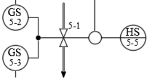
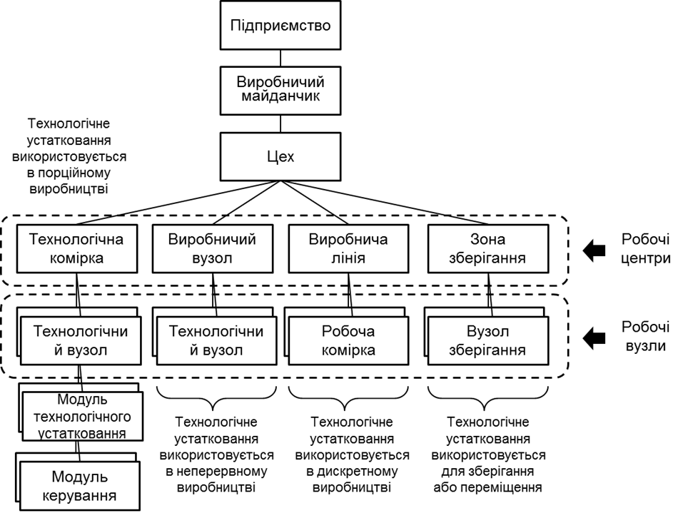

# 3. Розроблення рольової моделі обладнання

## 3.1. Поняття устатковання

Сучасні системи керування технологічними процесами як і керування виробничими операціями базуються на представленні ресурсів та інших сутностей як об'єктів. Це прослідковується як в стандартах інтегрування (ISA-88, ISA-106, ISA-95) так і в стандартах та протоколах комунікацій (наприклад OPC UA). Для всіх рівнів керування характерна наявність одного типу ресурсів - **устатковання (обладнання)**. Тому сучасні системи керування АСКТП повинне передбачати спосіб керування що оперує устаткованням, та зв'язаних з ним поняттями.

Виділення устатковання, як окрема сутність при проектуванні, налагодженні та експлуатації дає ряд переваг, зокрема:

- спрощення моделювання та аналізу поведінки обладнання, оскільки кожна одиниця устатковання може бути представлена як автономний об’єкт із власним життєвим циклом, параметрами та станами;
- підвищення гнучкості при впровадженні змін, бо окремі об’єкти можуть модифікуватися або замінюватися без порушення загальної структури системи;
- уніфікація підходів до інтеграції, оскільки стандартизовані інтерфейси взаємодії між об’єктами дозволяють легше застосовувати шаблони та бібліотеки (наприклад, згідно з ISA-88, ISA-106, ISA-95);
- полегшення налагодження та тестування, адже кожну одиницю обладнання можна тестувати незалежно від інших компонент системи;
- розширення можливостей автоматизованої генерації конфігурацій для PLC, SCADA та MES на основі уніфікованої інформаційної моделі;
- сприяння цифровій трансформації – окрема сутність обладнання дозволяє реалізовувати цифрові двійники, відстежувати ефективність та стан устатковання в реальному часі.   

Відповідно до стандартів ISA-88 (IEC-61512), ISA-106, ISA-95 (IEC-62264), при проектуванні та розробці програмного забезпечення кожен об'єкт автоматизації розглядається як окрема сутність. З точки зору керування виділяється ієрархія устатковання, де кожен об'єкт має свою роль. Окрім устатковання, виділяються також інші ресурси, такі як матеріали та персонал. 

На рівні АСКТП згідно стандарту ISA-88 (IEC-61512) усі об'єкти розділяються окремо на «технології» (як виробити продукт) і «устатковання» (на чому виробити продукт). Автоматизація «побудови технології» стосується тільки виробництв зі змінною рецептурою (для цього власне і створений стандарт ISA-88). На відміну від технологічної частини, автоматизація устатковання стосується усіх типів виробництв, навіть якщо використовуються виключно неперервні процеси з однаковою технологією. Отже, окрім набору функцій та відповідних їм змінних в програмі контролера чи SCADA/HMI, повинна бути передбачена наявність окремих сутностей (об’єктів) - устатковання, яке включає в себе інші об’єкти (дрібніші частини устатковання) та функції. Функції устатковання надалі будемо називати **функціональними елементами**. Взаємодія інших елементів системи керування з устаткованням проводиться через його змінні стану та команди.  

Навіщо на рівні АСКТП виділяти устатковання як окремі сутності, а не використовувати традиційні підходи на базі функціональних контурів? Перш за все слід розуміти, що у результаті виділення устатковання як окремих об’єктів, функції та навіть контури нікуди не діваються, вони стають частиною цього устатковання. По суті, устатковання агрегують функції та їх зв’язки  у більш загальні сутності, які сприймаються як єдине ціле. Розглянемо для прикладу, як представлений в системі автоматизації 2-х позиційний клапан або заслінка:

- орган керування (безпосередньо клапан або заслінка);
- виконавчий механізм з одним керуючим пневматичним сигналом «ВІДКРИТИ»;
- два датчика кінцевого положення «ВІДКРИТИЙ», «ЗАКРИТИЙ».

На схемі автоматизації для кожної з частин буде по одному зображенню (див. Рис.3.1), який як правило відповідає одному засобу автоматизації. Є функції для клапану, які часто не показуються на схемі автоматизації, але повинні бути передбачені в алгоритмі, наприклад:  

- базові функції контролю та керування;
- функції взаємодії з HMI, такі як переключення режимів руч/авт, та ручне керування;
- функції тривожної сигналізації.                    



Рис. 3.1 Зображення клапан на схемі автоматизації 

У програмах контролера та SCADA/HMI будуть відповідні змінні/теги та/або функції. Але з точки зору експлуатації клапан сприймається не як сукупність функцій, а в поняттях його станів, наприклад: функціонального («відкритий», «закритий»), режиму («у ручному режимі», «в автоматичному»), тривоги («не відкрився»). Ці поняття характерні для клапана в цілому, а не для його частин чи функцій. Тому на дисплеях HMI засоби автоматизації можуть показуватися як згруповані разом елементи, анімація передбачатиме використання всіх тегів, які мають відношення для клапану. 

Аналогічним чином відносяться до нього інженери, що не мають відношення до автоматизації. Вони оперують поняттями станів, а не функцій чи засобів вимірювання та керування. Тому при проектуванні чи експлуатації їх не цікавить спрацювання датчиків кінцевого положення, та зрештою їх може взагалі і не бути, або бути присутнім тільки один з них.

З точки зору проектування, клапан, як і інше обладнання з'являються ще на етапах проектування технології, як "залізо" яке виконує певну роль в технологічному процесі. У сучасних засобах автоматизованого проектування, також розглядають сукупність засобів як єдину сутність. Якщо ж говорити про виробництво в цілому, то оперують цілими установками або відділеннями, які є технологічним комплексом. 

Описане вище відношення до клапану виробничників є очевидним. Тим не менше, класичний контурний підхід при розробці ПЗ для АСКТП йде врозріз цьому підходу. Усі ці функції представлені переліком змінних (тегів), які аналізуються/змінюються в окремих частинах програми. Так, наприклад, функція керування клапаном відбувається в контурі алгоритму керування процесом, а функція сигналізації – в контурах сигналізації і блокування. Таке розкидування по коду може стати дуже громіздким і робить код погано читабельним. Наведемо кілька завдань, які передбачають крос-функціональну взаємодію:

- блокування клапану при відмові одного з датчиків;
- блокування клапану, якщо він не відкрився;
- тимчасова можливість функціонування без одного з датчиків.

Для наведеного вище прикладу використання в програмному забезпеченні об’єктів типу «клапан» дає можливість інкапсулювати усю логіку виконання функцій, що стосуються його, в одну сутність. У цьому випадку взаємодія інших, зовнішніх по відношенню до нього об’єктів, буде проходити через взаємодію з ним, а не оперувати набором тегів чи функцій, які мають відношення до клапану. При проектуванні така устатковоно-центрованість  значно спрощує спілкування між інженерами з різних дисциплін та дозволяє усунути помилки.      

Стандарти ISA-88/IEC 61512 та ISA-106 дають певні правила виділення та оперування такими об’єктами-устаткованнями, хоч не обмежує в цьому. Ці стандарти мають певне протиріччя, надалі в тексті буде використовуватися термінологія з ISA-88/IEC 61512, зокрема:

- устатковання (equipment) існує як виділена в системі керування сутність зі своїми наборами атрибутів;
- устатковання має певну роль, від якої залежить, які типи функцій воно виконує; 
- устатковання формує ієрархію, розміщення в якій також впливає на керування.   

Отже, окрім набору функцій та відповідних їм технологічних змінних (тегів) при проектуванні, та при розробленні ПЗ (в програмі контролера чи SCADA/HMI), передбачається наявність окремих сутностей (об’єктів) - **устатковання (equipment**), яке включає в себе інші об’єкти (дрібніші частини устатковання) та функції. Надалі під словом «устатковання» будуть розумітися спеціалізовані об’єкти в системі керування, які відображають стан їх фізичних сутностей. Функції устатковання надалі будемо називати **функціональними елементами**.

## 3.2. Стани та режими устатковання 

### Поняття станів (States)

**Стан** (**state**) – це загальна властивість, яка вказує на плинне становище якогось об’єкта. Оскільки устатковання включає в себе певні функціональні елементи, то зрештою його стан залежить від станів цих елементів та попереднього стану устатковання. Відповідно до принципів [емерджентності](https://uk.wikipedia.org/wiki/Емерджентність), стан системи не є простою сукупністю станів її елементів. Тим не менше, наразі для простоти, будемо вважати, що це так. 

Отже, стан устатковання може оцінюватися з позицій його функціональних елементів, наприклад з точки зору виконуваної операції, наявності тривог, обслуговування (ремонту) чи джерела керування. Тому під «узагальненою сукупністю» розуміється поєднання усіх станів функціональних елементів як єдиного цілого. У залежності від стану устатковання можуть змінюватися як сигнали керування, так і виконувані алгоритми. 

Таким чином, контроль за устаткованням відбувається через відповідні **змінні стану**, які повинні бути в програмі контролеру, SCADA/HMI, IIoT шлюзі чи іншого інтелектуального засобу. Для дискретних станів функцій це бітові статуси, які приймають значення TRUE/FALSE, або їх комбінація. 

```
бітові статуси = дискретні стани або їх комбінація
```

Сукупність цих станів функціональних об’єктів є об’єднання (конкатенація) цих статусів. У цьому випадку всі стани функціональних об’єктів можна об’єднати в певний упорядкований набір бітів для всього устатковання – **слово стану (status word**). 

```
слово стану = набір бітових статусів функцій елементів устатковання
```

Використовуючи слово стану інша частина системи може аналізувати устатковання як єдине ціле через бітове представлення. Це дає змогу контролювати як конкретний статус функціонального елементу, звертаючись до нього як до біту, так і як бітову матрицю, використовуючи маску. 

Наприклад, для клапану слово стану може мати вигляд як в таблиці 3.1. Біти стану можуть взаємно виключати один одного, наприклад біти «ВІДКРИТИЙ» і «ЗАКРИТИЙ», а рівність обидвох бітів 0 – представляти інший стан, наприклад проміжний. Наприклад, якщо біти 5–8 дорівнюють нулю – це вказує на стан «НЕ ВИЗНАЧЕНИЙ». 

Таблиця 3.1. Приклад слова стану для 2-х позиційного клапану 

| **Біт**   | **Опис**                                           |
| --------- | -------------------------------------------------- |
| 0 ALMOPN  | =1  тривога НЕ ВІДКРИВСЯ                           |
| 1 ALMCLS  | =1  тривога НЕ ЗАКРИВСЯ                            |
| 2 BLCK    | =1 БЛОКОВАНИЙ                                      |
| 3 ALMSHFT | =1 тривога ДОВІЛЬНИЙ ЗСУВ                          |
| 4 ALMSNSR | =1 тривога ПОМИЛКА ДАТЧИКА                         |
| 5 OPNING  | =1 ВІДКРИВАЄТЬСЯ                                   |
| 6 CLSING  | =1 ЗАКРИВАЄТЬСЯ                                    |
| 7 OPNED   | =1 ВІДКРИТИЙ                                       |
| 8 CLSED   | =1 ЗАКРИТИЙ                                        |
| 9 DISP    | =1 РУЧНИЙ  режим (з ПК/ОП), =0  АВТОМАТИЧНИЙ режим |
| 10 MANBX  | =1 МІСЦЕВИЙ  режим                                 |
| 11 ALM    | =1 загальна тривога                                |
| 13 FRC    | =1 хоча би одна зі змінних в  об’єкті форсована    |
| 14 SML    | =1 режим імітації                                  |

Стани стосується не тільки устатковання але і процедур в процедурному керуванні. 

### Автомати станів (State Machines) 

При написанні програми для реалізації об’єкта-устатковання необхідно реалізувати зміну його стану в залежності від станів функціональних елементів та інших об’єктів, що включені в нього. Ці стани необхідно змінювати в залежності від умов. Таку поведінку станів можна описати словесним алгоритмом, на кшталт: 

```
якщо клапан в стані «ЗАКРИТИЙ» і прийшла команда «ВІДКРИТИ», 
 перейти в стан «ВІДКРИВАЄТЬСЯ»
```

Для функції тривожної сигналізації це може виглядати так:

```
якщо клапан в стані «ВІДКРИВАЄТЬСЯ» і не спрацював датчик кінцевого 
 положення і час відкриття більше максимального, то перейти в стан «НЕ ВІДКРИВСЯ»
```

Слід зауважити, що у даному прикладі в алгоритмі керування станами тривожної сигналізації використовуються стани операційної функції. Тобто стани різних функціональних елементів устатковання взаємопов’язані. Це одна з причин, чому функції варто групувати в устатковання. 

Алгоритм, що описує для конкретної функції поведінку переходу між станами називають **автоматом станів(state machine)**. Більш зручним описом автомату станів є графічний – **діаграма станів**. Вершинами її є стани, а ребрами переходи між станами та відповідні умови. 

Автомати станів - це класичний механізм формалізації та моделювання, який використовується у багатьох галузях, у тому числі в автоматизації. Наприклад, на Рис. 3.2 показана діаграма класичного автомату станів для тривог, що описаний в стандарті ISA-18.2 (IEC 62682) з певними спрощеннями. Стани тривоги представлені на рисунку колами з підписами, в яких наводиться опис, що включає комбінацію статусів: статусу тривоги та статусу підтвердження. У даному випадку, стан тривоги – це узагальнюючий показник, який залежить від плинного значення статусів та від попереднього стану. Стрілки на Рис. 3.2 відповідають переходам між станами з вказаними умовами цих переходів.

 

Рис. 3.2. Спрощений автомат станів тривог 

Розглянемо діаграму станів для операційної функції клапану. У найпростішому випадку клапан має два стани – «ВІДКРИТИЙ» та «ЗАКРИТИЙ». У залежності від наявності датчиків кінцевого положення, клапан може описуватися автоматами станів, що показані на Рис.3.3 Рисками на стрілах показані умови спрацювання переходів. На перший погляд, кожен з цих варіантів є самодостатнім. Однак кожен з них має ряд вад.  

 

Рис. 3.3. Приклади найпростіших варіантів автомату станів для клапану

У варіанті з двома кінцевиками при виникненні несправності одного з них, жоден з них не буде дорівнювати одиниці, або спрацюють обидва. Це автоматом не передбачено. Аналогічна ситуація може відбуватися і з другим варіантом, коли датчик кінцевого положення буде несправним. Третій варіант взагалі немає контролю стану, тому в цьому випадку для алгоритмів керування можливо треба врахувати час переміщення, для уникнення, наприклад, гідроударів. Будь-який з цих варіантів не передбачає формування тривог на базі станів, так як автомату станів тривог ні на що орієнтуватися. 

Очевидно в наведених вище станах з датчиками кінцевого положення необхідно передбачити в якості умов переходу команди керування. Під останніми розуміється команди на об’єкт-устатковання, а не на його апаратну частину (тобто виконавчий механізм). Також, для спрощення побудови автомату станів тривожної сигналізації варто ввести додаткові перехідні стани «ВІДКРИВАЄТЬСЯ» та «ЗАКРИВАЄТЬСЯ». Крім того, варто ввести стан «НЕ ВИЗНАЧЕНО», якщо конкретну позицію неможливо ідентифікувати. З цього стану можна починати при ініціалізації програми керування, або переходити туди при несправності датчиків положення (обидва в одиниці). У такому випадку діаграма станів операційного функціонального елементу матиме вигляд як на Рис. 3.4.

 

Рис. 3.4. Приклад розширеного автомату станів для операційного функціонального елементу клапану 

Вище наведений приклад визначення та керування станами але нічого не сказано про дії на реальний об'єкт. У кожному з наведених станів можна робити певні керуючі дії. Наприклад в стані «ВІДКРИВАЄТЬСЯ» вмикати дискретний вихід контролера, що керує клапаном. Крім того, можна вмикати таймер, який буде вказувати на час активності стану, що можна буде використати для керування тривогами. Механізм формування дії на базі станів спрощує керування, так як в певному стані для об'єкта керування нас цікавить значення не усіх датчиків а тільки частини, актуальної для даного стану.   

Використовуючи діаграму операційного функціонального елементу клапану можна описувати алгоритм керування, який в свою чергу може спиратися на інші автомати станів. Інші функціональні елементи цього ж клапану можуть використовувати цей автомат для формування логіки своїх автоматів. Для прикладу розглянемо автомати станів для одного з функціональних елементів тривожної сигналізації «НЕ ЗАКРИВСЯ». Для спрощення ми будемо розглядати тільки статус активності тривоги, тобто без урахування статусу підтвердження і блокування (див. Рис. 3.5). Дві риски підряд на лінії переходу значать спрацювання обидвох умов щоб перехід відбувся. Як видно з діаграми тривога виникає тоді, коли клапан знаходиться в операційному стані «ЗАКРИВАЄТЬСЯ» і час цього стану більше максимально дозволеного.

 

Рис. 3.5. Діаграма спрощеного автомату станів для тривоги «НЕ ЗАКРИВСЯ» 

Як видно, автомати станів функціональних елементів тривожної сигналізації тісно пов’язані з операційними. Тому в ряді випадків автомати станів різних функціональних елементів показують зв’язаними на одній діаграмі. Однак слід розуміти, що якщо два автомати станів з Рис. 3.5 та з Рис.3.4 поєднати в одну діаграму, то в один момент часу будуть активні два стани, наприклад «ЗАКРИВАЄТЬСЯ» та «НЕ ЗАКРИВСЯ», що з графічного зображення може бути неочевидним. Тим не менше, в ряді випадків кілька автоматів станів можна звести в один, як це показують наприклад для перетворювача частоти. У будь-якому випадку програмна реалізація може базуватися на станах операційного функціонування, в яких будуть реалізовані керування станами інших функціональних елементів. 

Для прикладу з клапаном, устатковання можна описувати кількома взаємозалежними автоматами станів:

- операційний;
- 4 автомати для тривог («НЕ ВІДКРИВСЯ», «НЕ ЗАКРИВСЯ», «ДОВІЛЬНИЙ ЗСУВ», «ПОМИЛКА ДАТЧИКА»);
- блокування;
- режимів роботи;
- імітування.

### Режими (Modes) 

Згідно стандарту ISA-88 **режим** вказує на те, у який спосіб відбувається керування операційними функціями. Зрештою, «режими» це окремо виділені стани, які впливають на особливість виконання (алгоритмів) функцій устатковання, а інколи – і на їх автомати станів.

Для устатковання стандарт ISA-88 рекомендує використовувати два режими: РУЧНИЙ та АВТОМАТИЧНИЙ. У РУЧНОМУ режимі, операційний стан устатковання означується командами з HMI, у АВТОМАТИЧНОМУ – з алгоритму керування. На практиці режимів може бути більше. Наприклад, для згаданого вище клапану, на Рис. 3.6. показана діаграма з додатковими режимами «РУЧНИЙ ПО МІСЦЮ» і «ЗАБЛОКОВАНИЙ». У «РУЧНОМУ ПО МІСЦЮ» режимі, клапан керується байпасним щитком, що знаходиться біля клапану. У «ЗАБЛОКОВАНОМУ» режимі на клапан завжди подається команда «ЗАКРИТИ».

 

 Рис. 3.6. Автомат станів переключення режимів устатковання типу клапана

У даному випадку на автомат станів, що наведений на Рис.3.4, будуть подаватися команди керування з різних джерел. Але, у ряді випадків автомати станів деяких функцій можуть змінюватися в залежності від режиму устатковання. Наприклад, діаграма на Рис.3.4 не передбачає контроль команди ВІДКРИТИ та ЗАКРИТИ у режимі «РУЧНИЙ ПО МІСЦЮ», так як ці команди не можуть бути простежені системою. Тому, для цього режиму варто продумати інший автомат.

Вище наведені приклади станів, які є взаємно-виключеними. Наприклад, стани ВІДКРИВАЄТЬСЯ і ЗАКРИВАЄТЬСЯ з Рис. 3.4 ніколи не можуть бути активними одночасно. Для прикладу з 4-ма режимами, все не так однозначно, оскільки наприклад режим РУЧНИЙ (з HMI) і РУЧНИЙ ПО МІСЦЮ (з байпасу) можуть виникнути одночасно. Необхідно чітко розставити пріоритети при керуванню станами в програмі. У цьому випадку, «РУЧНИЙ ПО МІСЦЮ» має пріоритет, оскільки команди з контролеру, нівелюються. 

Зверніть увагу, що при означенні автомату станів, простіше визначаються неоднозначності та протиріччя в технічному завданні. Це ще одна причина необхідності їх формалізації у тому числі з використанням діаграми.

### Умови переходів та команди 

Як зазначалось вище, автомати станів описуються станами та переходами, для яких задаються умови. Умовами переходу можуть бути як команди алгоритму керування (або HMI), так і вияв системою керування зміни стану устатковання, як правило за допомогою датчиків. Наприклад, на Рис. 3.4 перехід з ВІДКРИТО в ЗАКРИВАЄТЬСЯ відбувається по команді ЗАКРИТИ з системи керування, а з ЗАКРИВАЄТЬСЯ у ЗАКРИТО по стану датчика кінцевого положення. Слід звернути увагу, хоч може це і не очевидно, але датчик кінцевого положення, який є елементом клапану, теж є устаткованням, яке має свої стани. Він може мати стан ВІДМОВА, який може впливати на стани (або навіть режими) устатковання вищого рівня, тобто клапану. 

З точки зору устатковання (віртуального представлення фізичної сутності), будь-яка дія, націлена на нього, або перевірка його внутрішнього стану (команда керування, відслідковування стану) може бути умовою переходу в інший стан. Реалізація автомату станів якраз і передбачає переведення устатковання у потрібний стан. 

Керовані умови переходу формуються **командами**. Можна виділити кілька джерел команд: з алгоритму керування, засобів HMI, системи верхнього рівня і т.п. У деяких випадках вони можуть відпрацьовуватися за різними алгоритмами, тоді діаграма станів має це відображати. Команди можуть бути реалізовані як бітові (ВІДКРИТИ, ЗАКРИТИ) або у вигляді числового **слова команди** (**command word**), де конкретна команда задається числом. Враховуючи, що за один раз устаткованню передається одна команда, як правило достатньо одного слова (числової змінної) для передачі всіх можливих команд керування. Обробник команд може не реагувати на ті команди, які недоступні в даному стані або режимі.  

**Важливо!** Слід обережно використовувати автомати станів та передбачати механізми «зависання», коли програма не може вийти із певного стану за причини неможливості спрацювання умови переходу. Це може бути наприклад команда на примусову ініціалізацію автомату. Крім того, **найбільш критичні умови блокування (спрацювання алгоритмів безпеки) краще робити в окремій частині програми з найбільшим пріоритетом (наприклад в кінці задачі ПЛК) і без використання автомату станів. Для функціонально небезпечних об'єктів ці функції повинні виконувати СПАЗ **

### Приклад автомату станів в перетворювачах частоти  

Описаний вище підхід на базі автомату станів використовується для керування перетворювачами частоти (ПЧ) для різноманітних профілів, в тому числі, які стандартизовані в IEC 61800-7 (ProfiDRIVE, CiA 402, SERCOS, CIP Motion). На Рис. 3.7 представлений приклад автомату станів керування перетворювачем частоти ALTIVAR (Schneider Electric) по профілю CiA 402. У кожному стані ПЧ доступні певні функції, керування обертами доступні тільки в стані «Operational enabled». Внутрішня логіка оперується на стани та умови переходу. По мережі передається слово статусу (ETA), яке показує значення стану. По суті воно є комбінацією статусних бітів, але для простоти їх показують в 16-ковому форматі як єдине значення. CMD – це командне слово, яке переводить автомат з одного стану в інший. Ці два слова, разом з заданою і плинною частотою циркулюють по мережі при обміні з контролером, що керує ПЧ. Таким чином, алгоритм керування даним устаткованням повинен спостерігати за його станом і керувати ним, передаючи конкретну команду. Слід зауважити, що на рис.8 не показані усі внутрішні умови переходу між станами, це винесено на внутрішню реалізацію в ПЧ. Також зверніть увагу, що стани операційного функціонального елементу та контролю помилок показані в контексті однієї діаграми.   

Детальніше про керування перетворювачами частоти по мережі Ви можете почитати [за цим посиланням](https://asu-in-ua.github.io/atpv/filedbus/pds/teor1.html). 

 

Рис. 3.7. Автомат станів керування перетворювачем частоти ALTIVAR по профілю CiA 402 

## 3.3. Ієрархія устатковання

### Поняття ієрархії устатковання

При проектуванні систем керування з використанням описаних підходів, необхідно зробити декомпозицію устатковання відповідно до його рольового призначення. Це значить, що все наявне виробниче (і не тільки) устатковання необхідно об’єднати, а інколи розділити в окремі сутності, що будуть виконувати певну роль, описуватися своїм набором автоматів станів. У залежності від типу виробництва (неперервне, порційне, дискретне) принципи виділення устатковання будуть відрізнятися. У будь-якому випадку, на стадії проектування правила декомпозиції устатковання повинні бути означені максимально детально, так як недостатньо продумані правила можуть ускладнити розробку і експлуатацію в майбутньому.

Критерії декомпозиції можуть бути описані з різних точок зору та відповідно застосовуватися до різних задач керування. Як приклад, можна виділити такі загальні правила: 

- об'єкт має єдиний набір операційних станів;
- об'єкт має показники якості функціонування КПЕ (КРІ, ключові показники ефективності);
- об'єкт має свій набір режимів;
- об’єкт має набір станів тривог;
- об’єкт виділяється як технологічна одиниця, що робить певну технологічну операцію або кілька операцій. 

Якщо об’єкт-устатковання у свою чергу складається з набору інших устатковань, то кожен елемент в його складі буде мати свої індивідуальні функціональні стани, режими, тривогові стани, які будуть формувати цей набір для об’єкта вищого рівня. Для прикладу можна розглянути пастеризаційно-охолоджувальну установку (ПОУ), яка складається з пастеризатора, сепаратора та гомогенізатора. З точки зору системи керування АСКТП ці три установки виконують конкретні функції по реалізації технологічного процесу. А з точки зору керування виробничою лінією, вони є одним об’єктом – ПОУ, яка виробляє продукт з певними характеристиками. У той же час, гомогенізатор може бути окремою автоматизованою машиною, яка включає в себе набір устатковання зі своїм набором станів і режимів. 

Ієрархічність будується за принципом підлеглості, тобто описується яким чином об’єкти вищого рівня керують/контролюють об’єкти нижчого рівня. У прикладі з клапаном це виглядає наступним чином – об’єкт клапан має в своєму складі три об’єкта нижчого рівня: датчики кінцевого положення ВІДКРИТО та ЗАКРИТО і соленоїд на відкриття (Рис. 3.8). При розробленні програмного забезпечення, об’єкт-устатковання вищого рівня (наприклад ПОУ) буде взаємодіяти шляхом команд і статусів лише з клапанами, а не з датчиками та соленоїдом. У свою чергу, програміст АСТКП може зосереджуватися на реалізації функцій устатковання, попередньо означивши автомати станів та їх взаємодію на різних рівнях. 

 

Рис. 3.8. Ієрархія устатковання на рівні клапана

Відповідно до такої структури реалізація функцій устатковання найнижчого рівня (наприклад, в контролері) може передбачати безпосередню взаємодію з датчиками та виконавчими механізмами: 

- обробку вхідного/вихідного значення: масштабування, фільтрування, інвертування, тощо;
- наявність режиму ручної зміни значення з датчика (форсування); 
- наявність режиму імітації, тобто коли поведінка об'єкта емулюється програмою;
- обробку тривог (ISA-18.2/IEC 62682): реагування на порогові значення для аналогових величин, врахування затримки на спрацювання та гістерезису, формування системного біту аварії/попередження і т.п;
- конфігурування: налаштування граничних значень та параметрів тривог, тимчасове зняття тривоги з обслуговування, налаштування масштабування, фільтрації, тощо.

Таким чином, рольова ієрархія дає можливість реалізувати взаємодію між устаткованням з використанням автоматів станів, без необхідності врахування особливостей їх внутрішньої організації.

Окрім очевидно зрозумілої взаємодії через команди/статус, ієрархія дає ще ряд, на перший погляд, неочевидних переваг при реалізації в ПЛК. Так, наприклад, для об’єкту-устатковання типу «клапан» це дає можливість забезпечувати наступні можливості:

- враховувати стан об’єкта нижчого рівня (норма/тривога/достовірність) та діагностичну інформацію при керуванні логікою виконання; наприклад, якщо датчик кінцевого положення в стані НЕДОСТОВІРНІСТЬ (відмова модуля входів/виходів), клапан переходить в режим ЗАБЛОКОВАНИЙ;
- проводити імітацію роботи підлеглих датчиків, шляхом оперування їх станами за імітаційним алгоритмом (наприклад для тестування або навчання персоналу);
- керувати станом НЕДОСТОВІРНОСТІ підлеглих датчиків за алгоритмом, наприклад, коли обидва датчика показують спрацювання.  

Враховуючи логіку взаємодії об’єктів в ієрархії, переведення в ручний режим устатковання вищого рівня (наприклад ПОУ), часто передбачає ручний режим усіх підлеглих елементів (наприклад виконавчих механізмів). Тобто, ієрархічність може забезпечувати **поширення режимів** з устатковання вищого рівня на нижчі або навпаки. Аналогічним чином може відбуватися **поширення станів**. Поширення режимів та станів описано нижче.

### Ієрархія устатковання в стандартах

У стандартах IEC-61512 та IEC 62264 все устатковання (Equipment) на підприємстві займає певний рівень в ієрархії в залежності від того, яку роль воно відіграє в ланцюжку виробництва і навіть в бізнес-процесах підприємства. 

В ISA-88/IEC-61512 та ISA-95/IEC-62264 рольова ієрархія устатковання має вигляд як на Рис.3.9, в ISA-106 дещо подібний, але з певними відмінностями в назві. Відповідно до цієї ієрархії кожне устатковання виконує певну роль у процесі виготовлення продукції. При інтегруванні верхніх рівнів з системами АСКТП, керування та контроль відбувається через стани та команди устатковання. Устатковання верхніх рівнів керування (підприємство, виробничий майданчик, цех) розглядаються з точки зору організаційного керування (див. Рис.3.10) і знаходяться в зоні діяльності операцій систем рівня ERP. У даному випадку слово «устатковання» варто розглядати як «потужності». Цеха випускають певний набір продуктів. Виробничі операції проводяться на **робочих центрах** – устаткованнях, які виготовляють напівпродукт. Робочі центри є основним засобом керування виробничими операціями, і керуються (плануються, диспетчеризуються, контролюються) системами MOM (Manufacturing Operation Management). Детальніше про це, можна прочитати в посібнику із серії aCampus «Принципи функціонування систем керування основним виробництвом через призму стандарту IEC-62264». У самих робочих центрах керування діяльністю виконання операцій сильно залежить від типу виробництва. Для порційного виробництва ця діяльність означується стандартом IEC 61512. Тому реалізація устатковання нижніх рівнів, починаючи від робочого центра описана саме в цьому стандарті.  

 

Рис.3.10 Рольова ієрархія устатковання підприємства

Слід наголосити, що в даній моделі устатковання розглядається саме с позиції рольового призначення. Тобто, насос в даній ієрархії розглядається як будь яке обладнання, що виконує функцію перекачування в конкретному місці розташування технологічного процесу. Тобто це те обладнання, яке на апаратурно-технологічній схемі або схемі автоматизації має своє умовне позначення. Якщо конкретний насос при певних обставинах змінюється на устатковання, наприклад іншого виробника, що виконує ту саму роль, то з точки зору даної моделі, це буде той самий насос. Для того щоб враховувати конкретні екземпляри устатковання (зі своїм серійним номером) в ISA-95 (IEC 62264) передбачена інша модель -- **активів** (**Asset**). Тому, наприклад при розробленні цифрових двійників варто виділяти окремо двійники активів, які супроводжують виріб протягом всього життєвого циклу, та двійників устатковання, яке виконує певну роль на виробництв, та в різні моменти часу можуть представлятися певними активами.

Як вже зазначалося стандартні рольові ієрархії дещо відрізняються між собою. У таблиці 3.2 наведена порівняльна таблиця:    

Таблиця 3.2. Найменування обладнання в стандартах ISA-88, ISA-95 та ISA-106

| Рівень (згори) | ISA-106    | ISA-95 (загальне/неперервне)  | ISA-88 (2га редакція) |
| -------------- | ---------- | ----------------------------- | --------------------- |
| 7              | Enterprise | Enterprise                    | Enterprise            |
| 6              | Site       | Site                          | Site                  |
| 5              | Plant      | Area                          | Area                  |
| 4              | Plant Area | Work Center / Production Unit | Process Cell          |
| 3              | Unit       | Work Unit / Unit              | Unit                  |
| 2              | Equipment  | -                             | Equipment Module      |
| 1              | Device     | -                             | Control Module        |

З точки зору ISA-88 та IEC-61512 для рівня АСКТП найвищим рівнем устатковання є технологічна комірка, для неперевного виробництва це виробничий вузол (Production Unit). ***Технологічна комірка*** (Process cell), що описана в стандарті ISA-88 відповідає робочому центру (Work Center) означеному в IEC 62264 та ISA 95. У той час, як робочий центр може бути означений для різних типів виробництв, технологічна комірка означена тільки в термінах порційних процесів (batch process), що характерно для стандарту ISA-88. Технологічна комірка представляє собою логічне угруповання, яке вміщує устатковання, що необхідне для виробництва однієї або декількох партій (напів)продукту. Вона означує діапазон логічного керування одним набором технологічного устатковання в межах цеху. Наявність технологічної комірки дає можливість планувати на основі неї виробництво і розробити стратегію керування усім процесом. Технологічна комірка згідно ISA-88 включає технологічні вузли (units), модулі технологічного устатковання (equipment modules) та модулі керування (control modules), що потрібні для створення однієї або більше партій. Ідея ISA-88 в тому, що для технологічної комірки існує **рецепт** (**recipe**), в якому вказується що саме і з використанням якого саме устатковання буде робитися в межах неї. Цей рецепт означується технологами і включає **процедуру** приготування для партії (напів)продукту (**procedure**) та додаткові параметри. Процедура технологічної комірки у свою чергу ділиться на менші **процедури технологічного вузлу** (**unit procedure**), які можуть ділитися на **етапи** (**phase**) таким чином формуючи так звану "технологічну програму" приготування. 

У ISA-106, **технологічний вузол** (Unit) як і у випадку з ISA-88 носить основне технологічне навантаження, серед критеріїв його виділення вказуються виконання технологічних процесів над продуктом та виконання завдань дещо незалежно відносно іншого суміжного обладнання. Разом з іншими суміжними технологічними вузлами відбувається поступова зміна основних властивостей продукту в потоці відповідно до технології. На відміну від ISA-88, в якому навіть непродуктові робочі центри можна реалізовувати через вузли порційного типу, у ISA-106 є чітке відсилання на використання технологічних вузлів тільки для процесів над продуктом. Якщо це не так, таке устатковання зветься Utility, і у фізичній ієрархії вона займає нижчий рівень, а саме Устатковання (Equipment), яке знаходиться безпосередньо під рівнем заводського цеху (Plant Area). Прикладом Utility є устатковання CIP. 

Пристрій (Device) в ISA-106 включає логіку керування, яка не може бути змінною, однак може параметруватися. Останнє принципово відрізняється від аналогічного рівня Control Module фізичної моделі ISA-88.  Проміжним місцем в ієрархії є Устатковання (Equipment), яке робить кінцеву сукупність технологічних дій і включає в себе інше обладнання або/та Пристрої. Щоб в даній статті розрізняти загальне поняття "устатковання" від конкретно цього рівня, останній надалі буде писатися з великої літери, як і назви інших рівнів. Це Устатковання є першим рівнем з низу, для якого можна використовувати процедури. При цьому усі рівні в даному стандарті можуть бути опущені, за винятком Device (Пристрій), який представляє будь яке обладнання КВПіА (датчики, перетворювачі, виконавчий механізм або інший елемент керування). Принциповим моментом в стандарті є те, що на відміну від ISA-88, об’єкти у фізичній моделі ISA-106 представляють лише фізичні елементи та не включають алгоритми керування, які можуть бути пов’язані з ними, якщо вони не є частиною пристрою. 

Нижні рівні обладнання для дискретного виробництва розглядається в технічному звітів ISA-TR88.00.02 Machine and Unit States: An Implementation Example of ISA-88 (2008), на базі якого розроблено специфікацію PackML. Також така модель устатковання розглядається в документах RAMI4.0. 

Надалі основою для ієрархії обладнання в даному курсі буде розглядатися в основному, прийняті в ISA-88/IEC-61512. 

Наприклад, до обладнання рівня Control Module (ISA-88) або Device (ISA-88) можна віднести наступні:

- виконавчі механізми: електромагнітні клапани, моторизовані засувки, пневмоприводи
- вимірювальні прилади: датчики температури, тиску, рівня, витрати, pH, електропровідності
- силові модулі: пускачі, частотні перетворювачі, реле
- контрольні пристрої: сигналізатори рівня, обмежувачі тиску, термостати
- зчитувальні пристрої: індуктивні, ємнісні, оптичні та інші типи датчиків положення
- пристрої індикації та локального управління: кнопки, тумблери, світлодіоди, дисплеї

До обладнання рівня Equipment Module (ISA-88) або Equipment (ISA-88) можна віднести наступні:

- дозуючий вузол з клапаном, витратоміром і логікою контролю об’єму або маси
- вузол нагріву з температурним датчиком, виконавчим елементом і ПІД-регулятором
- мішальний модуль із регульованою швидкістю, датчиком струму або навантаження
- вакуумний модуль з насосом, вакуумметром і логікою підтримки рівня вакууму
- охолоджувальний контур з регулятором температури, змішувальним клапаном і датчиком
- автоматичний вузол завантаження сировини з шнеками, шлюзами, сенсорами рівня
- блок керування окремою фазою CIP або регенерації в фільтраційній установці
- система стабілізації тиску або температури в реакторі як окремий керований функціональний вузол

Таке обладнання виконує автономні функції з чіткою логікою, але ще не керує всім процесом (як Unit), а лише окремою фазою або підзадачею.

До Технологічного вузла (Unit) порційного типу можна віднести:

- змішувальний бак, що виконує цикл наповнення, змішування, нагріву та вивантаження за рецептом
-  реактор для періодичного проведення хімічної або біохімічної реакції з контролем фаз
-  ємність для пастеризації або термічної обробки з керованим циклом нагріву, витримки, охолодження
-  дистилятор порційного типу, що працює за заздалегідь означеною послідовністю операцій
-  установка підготовки або обробки сировини з порційною подачею та виконанням технологічних фаз (подрібнення, змішування, контроль вологості)
- вакумапарати цукрового виробництва

Такі вузли керуються за процедурною моделлю (procedure, operation, phase), мають рецепти і управляються як цілісні об’єкти в рамках ISA-88.

До Технологічного вузла (Unit) неперервного типу можна віднести:

- теплообмінник, що забезпечує постійне нагрівання або охолодження потоку продукту
- стрічкова або шнекова транспортерна лінія для безперервного переміщення матеріалу
-  млин або подрібнювач, що працює в постійному режимі з безперервною подачею і відбором
-  сепаратор або фільтр, який здійснює безперервне розділення фаз або видалення домішок
-  пастеризатор трубчастого типу з постійним потоком продукту
-  змішувальна установка з динамічним мішанням у трубопроводі
-  вібраційне сито або центрифуга для безперервного сортування/осадження
-  установка зневоднення або сушіння, яка обробляє матеріал безперервним потоком

Ці вузли функціонують постійно, без рецептурної послідовності фаз, з можливістю стабілізації режимів у реальному часі. Управління ними часто реалізується через регулятори (PID) і автомати станів з мінімальним використанням процедурного контролю.

### Поширювання режимів/станів між об'єктами 

Режими і стани, що означені в системі керування для різних об'єктів теж як правило взаємодіють між собою. Так, наприклад, для усієї установки можуть бути означені режими: РУЧНИЙ, АВТОМАТИЧНИЙ та НАЛАГОДЖУВАЛЬНИЙ. При цьому зміна режиму в НАЛАГОДЖУВАЛЬНИЙ може змінювати пріоритет режимів РУЧНИЙ/АВТОМАТИЧНИЙ та ЗАБЛОКОВАНО/НЕЗАБЛОКОВАНО.

В ієрархічних та розподілених системах керування певні сутності (устатковання, процедури) залежать одна від одної. Це передбачає взаємозалежність станів та режимів. У багатьох випадках ця залежність може бути означена і в автоматах станів. Наприклад, переведення установки в ручний режим, може привести до переведення в ручний кожного виконавчого механізму установки. Або стан "пауза" загальної процедури керування всією установкою може привести до такого самого стану всіх етапів, які зараз виконувалися.

Прикладом поширення станів можуть бути аварійні стани, які з нижчого рівня поширюються по ієрархії вгору. Це значить, що усі тривоги відслідковуються на вищому рівні ієрархії устатковання (для кожної категорії відповідно до IEC 62682).

Стандарт IEC 61512 тільки оговорює факт можливості поширення, але це вже спричинює необхідність означення цих правил вже на стадії проектування. 

### Використання спільних ресурсів

З точки зору наведених вище критеріїв деяке устатковання може в окремий момент часу підпорядковується різним об’єктам верхнього рівня. Прикладом такого об’єкту може бути спільна зважувальна ємність, яка використовується декількома установками. Якщо більше ніж один об’єкт вищого рівня може оволодіти або запитувати послуги певного об’єкта, то він позначається як ***спільний ресурс***. Спільні ресурси часто присутні в складних процесах порційного виробництва. 

Спільний ресурс може бути ресурсом ексклюзивного користування або колективного користуванням. Якщо ресурс позначений як ресурс ***ексклюзивного користування***, то в один момент часу тільки одне устатковання вищого рівня може використовувати цей ресурс. Прикладом ресурсу з ексклюзивним користуванням може бути спільна для установки зважувальна ємність (дозатор). Вона може бути використана тільки одним реактором в один момент часу. 

Якщо спільний ресурс позначений як ресурс ***колективного користування***, кілька об’єктів можуть використовувати ресурс одночасно. Прикладами ресурсів колективного користування на заводі з порційним виробництвом можуть бути: підігрівачі, які використовуються декількома технологічними вузлами одночасно; системи розподілу сировини, які здатні забезпечити матеріалом більше ніж один технологічний вузол одночасно. 

Для ресурсів ексклюзивного використання треба контролювати доступ, щоб кілька об’єктів вищого рівня одночасно не змогли ним скористатися. У стандарті ISA-88 ця задача має типове вирішення через ***механізм надання*** (***allocation**) спільного ресурсу. Спосіб його реалізації надання не вказується в стандарті. Зрештою, керування та контроль зайнятості може вирішуватися зміною та перевіркою відповідної властивості устатковання, яке є спільним ресурсом. 

### Переваги декомпозиції утсатковання

Таким чином з точки зору рольового призначення декомпозиція устатковання дає наступні переваги:

1. **Означення логічних меж об’єкта**. Дає змогу визначити, що є одним цілісним устаткованням, яке має єдиний автомат станів, набір режимів, тривог і команд.
2. **Формування ієрархії керування**. Дозволяє побудувати вкладену структуру об'єктів, де вищий рівень керує нижчими через стани і команди.
3. **Інкапсуляцію функціональності**. Уся логіка (керування, діагностика, взаємодія з HMI) для об’єкта концентрується в одній сутності — замість розкиданих по коду фрагментів.
4. **Можливість повторного використання**. Рольові моделі дають змогу створювати шаблони для різних екземплярів одного типу устатковання.
5. **Поширення станів і режимів**. Ієрархічна структура дозволяє автоматично поширювати стан або режим між пов’язаними об’єктами.
6. **Покращення узгодженості між дисциплінами**. Дає спільну мову для автоматників, технологів, електриків, SCADA-розробників.
7. **Передумова для цифрових двійників і MES**. Рольова модель відображає саме виробничу роль, незалежно від конкретного фізичного активу.

## 3.4. Рекомендації щодо розроблення моделі устатковання

### Процес проектування

Як вже зазначалося, модель устатковання варто означувати ще на ранніх етапах проектування, що дає змогу спростити функціональну декомпозицію, так як це один з можливих критеріїв такої декомпозиції. При розробленні рольової моделі обладнання необхідно провести наступні дії (не повний перелік):

- виділити всі фізичні об'єкти, що мають функціональне значення в технологічному процесі
- ідентифікувати кожен об'єкт, тобто надати йому унікальне в проекті символьне позначення
- визначити об'єкти відповідно до їх ролі в ієрархії керуванні (Control Module, Equipment Module, Unit, Work Center тощо)
- класифікувати устатковання за функціональними класами (дискретні, аналогові, позиційні тощо)
- визначити взаємозв’язки та інтерфейси: які об’єкти взаємодіють, які сигнали/події обмінюються, перелік команд
- означити для кожного класу типовий набір функціональних елементів та автомат станів для них 
- означити режими роботи для кожного функціонального елементу: автоматичний/ручний, аварійний, тестовий/імітація, заблокований, інші
- описати алгоритми керування або регулювання функціональних елементів: ПІД-регулювання, імпульсна логіка, позиційне керування, алгоритми дозування
- означити поширення режимів та станів
- задати візуальне представлення кожного об’єкта: іконка, шаблон для SCADA, логічне групування
- сформувати інформаційну модель кожного об’єкта: ідентифікатор, тип, стан, сигнали, параметри
- описати типові тривоги: порушення переходу станів, тайм-аути, відсутність підтвердження, аварійні умови
- означити дії при тривогах: переходи в безпечний стан, інформування оператора, блокування функцій
- передбачити механізми відновлення після помилок або збоїв
- задокументувати модель у форматі, придатному для повторного використання: шаблони для PLC, SCADA, MES, інтеграція в інженерні інструменти

Такий підхід дозволяє створити масштабовану, уніфіковану архітектуру системи з чітко визначеною поведінкою кожного об’єкта в усіх режимах.

### Імплементація в коді

Кожне устатковання має свій набір функціональних елементів зі станами, режимами та командами. Практична реалізація передбачає, що програмний код для кожного устатковання буде виділений в якості окремої функції або функціонального блоку. Таким чином, для кожного об’єкта-устатковання передбачається окремий виклик функції та окремий екземпляр даних. 

Екземпляр даних у свою чергу повинен включати змінні стану, команди та конфігураційні дані. Змінні стану включають в себе статусні слова, а також усі властивості устатковання, що показують його теперішній стан. Команди у свою чергу включають слово команди та інші змінні, що керують устаткованням. Конфігураційні (параметричні) дані потрібні для налаштування роботи алгоритмів устатковання. 


Рис.3.11 Представлення Equipment як об'єкта

При першому погляді на ієрархію устатковання та фізичну його реалізацію у вигляді вкладеності, виникає бажання робити відповідну вкладеність функцій (або функціональних блоків). Але практичний досвід показує, що це не вдале рішення. Бажано викликати програми обробки логіки роботи устатковання паралельно. Підпорядкування відповідно до ієрархії відбувається шляхом обміну станами та командами. Це не є вкладеністю, а координацією роботи відповідно до ролей. 

Подібні підходи були неодноразово випробувані на власному програмному каркасі [PAC Framework](https://github.com/pupenasan/PACFramework). Кожне устатковання реалізоване як окрема функція, в яку при виклику передаються дані реального часу (стани та команди) та конфігураційні дані. Стани устатковання включають велику кількість бітових статусів, які характеризують стан та режими функціональних елементів. Серед них є тривоги, стан базових функцій керування, режими. Ці бітові статуси можна передавати одним статусним словом. Тим не менше, для багатьох базових функціональних елементів кількість внутрішніх станів може перевищувати два і більше, тому в структуру включено більшості устатковання додаткову змінну номеру кроку. Також більшість алгоритмів керування передбачають контроль часу, що при стандартній реалізації в ПЛК потребує великої кількості таймерів. У PACFramework використовується в кожному устаткуванні лічильники часу кроку. Таким чином, у практиці розроблення програмного забезпечення PAC Framework для систем керування кожне устатковання супроводжується як мінімум наступними змінними:

- слово стану – набір статусних та режимних бітів;

- слово команди;

- змінна кроку (як мінімум одна), яка відповідає за стани базового функціонального елементу;

- час кроку (як мінімум один), який зв'язаний з відповідною змінною кроку;

- конфігураційні дані.

Програмна реалізація таких об'єктів передбачає: 

- обробку всіх автоматів станів;

- підрахунок часу кроку по принципу лічильників, що дає змогу відмовитись від використання таймерів і значно спрощує процес розробки програми.

В устаткованні функціональних елементів, що описуються кількістю станів більшою за два, може бути декілька. У цьому випадку, якщо використання бітових статусів є незручним, змінних кроку теж може буде декілька. І відповідно стано-орієнтоване програмування буде передбачати для кожного кроку свою логіку керування. Те саме стосується і часу кроку. Якщо ж таких автоматів станів виявляється багато, можливо варто зробити декомпозицію устатковання на кілька менших.  

### Класифікація устатковання

Враховуючи можливу велику кількість різноманітного устатковання на об'єкті, варто зробити його класифікацію. Класифікація устатковання в загальному проводиться для виділення однотипного обладнання, що дає можливість зосередити роботи над ними. Особливо це варто зробити для обладнання рівня Equipment Module, або Control Module, які представляють собою об'єднання групи обладнання нижчого рівня. До них відносяться в тому числі виконавчі механізми. Виділення окремих класів виконавчих механізмів можна зробити за наступними принципами:        

- За типом ВМ, та керуванням наприклад:

  - двигуни для керування приводами, з ПЧ або без ПЧ
  - двигунні ВМ типу відкрито/закрито, без нормального положення
  - запірні ВМ з нормальним положенням (нормально відкриті, або нормально закриті)
  - ВМ типу більше/менеш 

- За вимогами до зворотного зв’язку, що впливає на контроль переходів між станами й діагностику помилок, наприклад:

  - із підтвердженням стану (кінцеві вимикачі, датчики положення)

  - без підтвердження (логіка на час або на довіру)

- За наявними входами/виходами з однаковим призначенням
  - стан кнопок, перемикачів режимів за місцем
  - стан готовності/живлення привода
  - стан аварія/блокування приводу

Ці принципи дозволяють грамотно структурувати проєкт, скоротити кількість унікальних автоматів і забезпечити повторне використання функціональних блоків у ПЛК, SCADA чи MES/MOM.


## Запитання для самоперевірки

1. Чому в системах керування виділення устатковання як окремої сутності є доцільним?
2. Які переваги дає уніфікація устатковання згідно з ISA-88 та ISA-95?
3. Що таке функціональні елементи устатковання?
4. Яка структура прикладу устатковання на базі двопозиційного клапана?
5. Що таке слово стану устатковання і з чого воно складається?
6. Як слово стану може бути використане в інших частинах системи керування?
7. Що таке автомат станів? Наведи приклад для тривоги «не закрився».
8. Чому в розробці моделі устатковання доцільно використовувати автомати станів?
9. Яку роль відіграє діаграма станів у виявленні неоднозначностей у ТЗ?
10. Як у системі реалізуються режими керування устаткованням?
11. Які додаткові режими, окрім «ручний» і «автоматичний», можуть бути передбачені?
12. Які джерела можуть передавати команди устаткованню?
13. Що таке слово команди, і як воно використовується?
14. Які особливості має ієрархія устатковання згідно з ISA-88?
15. Чим відрізняється рольова модель устатковання від моделі активів (Asset)?
16. Яке призначення поширення режимів та станів в ієрархічній моделі?
17. Що таке спільний ресурс і як ним керують у багатовузлових системах?
18. Які етапи слід виконати при побудові рольової моделі устатковання?
19. Як реалізується устатковання в програмному коді згідно з підходами PAC Framework?
20. За якими критеріями класифікується устатковання рівня виконавчих механізмів?

