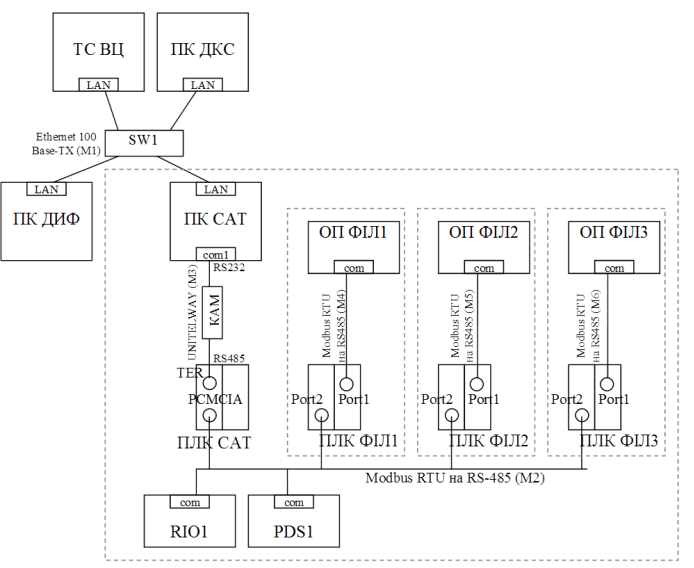
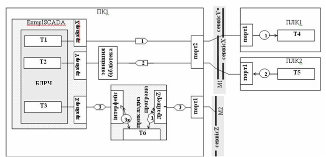
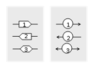
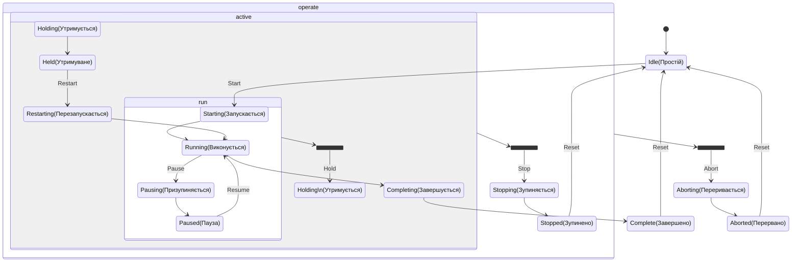
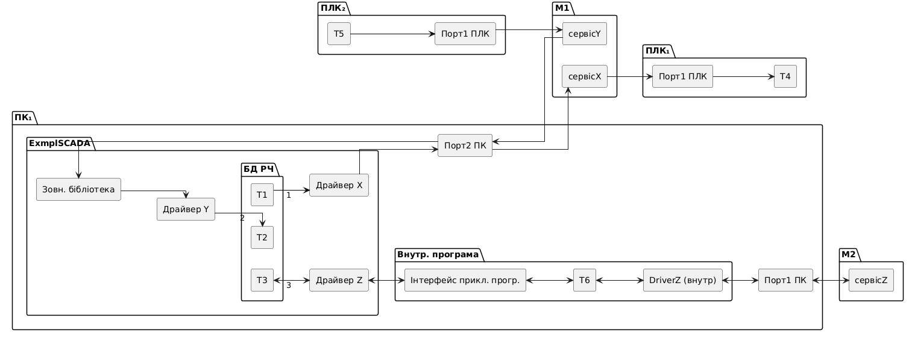
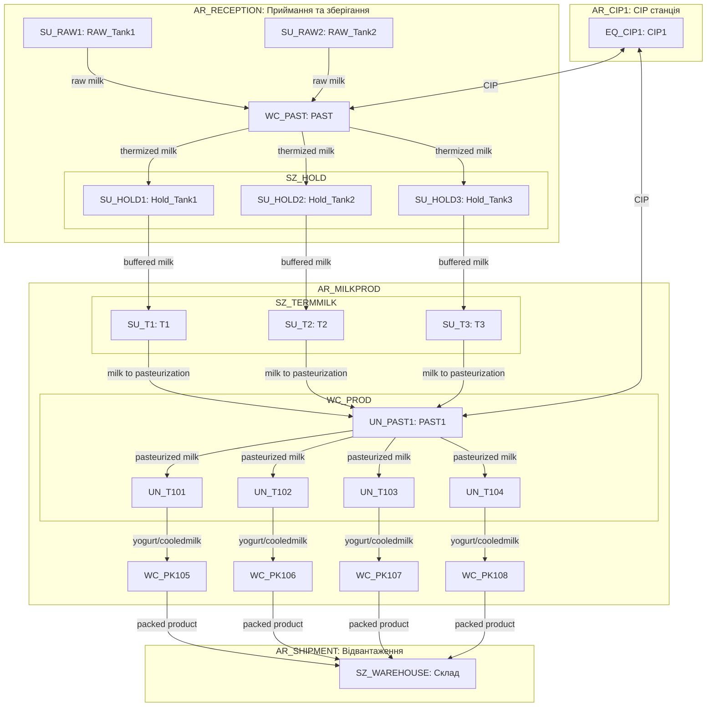
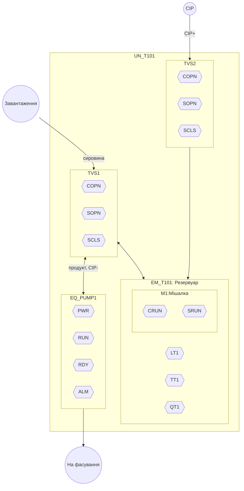
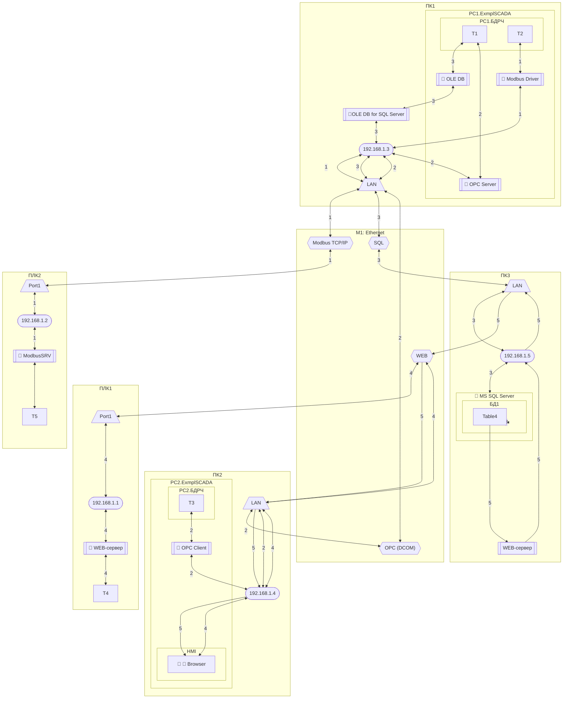
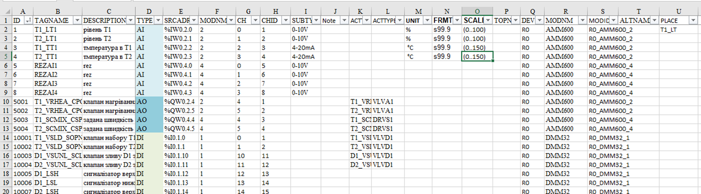

# 4. Інструменти для проектування КІСК 

Інструменти повинні 

## 4.1. Технічна структура

### Призначення технічної структури

Розроблення технічної структури комп’ютерно-інтегрованої системи керування (КІСК) передбачає формування цілісної картини усіх апаратних і програмних компонентів системи, визначення їхніх функціональних ролей, взаємозв’язків та розміщення в межах об’єкта автоматизації. Основна мета цього етапу — забезпечити узгоджене, раціональне й масштабоване технічне рішення, яке відповідає вимогам до функціональності, надійності, безпеки й технічного обслуговування системи.

Процес побудови технічної структури включає визначення програмно-технічних засобів (ПТЗ), які забезпечують реалізацію функцій контролю, керування, обміну, візуалізації та обробки інформації. До складу ПТЗ можуть входити: програмовані логічні контролери, модулі введення-виведення, операторські панелі, SCADA-сервери, шлюзи, комп’ютери, мережеве обладнання, джерела живлення, системи резервування тощо. Для кожного з компонентів визначається тип, технічні характеристики, інтерфейси підключення та логічне розміщення у структурі системи.

На основі вимог до функціональності та топології об’єкта формується структура розподілу функцій між вузлами системи. Виділяються локальні вузли збору й обробки сигналів, центральні вузли керування, вузли взаємодії з оператором, архівування та взаємодії з системами верхнього рівня. Визначається принцип розміщення обладнання: у шафах автоматизації, на об’єкті, в серверному приміщенні чи на робочих місцях персоналу.

Для кожного вузла технічної структури формується його склад у вигляді логічної або фізичної структури: центральний процесор, мережеві інтерфейси, модулі вводу/виводу, диски, монітори, джерела живлення, комутаційна апаратура. Визначається спосіб зв’язку між вузлами — тип мережі (Ethernet, RS-485, CAN, інше), топологія (зірка, кільце, лінія), протоколи (Modbus, OPC UA, Profinet тощо), а також засоби резервування.

Результатом розроблення технічної структури є технічна схема або структурна схема ПТЗ системи керування з прив’язкою до функціональної структури. Ця схема є основою для подальшого проєктування електротехнічної частини, вибору обладнання, побудови кабельних журналів, конфігурації програмного забезпечення та розроблення експлуатаційної документації.

Цей опис є частиною інженерного подання архітектури системи згідно з ISO/IEC/IEEE 42010 і відображає реалізацію архітектурних рішень у фізичному (технічному) аспекті. У рамках цього подання технічна структура конкретизує вибрані архітектурні концепції через конкретні програмно-технічні засоби, способи їх взаємодії, топологію системи та розміщення ресурсів.

Артефактами такої структури є: структурні схеми програмно-технічних засобів (ПТЗ), специфікації вузлів системи, топологічні схеми з’єднань, таблиці інтерфейсів, відомості про комунікаційні засоби, розміщення обладнання, специфікації протоколів обміну, схеми резервування, а також таблиці відповідності між функціональними та технічними компонентами системи. Ці артефакти слугують основою для реалізації, монтажу, тестування та подальшої експлуатації системи, а також для узгодження проєктних рішень між замовником, постачальниками і розробниками окремих підсистем.

### Структурні схеми

Розроблення технічної структури комп’ютерно-інтегрованої системи керування включає створення структури комп’ютерно-технічних засобів (КТС), яка є основою для реалізації технічної інтеграції всіх компонентів системи в єдине кероване середовище. Цей процес передбачає не лише вибір необхідного обладнання, а й формування мережної архітектури, що забезпечує комунікацію між усіма функціональними вузлами системи.

Розробка структури КТС передбачає, зокрема:

- вибір типів промислових та комп’ютерних мереж, на базі яких забезпечується обмін інформацією між вузлами;
- створення мережної структури, в якій кожен технічний засіб визначається як вузол із власним набором інтерфейсів та функціональним призначенням;
- вибір мережного обладнання для кожного вузла, включаючи комунікаційні модулі, мережні карти, інтегровані інтерфейси;
- вибір і розміщення мерених складових з функціями трансляції, розподілу або маршрутизації трафіку — репітерів, концентраторів, комутаторів, маршрутизаторів, шлюзів і протокол-конвертерів.

Процес побудови структури КТС, як правило, має ітераційний характер. На першому етапі аналізується функціональна структура системи, визначаються напрямки і характер інформаційних потоків між окремими вузлами, оцінюється необхідна пропускна здатність мереж. З урахуванням вимог технічного завдання здійснюється початковий вибір мережної топології та обладнання. Далі обрана структура перевіряється на відповідність вимогам надійності, масштабованості, пропускної здатності та сумісності. Якщо виявляються обмеження або невідповідності — виконується повторна ітерація з уточненням технічних рішень або за необхідності з корекцією вимог технічного завдання.

Якщо документація розробляється відповідно до ГОСТ 34, мережна структура документується у вигляді структурної схеми КТС (позначається як С1). Ця схема відображає загальну топологію зв’язків між вузлами, фізичні інтерфейси (порти), комунікаційні засоби та пристрої перетворення, а також дозволяє візуально зіставити її з функціональною ієрархією системи. Схема повинна бути максимально інформативною, відображати рівні керування відповідно до функціональної структури та відображати ієрархічну прив’язку вузлів. До схеми у вигляді окремого додатка додається перелік елементів ТЗА (технічних засобів автоматизації), який містить повну специфікацію вузлів, портів, типів мереж та комунікаційних засобів.



Рис.4.1.Приклад структурної схеми КТС 

Таблиця 4.1. Відомість мережних технічних засобів.

| Позначення                 | Найменування                                                 | К-сть | Примітка                                                     |
| -------------------------- | ------------------------------------------------------------ | ----- | ------------------------------------------------------------ |
| ПК ДКС                     | ПК начальника  зміни                                         | 1     | офісного виконання                                           |
| ПК САТ                     | ПК  оператора дефекосатурації                                | 1     | офісного виконання                                           |
| ПК ДИФ                     | ПК оператора  дифузії                                        | 1     | вже експлуатується Celeron 1,7  GHz, RAM 256Mb               |
| ПЛК  САТ                   | Програмований  логічний контролер відділення очистки         | 1     | TSX Premium (з Unity) з комм.  картою Modbus RS-485 TSX SCP 114 |
| ПЛК  ФІЛ1-3                | Програмований  логічний контролер фільтрації відділення очистки | 3     | вже експлуатується  TWD LCAA 40DRF з ком. модулем   TWD NOZ 485 T |
| ОП  ФІЛ1, ОП ФІЛ2, ОП ФІЛ3 | Операторська  панель фільтрації відділення очистки           | 3     | вже експлуатується  XBTN400                                  |
| PDS1                       | Частотний  перетворювач відкачка соку з хол. дефекатора      | 1     | ATV71 з інтегрованим Modbus RTU                              |
| RIO1                       | Віддалені  входи/виходи                                      | 1     | Advantys OTB на базі OTB  1S0DM9LP (Modbus RTU)              |
| КАМ                        | Комунікаційний  адаптер перетворювач RS-232<->RS-485         | 1     | TSX PCX 1031 (Schneider  Electric)                           |

### Схеми з’єднань та підключень проводок промислових мереж

Схеми з’єднань та підключень проводок промислових мереж є деталізованим поданням технічної структури, яке фіксує фізичну реалізацію інформаційних каналів між вузлами комп’ютерно-інтегрованої системи керування. На відміну від структурної схеми КТС, яка демонструє загальну логіку зв’язків між пристроями та рівнями, схема з’єднань орієнтована на практичне виконання монтажу, з урахуванням конкретних маркувань, роз’ємів, типів кабелів та точок підключення.

Такі схеми повинні містити інформацію про:

- усі логічні канали зв’язку, що реалізуються фізичними лініями (RS-485, Ethernet, CAN, 4–20 мА тощо);

- типи та марки кабелів, їх довжини, екранування, обов’язкові заземлення;

- прив’язку проводок до конкретних клем, портів або роз’ємів з вказанням номерів клемників, контактів, позицій у шафах та на об’єктах;

- з’єднання з перетворювальними або захисними пристроями (ізолятори, гальванічні розв’язки, бар’єри, комутаційні панелі);

- вимоги до прокладання: захищеність, маршрути, кабельні лотки, відстані від силових ліній.

Схеми з’єднань промислових мереж, як правило, виконуються з використанням електротехнічних САПР (наприклад, EPLAN Electric P8, AutoCAD Electrical), що дозволяє автоматично формувати кабельні журнали, таблиці з’єднань, маркування дротів і переліки обладнання. Це критично важливо для реалізації системи відповідно до вимог безпеки, стандартизації монтажу й забезпечення простежуваності в процесі налагодження та обслуговування.

Такі схеми є складовою частиною комплексу технічної документації і доповнюють загальну архітектуру системи, уточнюючи, як саме реалізується передача даних між логічно пов’язаними, але фізично віддаленими компонентами. У випадку змін у структурі або оновлення обладнання, саме ці схеми забезпечують однозначність у відновленні працездатності системи без необхідності повторного трасування усіх каналів зв’язку.

Якщо схеми виконуються відповідно до правил ЄСКД, то загальні рекомендації до підбору та виконанню електричних проводок наведені в РМ4-6-84 (частина 1). Правила стосовно виконання електричних проводок для промислових мереж визначені в технічній документації до цих мереж.  Зображення електричних зв’язків між ТЗА, які використовуються для передачі по промисловим мережам проводиться з використанням схеми з’єднань (С4) та підключень (С5) проводок мереж. Для спрощення виконання схеми з’єднань проводок промислових мереж можна виконувати з зображенням на них підключень засобів (суміщений спосіб). Якщо суміщений спосіб дуже ускладнює читання схеми, схеми з’єднань доповнюються схемами підключень. 

На рис.4.2 показаний приклад схеми з’єднань, а на рис.4.3 – схеми підключень проводок промислових мереж. Підключення, яке необхідно деталізувати, на рис.4.2 вказується внизу під написами позначень комунікаційних модулів, коробок та клем. До схеми з’єднань додається перелік елементів, приклад якого даний в таблиці 4.2. 


Рис.4.2. Приклад схеми з’єднань проводок промислових мереж

Таблиця 4.2. Перелік елементів до схеми з’єднань.

| Позначення | Найменування                                                 | К-сть | Примітка |
| ---------- | ------------------------------------------------------------ | ----- | -------- |
|            | Комунікаційні адаптери та карти                              |       |          |
|            | КК САТ  – TSX SCP114 PCMCIA мультипротокольна карта RS-485   | 1     |          |
|            | КМ  ФІЛ1 – TWD NOZ 485 T, комунікаційний модуль RS-485 для Twido з підключенням під клемну  колодку (PORT2) | 1     |          |
|            | Коробки з’єднувальні                                         |       |          |
|            | КС2-1 -  TSX SCA 50 з вбудованим термінатором                | 1     |          |
|            | Клемні колодки                                               |       |          |
|            | XT1 (щит RIO1) з прохідними клемами та 3 контакти            | 1     |          |
|            | XT1 (щит PDS1) з прохідними клемами та 3 контакти            | 1     |          |
|            | Мережні з’єднувачі                                           |       |          |
|            | XS1 –  неекранований RJ-45 типу вилка                        | 2     |          |
|            | Мережні кабелі                                               |       |          |
|            | TSX SCPCM4030 – для підключення TSX  SCP114 до MODBUS RTU, 3 м | 1     |          |
|            | TSX PCX1031 – кабель з адаптером RS232-RS485,  SUB-D 9 пін з боку RS232, MiniDIN з боку RS485, 2.5 м | 1     |          |
|            | XBTZ 9780 –  для підключення панелі (RJ-45) до ПЛК (MiniDIN) | 1     |          |
|            | TSX CSA – кабель на базі подвійної екранованої витої пари    | 120   | м        |
|            | UTP – UTP кабель 4х2 CAT5e 0,5 мм PVC                        | 2     | м        |

 

Рис.4.3. Схеми підключень

## 4.2. Інформаційна структура

### Призначення та способи представлення інформаційної структури

Розроблення інформаційної структури в контексті комп’ютерно-інтегрованих систем керування (КІСК) полягає у формуванні моделі потоків даних, форматів, структур тегів, інтерфейсів обміну між компонентами системи, а також опису інформаційної взаємодії між підсистемами.

Це включає:

1. Модель тегів та змінних: опис усіх змінних (тегів), які використовуються в системі, включно з: назвою, типом, одиницями, джерелом (PLC, SCADA, OPC тощо), частотою оновлення.
2. Інформаційна архітектура (Information Architecture): опис структури даних і їхнього руху між підсистемами, зокрема: таблиці змінних; OPC UA Nodeset (якщо використовується); відповідність між базами даних, SCADA, PLC; формати повідомлень, структури пакетів.
3. Інтерфейси та протоколи обміну: формування специфікацій на інтерфейси між підсистемами; вибір протоколів обміну (Modbus, OPC UA, MQTT тощо); мапування тегів між вузлами.
4. Правила доступу та управління даними: визначення прав на читання/запис; політики журналювання; безпечний обмін даними (особливо згідно IEC 62443).
5. Трасування даних: зв’язки між тегами і вимогами користувача; контроль відповідності даних у контексті перевірки (V&V).

Цей опис є частиною інформаційного подання архітектури системи згідно ISO/IEC/IEEE 42010 і повинен бути узгоджений з іншими поданнями (технологічним, фізичним, функціональним тощо)

Основне завдання схеми показати реалізацію інформаційної взаємодії між даними мережних вузлів. Схеми та таблиці, які відображають інформаційну структуру, можна розробляти окремо для кожної із мереж або для всієї системи. 

На схемі інформаційної структури необхідно графічно зобразити масиви даних в базах даних вузлів системи, та їх взаємозв’язок інформаційними потоками. Наочність дає змогу краще розуміти процеси обміну, які діють в системі, тому бажано особливо не нагнітати схему надлишковою інформацією. Для побудови такої схеми, проектант повинен розуміти основні принципи роботи мережного обладнання, протоколів обміну, програмного забезпечення вузлів і т.д.

Основними елементами схеми є:

1. масиви даних процесу, які приймають участь в загальносистемному обміні, тобто які циркулюють по обчислювальним мережам;

2. інформаційні потоки, які забезпечують доставку даних з бази даних джерела в базу даних отримувачів; 

3. мережні сервіси/протоколи, за допомогою яких реалізовані інформаційні потоки;

4. комунікаційні логічні канали пристроїв та програмного забезпечення, через які проходять інформаційні потоки: драйвер, логічний канал, адреса, тощо; 

5. уточнюючі характеристики інформаційних потоків: в графічній частині бажано показати хто ініціював запит (Клієнт, Видавець або Виробник) та напрямок передачі інформації; в текстовій – всю іншу інформацію, відповідно до вимог до інформаційного забезпечення.


Для створення та представлення інформаційної архітектури комп’ютерно-інтегрованих систем керування (КІСК) використовуються різні формати, моделі подання та інструменти, залежно від цілей (проєктування, інтеграції, документування, валідації, сертифікації). Зокрема можна виділити:

- Табличні (Spreadsheet/CSV): Таблиці тегів (I/O list), Таблиці зв’язків між змінними та джерелами/споживачами, Таблиці трасування (traceability matrix). 
- Електронні документи XML/JSON/B2MML/AutomationML: Для експорту/обміну між системами (особливо OPC UA, MES, ERP), B2MML – XML-представлення моделей ISA-95, AutomationML – інтеграція між CAD/CAE/PDM/SCADA/PLC, EPLAN XML, TIA Portal XML, Step7-SCL – для імпорту/експорту конфігурацій
- графічні подання: ERD (Entity Relationship Diagram) або UML Class Diagram - для логічного моделювання даних,  EPC / BPMN / IDEF0 + DFD - Для опису потоків інформації у процесах.

### Приклад графічного подання у вигляді схеми інформаційних потоків

Наведемо приклад подання у вигляді схеми інформаційних потоків, використовуючи варіант, що зображений на рис.4.4. 



Рис.4.4. Приклад схеми інформаційних потоків

Ключовими вузловими елементами інформаційної структури є ресурси даних та інформаційні потоки.

**Ресурси даних (ресурси)** — структуровані об'єкти, які містять або приймають значення змінних у системі. Ресурсом може бути область пам’яті в контролері, таблиця тегів у SCADA, endpoint у REST API або вузол в OPC UA. 

**Програмна сутність (програма)** — це компонент комп’ютерно-інтегрованої системи керування, що реалізує або викликає функцію обміну, обробки чи взаємодії з даними або користувачем. На відміну від ресурсів, програмні сутності є **активними**, тобто ініціюють або обслуговують інформаційні потоки, виконують комунікаційні або прикладні задачі. Класи програмних сутностей:

- **Сервіси** (драйвери, протокольні модулі, служби). Програмні компоненти, що виконують обробку або обслуговування запитів у рамках конкретного протоколу чи інтерфейсу. Можуть бути клієнтами або серверами, взаємодіють із зовнішніми пристроями або середовищами. Приклади: Modbus Driver, OPC Server, MQTT Broker, SQL API, httpClient.
- **Застосунки** (з HMI) Програмні компоненти, що реалізують людино-машинну взаємодію. Їх головна функція — представлення даних користувачу, отримання вводу, виконання інтерфейсних сценаріїв. Приклади: SCADA HMI, Browser, мобільний додаток CMMS, панель управління.

Загальні ознаки програмних сутностей є:

- Ініціює або обробляє інформаційний обмін
- Запускається в середовищі виконання
- Поведінка сутності у потоці означує її роль (клієнт, сервер тощо)
- Відокремлена від ресурсу, тобто не зберігає дані, а лише працює з ними 

Програмна сутність може: оперувати одним або кількома ресурсами, бути розміщеною в контейнері (наприклад, ОС, ПЛК, шлюзі), бути точкою входу або виходу інформаційного потоку, мати або не мати HMI (інтерфейс користувача).

Саме ресурси та/або програми означують точки початку й завершення інформаційного потоку. Один ресурс зазвичай асоціюється з одним потоком, але може бути спільним для кількох потоків або агрегованим у межах одного обміну.

У схемах інформаційних потоків ресурси та програми слід представляти з точки зору їх участі в комунікаційному обміні, а не внутрішньої структури програмно-технічного засобу. Це означає, що важливо вказати, як ресурс є доступним для інших вузлів: через який протокол, інтерфейс, топік, адресу, endpoint або ID. Саме такі характеристики означують його роль у схемі — як джерела чи приймача даних. Наприклад, змінна `Level` в контролері може бути реалізована у внутрішньому блоці пам’яті `DB10`, але з точки зору комунікації вона доступна через `S7 endpoint`, ідентифікована як `DB10.DBW2`, або передається, наприклад, через MQTT у вигляді `{"level": ...}`.

Таким чином, у схемі має бути показано:

- який саме ресурс або/та програма бере участь в обміні (ідентифікатор з точки зору протоколу/інтерфейсу),
- де він розміщений логічно (який засіб, вузол, endpoint),
- яким чином здійснюється обмін (протокол, формат, інтерфейс).

Внутрішня реалізація ресурсу/програми може змінюватися (наприклад, зміна входів/виходів в ПЛК), але інформаційна схема залишається сталою, якщо характеристики обміну збережено. Ресурси та програми розміщуються в межах програмно-технічного засобу (наприклад, контролера, SCADA-сервера або edge-шлюзу) в рамках його логічної або фізичної структури. 

Під "структурою даних" у цьому контексті розуміється виділений адресований простір або логічна область, призначена для зберігання чи обміну змінними. Фізично ресурс може представляти собою область оперативної пам’яті ПЛК, блок даних, змінні програми, таблиці тегів або окремі записи в базі даних.  

**Контейнер ресурсів (контейнер)** — це будь-яка частина системи (фізична або логічна), в межах якої розміщено ресурс або інші (вкладені) контейнери.
Вкладеність контейнерів відповідає структурі реалізації доступу до ресурсу, яку необхідно вказати для правильної ідентифікації. Можна виділити такі типи контейнерів:

- Обчислювальний пристрій (ПК, ПЛК, шлюз, маршрутизатор). Це фізичний вузол мережі, який виступає контейнером верхнього рівня для ресурсів даних або програм, що працюють в його середовищі. У межах цього пристрою функціонує хостова операційна система, яка забезпечує доступ до ресурсів — або безпосередньо (як у контролерах), або через середовище виконання (як у ПК). Якщо ОС безпосередньо керує ресурсом (наприклад, змінна в оперативній пам’яті ПЛК), то ресурс вважається вкладеним без проміжного контейнера. Якщо ОС лише хостить ПЗ, яке керує ресурсом (наприклад, OPC Server, SQL Server, SCADA/HMI середовище виконання) — воно буде окремим контейнером усередині контейнеру-пристрою. Приклади:

```
Контейнер: ПК1
  ОС: Windows
    └─ Ресурс: Level.txt (файл, без проміжного ПЗ)
```

```
Контейнер: ПЛК1
  ОС: RTOS
    └─ Ресурс: %MW100
```

- Програмне забезпечення (контейнер ПЗ).  Це прикладна програма або середовище виконання, що має власну структуру даних і самостійно оперує ресурсами. Такий контейнер функціонує всередині іншого контейнера (найчастіше — пристрою), і може містити один або кілька ресурсів, а також внутрішню ієрархію (модулі, бази даних, драйвери). Типові приклади:

  - SCADA-система з базою даних реального часу


  - OPC UA Server


  - SQL Server


  - Node-RED


  - Excel із VBA


  - Python-скрипт зі змінними

Якщо ресурс невід’ємний від ПЗ (наприклад, тег у SCADA), то він завжди вказується в межах цього ПЗ. Якщо ПЗ виступає інтерфейсом до зовнішнього ресурсу (наприклад, OPC-клієнт), то воно є частиною інформаційного потоку, а не контейнером ресурсу. 

```
Контейнер: ПК1
  └─ Контейнер: ExmplSCADA
       └─ Контейнер: БДРЧ
            └─ Ресурс: T1 (теги)
```

Для ідентифікації місця розташування ресурсу у схемі інформаційних потоків необхідно вказати його ієрархічну вкладеність у межах контейнерів, які відображають структуру розміщення та доступу. 

```
Пристрій (Контейнер верхнього рівня) → Програмне забезпечення (опціонально) → Внутрішня структура (опціонально) → Ресурс
```

Необов’язкові рівні контейнерів опускаються, якщо немає потреби в уточненні.

Графічно контейнери можна показувати через вкладеність прямокутників один в одного з зазначенням назви. Наприклад на рис.4.4  є такі вкладення:

```
Контейнер: ПК1
  └─ Контейнер: ExmplSCADA
       └─ Контейнер: БДРЧ
            └─ Ресурс: T2
```

```
Контейнер: ПЛК1
  └─ Ресурс: T4
```

Графічно контейнер можна зобразити прямокутником з написом, на який можна послатися в описі, наприклад `T1`...`T5` на рис.4.4. Деталі ресурсу варто показувати в описі, у вигляді таблиць, що включають переліки елементів та їх зв'язків, з додатковою інформацією за необхідності.  

**Інформаційний потік** — логічна модель, яка означується як реалізація комунікаційного обміну між двома ресурсами в межах комп’ютерно-інтегрованої системи. Потік описує:

- напрямок передавання даних (від джерела до споживача або двобічно);
- сервіс або протокол, який використовується для реалізації обміну (наприклад, Modbus, OPC UA, MQTT, REST API);
- послідовність проміжних компонентів, через які проходять дані (драйвери, брокери, проксі, шлюзи тощо);
- початковий і кінцевий ресурс, які виступають вузлами потоку.

Один інформаційний потік може охоплювати кілька рівнів взаємодії, включати перетворення форматів або маршрутизацію через проміжні засоби.

Інформаційні потоки доцільно зображати у вигляді ліній (стрілок), що поєднують ресурси в межах різних контейнерів. Для полегшення аналізу, трасування та посилання у тексті, потоки бажано нумерувати. Кожен потік має унікальний номер (наприклад, `1`, `2`, …). Цей номер відображається на схемі біля стрілки або в окремій фігурі. Нумерація потрібна для перехресного пошуку в документації та узгодження з таблицями описів. Форма, у якій вказано номер потоку, може передавати додаткову семантику, якщо це дозволяє обраний інструмент. Наприклад, можна вказувати тип сервісу (Client, Server, Pub, Sub), тип потоку (однонаправлений, двонаправлений, періодичний тощо) або інші атрибути. Для моделі Клієнт–Сервер з боку Клієнта (той, хто ініціює запит) може бути використана фігурна стрілка в напрямку потоку. З боку Сервера – круг зі стрілками, що вказують на доступність ресурсу (рис.4.5). 



Рис.4.5. Приклади зображення потоків

На схемі вказуються ***комунікаційні сервіси***, якими послуговуються інформаційні потоки. Якщо сервіси однозначно означуються протоколом, то вказується протокол обміну. Як правило необхідно вказувати прикладні сервіси і відповідно прикладні протоколи. Для спрощення в контексті правил побудови буде використовуватись слово "сервіс" а не "протокол".  

Кожний потік починається з ресурсу. Початком потоку умовно можна вважати бік його ініціювання. Далі в порядку слідування потоку вказуються комунікаційні засоби програмного забезпечення, що відповідають за обмін, тобто його інтерфейсна частина (драйвери пристроїв, бібліотеки обміну і т.д.). Якщо ці складові приховані від розробника системи і вважаються внутрішньою закритою складовою програмно-технічного засобу, то її вказувати не потрібно. Вказуються необхідно тільки ті частини програмного забезпечення, які неоднозначні і можуть бути замінені на альтернативні. 

На рисунку 4.4 показано три типові випадки (не повний перелік) слідування інформаційних потоків від ресурсів до зовнішнього порту комп’ютера. Всі вони послуговуються умовними інтерфейсними каналами прикладної програми, які в подальшому будемо називати **драйверами**. Для кожного драйвера можуть існувати налаштування, які інколи необхідно уточнювати або на самій схемі, або в текстовій частині. Як мінімум, на схемі слід вказати дійсну або умовну назву цього каналу.

Перший інформаційний потік починається від ресурсу `T1`. Для передачі даних через мережу `М1` використовується `драйверХ`, який є інтерфейсною частиною прикладної програми `ExmplSCADA`. У цьому випадку достатньо вказати лише цей інтерфейс, за потреби з уточненнями. Якщо всі дані передаються через єдиний незмінний інтерфейс, то `драйверХ` може не вказуватись, оскільки відсутні варіанти його заміни або конфігурування

Інколи драйвер прикладної програми використовує проміжну бібліотеку (або іншу програму чи драйвер). При цьому ім’я цієї бібліотеки або її тип можуть відрізнятись залежно від реалізації. Наприклад, якщо на рисунку 4.4 `драйверY` — це реалізація OPC-клієнтського інтерфейсу, то необхідно також вказати OPC-сервер, який реалізує потрібний протокол мережі. У такому випадку бібліотеку доцільно зобразити безпосередньо на шляху слідування потоку — у вигляді "розриву".

У разі потреби у проміжній бібліотеці (програмі, драйвері) можна деталізувати її внутрішню структуру. Наприклад, при використанні OPC з кількома реалізованими протоколами обміну необхідно вказати, який саме з них використовується поточним інформаційним потоком, а також основні параметри комунікації цього драйвера. У деяких випадках слід також показати внутрішні дані або структури цієї програми, які задіяні в обміні. На рисунку 1.4 інформаційний потік 3 проходить через таку програму. Оскільки ця програма розриває потік, він представлений як два окремі потоки — `3k` та `3s`. Усередині програми показано допоміжний масив даних `T6`.

За необхідності, на шляху проходження потоку, після програмного забезпечення, драйверів, бібліотек вказуються адреси станцій (вузлів) на мережі та логічні канали або порти, які є інтерфейсними для програмно-технічного засобу. ***Логічний канал*** є відображенням фізичного каналу, а його маркування залежить від реалізації та типу ПЗ. У загальному випадку логічний канал може мати вигляд:

```
ідентифікатор_модуля.ідентифікатор_каналу
```

Ідентифікація модуля та каналу залежить від реалізації і повинна бути однозначною та зрозумілою. Приклади:

-     "CPU.Modbus" або "CPU.0" або "0.0" або "0.Modbus" можуть бути для інтегрованого каналу з назвою "Modbus" (0-й порт) в процесорний модуль (0-й модуль);

-     "CP343-1.LAN" – порт Ethernet на модулі CP343-1, якщо такий модуль тільки один в конфігурації, або "CP343-1(3).LAN" якщо таких модулів декілька і необхідний знаходиться на 3-му місці;

-     "Port3", "COM1", "LAN" - інтегровані канали пристрою з унікальною назвою;    

Логічні канали повинні мати унікальний ідентифікатор в межах пристрою.  

Адреса (або адреси) може бути прив’язана до логічного каналу. У випадках, коли на одному логічному каналі знаходиться кілька адрес, у схемі на шляху інформаційного потоку вказується та адреса, яка використовується саме для даного потоку. Якщо канал використовується кількома драйверами (у випадку підтримки мультиплексування або багатопротокольності), адреси не прив’язуються до каналу, а безпосередньо до відповідного драйвера.

Після логічного каналу всі інформаційні потоки умовно зливаються в одну інформаційну шину. Під інформаційною шиною мається на увазі спільний комунікаційний сервіс, яким послуговуються ці потоки. Одна фізична мережа з одним транспортним протоколом може підтримувати кілька сервісів (наприклад, OPC UA і MQTT в одній Ethernet-мережі).

Інформаційна шина не обов’язково повинна відповідати сервісу протоколу одного рівня (наприклад, прикладного рівня моделі OSI), однак повинна однозначно вказувати, яким сервісом користуються інформаційні потоки.

Інформаційний потік закінчується аналогічно до того, як починається — на ресурсі. Таким чином, початок потоку є умовним і не обов’язково співпадає зі стороною клієнта в моделі Клієнт–Сервер.

## 4.3. Інструменти проєктування

### Загальні підходи

Проєктування комп’ютерно-інтегрованих систем керування потребує комплексного підходу, який охоплює архітектурне, функціональне, інформаційне та фізичне подання системи. Для цього застосовуються спеціалізовані програмні засоби, які дозволяють формалізувати модель, забезпечити узгодженість між її поданнями, а також автоматизувати формування документації, структури проекту, кодів програм і зв’язків між рівнями системи.

На етапах архітектурного та функціонального проєктування доцільно використовувати системи моделювання, такі як Enterprise Architect, Visual Paradigm, Cameo Systems Modeler. Вони дозволяють створювати UML та SysML-моделі, описувати архітектурні подання відповідно до ISO/IEC/IEEE 42010, а також використовувати шаблони, сценарії, діаграми станів і взаємозв’язки між компонентами. Такі засоби ефективно застосовуються для моделювання високорівневої логіки, сценаріїв взаємодії та ролей користувачів.

Паралельно з логічним моделюванням формується фізична структура системи керування. Для цього використовуються електротехнічні САПР, зокрема EPLAN Electric P8, Engineering Base, AutoCAD Electrical, SolidWorks Electrical. Вони дозволяють створювати структурні схеми шаф, клемників, топології підключення пристроїв, кабельні журнали, таблиці сигналів, а також здійснювати автоматичне маркування, трасування з'єднань і формування специфікацій. Багато з таких САПР підтримують генерацію тегів і таблиць адрес, які потім можуть бути використані в середовищах програмування ПЛК або SCADA.

Деякі інструменти проектування доступні і в сучасних середовищах розроблення прикладного ПЗ для ПЛК та SCADA. У будь якому випадку варто передбачити інтегрування з ними. Дані з ПЛК можуть експортуватися у форматах CSV, XML, L5X, AutomationML для синхронізації з іншими рівнями. SCADA/HMI засоби забезпечують формування візуалізації, структуру тегів, реалізацію протоколів обміну (OPC UA, MQTT, Modbus TCP), логіку тривог, архівацію даних і взаємодію з MES/ERP-рівнями.

Важливою складовою сучасних проєктів є використання форматів текстового опису діаграм, таких як PlantUML, Mermaid, які дозволяють формалізувати архітектурні рішення, функціональні взаємозв’язки, стани та потоки даних у вигляді коду. Це особливо корисно для автоматизації документації, інтеграції з Git та побудови інженерних wiki-довідників у Markdown-форматі.

Крім того, для забезпечення зв’язку між рівнями системи — ПЛК, SCADA, MES — активно використовуються стандартизовані формати обміну: OPC UA Nodeset XML, B2MML, AutomationML, GSDML. Вони дозволяють уникати дублювання конфігурацій, синхронізувати ієрархії устатковання та спростити налаштування OPC-серверів або систем диспетчеризації.

Отже, спеціалізовані засоби проєктування охоплюють як логічне та інформаційне моделювання, так і розробку апаратної частини, програмування, візуалізацію, архітектурну документацію та зв’язок між усіма рівнями КІСК. Їх використання забезпечує цілісність, простежуваність і масштабованість проєктів у відповідності до сучасних стандартів та практик.

У той же час для виконання окремих частин проєкту можна використати доступні (недорогі або безкоштовні) інструменти, які дають можливість створювати базову документацію, моделювати інформаційні структури, формувати схеми зв’язків та описувати архітектурні рішення без значних витрат. Такі інструменти, як Draw.io (diagrams.net), LibreOffice Draw, yEd Graph Editor або Inkscape дозволяють будувати структурні, функціональні й інформаційні схеми з використанням стандартних шаблонів та блоків.

Для створення текстових діаграм можна скористатися PlantUML або Mermaid — вони легко інтегруються з системами керування документацією, зокрема Markdown, AsciiDoc, GitLab Wiki, Docusaurus, що робить їх зручними для спільної роботи й ведення актуальної технічної документації в середовищах Git. Такі підходи особливо ефективні на етапах прототипування, узгодження архітектури, написання технічних завдань та пояснювальних записок.

Таким чином, навіть у межах обмеженого бюджету можливо реалізувати значну частину процесу проєктування ПКІСК з використанням доступних інструментів, які забезпечують базову формалізацію моделі, прозорість структури системи та інтеграцію з подальшими етапами розробки.

### Інструменти графічного представлення 

Схеми можна створювати за допомогою звичайних графічних редакторів (наприклад, Visio, Draw.io тощо), однак для забезпечення підтримуваності, повторного використання та інтеграції в документацію доцільніше застосовувати подання, побудовані з використанням типових форматів діаграм і відповідних файлів (наприклад, PlantUML, Mermaid, UML/XMI, SVG, XML). Це дозволяє забезпечити однозначне трактування структури між розробниками, автоматизувати створення й оновлення схем, інтегрувати їх у системи контролю версій та CI/CD, а також забезпечити машинну обробку та простежуваність архітектурних рішень у рамках життєвого циклу проєкту.

Пропонуються наступні варіанти подання схем інформаційної архітектури:

1. Графічне у векторному редакторі (Draw.io, Visio, yEd). Підходить для швидкого створення наочних схем із використанням бібліотек символів. Добре інтегрується в офісну документацію, але важко підтримується при зміні структури.
2. PlantUML. Текстовий формат для опису діаграм, підтримує UML, ERD, діаграми станів, компонентів, класів тощо. Дозволяє автоматично генерувати діаграми на основі коду, легко інтегрується в CI/CD, контролю версій та документацію (Markdown, AsciiDoc).
3. Mermaid
    Простий текстовий синтаксис, особливо зручний для Markdown-документації, GitHub/GitLab Wiki. Підтримує діаграми потоків, станів, послідовності, Gantt тощо. Менш гнучкий, ніж PlantUML, але швидший у використанні.
4. OPC UA Nodeset/XML, B2MML/AutomationML
    Придатні для формалізованого опису інформаційної моделі на машинному рівні. Застосовуються в середовищах SCADA/MES для автоматизованої генерації або експорту/імпорту моделей.
5. SVG з інтерактивними елементами
    Для інтеграції з веб-документацією або UI, коли потрібна інтерактивність або гіперпосилання між об’єктами.

Кожен варіант може використовуватись залежно від задачі: документування, інтеграції, автоматизації чи презентації.

#### Mermaid

[Mermaid](https://mermaid.js.org/intro/)— це текстова мова для створення діаграм, орієнтована на просте візуальне подання структур у середовищах, де використовується Markdown або HTML. Вона дозволяє швидко створювати блок-схеми, діаграми процесів, автоматів станів, діаграми Ганта, діаграми послідовності, а також прості графи та організаційні структури. Mermaid створена з фокусом на легкість використання та інтеграцію з системами документації, зокрема GitHub, GitLab, Obsidian, Docusaurus, MkDocs та іншими.

На відміну від PlantUML (див. нижче), Mermaid має менш формалізований синтаксис і орієнтується не на UML як стандарт, а на просте інтуїтивне креслення блоків і стрілок. Наприклад, діаграма потоків будується за схемою, де елементи з’єднуються стрілками через символи `A --> B` або `A -.-> B`. Завдяки цьому поріг входу дуже низький, і навіть неінженерні користувачі можуть швидко навчитися створювати діаграми. Кожен тип діаграми починається з ключового слова, наприклад graph TD для звичайного графу зверху вниз або gantt для діаграми Ганта.

Mermaid добре підходить для вбудовування в markdown-документацію — багато платформ, зокрема GitHub, GitLab та Obsidian, підтримують її рендеринг без додаткових інструментів. Це дає змогу включати діаграми безпосередньо в інженерні wiki, технічні вимоги, інструкції, README-файли або сторінки документації проєктів. Mermaid підтримує не лише графи, а й додаткові функції — наприклад, групування вузлів (subgraph), стилізацію блоків, умовні переходи, цикли тощо.

Можливості налаштування вигляду діаграм у Mermaid обмежені в порівнянні з PlantUML, але цього цілком достатньо для багатьох прикладних задач: відображення інформаційних потоків, логіки станів, взаємозв’язків між підсистемами або структур доступу. Mermaid не потребує встановлення, якщо використовується у вебплатформах, і має відкритий онлайн-редактор, у якому можна одразу побачити результат введеного коду.

Завдяки своїй простоті та сумісності з сучасними платформами документації Mermaid набуває широкого поширення, особливо в умовах спільної роботи над технічною документацією, де важлива швидкість оновлення, наочність і легка інтеграція без графічних інструментів. Створення та відображення Mermaid діаграм можна робити в онлайн редакторі, який доступний за посиланням <https://mermaid.live>

На рис.4.6 показаний приклад діаграми станів, нарисованої в Mermaid, код якої наведено нижче.

```
stateDiagram-v2
    [*] --> Idle(Простій)
    Idle(Простій) --> Starting(Запускається): Start
    state operate {
     state active {
       state run{
         Running(Виконується) --> Completing(Завершується)
         Running(Виконується) --> Pausing(Призупиняється) : Pause
         Pausing(Призупиняється) --> Paused(Пауза)
         Paused(Пауза) --> Running(Виконується) : Resume
         Starting(Запускається) --> Running(Виконується)
         Restarting(Перезапускається) --> Running(Виконується)
       }
       Completing(Завершується)
       Holding(Утримується)
       Held(Утримуване)
       state cmdHold <<join>>
       run --> cmdHold 
       cmdHold --> Holding\n(Утримується) : Hold
       Held(Утримуване) --> Restarting(Перезапускається) : Restart
       Holding(Утримується) --> Held(Утримуване) 
     }
     state cmdStop <<join>>
     active --> cmdStop 
     cmdStop --> Stopping(Зупиняється) : Stop  
     Stopping(Зупиняється) --> Stopped(Зупинено)
    }
    Completing(Завершується) --> Complete(Завершено)
    state cmdAbort <<join>>
    operate --> cmdAbort 
    cmdAbort --> Aborting(Переривається) : Abort
    Aborting(Переривається) --> Aborted(Перервано)
    Stopped(Зупинено) --> Idle(Простій): Reset
    Complete(Завершено) --> Idle(Простій) : Reset
    Aborted(Перервано) --> Idle(Простій) : Reset 
```



рис.4.6. Приклад діаграми станів нарисованої в Mermaid .

#### PlantUML

PlantUML — це текстова мова для створення діаграм, яка дозволяє генерувати графічні зображення схем на основі простої текстової специфікації. Вона особливо зручна для використання в середовищах, де важлива автоматизація, підтримуваність та інтеграція з системами контролю версій. Замість того, щоб малювати схеми вручну в графічному редакторі, користувач описує логіку структури у вигляді короткого коду, а PlantUML генерує зображення у форматах PNG, SVG або навіть ASCII.

Серед переваг PlantUML — підтримка широкого спектра діаграм, зокрема діаграм класів, станів, послідовностей, компонентів, прецедентів, ER-діаграм, організаційних структур, Gantt-діаграм та mindmap. Це робить PlantUML універсальним інструментом як для розробників програмного забезпечення, так і для інженерів автоматизації. Завдяки цьому його часто використовують у документації проєктів SCADA, PLC та MES, де важлива чітка структуризація архітектури та взаємодії між компонентами.

Формат опису діаграм у PlantUML є простим і легким для читання. Наприклад, діаграма послідовності між оператором, SCADA-системою та контролером описується кількома рядками тексту. Кожна діаграма починається з директиви `@startuml` і завершується `@enduml`, між якими означуються об'єкти, зв’язки, повідомлення, послідовності подій та інші елементи.

PlantUML добре інтегрується з різними інструментами розробки та документації: його можна використовувати в середовищах IntelliJ IDEA, Visual Studio Code, AsciiDoc, Markdown, LaTeX, а також у системах CI/CD і Confluence. Завдяки текстовому формату легко оновлювати діаграми автоматично під час змін у коді або конфігураціях. Це особливо цінно в командних проєктах, де важлива простежуваність і мінімізація ручної роботи над документацією.

Є онлайн редактор, у якому можна робити подібні діаграми <https://editor.plantuml.com. Ось наприклад код, результат роботи якого показний на рис.4.7.    

```
@startuml
left to right direction
skinparam linetype ortho
skinparam componentStyle rectangle
skinparam defaultTextAlignment center

' ПК1
package "ПК₁" {
  
  ' SCADA з БД РЧ
  package "ExmplSCADA" {
    package "БД РЧ" {
      [T1]
      [T2]
      [T3]
    }
    [Драйвер X] as DriverX
    [Драйвер Y] as DriverY
    [Драйвер Z] as DriverZ
    [Зовн. бібліотека] as ExtLib
  }

  ' Внутрішня програма
  package "Внутр. програма" {
    [Інтерфейс прикл. прогр.] as Iface
    [T6]
    [DriverZ (внутр)] as GW_DriverZ
  }

  [Порт1 ПК₁] as Port1_PC1
  [Порт2 ПК₁] as Port2_PC1
}

' ПЛК1
package "ПЛК₁" {
  [T4]
  [Порт1 ПЛК₁] as Port1_PLC1
}

' ПЛК2
package "ПЛК₂" {
  [T5]
  [Порт1 ПЛК₂] as Port1_PLC2
}

' Мережі
package "M1" {
  [сервісX]
  [сервісY]
}

package "M2" {
  [сервісZ]
}

' Потік 1: SCADA → ПЛК1
T1 -[#black]-> DriverX : 1
DriverX --> Port2_PC1
Port2_PC1 --> сервісX
сервісX --> Port1_PLC1
Port1_PLC1 --> T4

' Потік 2: ПЛК2 → SCADA
T5 -[#black]-> Port1_PLC2
Port1_PLC2 --> сервісY
сервісY --> Port2_PC1
Port2_PC1 --> ExtLib
ExtLib --> DriverY
DriverY --> T2 : 2

' Потік 3: двосторонній через DriverZ
T3 <--> DriverZ : 3
DriverZ <--> Iface
Iface <--> T6
T6 <--> GW_DriverZ
GW_DriverZ <--> Port1_PC1
Port1_PC1 <--> сервісZ

@enduml
```



рис.4.7. Приклад діаграми PlantUML 

### Використання табличних інструментів при проектуванні

Табличні інструменти, зокрема електронні таблиці (Microsoft Excel, LibreOffice Calc, Google Sheets), відіграють важливу роль на всіх етапах проєктування комп’ютерно-інтегрованих систем керування. Вони забезпечують зручний спосіб структурування, аналізу, трансформації та передачі проєктних даних між різними учасниками проєкту, а також між різними програмними середовищами.

У процесі проєктування табличні інструменти використовуються для:

- ведення переліку змінних (тегів) системи, з вказанням їхніх ідентифікаторів, адрес, типів даних, одиниць вимірювання, джерел, напрямків обміну, доступності для архівації, візуалізації, логування тощо;

- формування специфікацій обладнання, в яких зазначається найменування пристроїв, моделі, конфігурація, кількість каналів, інтерфейси, тип живлення, тип корпусу, клас захисту;

- побудови таблиць прив’язки сигналів до модулів вводу-виводу, портів, клем, кабелів, які є основою для формування схем з’єднань та монтажних відомостей;

- відображення структури програмних блоків, параметрів рецептур, таблиць станів автоматів, режимів роботи обладнання;

- ведення таблиць трасування сигналів та інформаційних потоків між вузлами системи, у тому числі з вказанням сервісів і протоколів, які використовуються для обміну.

Окрім цього, табличні форми можуть використовуватися як проміжний формат для обміну даними між системами САПР, середовищами розроблення ПЛК, SCADA та MES. Багато середовищ підтримують імпорт/експорт у форматі CSV або XML, що дозволяє автоматизувати створення конфігурацій на основі підготовлених таблиць. Це значно знижує ймовірність помилок, зменшує час розроблення, а також забезпечує повторне використання шаблонів і типових структур.

У навчальних і курсових проєктах використання табличних засобів є доцільним для опису інформаційної структури, складання структурних і функціональних специфікацій, формування відомостей про обладнання, а також як інтерфейс для формалізації технічних рішень перед побудовою схем.

Хоча Google Sheets зазвичай використовується як зручний онлайн-табличний редактор, його можливості спільної роботи роблять цей інструмент надзвичайно ефективним і для проєктування систем керування. Більшість користувачів знайомі з базовим редагуванням таблиць, але часто не замислюються над тим, що цей сервіс дозволяє декільком учасникам проєкту паралельно працювати над однією структурою даних — наприклад, над переліком змінних, адресацією сигналів або специфікацією вузлів системи.

У Google Sheets кожна зміна зберігається автоматично та миттєво доступна всім учасникам. Це знімає проблему узгодження різних версій таблиці між членами команди. Коментарі дозволяють ставити запитання або давати уточнення безпосередньо у відповідному місці документа, а можливість обмежити доступ лише до перегляду чи коментування допомагає уникнути небажаних правок. Історія змін дає змогу не лише простежити, хто і коли редагував таблицю, але й за потреби повернутися до попереднього стану.

У проєктах КІСК це дає відчутну перевагу — наприклад, інженер із SCADA може одночасно з програмістом ПЛК наповнювати структуру тегів, а проєктувальник мережі — вказувати фізичні порти й адреси. Замість надсилання файлів електронною поштою або злиття окремих фрагментів вручну, команда має єдину актуальну версію документу, до якої всі мають доступ у зручний момент. Такий підхід не лише підвищує узгодженість і швидкість роботи, а й робить процес формування проєктних даних прозорим і керованим.

Зберігання проєктних майстерданих у Google Sheets відкриває можливості для автоматизованого обміну даними з іншими середовищами — як у напрямку експорту, так і в напрямку імпорту. Це дозволяє використовувати таблицю не лише як зручну форму введення й спільного редагування, але й як джерело для формування файлів конфігурацій, структур тегів або фрагментів документації.

Google Sheets підтримує експорт у формати CSV, XLSX, ODS, PDF та інші. Формат CSV є особливо зручним для подальшого імпорту в SCADA-системи, середовища розробки ПЛК або в системи електротехнічного проєктування, які підтримують обмін даними через табличні шаблони. Наприклад, список тегів або змінних можна експортувати у CSV і завантажити до WinCC, Ignition, Codesys або EPLAN. З іншого боку, дані, які згенеровані або експортуються з інших систем (наприклад, з OPC-серверів, MES чи PLM), також можна конвертувати у таблиці Google Sheets для подальшої обробки чи перегляду.

Завдяки наявності API, Google Apps Script та сторонніх надбудов, таблиці Google Sheets можна інтегрувати в автоматизовані процеси — наприклад, автоматичне перетворення даних у JSON або XML для генерації конфігурацій OPC UA Nodeset, тегів SCADA, конфігурацій MQTT або структури рецептів. Дані, що вводяться вручну або формуються спільно в таблиці, можуть бути використані як вихідна точка для генерації формалізованих файлів, які потрібні для подальших кроків реалізації проєкту.

Завдяки можливості зберігати довільну кількість аркушів і використовувати формули, валідацію, умовне форматування та зв’язки між таблицями, Google Sheets може виступати як гіпотетичне сховище майстерданих про об’єкти, змінні, інтерфейси, обладнання, адресацію тощо. Така таблиця може мати статус референсного джерела, яке є актуальним для всієї команди — і на основі якого будуються як конфігурації системи, так і пояснювальна документація.

Таким чином, Google Sheets може бути використаний не лише як зручний редактор, але й як складова інфраструктури проєктування з інтегрованими механізмами передачі даних між етапами життєвого циклу КІСК.

## 4.4. Приклади та підходи до проектування 

### Загальні підходи до ідентифікації сутностей

При проєктуванні комп’ютерно-інтегрованих систем керування (КІСК) варто детально і обґрунтовано підходити до найменування всіх сутностей — незалежно від того, чи йдеться про устатковання, функції, процедури чи програмні компоненти. Враховуючи їхню взаємозалежність, систему ідентифікації необхідно розробляти комплексно, з урахуванням єдиної логіки, що охоплює фізичні об’єкти, інформаційні моделі та програмну реалізацію.

Усі технічні засоби в системі мають бути забезпечені унікальними ідентифікаторами в межах проєкту. Крім того, повинна бути реалізована система ідентифікації функцій пристроїв, змінних у ПЛК, тегів у SCADA/HMI, а також інформаційних потоків між вузлами. Від обраної стратегії ідентифікації залежить не лише зручність інтеграції й розгортання, але й ефективність експлуатації, підтримки, модифікацій та пошуку помилок.

Ідеальною практикою є використання **єдиної уніфікованої системи ідентифікації** в межах усього проєкту, що охоплює як технічну, так і програмну складову. Проте на практиці це реалізується не завжди, оскільки різні типи схем і документів регламентуються різними стандартами: наприклад, електричні схеми — за ЄСКД або IEC 61082, схеми автоматизації — за ГОСТ 21.408, ISA 5.1, а структурні та архітектурні рівні — за ISO/IEC 81346.

На сьогоднішній день найпоширенішими підходами до ідентифікації є:

**IEC 61346 / IEC 81346**

Цей підхід ґрунтується на багатовимірному поданні об’єкта — через функціональні, місцеві (топографічні) та продуктові структури. Ідентифікатор будується як послідовність сегментів, які починаються зі знаків `=`, `+`, `-`, `/`, що вказують на вид структури:

```
=AR01+CP1-CM05/X101
```

де `AR01` — функціональна зона, `CP1` — місце розташування, `CM05` — фізичний компонент, `X101` — сигнал або змінна. Цей метод широко застосовується у стандартизованих САПР-системах (наприклад, EPLAN) та дає змогу забезпечити узгодженість між електротехнічними, функціональними, інформаційними та програмними структурами.

**KKS / RDS-PP**

Система походить з енергетики (Kraftwerk Kennzeichen System) і застосовується для складних об’єктів, таких як електростанції. Вона дозволяє створювати уніфіковану структуру ідентифікаторів для всього об’єкта — від агрегатів і функцій до сигнальних точок. Сучасне розширення — RDS-PP (Reference Designation System for Power Plants), що уніфікує з IEC 81346.

**ANSI/ISA-5.1-2009**

Основу цього стандарту становить функціональна ідентифікація за контурами керування (loop-based identification). Усі пристрої, що реалізують певну функцію (вимірювання, сигналізація, керування), об’єднуються в контур з унікальним номером. Ідентифікатор формується за форматом:

```
[код змінної][код функції][номер контуру]
```

Наприклад:

- `TIC101` — регулятор температури з індикацією в контурі 101,
- `LIC202A` — додатковий регулятор рівня в контурі 202.

Ідентифікатори можна доповнювати:

- префіксом (наприклад, `dif-TIC101`) — для позначення підсистеми або установки;
- суфіксом (наприклад, `TIC101-SP`) — для уточнення (задане значення, вихід тощо).

Цей стандарт традиційно застосовується в P&ID, схемах автоматизації, таблицях I/O та SCADA. Він добре підходить для побудови логічних структур у ПЛК та SCADA, де кожна функція, змінна чи візуалізація має пряме відповідне позначення.

**Інші стандарти**

- ISO 3511 — графічне позначення приладів на схемах.
- ГОСТ 21.408-93, ГОСТ 21.404-85 — стандарти для креслень автоматизації в межах СПДС.
- ISA-5.6 / ISO/IEC 81355 — документування функціональних специфікацій та схем керування.

Можна зробити такі рекомендації до проєктування системи ідентифікації

- Означити правила ієрархії іменування на початку проєкту (в ТЗ або архітектурному документі).
- Обрати базовий стандарт і дотримуватись його для всієї документації, наскільки це можливо.
- Забезпечити трасування між ідентифікаторами пристроїв, функцій, тегів і змінних.
- Забезпечити унікальність ідентифікаторів у межах проєкту або підсистеми.
- Використовувати шаблони іменування з урахуванням розміщення, функції і типу об’єкта (наприклад, `UN_BREW_TIC101_OUT` — вихід регулятора температури пивоварного блоку).
- Документувати правила у вигляді таблиць, списків відповідностей або схем.

Наймен

### Ідентифікація устатковання в рольовій моделі  

При декомпозиції устатковання за рольовою ознакою, як це описано в розділі 3, кожна одиниця повинна також ідентифікуватися. Пропонується надавати наступні префіксні позначення залежно від ієрархічного рівня:

- `AR_` — *Area* (ділянка, цех, установка);
- `WC_` — *Work Center* (робочий центр);
- `UN_` — *Unit* (технологічна одиниця, основна функціональна підсистема);
- `EQ_` — *Equipment Module* (модуль устатковання, наприклад, бак, теплообмінник, мішалка);
- `SZ_` — *Storage Zone* (зона зберігання, склад);
- `SU_` — *Storage Unit* (одиниця зберігання, бункер, контейнер, палето-місце).
- без префікса, за префікс береться устковання, до якого належить  — *Control Module* або пристрій (локальний елемент керування: клапан, двигун, датчик, привід); див. теги

Ідентифікатор утворюється шляхом конкатенації префіксу з унікальним скороченим кодом, наприклад:

 `AR_BRW`, `WC_MASH`, `UN_T101`, `EQ_TANK03`, `T101_TV04`, `SU_HOP`.

У межах інформаційної моделі КІСК ці позначення можуть використовуватися як ключі для логічного зв’язування об’єктів з описами функцій, даними конфігурації, тегами SCADA, файлами проєкту, елементами рецептур та іншими ресурсами. При цьому слід забезпечити однозначність ідентифікації та відповідність між рівнями. Структура імен повинна бути сталою і задокументованою в проєкті.

### Теги та їх ідентифікація

Під поняттям **Тег (Tag)** часто розуміють іменовану технологічну змінну, яка описує фізичну або логічну величину, що використовується у системі автоматизованого керування. Теги є основою для зв’язку між схемою автоматизації, програмою ПЛК та системами SCADA/HMI. У загальному випадку тег:

- має **ім’я**, яке використовується в програмному середовищі (наприклад, `TIC101_PV`);
- відповідає **сигналу на вході або виході ПЛК** (реальному чи внутрішньому);
- пов’язаний із **елементом на схемі автоматизації** — приладом, виконавчим механізмом, контролером або функцією;
- фігурує у **базі даних тегів SCADA**, що використовується для візуалізації, архівування, сигналізації.

Схема автоматизації задає функціональну структуру системи та позначає контури керування згідно з ISA 5.1 або ГОСТ 21.408 (наприклад, `TIC101`, `LT202`). Тег зв’язує логічне ім’я зі схемою (через позначення функції) та з ПЛК (через карту адресації). У SCADA/HMI тег зберігає значення сигналу, використовується у графіці, тривогах, логіці подій. Таким чином тег має наскрізний характер, якщо забезпечувати правила його найменування у всіх частинах проекту. Наприклад, якщо на схемі автоматизації `TIC101` — регулятор температури, а у ПЛК вхід `AI0.1` зчитує температуру з датчика, то можна вважати його  `TIC101_PV` або `TT101` (позначення датчика температури). У першому варіанті беруть за основу контур, а в другому - позначення засобу вимірювання або керування, які підключені до ПЛК.

Структурована система тегів забезпечує простежуваність між елементами схеми, програмним кодом і операторським інтерфейсом. Якщо взяти за основу концепцію рольової ієрархії, то теги є відображенням сигналів з устатковання нижнього рівня ієрархії - Cintrol Module (ISA-88) або Device (ISA-106), а отже є сенс робити ієрархічне найменування. Наприклад назву тегів можна давати в трирівневому варіанті:

```
UNIT_INSTRUMENT_SIGNAL
```

- `UNIT` - назва установки, місця, одиниці устатковання, потрібна для ідентифікації засобів автоматизації в різних групах устатковання. Хоч назви цього устатковання можуть мати свої префікси, не варто її використовувати, якщо це не вимушена міра для унікальної ідентифікації.  
- `INSTRUMENT` - ідентифікація засобів автоматизації відповідно до схеми автоматизації або P&ID (надалі P&ID). Якщо P&ID передбачає ієрархічне найменування, перша частина (префікс) може стати в позицію `UNIT`, друга (починаючи з функціональної літери) стає на позицію `INSTRUMENT`. Замість числових позначень контуру P&ID можна використовувати альтернативні символи контуру. Правила ідентифікації засобів на діаграмах часто беруться з прийнятих в технології, рекомендується використовувати саме ті ідентифікатори, які використані в схемах P&ID.  
- `SIGNAL` - уточнююча інформація про сигнал, так як один і той самий засіб автоматизації на схемі P&ID, може мати кілька входів/виходів. Може бути опущений, якщо засіб має тільки один сигнал зв'язку з ПЛК.       

Ось кілька прикладів:

```
T101_TT1 - температура TT1 в танку T101
T101_TT1_PV - температура TT1 в танку T101 (альтернативний варіант)
UN_T101_TT1_PV - температура TT1 в танку T101 (альтернативний варіант 2 з префіксом уточнення рівня устатковання танку)
T101_LS1 - сигналізатор рівня
T101_LSH - сигналізатор рівня (альтернативний варіант)
T101_TV1_CPOS - вихід на керування клапаном TV1
T101_TV1_POS - плинна позиція клапану TV1
```

Варто означити також правила для найменування суфіксів, які означують сигнал, що дозволить легко робити навігацію в тегах. Нижче наведені рекомендації, які можна прийняти за основу. 

Усі суфікси для вихідних сигналів повинні починатися з літери `C`, вхідні сигнали не повинні починатися з літери  `C`

**Дискретні вхідні сигнали**

- `ALM` - стан Аварія, наприклад `T101_TY1_ALM` - сигнал аварії перетворювача частоти
- `LSTP` - натиснута кнопка "Місцевий стоп"
- `PWR` - наявність живлення схеми керування
- `RDY` - готовність пристрою до роботи
- `RMT` - стан перемикача місцевий/дистанційний
- `RUN` - двигун в роботі (наприклад вал двигуна обертається)
- `SCLS`  - положення закрито
- `SOPN` - положення відкрито
- `SPDC` - контакт дискретного датчику контролю обертів (наприклад індуктивний контакт)
- `WRN` - стан попередження
- `WRK` - пристрій в роботі (альтернатива `RUN`)

**Аналогові вхідні сигнали**

- `ECUR` - струм двигуна

- `POS` - положення РО

- `PV`  - плинне значення (вказується тільки при кількох сигналах з пристрою)

- `SPD` - Дійсна швидкість/частота

**Дискретні вихідні сигнали**

- `CBWR` - рух назад (керування переміщенням) 
- `CCLS` - керування закрити
- `CFRW` - рух вперед (керування переміщенням)
- `COPN` - керування відкрити або відкрити/закрити
- `CRMT` - включення/відключення дистанційного керування
- `CRVRS` - Керування Реверс, або Реверс/Стоп
- `CSTRT` - Керування Пуск, або Пуск/Стоп
- `CSTP` - Керування Стоп
- `CUP` - команда Більше (можна використовувати COPN)
- `CDN` - команда Менше (можна використовувати CCLS)
- `CBLK` - команда на дистанційне блокування
- `CCLR` - команда скидання тривог  

**Аналогові вихідні сигнали**

- `CSPD` - задана швидкість/частота

- `CPOS` - задана позиція ВМ

### Приклад відображення ієрархії устатковання в контексті виробничих потоків

При декомпозиції устатковання в рольовій ієрархії можна показати це візуально на схемі разом з технологічними потоками.  Для цього можна використати Mermaid схеми `flowchart` з вкладеними `subgraph`, що відображають структурну підлеглість (`area` → `work center` → `unit` → `equipment module`), а стрілки між об’єктами вказують на продуктові потоки (наприклад, молоко, йогурт) або енергетичні/допоміжні потоки (наприклад, CIP, холодоагент).

На рис.4.8 наведено приклад фрагменту рольової структури підприємства з виробництва молочних продуктів у форматі `Mermaid` до рівня `Unit` включно, де показано як устатковання структуровано за цехами та модулями, а також відображено основні технологічні потоки між ними. У цій моделі: вся структура устатковання розподілена за функціональними ділянками (area), кожен об’єкт має рольовий префікс (`SU_`, `EQ_`, `WC_`, `SZ_` тощо). Стрілки позначають напрямки переміщення продукту між устаткованнями, що дозволяє поєднати фізичну структуру і логіку виробничого процесу в єдиній візуальній формі. Така схема корисна в розрізі проектування на рівні MOM. 



рис.4.8. Приклад відображення ієрархії устатковання в контексті виробничих потоків до рівня UNIT

Для рівня АСКТП варто розглядати декомпозицію починаючи від робочих центрів або технологічних одиниць до модулів керування. На рис. 4.9 показаний приклад такої схеми для танка приготування продукту (`UN_T101`), в якому відображено типову внутрішню структуру устатковання до рівня `Control Module`.



рис.4.9. Приклад відображення ієрархії устатковання в контексті виробничих потоків від рівня UNIT до CM.

На рис.4.9 реалізація рольової структури нижнього рівня в `Mermaid flowchart`, яка:

- подає структурну декомпозицію устатковання `UN_T101` до рівня модулів керуванн;
- розмежовує вкладеність (`subgraph`) і потоки (`-->`, `<-->`);
- використовує узгоджену ідентифікацію (згідно з твоїм форматом: `UNIT_INSTRUMENT_SIGNAL`);
- чітко вказує напрямки технологічного потоку та CIP-процесу.

Структурна декомпозиція показує вкладеність:

- `UN_T101` — технологічна одиниця (танк приготування).

- `EM_T101` — сам резервуар, до якого належать:

  - `T101_LT1` — датчик рівня;
  - `T101_TT1` — датчик температури;
  - `T101_QT1` — датчик витрати (ймовірно вихідної).

- `T101_M1` — мішалка, включає:

  - `CRUN` — команда пуск;

  - `SRUN` — зворотний сигнал роботи.

- `T101_TVS1`, `T101_TVS2` — дві лінії з клапанами:

  - `TVS1` — для сировини;
  - `TVS2` — для CIP;
  - кожна має `COPN`, `SOPN`, `SCLS`.

- `EQ_PUMP1` — насосний модуль з базовими діагностичними сигналами (`PWR`, `RUN`, `RDY`, `ALM`).

Потоки:

- `IN_PRODUCT` → `T101_TVS1` → `EM_T101` — завантаження сировини.
- `IN_CIP` → `T101_TVS2` → `EM_T101` — вхід CIP-розчину.
- `T101_TVS1` ↔ `EQ_PUMP1` — відкачування продукту / CIP-розчину.
- `EQ_PUMP1` → `OUT_PRODUCT` — на фасування.

### Приклад формалізації схеми інформаційних потоків

Схему інформаційних потоків можна виконувати в Mermaid. Для цього пропонується дотримуватися узгодженого набору умовних позначень для всіх типів об'єктів, які беруть участь в обміні, а також структури схеми, яка відображає логіку послідовного слідування потоку від ресурсу-джерела до ресурсу-приймача через відповідні програмні засоби, порти, адреси, сервіси та мережі. Нижче наведений приклад виконання схеми інформаційних потоків з означеними правилами подання.

Кожен елемент у схемі повинен мати відповідну форму відображення, яка дозволяє без додаткових пояснень ідентифікувати його тип та роль. Інформаційні потоки позначаються спрямованими стрілками з унікальними ідентифікаторами, що дозволяє виконувати трасування в документації та описах. Потоки починаються з ресурсів, які позначаються прямокутниками, і проходять через проміжні об'єкти, які наведені в таблиці 4.3.:

Таблиця 4.3. Приклад позначення сутностей на схемах інформаційних потоків виконаних в Mermaid

| Сутність                               | Призначення                                         | Mermaid-позначення                                    | Приклад                                                    |
| -------------------------------------- | --------------------------------------------------- | ----------------------------------------------------- | ---------------------------------------------------------- |
| Ресурс                                 | Точка початку або завершення потоку                 | `["..."]` - прямокутник                               | `["DB10.DBW6 Level"]`                                      |
| Контейнер                              | Обчислювальний пристрій або ПЗ                      | `subgraph` - виділена область                         | `subgraph PLC1 [...]`                                      |
| Вкладений контейнер                    | Підсистема або програмний модуль усередині іншого   | `subgraph` - виділена область                         | `subgraph SCADA [...]`                                     |
| Програма (драйвер, служба, застосунок) | Активний компонент, що реалізує або викликає сервіс | `[[...]]` - прямокутник з подвійними боковими рамками | `[[🔷 Modbus Driver]]`, `[[🔳 HMI App]]`, `[[🔴 OPC Server]]` |
| Порт / логічний канал                  | Інтерфейс пристрою                                  | `[/...\]` - трапеція                                  | `[/Port1\]`                                                |
| Адреса                                 | Адресація вузла, модуля або інтерфейсу              | `([...])` - овал                                      | `([192.168.0.1:502])`                                      |
| Сервіс (протокол)                      | Прикладний протокол або інтерфейс в мережі          | `{{...}}` - вузол типу `subroutine`                   | `{{MQTT}}`                                                 |
| Мережа з інформаційною шиною           | Середовище передачі даних між вузлами               | `subgraph` - виділена область                         | `subgraph Net1 [...]`                                      |
| Інформаційний потік                    | Послідовність обміну між ресурсами                  | `--> |n|` - лінія зі стрілками                        | `--> |1|`                                                  |

Контейнери представляють логічну або фізичну структуру, в якій розміщено ресурси або програми: наприклад, обчислювальний пристрій, прикладна програма або середовище виконання. Вони оформлюються як `subgraph` у Mermaid, з можливістю вкладеності. Для наочності ролі програм при доступі до ресурсів можуть позначатися кольоровими emoji-символами, які наведені в таблиці 4.4. Ролі вказуються в програмах, не на стрілках або сервісах.

Таблиця 4.4. Позначення ролей програм в обміні

| Роль                                  | Позначення | Unicode | Значення                    |
| ------------------------------------- | ---------- | ------- | --------------------------- |
| Сервер                                | 🔴          | U+1F534 | Приймає запити, відповідає  |
| Клієнт                                | 🔷          | U+1F537 | Ініціює запити              |
| Видавець                              | 🔺          | U+1F53A | Публікує дані (MQTT, події) |
| Підписник                             | 🟩          | U+1F7E9 | Отримує дані                |
| Наявність людино-машинного інтерфейсу | 🔳          | U+1F533 | Взаємодіє з користувачем    |

Цей підхід дозволяє створювати масштабовані, однозначно читабельні та формально узгоджені схеми, придатні як для візуального аналізу архітектури обміну, так і для автоматизованої документації.

Ось, як може виглядати код схеми зробленої в Mermaid, а її вигляд показаний на рис.4.7.

```
flowchart TD

%% ПК1 — SCADA + OPC Server
subgraph PC1[ПК1]
    subgraph PC1.ExmplSCADA
        subgraph PC1.БДРЧ
            T1[T1]
            T2[T2]
        end
        PC1.OPCServer[[🔴 OPC Server]]
        PC1.ModbusDrv[[🔷 Modbus Driver]]
        PC1.OLEDB[[🔷 OLE DB]]
    end
    PC1.OLEDBProvider[[🔷OLE DB for SQL Server]]
    PC1.IP([192.168.1.3])
    PC1.LAN[/LAN\]
end

%% ПК2 — SCADA HMI + OPC Client
subgraph PC2[ПК2]
    subgraph PC2.ExmplSCADA
        subgraph PC2.БДРЧ
            T3[T3]
        end
        subgraph HMI
            PC2.Browser["🔷🔳 Browser"]
        end        
        PC2.OPCClient[[🔷 OPC Client]]
    end
    PC2.IP([192.168.1.4])
    PC2.LAN[/LAN\]    
end

%% ПК3 — MS SQL + MES
subgraph PC3[ПК3]
    subgraph MSSQL["🔴 MS SQL Server"]
        subgraph БД1
            Table4[Table4]
        end
    end
    PC3.WebSrv[[WEB-сервер]]
    PC3.IP([192.168.1.5])
    PC3.LAN[/LAN\]    
end

%% Мережа Ethernet
subgraph NetM1[M1: Ethernet]
    Modbus{{Modbus TCP/IP}}
    OPC{{"OPC (DCOM)"}}
    SQL{{SQL}}
    WEB{{WEB}}
end

%% PLC1
subgraph PLC1[ПЛК1]
    PLC1.Port[/Port1\]
    PLC1.IP([192.168.1.1])
    PLC1.WebSrv1[["🔴 WEB-сервер"]]
    T4[T4]
end

%% PLC2
subgraph PLC2[ПЛК2]
    PLC2.Port[/Port1\]
    PLC2.IP([192.168.1.2])
    PLC2.ModbusSRV[["🔴 ModbusSRV"]]
    T5[T5]
end

%% Потоки
T2 <-->|1| PC1.ModbusDrv <-->|1| PC1.IP<-->|1| PC1.LAN <-->|1| Modbus <-->|1| PLC2.Port <-->|1| PLC2.IP <-->|1| PLC2.ModbusSRV <--> T5
T3 <-->|2| PC2.OPCClient <-->|2| PC2.IP<-->|2| PC2.LAN <-->|2| OPC <--> |2| PC1.LAN <--> |2| PC1.IP <--> |2| PC1.OPCServer <--> |2| T1
T1 <-->|3| PC1.OLEDB <-->|3| PC1.OLEDBProvider <-->|3| PC1.IP <-->|3| PC1.LAN <-->|3| SQL<-->|3| PC3.LAN <-->|3| PC3.IP <-->|3| MSSQL <-->|3| Table4
PC2.Browser <-->|4| PC2.IP <-->|4| PC2.LAN <-->|4| WEB <-->|4| PLC1.Port <-->|4| PLC1.IP <-->|4| PLC1.WebSrv1 <-->|4| T4
Table4 --->|5| PC3.WebSrv --->|5| PC3.IP --->|5| PC3.LAN --->|5| WEB --->|5| PC2.LAN --->|5| PC2.IP --->|5| PC2.Browser
```



рис.4.7. Приклад схеми нарисованої в Mermaid


### Основні дані

Вище розглядалося використання табличних інструментів для формування проєктних даних — від списків змінних і специфікацій до таблиць прив’язки сигналів. Природним розвитком цієї практики є побудова цілісної системи конфігураційних даних у табличному форматі, яка виступає основою для координації всіх інформаційних сутностей проєкту. Такий підхід дозволяє уніфікувати дані, забезпечити їхню узгодженість між підсистемами та уникнути дублювання і ручного введення конфігурацій.

Ці проектні дані, надалі зватимо майстердані (masterdata) - це дані, які означують структуру системи, її об’єкти, змінні, функції, адресацію тощо, і можуть зберігатися у вигляді систематизованих електронних таблиць, які містять усі ключові параметри необхідні для SCADA, ПЛК, OPC UA, HMI, MES та документації. Наприклад, одна таблиця може описувати повний перелік змінних (тегів), інша — структуру модулів вводу-виводу, третя — маршрути інформаційних потоків, ще одна — правила масштабування та одиниці вимірювання.

У табличних майстерданих зазвичай містяться такі типи інформації:

- ідентифікатори змінних (імена тегів), їх опис, тип і напрямок (вхід, вихід, аналоговий, дискретний тощо);
- адреси підключення в ПЛК або на рівні фізичного обладнання (наприклад, комірки пам’яті, порти, модулі);
- прив’язка до функціонального об’єкта або ділянки технологічного процесу;
- параметри відображення у SCADA/HMI: одиниці вимірювання, формат, діапазон значень, розрядність;
- інформація про джерело чи споживача змінної (наприклад, OPC-сервер, шлюз, SCADA, архів);
- категорії тривог або діагностичної логіки (порогові значення, часові затримки, критичність).

Завдяки чіткій структурі такі таблиці можуть виступати джерелом для автоматичної генерації конфігурацій у різних середовищах. Наприклад, експорт у форматі CSV дозволяє імпортувати теги у SCADA, згенерувати XML для OPC UA Nodeset або сформувати блоки змінних у середовищі розробки ПЛК. Зворотний процес — імпорт оновлених структур у таблицю — дозволяє підтримувати єдине джерело актуальної інформації, незалежно від змін на рівні коду або візуалізації.

Таким чином, використання майстерданих у табличному форматі дає змогу перетворити таблицю з допоміжного засобу на активний інструмент управління структурою проєкту, який синхронізує дані між різними рівнями системи керування, сприяє повторному використанню конфігурацій, спрощує контроль змін та забезпечує прозорість архітектурних рішень.

Приклад подібної таблиці можна знайти [за посиланням](https://docs.google.com/spreadsheets/d/1GvttNOH74X2o9y0fh_qxQCHhfdFszx7m/edit), фрагмент його показаний на рис.1.10. Це таблиця `tags`, яка містить такі ключові поля:

`TAGNAME` — унікальне ім’я тега, яке використовується в SCADA/HMI або OPC;

`DESCRIPTION` — опис призначення змінної (людинозрозумілий опис, зручний для HMI);

`TYPE` — тип сигналу (наприклад, AI – аналоговий вхід, DI – дискретний вхід тощо);

`SRCADR` — фізична адреса сигналу в мережі (наприклад, IW200 – Modbus або S7);

`DEV`, `MODNMB`, `CH`, `MODNM`, `CHID`, `MODID` — поля, які разом формують топологічне розміщення сигналу (пристрій, модуль, канал);

`PLACE` — функціональна або фізична зона (наприклад, HBK10 – ділянка котла);

`UNIT`, `FRMT`, `SCALE`, `TRSCL` — інформація про формат подання значення, одиниці вимірювання, діапазон, шкалювання (для HMI, архівування);

`ACTTR`, `ACTTYPE` — прив’язка до технологічного обладнання;

Ця таблиця виконує роль уніфікованої структури тегів — так званої "single source of truth". Вона може бути використана:

- для генерації тегів SCADA через імпорт, Ignition або інші середовища;

- для програмного формування PLC конфігурації (наприклад, призначення IW-адрес, каналів, модулів) та написання тегів;

- як довідник для тривожної сигналізації;

- для автоматичної генерації документації (описів сигналів, таблиць прив’язки, реєстрів технічних змінних).



рис.4.10. Приклад таблиці тегів як майстерданих

### Автоматизація проектування через Locode засоби

У задачах автоматизації проєктування комп’ютерно-інтегрованих систем керування часто виникає потреба швидко формувати типові конфігурації, уніфіковану документацію та структуровані дані без залучення до програмування на низькому рівні — саме для цього доцільно використовувати інструменти типу Low-code/No-code (Locode).  У контексті КІСК такі інструменти можуть використовуватись не для створення програмного забезпечення керування, а для формування конфігурацій, генерації документації, підтримки інформаційної моделі або автоматизації формалізованих частин технічного проєкту.

Locode-платформи дозволяють будувати графічні або табличні моделі, на основі яких автоматично генеруються кінцеві артефакти проєкту — наприклад, специфікації тегів у SCADA, фрагменти конфігурації OPC UA, блоки програм для ПЛК, шаблони документації або навіть частини структурної схеми. У найпростішому варіанті до таких інструментів можна віднести Google Sheets або Microsoft Excel у поєднанні з макросами, скриптами чи зв’язком із зовнішніми інтерфейсами. Складніші реалізації можуть базуватись на платформах на зразок Node-RED або спеціалізованих генераторах типових рішень, які дозволяють зібрати проєкт з готових модулів або описових структур.

Прикладом може бути використання табличного редактора, в якому означуються всі змінні, модулі, канали й режими, а далі автоматично формуються:

- таблиці конфігурації для SCADA/HMI, а навіть графічні файли
- структуровані JSON/XML-файли для різних середовищ програмування;
- шаблонні блоки коду для функціональних об’єктів ПЛК;
- графічні діаграми у форматі PlantUML або Mermaid.

Такий підхід дозволяє зменшити кількість помилок, які виникають при ручному копіюванні, та забезпечити простежуваність змін. Крім того, він полегшує повторне використання типових вузлів і сприяє уніфікації архітектурних рішень у межах організації чи групи проєктів.

Застосування Locode-інструментів у КІСК особливо доцільне на етапах, де присутня чітка формалізована структура: генерація таблиць тегів, конфігурація тривог, створення шаблонів документації, побудова структурних моделей або сценаріїв обміну. У довгостроковій перспективі це сприяє переходу до моделі, де більшість типових дій автоматизується, а інженер зосереджується на прийнятті архітектурних рішень і перевірці цілісності системи. Особливо актуально застосування таких інструментів у випадках, коли вихідні дані проєкту часто змінюються, а сам процес проєктування є ітераційним за своєю природою. У складних системах керування кожне уточнення — наприклад, зміна імен змінних, адрес вводу-виводу, налаштувань сигналів або топології мережі — потребує синхронного оновлення у кількох артефактах: конфігураціях SCADA, PLC, OPC UA, документації, схемах та таблицях. За великого обсягу даних і великої кількості об’єктів ручне внесення змін стає не лише неефективним, а й джерелом помилок, що важко простежуються.

У таких умовах low-code/no-code-підхід дає змогу організувати централізоване зберігання майстерданих та автоматизувати формування похідних артефактів. Завдяки цьому оновлення початкових параметрів на рівні таблиці чи графічного інтерфейсу одразу відображається у всіх пов’язаних частинах системи. Це значно підвищує гнучкість проєктування, дає змогу швидко адаптуватися до змін технічного завдання і пришвидшує проходження наступних ітерацій — від оновлення проєктної документації до підготовки конфігурацій для реального впровадження.

### Використання ШІ при проектуванні

Використання штучного інтелекту (ШІ) у проєктуванні комп’ютерно-інтегрованих систем керування відкриває новий рівень автоматизації, який виходить за межі формального опису конфігурацій і охоплює підтримку прийняття рішень, аналіз варіантів і генерацію технічних рішень на основі контексту. На відміну від класичних low-code/табличних інструментів, ШІ дозволяє працювати з неповними або неструктурованими вхідними даними, виявляти закономірності, пропонувати узгоджені варіанти реалізації та пояснювати вплив окремих рішень на архітектуру системи.

Однією з основних задач, де ШІ може бути застосований, є автоматичне формування початкової архітектури системи на основі опису функціональних вимог. Наприклад, аналізуючи перелік операцій або перелік змінних з описами, модель може означити відповідні функціональні блоки, запропонувати їх розподіл по вузлах системи, визначити потрібні типи інтерфейсів або навіть запропонувати базову мережну структуру. Особливо ефективно це працює в умовах проєктів з великою кількістю однотипних об’єктів або повторюваних рішень.

Ще один напрям застосування — генерація технічної документації. ШІ може автоматично формувати описові розділи пояснювальної записки, таблиці сигналів, списки тривог, інструкції для оператора, виходячи зі структур даних, схем або конфігурацій, наданих у вигляді таблиць або фрагментів коду. У разі змін у вихідних даних ці частини документації можуть бути швидко оновлені без повного переписування.

Штучний інтелект також може допомагати при перевірці узгодженості: виявляти дублі, невикористані теги, неповні зв’язки між модулями, потенційні колізії в адресації або повтори в описах. Завдяки контекстному аналізу ШІ може вказати на відсутність необхідних атрибутів у даних або порушення прийнятих шаблонів оформлення.

У перспективі можлива побудова гібридних систем, де ШІ взаємодіє з локод-інструментами та табличними моделями: наприклад, модель формує структуру таблиці на основі опису системи, а користувач заповнює конкретні параметри через знайомий інтерфейс. Такий підхід забезпечує поєднання гнучкості й контрольованості з інтелектуальною допомогою в процесі проєктування.

Загалом, застосування ШІ у КІСК орієнтоване не на заміну інженера, а на підсилення його можливостей — особливо у фазах аналізу, підготовки проєктних матеріалів, оновлення документації та узгодження змін між рівнями системи. Це особливо важливо у складних або довготривалих проєктах, де підтримка узгодженості стає критичною задачею.

Окрім генерації конфігурацій та текстів, штучний інтелект може істотно підвищити ефективність проєктування КІСК за рахунок функцій пошуку, аналізу й узагальнення наявної технічної інформації. В умовах, коли проєкти спираються на велику кількість специфікацій, стандартів, технічної документації та шаблонів, значну частину часу інженери витрачають не на проєктування, а на пошук відповідей, прикладів або вже наявних рішень. Саме тут ШІ здатен діяти як інтелектуальний помічник.

Модель може аналізувати технічну документацію: схеми, таблиці, специфікації, технічні завдання, стандарти (наприклад, IEC 61131, ISA-88, ISA-95) — і відповідати на запити щодо того, де знайти потрібний параметр, як визначений певний термін, чи чиїм вимогам відповідає конкретне рішення. Це дає змогу не просто шукати слова в тексті, як це робить звичайний пошук, а отримувати змістовні відповіді з урахуванням контексту, формулювань і логіки документа.

Інший важливий напрям — формування баз знань на основі вже реалізованих проєктів. Наприклад, шляхом обробки технічної документації, описів функцій, шаблонів конфігурацій, пояснювальних записок або даних з Git-репозиторіїв можна створити інженерну базу знань, у якій ШІ буде відповідати на запити типу: "як зазвичай реалізується тривога перевищення температури", "які вузли використовуються у проєктах із аналогічною структурою", "яка структура тега для витратоміра" тощо.

Це особливо цінно в командних або довготривалих проєктах, де знання накопичуються, але не завжди належно формалізуються або передаються. ШІ може допомогти не лише в пошуку рішень, а й у формуванні документації заднім числом — наприклад, створити опис функції на основі назви змінної та її призначення в коді, згенерувати блок пояснення до схеми, скласти автоматичну інструкцію з експлуатації.

Завдяки підтримці зображень і документів, ШІ здатен аналізувати креслення, схеми, таблиці й фрагменти коду без попередньої обробки. Це означає, що інженер може завантажити PDF-файл з технічними умовами або таблицю тегів — і одразу запитати, які змінні відносяться до певного обладнання, чи всі тривоги мають шкалювання, які поля відсутні або суперечливі.

З боку індустрії, наразі активно розвиваються інструменти на базі ШІ, орієнтовані на технічну документацію: GitHub Copilot для коду, Tabnine, OpenAPI/Swagger з генерацією документації, а також інженерно-орієнтовані LLM-системи, які інтегруються в корпоративні системи проектування (наприклад, Siemens Teamcenter, AVEVA Unified Engineering, Honeywell Forge).

У перспективі можна очікувати поєднання моделей ШІ з локальними базами даних та документації підприємства, що дозволить реалізувати справжнього інженерного асистента — інтегрованого в середовище проєктування і доступного на всіх етапах життєвого циклу системи.

Попри зростаючі можливості штучного інтелекту, існують сфери проєктування комп’ютерно-інтегрованих систем керування, де ШІ ще не здатен — і в найближчому майбутньому навряд чи буде здатен — повноцінно замінити інженера-проєктанта. Це насамперед стосується комплексних інженерних рішень, які потребують контекстного бачення, інтуїтивного розуміння технології, врахування виробничих обмежень, а також етичних, юридичних, організаційних та міждисциплінарних чинників.

ШІ не може самостійно обґрунтувати вибір структури системи з урахуванням специфіки підприємства, взаємодії з суміжними системами, вимог технічного завдання, особливостей монтажу або обслуговування. Він не ухвалює рішень у конфліктних ситуаціях, не несе відповідальності за наслідки вибору архітектури або порушення вимог безпеки. Інтуїція, досвід, знання практичних нюансів — усе це залишається виключною компетенцією людини.

Також ШІ не здатен повноцінно вести комунікацію із замовником, адаптувати технічне рішення до організаційних процесів, узгоджувати рішення з іншими проєктантами (електриками, технологами, IT-фахівцями) або працювати з неформалізованими обмеженнями — наприклад, з вимогами експлуатаційного персоналу, політиками підприємства чи практиками, що склалися.

У зв’язку з цим, інженеру-проєктанту варто послідовно розвивати компетентності, які залишаються критично важливими:

- системне мислення: здатність бачити зв’язки між рівнями, вплив змін на цілісність системи;
-  знання стандартів автоматизації (наприклад, IEC 61131, IEC 61512, ISA-88, ISA-95);
-  розуміння технологічних процесів і ролі системи керування у них;
-  вміння структурувати проєктну інформацію, створювати формалізовані моделі;
-  здатність вести міждисциплінарну комунікацію з різними сторонами;
-  навички використання інструментів проєктування, трасування, валідації та документування;
-  вміння формувати вимоги, технічні завдання і критично їх аналізувати.

ШІ стане незамінним помічником у виконанні рутинних, повторюваних і формалізованих дій, однак саме проєктант задає рамки системи, обґрунтовує рішення і відповідає за їх якість. Успішне проєктування майбутнього — це не конкуренція, а кооперація інженера й інструментів ШІ на засадах чіткого розподілу компетенцій.

## 4.5. Інструменти та практики керування конфігурацією

###  Засоби та практики

У межах життєвого циклу КІСК керування конфігурацією передбачає впорядкування, контроль і документування змін технічних та програмних компонентів. Це особливо важливо у багаторівневих системах із кількома підрядниками, великою кількістю програмних артефактів та високими вимогами до простежуваності.

Для ефективного керування конфігурацією можуть застосовуватись такі інструменти:

- Git (та інші VCS: SVN, Mercurial) — для версіонування програмного коду, конфігурацій, XML/B2MML описів, моделей SysML/UML тощо.
- GitLab/GitHub/Bitbucket — для командної роботи над артефактами та реалізації системи Pull Request / Merge Request зі схваленням змін.
- Issue Tracker (Jira, Redmine, GitHub Issues) — для трасування змін за вимогами, дефектами, задачами.
- CI/CD-сервери (GitLab CI, Jenkins, GitHub Actions) — для перевірки цілісності проєкту після кожної зміни.
- Системи керування документацією (DMS): DokuWiki, Confluence, або просто Git-зберігання документів у форматі Markdown/AsciiDoc.
- SCADA/PLC-specific інструменти: засоби експорту проєктів Siemens TIA Portal, Codesys, Schneider Ecostruxure у контрольовані архіви (наприклад, .ap13, .zwt, .projectarchive).
- OPC UA Nodeset tools — для збереження інформаційної моделі в стандартизованому форматі .xml з керуванням версіями.

Практики впровадження

1. Заведення реєстру конфігураційних одиниць:
   - кожна одиниця (документ, код, файл, обладнання) має ідентифікатор, версію, дату зміни, відповідального;
   - рекомендується використовувати таблицю в електронній системі або у форматі YAML/JSON.
2. Контроль змін через пул-запити:
   - жодна зміна не потрапляє до головної гілки (main/master) без перевірки й схвалення відповідальним за конфігурацію;
   - фіксується причина зміни, прив’язка до задачі чи вимоги.
3. Аудит змін та "release" політика:
   - періодична фіксація контрольних точок («release», «milestone») із валідацією структури;
   - підписані архіви із хеш-сумами для SCADA/PLC/DB-проєктів.
4. Впровадження шаблонів і політик іменування:
   - використання схем версійування (наприклад, `v1.2.0`);
   - стандартизоване іменування файлів, міток (tags), гілок (branches) для підсистем.
5. Інтеграція з інструментами валідації:
   - автоматичне тестування SCADA-проєктів (наприклад, LINT-аналіз HMI);
   - тестові стенди з емуляцією ПЛК для CI-тестування.

Прикладна користь

- Зменшення ризику неузгоджених змін, особливо в мультиорганізаційних проєктах;
- Швидке повернення до стабільної версії системи після збоїв;
- Формалізація відповідальності за кожну зміну;
- Можливість відтворити точний склад системи на конкретну дату (audit trail).

### Ресурсно-адаптовані інструменти

Для впровадження практичного керування конфігурацією в комп’ютерно-інтегрованих системах керування не обов’язково використовувати дорогі або складні інструменти. Сучасна практика показує, що для більшості проєктів достатньо простих засобів, які забезпечують базові функції ідентифікації, контролю та документування змін.

Один із найпростіших варіантів — використання Google Sheets або Excel Online. У цих таблицях можна створити реєстр конфігураційних одиниць, де для кожного об’єкта зазначається його назва, версія, дата останньої зміни, відповідальна особа, статус та опис змін. Можна створити окремі вкладки для різних категорій даних: перелік об’єктів, журнал змін, список відповідальних, статуси елементів. Історія змін у Google Sheets ведеться автоматично, тому можливо відновити попередні версії при потребі. Такий підхід підходить для невеликих проєктів або як стартова форма дисципліни змін.

Для більш складних або командних проєктів варто використовувати системи контролю версій на базі Git. Найбільш відомі варіанти — GitHub, GitLab, Bitbucket або легкий самохостинговий варіант Gitea. Git дозволяє вести точний облік усіх змін, фіксувати хто, коли і що змінив, контролювати затвердження змін через pull request, а також пов’язувати зміни з задачами або вимогами. У Git можна зберігати SCADA-проєкти, OPC UA-моделі (у форматі XML), технічну документацію (у форматі Markdown, AsciiDoc), а також конфігураційні файли з розширеннями CSV, JSON, YAML. Хоча двійкові файли SCADA-проєктів не завжди зручно порівнювати, їх теж можна зберігати у контрольованому архіві, наприклад, з використанням міток версій.

Для ведення документації та описів можна застосовувати прості в освоєнні текстові системи, такі як DokuWiki, Obsidian або просто тексти у форматі Markdown, збережені в репозиторії Git. Це дає змогу впорядковано зберігати шаблони, інструкції, звіти, чек-листи, моделі систем тощо.

У випадку, коли Git здається складним, можна звернути увагу на систему Fossil. Це легка у налаштуванні альтернатива, яка поєднує в одному інструменті контроль версій, wiki та систему задач. Її можна використовувати локально без додаткових серверів.

Для проєктів середнього масштабу або з кількома командами доцільно розгортати системи класу Redmine, Tuleap або Taiga. Вони дають змогу пов’язувати конфігураційні одиниці з вимогами, задачами, результатами тестування, а також реалізовують повноцінний життєвий цикл розробки. Щоправда, такі системи потребують налаштування сервера і трохи більше зусиль на початковому етапі.

У найпростішому випадку для мінімально життєздатного впровадження конфігураційного керування (так званого MVCS) достатньо:

- таблиці в Google Sheets для обліку конфігураційних одиниць і змін;
- безкоштовного Git-репозиторію на GitHub або GitLab;
- впорядкованої структури архівів з конфігураційними файлами (на Google Drive або локально).

Ці інструменти можуть забезпечити базову дисципліну змін, простежуваність та можливість відновлення стану системи в разі потреби. Їх використання доцільно починати вже на стадії проєктування та підтримувати під час усього життєвого циклу КІСК.

### Інтеграція з інформаційною структурою

У сучасних проєктах КІСК керування конфігурацією виходить за межі традиційного відстеження версій програмного коду. Його роль поширюється на всі артефакти, пов’язані з інформаційною структурою системи: змінні, конфігураційні файли, таблиці тегів, структури OPC UA, шаблони тривог, рецепти, специфікації модулів тощо. Інформаційна модель, яка формується в процесі проєктування, повинна залишатися цілісною та узгодженою на кожному етапі, а всі зміни — контрольованими і відтворюваними.

Це потребує системного підходу до фіксації ідентифікаторів, описів і зв’язків між об’єктами. Наприклад, змінна, яка відображається в SCADA, повинна мати однозначну відповідність до своєї адреси в контролері, до вузла OPC-серверу, до фізичного входу модуля, до шаблону інструкції оператора, а в багатьох випадках — і до пункту технічного завдання. Для цього використовується так зване **трасування**, під яким розуміється встановлення та підтримання зв’язків між окремими елементами інформаційної моделі системи на різних рівнях її подання. Трасування дозволяє визначити, звідки походить кожен об’єкт, яким іншим об’єктам він відповідає, у яких конфігураціях використовується і які артефакти потрібно оновити у разі його зміни.

У системах керування, де інформація дублюється між ПЛК, SCADA, OPC-сервером, документацією, схемами та програмним забезпеченням, трасування дає змогу уникати розсинхронізації між цими рівнями. Наприклад, зміна імені змінної повинна супроводжуватися автоматичним оновленням відповідного поля в конфігураціях SCADA, шаблонах HMI, OPC Nodeset, специфікаціях та технічній документації. Без трасування така узгодженість досягається вручну, що супроводжується високим ризиком помилок.

Трасування може бути реалізоване у вигляді таблиць відповідності, структурованих ідентифікаторів, посилань у документації або у вигляді формалізованих схем. У сучасних середовищах розробки підтримка трасування дедалі частіше інтегрується у самі інструменти — наприклад, у вигляді трасувальних матриць, автоматичних посилань, багаторівневих моделей залежностей або інтерактивних навігаційних структур.

Завдяки трасуванню можлива швидка перевірка повноти реалізації вимог, формування звітів про покриття, аналіз впливу змін і цілісне управління складною системою, у якій кожна зміна має свої наслідки на кількох рівнях. У комплексі з керуванням версіями та шаблонами це створює основу для надійної, відтворюваної та масштабованої архітектури КІСК.

Особливо важливим стає зв’язок між версіями різних складових конфігурації. Наприклад, кожна версія ПЛК-програми повинна бути чітко прив’язана до відповідної версії SCADA-конфігурації, документації і мережної структури. Це дозволяє уникати ситуацій, коли однією зміною в коді нівелюється логіка архівування або візуального представлення даних. У практиці проєктування це реалізується через ведення таблиць відповідності версій, використання тегів у системах контролю версій або синхронізацію через CI-процеси.

Ще одним аспектом є застосування інструментів **аналізу змін**. Для конфігурацій, що зберігаються у текстових форматах (CSV, XML, JSON), зручно використовувати інструменти порівняння, які дозволяють швидко побачити відмінності між версіями, виявити небажані правки або перевірити, чи зміни стосуються лише метаінформації, а не критичних параметрів. Це стає особливо корисним у фазах ревізій, погодження та передачі проєкту в експлуатацію.

**Керування шаблонами** — ще один ключовий механізм збереження узгодженості конфігурації. Шаблонні рішення для типових функціональних вузлів, структур змінних, груп сигналів або модулів ПЛК дозволяють багаторазово використовувати перевірену структуру з мінімальними адаптаціями. Це не лише підвищує якість, але й спрощує відстеження змін: оновлення шаблону автоматично впливає на всі пов’язані компоненти, якщо структура побудована з відповідною підтримкою залежностей.

Таким чином, повноцінне керування конфігурацією у проєктах КІСК включає інтеграцію структур даних, версій логіки, документації та шаблонів в єдину систему, яка дозволяє забезпечити простежуваність, узгодженість та масштабованість рішень на всіх етапах життєвого циклу системи.


## Запитання для самоперевірки

1. Яка мета побудови технічної структури КІСК?
2. Які типи вузлів виділяють при формуванні технічної структури системи керування?
3. Що входить до складу артефактів технічної структури?
4. Що таке структурна схема КТС і які її основні елементи?
5. Яку інформацію містить відомість мережних технічних засобів?
6. Чим відрізняється схема з’єднань від структурної схеми?
7. Які вимоги висуваються до виконання схем з’єднань проводок промислових мереж?
8. Які інструменти використовуються для створення схем з’єднань і підключень?
9. У чому полягає призначення інформаційної структури в КІСК?
10. Які основні елементи схеми інформаційної структури?
11. Які існують способи зображення масивів даних на схемі?
12. Як відображаються інформаційні потоки між вузлами системи?
13. Яка роль логічного каналу та адреси у схемі інформаційної взаємодії?
14. Які формати подання інформаційної структури найбільш поширені в SCADA/MES?
15. Які типи діаграм підтримує мова PlantUML?
16. У чому полягає різниця між Mermaid та PlantUML?
17. Як Google Sheets може бути використано в проєктуванні КІСК?
18. Які типи інформації зберігаються у таблицях майстерданих?
19. Для чого застосовуються low-code інструменти у проєктуванні КІСК?
20. Яку роль виконує трасування у процесі керування конфігурацією?