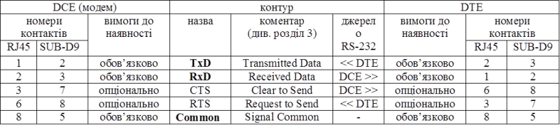
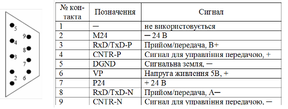

# 5. Проектування промислових мереж на базі послідовних інтерфейсів  

## 5.1. Загальні аспекти проєктування промислових мереж на базі послідовних інтерфейсів 

Здебільшого при застосуванні послідовних інтерфейсів протокол верхніх рівнів мережі вже відомий і часто слугує обмеженням і не є опцією. Тому в подальшому проектування зводиться до  проектування фізичного рівня, топології мережі, адресації пристроїв, а також таймінгу та конфігурації обміну, які повинні відповідати специфікації вибраного (вже заданого) протоколу. Зокрема:

1. Фізичний рівень:
   - Вибір типу інтерфейсу: RS-485 (найчастіше), RS-422, RS-232, CAN, якщо вибір вже не означено;
   - Тип кабелю: виті пари (кількість пар), матеріал ізоляції, наявність екранування, тощо;
   - Правила прокладання кабелів
   - Термінування ліній, узгодження імпедансу, захисне зміщення ;
   - Забезпечення захисту від перешкод та блискавкозахист.
   - Правила заземлення екранів кабелів
2. Топологія:
   - Лінійна (шинна) структура для RS-485;
   - Мінімізація відгалужень (stub lengths);
   - Обмеження довжини (наприклад, до 1200 м для RS-485 на низьких швидкостях).
3. Адресація:
   - Присвоєння унікальних адрес згідно з вимогами протоколу (наприклад, Modbus RTU – 1…247);
   - Уникнення конфліктів адрес;
   - Резервування адрес для діагностики.
4. Таймінг та обмін:
   - Встановлення швидкості обміну (baudrate), яка є спільною для всіх пристроїв на шині;
   - Означення тайм-аутів, затримок між кадрами, пауз між передаваннями (наприклад, згідно Modbus RTU – 3.5 символів тиші);
   - Підбір частоти опитування (polling) з урахуванням обсягу даних і допустимої затримки.
5. Конфігурація вузлів:
   - Налаштування COM-портів, параметрів UART;
   - Встановлення ролі пристрою (master/slave);
   - Програмування таблиць обміну (наприклад, Modbus map).
6. Діагностика та тестування:
   - Визначення точок моніторингу (sniffer-порти);
   - Використання аналізаторів трафіку;
   - Облік типових помилок (CRC, frame error, timeout).

7. Підбір компонентів обладнання:

   - Модулі послідовних портів (наприклад, RS-485 на ПЛК, перетворювачі USB↔RS-485);

   - Повторювачі (репітери), якщо довжина або кількість вузлів перевищує допустиме;

   - Гальванічні ізолятори для захисту ПЛК/ПЧ;

   - Клемні блоки, роз’єми, з урахуванням зручності монтажу та обслуговування;

8) Підбір та конфігурація програмного забезпечення:

   - Підтримка протоколу у SCADA/PLC/RTU (наприклад, реалізація Modbus Master/Slave у ПЛК);

   - Конфігуратори вузлів – утиліти для налаштування адрес, швидкості, регістрів (наприклад, інструменти від Schneider, Siemens, Advantech);

   - Бібліотеки/драйвери для SCADA або OPC-сервер (наприклад, Kepware, Matrikon для Modbus);

   - Засоби діагностики: аналізатори кадрів (ModScan, Modbus Poll), логери;

   - Системи резервування/виявлення помилок, якщо передбачено (наприклад, watchdog, логування втрат зв’язку).

Нижче розглянемо рекомендації до мереж Modbus RTU та Profibus DP. 

## 5.2. Рекомендації до проектування Modbus RTU/ASCII

Основними перевагами мереж MODBUS перед іншими мережами є їх простота та бюджетність рішення. Нерідко вибір конкретної мережі диктується наявними обмеженнями з боку вибраної платформи. Якщо вибрані засоби мають інтегровані канали з підтримкою MODBUS, то при необхідності побудови мережних структур є сенс в їх використанні. Тільки якщо дане рішення принципово не підходить по ряду критеріїв, необхідно змінювати конфігурацію обладнання а інколи і самі програмно-технічні засоби. Нижче розглянемо загальні підходи до проектування мереж MODBUS в типових ситуаціях.

### Особливості Modbus RTU/ASCII

Варто виділити наступні основні особливості, які треба враховувати в мережах Modbus RTU/ASCII:

- Модель доступу до шини: Ведучий–Ведений (Master–Slave) — лише ведучий ініціює обмін, решта пристроїв лише відповідають. Це потребує явного визначення одного пристрою як ведучого (наприклад, ПЛК або SCADA).
- Один обмін — один запит, одна відповідь — не допускається мовчазний обмін між двома веденими пристроями без участі ведучого.
- Адресація пристроїв: допустимий діапазон — 1…247 (0 зарезервовано для широкомовної передачі), всі адреси мають бути унікальними.
- Формат кадру — залежить від варіанта протоколу, усі пристрої на шині мають підтримувати однаковий формат:
  - RTU: двійковий формат, менший об’єм даних, суворіші вимоги до таймінгів (3.5 символів тиші між кадрами).
  - ASCII: текстовий формат, зручніший для ручного зчитування, проте менш ефективний.
- Однакова швидкість (baudrate) для всіх пристроїв на шині, типові значення: 9600, 19200, 38400 біт/с.
- Одна фізична лінія — одна сесія обміну. Відсутність підтримки кількох одночасних з’єднань або обробки кількох запитів.
- Відсутність автоматичного виявлення пристроїв — конфігурація має проводитись вручну (адреси, швидкість, паритет, стоп-біти).
- Обмеження кількості вузлів — типово до 32 без репітерів (залежить від драйверів та рівня сигналу, можливе розширення з повторювачами до 247).
- Підтримка стандартних функцій Modbus - кожен пристрій може підтримувати різний набір функцій, це треба враховувати при проектуванні.
- Час очікування відповіді — якщо ведучий не отримує відповідь у визначений час, це вважається помилкою (timeout).
- Очікування відповіді від відсутнього в мережі пристрої сильно впливає на обмін. 

Ці особливості мають прямий вплив на архітектуру обміну, вибір пристроїв та логіку керування, тому їх слід враховувати вже на етапі проектування. Потрібен список типових помилок і конфліктів у таких мережах?

### Послідовність розробки мереж MODBUS RTU/ASCII

В загальному випадку проектування мереж MODBUS RTU можна проводити по алгоритму, наведеному на рис.5.1 (для MODBUS ASCII аналогічно). Враховуючи функціонування протоколу прикладного рівня по моделі Клієнт/Сервер обміну повідомленнями, в блоці 1 необхідно визначити вузли, які повинні ініціювати обмін. Серед типів програмно-технічних засобів типовими ініціаторами обміну можуть бути:

-     засоби людино машинного інтерфейсу (HMI), до яких відносяться ОП та комп’ютери зі SCADA/HMI;

-     контролери, яким необхідно доступатись до інших контролерів або до периферійних засобів;

-     програматори або конфігуратори.

Засоби HMI обмінюються даними з контролерами, периферійними засобами або іншими засобами HMI. Для відображення плинних даних процесу, засоби HMI опитують їх значення з певною періодичністю тільки тоді, коли сторінка відображення є активною. Така поведінка є логічною, оскільки економляться часові ресурси мережі. Однак деякі засоби HMI дають можливість постійного опитування даних. Зокрема це характерно для операцій ведення архівів а також для задач тривог та аварій. Запис даних процесу з HMI проводиться як правило тільки при їх зміні. Тому логічним є те, що засоби HMI в мережі повинні бути Клієнтами. Виключенням можуть бути ситуації, коли в мережі повинно бути декілька засобів HMI, або коли є необхідність в передачі термінових повідомлень на термінал. Ці ситуації розглянуті нижче.

При необхідності обміну даними контролера з іншим контролером, або з периферійними засобами, він повинен ініціювати обмін, тобто бути Клієнтом. 

Програматори та конфігуратори теж повинні бути Клієнтами. В зв’язку з тим, що підключення їх до мережі проводиться тільки при необхідності, та при умові відсутності вимог до одночасного функціонування мережі разом зі зміною конфігурації/програми мережних вузлів, можна вважати, що програматор не входить в структуру мережі. В іншому випадку, необхідно виділяти окремий канал, тобто виділяти окрему мережу для пристроїв, які необхідно програмувати, якщо таке можливе (блок 14).  

У будь якому випадку, кількість клієнтських вузлів не може бути більше одного, оскільки прикладний процес Клієнта в одній мережі MODBUS RTU може знаходитись тільки на Ведучому. Якщо кількість Клієнтів (блок 1) все ж таки більше одного можна спробувати перенести клієнтські запити вузлів на один вузол з правами Ведучого (блок 4). Нижче розглянуті декілька прикладів такого переносу. Якщо перенос не вдається по певним причинам необхідно на вузлах виділити окремі канали, тобто замість одної мережі створити декілька мереж, якщо таке можливо (блоки 14 та 16), або змінити забезпечення вузлів (блок 15).       

Рис.5.1.Алгоритм проектування мереж MODBUS RTU 

Якщо Клієнт тільки один, його прикладний Процес буде виконуватися на вузлі з правами Ведучого шини (блок 3). Після всіх проведених вище перевірок, необхідно узгодити фізичні інтерфейси (блок 5) та при необхідності використати адаптери перетворювачі. При великих довжинах ліній необхідно підібрати репітер, після чого визначитися з кінцевою структурою, бітовим швидкостям та перевірити відповідність фізичних характеристик вимогам MODBUS RTU. 

При наявності часових комунікаційних характеристик для портів всіх засобів, які приймають участь в обміні, бажано розрахувати орієнтований час обміну. Якщо час обміну задовольняє, то мережа підходить для вирішення поставлених задач і можна переходити до розробки документів робочого проекту.

### Перенесення клієнтських запитів в мережах MODBUS RTU/ASCII

Якщо при проектуванні мережі MODBUS RTU виявилось декілька прикладних Процесів Клієнтів, можна спробувати їх перенести на один вузол.

На рис.5.2 показаний приклад вирішення задачі, в якій необхідно поєднати в мережу чотири ПЛК (PLC1-PLC4) , для обміну даними з певною періодичністю. Розглянемо, який з PLC повинен бути Клієнтом, а отже і Ведучим MODBUS RTU. Враховуючи, що обмін даними повинен бути періодичним, то кожен з ПЛК для інформаційних потоків може бути як ініціатором обміну, тобто Клієнтом, так і Сервером. Чи можна виділити єдиний Клієнтський вузол? PLC1  – не може бути єдиним клієнтським вузлом, бо присутній інформаційний зв’язок між PLC3 та PLC4. PLC2 теж не може, із-за зв’язків PLC3-PLC1 та PLC3-PLC4. Для PLC3 так як і для PLC4 залишається недосяжними зв’язок PLC1-PLC2. Для PLC4 крім того не може бути Клієнтом із-за зв’язку PLC3-PLC1. Таким чином явно виділяються як мінімум два Клієнти: PLC1 та PLC3.      

Рис.5.2. Перенесення клієнтських запитів на один ПЛК: зліва – постановка задачі, зправа – варіант вирішення задачі  

Рішення даної задачі може бути перенесення клієнтських запитів на один із вузлів, наприклад PLC3. Прямі клієнтські запити залишаються: PLC3 записує значення змінні3_1 в змінні1_1, зчитує значення зі змінні4 в змінні3_2. Для реалізації зв’язку між змінні2 та змінні1_2, необхідно щоб PLC3 зчитував ці значення з PLC2, після чого записував їх в PLC1. Як правило для цього виділяється додатковий буфер, в прикладі це змінні3_3.    

Вибір вузла з клієнтським прикладним Процесом, а отже Ведучого, може проводитись по різними критеріями: здатність комунікаційних каналів працювати в режимі MODBUS RTU Ведучого або Веденого, потужність комунікаційних каналів (продуктивність запитів що може обробити ПЛК), потужність процесору, зручність програмування або конфігурування, кількість прямих клієнтських запитів, зручність налагоджування, тощо. В нашому випадку ми зупинилися на PLC3, що обумовлено зменшенням кількості непрямих клієнтських запитів.  

Розглянемо наступний випадок. При необхідності підключення до єдиної мережі MODBUS RTU декількох засобів людино-машинного інтерфейсу, які, як ми зазначили, повинні формувати клієнтські запити, виникає необхідність в декількох Ведучих. На рис.5.3 продемонстрований приклад, в якому необхідно підключити дві операторські панелі до одного ПЛК як для відображення так і для управління. Жодна з операторських панелей не може взяти на себе ексклюзивні права Клієнта, оскільки інша операторська панель не зможе отримувати дані. Якщо операторські панелі підтримують MODBUS RTU в режимі Веденого, а ПЛК в режимі Ведучого, то рішення цієї задачі може бути як на рис.5.3 (зправа). Для цього в операторських панелях повинна бути виділена область пам’яті (на рис.5.3 змінні2 та змінні3), з якою буде обмінюватись ПЛК, генеруючи запити на читання та запис регістрів/бітів. Відображення та зміна значень змінні1 з операторських панелей буде проходити через ці виділені області. 

  

Рис.5.3. Перенесення клієнтських запитів з декількох ОП на один ПЛК: зліва – постановка задачі, зправа – варіант вирішення задачі 

Хоч в розглянутому прикладі використовуються операторські панелі, аналогічно вирішується ситуація, коли в якості засобів людино-машинного інтерфейсу виступають ПК зі SCADA, або комбінація ОП та SCADA. Для SCADA в цьому випадку необхідна наявність драйверів MODBUS RTU в режимі Веденого. 

В даній задачі можливе перенесення клієнтських запитів на один із засобів людино-машинного інтерфейсу. Однак це далеко не завжди можливо, оскільки в цьому випадку необхідно реалізувати переприсвоєння змінних з різними джерелами даних. Крім того, засоби HMI в більшості випадків не можуть забезпечити детермінований час доставки даних.

### Приклад розрахунку часу опитування Ведених на MODBUS-RTU

Розглянемо приклад розрахунку загального часу опитування 10-ти аналогових 16-бітних змінних для 4-х Ведених (рис.5.4). Швидкість передачі даних 19200 біт/с. Клієнтський Процес Ведучого (PLC5) та серверні Процеси Ведених (PLC1-PLC4) приймають повідомлення на початку циклу, а відправляють - в кінці циклу. Час циклу Ведучого = 10 мс, Ведених - 5с. 

 

Рис.5.4. Постановка задачі 

Побудуємо часову діаграму обміну (рис.5.5). З боку клієнтської програми повідомлення-запит формується за допомогою комунікаційної функції, відправка даних якої через комунікаційний порт проводиться в кінці циклу задачі, а отримування з порту – на початку циклу. Така поведінка клієнтської сторони цілком відповідає багатьом реалізаціям для різних ПЛК. В ПЛК Modicon MODBUS-Сервер реалізований на рівні операційної системи. Специфіка реалізації заключається в тому, що прийом MODBUS-запитів з комунікаційного порту системою проводиться на початку циклу, а відправка повідомлень-відповідей – вкінці. 

Слід зазначити, що реалізація MODBUS-Серверу може бути підтримана на рівні комунікаційного модуля, а обмін даними з пам’яттю самого пристрою проводитись через комунікаційні буфери. В цьому випадку реакція MODBUS-Сервера буде значно швидшою і не залежати від циклу програми. Для розрахунку часу транзакції для інших типів систем необхідно ознайомитися з деталями їх реалізації.  

На рис.5.5 показано, що надходження кадру приходить десь всередині циклу. Це значить, що їх обробка та генерація відповіді пройде приблизно через 1,5 циклу. Слід розуміти, що це усереднене значення, для найгіршої оцінки краще резервувати 2 часу циклу (тобто коли кадр прийшов відразу після опитування комунікаційного порту). Таким чином час транзакції для одного ПЛК, наприклад PLC1 (ТТ1),  буде дорівнювати:

`ТТ1=С5+T1.req+2C1+T1.res+C52`                            (5.1)

 

Рис.5.5. Часова діаграма до прикладу

ТТ1 розрахований з урахуванням 2 циклів затрачених Веденим на генерацію відповіді на повідомлення-запит. Якби транзакця проводилась не періодично, як по умові задачі, а по виникненню події, то в час транзакції необхідно б було включити також ще один цикл Ведучого. Нескладно вивести час опитування всіх Ведених:

`ТТall=C59+C12+C22+C32+C42+T1.req+T1.res+T2.req+T2.res+ T3.req+T3.res+ T4.req+T4.res`       (5.2)

Враховуючи, що цикли Ведених однакові, а кадри запитів і кадри відповідей для всіх Ведених мають однакову структуру, загальна формула буде мати наступний вигляд: 

`ТТall= C59 + C18 + (T1.req+T2.req)4`                      (5.3)

Розрахуємо час T1.req та T2.req. Час передачі кадру (Тframe) можна орієнтовно розрахувати по кількості символів (Nsymb) в кадрі та часу передачі одного символу (Tsymb):

`Tframe=NsymbTsymb`                         (5.4)

Час передачі одного символу розраховується:

`час передачі одного символу = кількість біт в символі / бітова швидкість;`

Час передачі кадрів буде дорівнювати (з урахуванням кількості символів на кадр):

`T1.req=8(11/19200)=4,58 мс`

`T1.res=25(11/19200)=14,33 мс`

`TTall=90+40+ (4,58+14,33)4= 206 мс.`

Таким чином, для опитування 10-ти змінних з 4-х Ведених зі швидкістю 19200 біт/с необхідно затратити приблизно 206 мс. Якщо необхідне періодичне опитування бажано зарезервувати певний час, наприклад ще додатково 100 мс.

### Реалізація фізичного рівня для MODBUS Serial

У стандарті MODBUS-IDA описуються також правила для реалізації мережі на фізичному рівні. MODBUS over Serial Line базується на використанні послідовних інтерфейсів RS-485, RS-422 та RS-232. Для  RS-485 означена топологія – це шина, до якої передбачено три способи підключення пристроїв (рис.5.6):

-     безпосередньо до магістрального (trunk) кабелю, так званим способом daisy-chain;

-     через пасивну коробку підключення та кабель відгалуження (Derivation);

-     через активну коробку та специфічний кабель відгалуження. 

 

Рис.5.6. Інфраструктура шини MODBUS для послідовного інтерфейсу RS-485

Інтерфейси між кабелями та елементами мережі мають наступні позначення (див. рис.5.6): ITr – інтерфейс до магістрального кабелю; IDv – інтерфейс між пристроєм та пасивною коробкою;  AUI  - інтерфейс між пристроєм та активною коробкою; LT – термінатори лінії.

Бітові швидкості визначені рівними 9600 біт/с та 19200 біт/с (по замовченню). Інші швидкості є опціональними. 

При використанні RS-485 стандарт означує правила підключення пристроїв по 2-х провідній та 4-хпровідній схемі, а також правила сумісності 2-х провідних та 4-х провідних інтерфейсів на єдиній лінії. Нижче розглянуте тільки 2-х провідне підключення, яке є обов’язковим.

По суті, 2-х провідне підключення зрештою є 3-х провідним, тому що крім ліній A-(D0) та B+(D1) використовується також загальна лінія C(Common), яка є обов’язковою (рис.5.7).

 

Рис.5.7. 2-провідне з’єднання пристроїв MODBUS по RS-485

Загальна кількість пристроїв обмежена: 32 пристрої на одному сегменті RS-485 без репітерів, використання яких дозволяється. Максимальна довжина кабелю залежить від швидкості, кабелю, кількості навантажень через daisy-chain і конфігурації мережі (2-х провідна або 4-х провідна). Для бітової швидкості 9600 і кабелю AWG26 максимальна довжина обмежена 1000м. Кабель відгалуження повинен бути коротше за 20 м. Якщо використовується мультипортова коробка з n портами, то кожен кабель відгалуження обмежений довжиною 40/n м. 

Загальний сигнальний провід (Common) обов’язково з’єднується з екраном в одній точці шини, яка як правило знаходиться на вузлі Ведучого, або його коробки відгалуження.

Для погашення відбиття хвиль на кінцях лінії між D1 та D0 виставляється термінатори лінії (LT). Термінатори дозволяється виставляти тільки на магістральному кабелі. В якості термінаторів можна використати:

-     резистор номіналом 150 Ом та потужністю 0.5 Вт;

-     послідовно з’єднані конденсатор (1 нФ, 10 В мінімум) та резистор номіналом 120 Ом (0.25 Вт) при використанні поляризації лінії

У стандарті MODBUS Serial означені правила реалізації захисного зміщення (поляризації), які  передбачають  підключення  живлення  номіналом 5 В між D1 та D0 через PullUp та PullDown резистори для утримання логічної ”1” на лінії при відсутності передачі. Номінал резисторів вибирається від 450 Ом до 650 Ом в залежності від кількості пристроїв (650 Ом при великій кількості). Захисне зміщення проводиться тільки в одній точці лінії, як правило на стороні Ведучого. Максимальна кількість пристроїв з реалізованою поляризацією зменшується на 4 порівняно з системою без поляризації. Поляризація є необов’язковою. Однак ряд пристроїв критично налаштовані на відсутність логічного сигналу. Якщо це так, то поляризацію необхідно реалізовувати самостійно, або використовувати існуючі схеми, якщо такі передбачені пристроями. В іншому випадку пристрої, які потребують поляризації не будуть нормально працювати в мережі. 

Стандарт означує також механічний інтерфейс, тобто типи роз’ємів, вилок та відповідність сигналів на контактах. В якості механічного терміналу можна використовувати клемну колодку, екранований RJ-45 (рис.5.8) або екранований SUB-D9 роз’єм (рис.5.9).

 

Рис.5.8. Використання RJ-45 типу з’єднувачів

Рис.5.9. Використання 9-пінового Sub-D типу з’днувачів

В таблиці 5.1 вказані призначення контактів для конекторів при 2-х провідному підключенню по RS-485, а в таблиці 5.2 по RS-232 . 

Таблиця 5.1. Призначення контактів конектора при підключенні по RS-485

 

Таблиця 5.2 Призначення контактів конектора при підключенні по RS-232

 

В якості кабелів для 2-х провідного типу з’єднання стандарт визначає подвійну екрановану виту пару категорій 4 (до 600м) або 5 (до 1000м), де в одній парі йдуть збалансовані сигнали D0 та D1, а в другій – сигнальна земля Common. Рекомендовані кольори кабелів: D1 жовтий; D0 коричновий;  Common сірий.

### Приклад схеми мережних з'єднань

Покажемо на прикладі схему мережних з’єднань для 2-х провідної реалізації шини MODBUS RTU з наступними вузлами:

- PLC1: VIPA CPU 115SER 6BL32 (Ведучий) через вбудований послідовний порт процесорного модулю;
- PLC2: TSX Twido TWDLMDA40DTK (Ведений) через комунікаційний модуль TWD NOZ 485T 
- PLC3: TSX Twido TWDLMDA40DTK (Ведений) через комунікаційний модуль TWD NOZ 485T 

На рис.5.10 показана схема мережних з’єднань до поставленої задачі. Специфікація мережних засобів дана в таб.5.3. 

Як видно з рис.5.10, PLC1 підключається до шини через пасивну коробку, а вірніше через клемну колодку, що в принципі рівнозначно. Це спричинено тим, що на ПЛК підключення йде з використанням 9-пінового SUB-D роз’єму, що потребує розробку власного кабелю, схема підключення (спаю) якого до коннектора та до клемної колодки показаний нижче основної схеми.  

Таким чином до вилки КК1 проводи кабелю КМ2 необхідно припаяти. Призначення пін розетки SER не співпадає зі стандартною. Піни 8 та 3, відповідно А(D0) та В(D1) йдуть в одну пару, яка потім підключаються до ХТ1:1 та ХТ1:2, а 5 та 6, відповідно  M5V(-5В) та P5V(+5В) йдуть в іншу виту пару кабелю КМ2. Живлення 5В необхідно для того, щоб реалізувати захисне зміщення (асиметрію) ввідповідно до стандарту, крім того -5В є сигнальною землею (Common). 

Кабель КМ2 підключається до ХТ1 відповідно до схеми, показаної на рис.5.10. Екран кабелю з’єднується з сигнальною землею відповідно до вимог стандарту. Слід нагадати, що ПЛК VIPA в цій системі є Ведучим, отже і захисне зміщення і з’єднання екрана з землею необхідно реалізовувати саме в цьому місці. Захисне зміщення проводиться за допомогою живлення 5В, яке береться з порту SER та двох резисторів.

 

Рис.5.10. Схема мережних з’єднань до прикладу 6.6

Таблиця 5.3. Специфікація мережних засобів

| №    | Позна-чення | Найменування                                                 | Назва                 | Кіль-кість | Примітка                     |
| ---- | ----------- | ------------------------------------------------------------ | --------------------- | ---------- | ---------------------------- |
| 1    | PLC1        | ПЛК VIPA 100                                                 | VIPA CPU 115SER 6BL32 | 1 шт.      | VIPA                         |
| 2    | PLC2, PLC3  | ПЛК Twido                                                    | TWDLMDA40DTK          | 2 шт.      | Schneider Electric           |
| 3    | MK1, MK2    | комунікаційний модуль для реалізації інтерфейсу RS-485, підключення під  гвинт | TWD NOZ 485T          | 2 шт.      | Schneider Electric           |
| 4    | KK1         | 9-піновий SUB-D коннектор типу вилка                         |                       | 1 шт.      |                              |
| 5    | XT1         | клемна колодка на 4 клеми                                    |                       | 1 шт.      |                              |
| 6    | TL1,TL2     | термінатори лінії                                            |                       | 2 шт       | виготовляються з поз. 7 та 8 |
| 7    | Rt          | Резистор 120 Ом (0.25 Вт)                                    |                       | 2 шт.      | у складі поз.6               |
| 8    | Ct          | Конденсатор 1 нФ ( >10  В)                                   |                       | 2 шт.      | у складі поз.6               |
| 9    | Ru,Rd       | Резистор 500 Ом (0.25 Вт)                                    |                       | 2 шт       |                              |
| 10   | КМ1         | кабель подвійна екранована вита  пара 5-ї категорії AWG26    |                       | 300 м      |                              |
| 11   | КМ2         | кабель подвійна екранована вита  пара 5-ї категорії AWG26    |                       | 2 м        |                              |
| 12   | КМ3         | кабель подвійна екранована вита  пара 5-ї категорії AWG26    |                       | 300 м      |                              |

PLC2 та PLC3 з’єднуються з шиною за допомогою комунікаційного модулю з клемною колодкою. Це дозволяє реалізувати підключення типу daisy-chain. Однак на колодці не передбачене місце підключення екрану, тому кабель екранується окремо. Слід нагадати, що екранування дозволяє вирівняти потенціали на різних кінцях кабелю.  

Термінатори ліній реалізовані послідовним з’єднанням резистору та конденсатору, оскільки на шині задіяне захисне зміщення.

### Побудова схеми інформаційної структури для мереж Modbus Serial

Виконання схеми розглянемо на прикладі (рис.5.11). Комп’ютер під’єднується до шини Modbus RTU через СОМ-порти. Для операційної системи ПК не важливо, чи це реалізація інтерфейсу RS-232, чи RS-485 в послідовному режимі, чи USB як емулятор СОМ-порта. Для неї це завжди буде СОМ-порт з певним номером. Оскільки при настройці драйверу необхідно вказати номер порту, його треба показати на інформаційному потоці. Також необхідно вказати який саме тип драйверу Master чи Slave використовується. При використанні драйверу Slave треба також вказати адресу.

У мережі Modbus RTU в більшості випадків використовуються стандартні Modbus-запити читання/запису регістрів/бітів, однак в багатьох реалізаціях доступні інші типи сервісів. Різні сервіси при необхідності можна показувати різними інформаційними шинами. Для спрощення схеми можна показувати тільки сервіс "Modbus запити", або "Modbus", або "MBAP", або у вигляді зноски (рис.5.11). 

Рис.5.11. Приклад інформаційної структури системи з Modbus RTU

ПЛК на шині може бути як Ведучим, так і Веденим. На рис.5.11 ПЛК1 та ПЛК2 є Веденими. Адреса Веденого прив’язується до логічного каналу контролера. В ПЛК1 логічний канал адресується як PORT1 (наприклад контролер TWIDO). В ПЛК2 адресація йде за принципом номер `модуля.номер_каналу` (наприклад), тобто з’єднання з Modbus RTU проводиться через 0-й канал 0-го модуля (TER - термінальний порт). Адреса Ведених для двох ПЛК для прикладу показана по різному: слово "slave" може вказуватись а може бути присутній тільки номер Веденого. 

У наступному прикладі (рис.5.12) Modbus RTU використовується не тільки для зв’язку між ПЛК та ПК а також в якості мережі вводу/виводу (рівень датчиків та розподіленої периферії). При зображенні масиву змінних у вигляді списку або розірваного масиву, необхідно показати змінні згідно Modbus моделі (області даних 1x,0x,3x,4x). Однак для зручності інтерпретації їх в системі ПЛК Premium (Master), Holding Registers на пристроях позначені як %MW. На перетворювачі частоти PDS1 та засобі розподіленого вводу/виводу RIO1 масив даних представлений у вигляді списку, де кожний елемент є змінна Modbus, відображена на конкретну змінну пристрою. На Ведучому вузлі (ПЛК САТ) над масивами даних показане позначення Ведених, де розміщені джерела даних. 

Рис.5.12. Приклад інформаційної структури системи з Modbus RTU

## 5.3. Рекомендації до проектування PROFIBUS DP

Загальні рекомендації з проектування мереж Profibus DP можна привести до наступних:

1. Фізичний рівень (RS-485)

- Тип кабелю — тільки рекомендований кабель типу A (двожильний, екранований, імпеданс 150 Ом).
- Топологія — лінійна (шина), дозволено використання активних репітерів для розгалуження.
- Макс. довжина сегмента (без репітерів, для 1 Мбіт/с) — до 200 м (за потреби більше — зниження швидкості або використання репітерів), взагалом до 1200 м.
- Кількість вузлів на сегмент — до 32 (з живленням шини) або 126 з використанням репітерів.
- Термінатори — обов’язково на обох кінцях сегмента (активні, живляться пристроями або окремо).

2. Адресація пристроїв. Унікальні адреси в межах 0…126, причому:

3. Типи пристроїв

- DP-Master Class 1 — керує процесом у реальному часі;
- DP-Master Class 2 — використовується для діагностики та конфігурації;
- DP-Slave — польові пристрої (ПЧ, модулі I/O, датчики).

4. Мультимастерність

- Profibus DP підтримує декілька ведучих (master) на одній шині (наприклад, один PLC і один програматор або SCADA).
- Master-пристрої координуються через маркер доступу (token passing).
- Кожен ведучий має свою конфігурацію ведених пристроїв, які не дублюються між ведучими.

5. Конфігурація обміну

- Завантаження GSD-файлів у систему конфігурації (TIA Portal, STEP 7, тощо);
- Означення IO-образу (input/output mapping);
- Налаштування Watchdog time, Fail-safe-значень, циклу опитування.

6. Електричні та завадозахисні вимоги

- Якісне екранування і заземлення;
- Врахування гальванічної ізоляції;
- Мінімізація довжини відгалужень;
- Уникнення петель заземлення.

7. Діагностика

- Підтримка стандартних діагностичних telegram;
- Використання аналізаторів Profibus (ProfiTrace, Softing тощо);
- Контроль синхронізації, затримок, втрат маркера.

### Реалізація фізичного рівня PROFIBUS DP

PROFIBUS DP на фізичному рівні базується на інтерфейсі RS-485 або на різних типах оптоволоконних з’єднань з бітовою швидкістю до 12 МБіт/с. Дані передаються 11-бітними символами (1 старт, 8 даних, 1 паритет, 1 стоп) методом NRZ. Максимальна кількість вузлів на сегмент – 32, максимальна довжина лінії залежить від бітової швидкості:

- від 9600біт/с до 187500біт/с – до 1000 м;
- 500 кбіт/с – до 500 м;
- 1500 кбіт/с – до 200 м;
- 12 Мбіт/с – до 100 м.

Використовується шинна топологія (рис.5.13). З’єднання вузлів проводиться по 2-провідній схемі (сигнал А та В) без сигнальної землі. На кінцях кожного сегменту виставляються термінатори лінії опором 220 Ом.  

В стані покою, коли всі передавачі мовчать, на лінії обов’язково повинна бути логічна „1”. Тобто в мережі необхідно реалізовувати поляризацію лінії (захисне зміщення). Для цього на кінцях лінії, крім термінаторів лінії, до шини підключається живлення 5 В через PullUp та PullDown резистори номіналом 390 Ом. Захисне зміщення з обох кінців забезпечується як правило безпосередньо кінцевими вузлами. Використання зміщення з двох кінців більш надійне порівняно з централізованою схемою, як наприклад у Modbus RTU, оскільки при відключенні одного з кінцевих вузлів мережа залишається робочою.  

Рис.5.13. Структура шинного сегменту RS-485 

Підключення пристроїв до загальної шини проводиться способом daisy-chain, тобто без відгалужень. Ці вимоги пов’язані з ефектом відбиття хвиль на коротких ділянках відгалуження. На рис.5.14 видно, що кабель шини повинен „зайти” до кожного і „вийти” з кожного пристрою. На цьому ж рисунку показаний спосіб розділення загальної шини на сегменти, які об’єднуються за допомогою репітерів. Таким чином можна досягнути іншої топології і збільшити кількість пристроїв та загальну довжину мережі. Треба пам’ятати, що наявність репітерів треба враховувати при виборі швидкості передачі даних.

 

 Рис.5.14. Сегментація та підключення пристроїв до PROFIBUS шини 

Деякі пристрої необхідно підключати тільки в певні періоди часу, наприклад програматори. В цьому випадку дозволяється підключення до шини через активні відгалужувачі (наприклад шинні термінали, репітери, активні кабельні з’єднувачі).

В якості з’єднувача в стандартах IEC 61158-2 і EN 50170-2 рекомендується використовувати 9-піновий SUB-D конектор, призначення контактів якого наведене на рис.5.15. Наявність наведених функцій для контактів 3,5,6 та 8 є обов’язковою. Стандарти дозволяють використовувати інший тип з’єднувачів, або клемну колодку з аналогічними контактами. 

Рис. 5.15 Призначення контактів 9-пінового SUB-D конектора

Стандарт IEC 61158-2 визначає два типи кабелів рекомендованих для підключення PROFIBUS шини: виті пари типу А та В. Припустимі швидкості передачі даних для них, в залежності від довжини лінії зв’язку показані у таблиці 5.4.  

Для шинної топології на базі RS-485 інтерфейсу, для достатнього погашення відбиття сигналів рекомендують мінімізувати довжину відгалужень від магістральної шини. Загальна ємність всіх відгалужень на шині не повинна перевищувати: 0,05 nF для 3 Мбіт/с, 6 Мбіт/с та 12 Мбіт/с; 0,2 nF для 1,5 Мбіт/с; 0,6 nF для 500 кбіт/с; 1,5 nF для 187,5 кбіт/с; 3,0 nF для 93,75 кбіт/с; 15 nF для 9,6 та 19,2 кбіт/с.

Таблиця 5.4  Залежність швидкості передачі даних від довжини лінії зв’язку

| Бітова швидкість (кбіт/с)         | 9.6  | 19.2 | 93.75 | 187.5 | 500  | 1500 | 3000         | 6000         | 12000        |
| --------------------------------- | ---- | ---- | ----- | ----- | ---- | ---- | ------------ | ------------ | ------------ |
| Макс. довжина кабелю   типу А (м) | 1200 | 1200 | 1200  | 1000  | 400  | 200  | 100          | 100          | 100          |
| Макс. довжина кабелю типу В (м)   | 1200 | 1200 | 1200  | 600   | 200  | 70   | не допустима | не допустима | не допустима |

Таким чином, для бітової швидкості порядку 1500 Кбіт/с сумарна довжина всіх відгалужень на кабелі типу А не повинна перевищувати 6,6 м, а для швидкості 3/6/12 Мбіт/с – 1,6 м. При високих швидкостях (3-12 Мбіт/с) необхідно включити додатковий імпеданс на лінії зв’язку відгалужувачів або в шинні з’єднувачі. Стандарт рекомендує використати для цього додаткові індуктивності (рис.5.16) 

Рис.5.16. Використання індуктивностей  в якості додаткових імпедансів 

Для кабелю типу А, індуктивності L1-L4 мають мати значення від 110±22 нГн. Значення індуктивностей розраховуються відповідно до імпедансу між B та B’, А та А’, ємнісних характеристик з’єднувача, трансиверу та інших деталей. Тобто при відключенні пристрою від шини (з’єднувача від пристрою), в даній точці може відбутись відбиття сигналу, що спотворює корисний сигнал на загальній шині. На рис. 5.17 показана конструкція мережного з’єднувача, при підключенні по типу daisy-chain. 

Слід зазначити, що у випадку використання кабеля типу В, термінатор лінії повинен мати опір 150 Ом замість 220 Ом (для кабеля типу А).  

У випадку прокладки лінії передачі у місцях з потужними електромагнітними завадами, необхідно використати екранований кабель та правильно виконати заземлення екрану. Екран кабелю повинен бути з’єднаний з корпусом штекера (рис.5.17).  

 

Рис.5.17. Схема мережного з’єднувача для мереж з бітовою швидкостю >1500 біт/с  

Згідно стандартів PROFIBUS заземлення екрану необхідно проводити в усіх точках підключення кабелю через відповідне виконання роз’ємів (рис.5.17) або по загальним правилам заземлення кабелів з високочастотним сигналом.   

### Приклад побудови схеми мережних з’єднань для PROFIBUS DP на базі RS-485. 

Розглянемо приклад підбору необхідних технічних засобів та розроблення схеми мережних з’єднань для PROFIBUS DP відповідно до наведеної структури рис.5.18.

 

Рис.5.18. Структурна схема системи до прикладу.

Рішення. PLC1 – Speed7 має вбудований PROFIBUS DP інтерфейс, який можна використати в якості Ведучого. PLC2 вибираємо з таким розрахунком, щоб в процесорному модулі теж був інтегрований інтерфейс ROFIBUS-DP (VIPA 215-2BP02), що дешевше ніж купувати окремий модуль. Модулі розподіленого вводу виводу RIO1 повинні бути PROFIBUS DP Веденими (VIPA 153-4PH00). Для підключення до мережі частотного перетворювача Lenze необхідний відповідний комунікаційний модуль E82ZAFPC001. Таким чином схема мережних з’єднань буде мати вигляд показаний на рис.5.19. Специфікація мережних засобів та вузлів дана в таблиці 5.5. На рис. 5.20 приводиться схема підключень кабелів КМ1-КМ3 до мережних з’єднувачів КК1-КК3. 

 

 Рис.5.19. Схема мережних з’єднань до прикладу 7.1.

 

Рис.5.20. Схема підключення кабелів до мережних з’єднувачів (до прикладу 7.1).

Таблиця 5.5. Специфікація мережних засобів та вузлів

| №    | Позна-чення | Назва                                                        | Тип            | Кіль-кість | Фірма |
| ---- | ----------- | ------------------------------------------------------------ | -------------- | ---------- | ----- |
| 1    | PLC1        | ПЛК VIPA Speed7                                              | VIPA 314-6CF02 | 1 шт.      | VIPA  |
| 2    | PLC2        | ПЛК VIPA 200                                                 | VIPA 215-2BP02 | 1 шт.      | VIPA  |
| 3    | RIO1        | Модуль  віддаленого вводу/виводу VIPA 100                    | VIPA 153-4PH00 | 1 шт.      | VIPA  |
| 4    | PDS1        | Частотний перетворювач Lenze 8200 Vector для управління асинхронним  двигуном 0,37 кВт | E82EV371K2C    | 1 шт.      | LENZE |
| 5    | MK1         | комунікаційний модуль для роботи в мережі PROFIBUS DP частотних перетворювачів Lenze 8200, з вбудованим  термінатором | E82ZAFPC001    | 1 шт.      | LENZE |
| 6    | KK1-KK3     | мережний з’єднувач Easy Conn PB 90° для мережі  PROFIBUS DP з вбудованим термінатором | VIPA 972-0DP10 | 3 шт.      | VIPA  |
| 7    | KM1         | Кабель екранована вита пара для PROFIBUS DP (тип „Стандарт”) | VIPA 830-0LE00 | 30 м       | VIPA  |
| 8    | KM2         | Кабель екранована вита пара для PROFIBUS DP (тип „Стандарт”) | VIPA 830-0LE00 | 40 м       | VIPA  |
| 9    | KM3         | Кабель екранована вита пара для PROFIBUS DP (тип „Стандарт”) | VIPA 830-0LE00 | 15 м       | VIPA  |

### Побудова схеми інформаційної структури для Profibus

На прикладному рівні (на "рівні профілів") в Profibus можливе використання різних типів сервісів, що необхідно показати на схемі інформаційної структури. Для обміну процесними даними можуть використовуватись циклічний (Data-Exchange) та ациклічний DP-обмін даними, обмін типу Видавець-Абонент, обмін FMS-повідомленнями. Крім того на цій же мережі можуть підтримуватись інші сервіси, які не визначені в стандартах Profibus. Наприклад в програмно-технічних засобах Siemens та VIPA підтримуються Siemens-сумісні S7-функції обміну (до них також відносяться PG/OP-сервіси) та S5-функції (SEND/RECEIVE). Таким чином на одній мережі можуть бути зображені декілька інформаційних шин.

Вхідні та вихідні дані, що приймають участь в обміні показуються відповідно як окремі масиви даних. В наповненні масиву даних вказується джерело даних для даного вузлу (змінні, номера входів або виходів, назва параметру, тощо). 

Для клієнт-серверного типу обміну циклічними та ациклічними даними процесу, позначення клієнтської та серверної сторони співпадає з загальноприйнятими. Для обміну Видавець-Абонент, номера потоків в фігурних стрілках можна вказувати з боку Видавця а можна з боку Ведучого. В будь якому випадку позначення необхідно описати.   

При необхідності, на схемі інформаційних потоків можна окремо виділяти групи SYNC/FREEZE, консистентність даних, тощо. 

На рис.5.21 наведена схема інформаційної структури для системи з PROFIBUS DP. Всі пристрої, крім OP1 (операторська панель Siemens TP 177B), обмінюються даними з Ведучим з використанням циклічного DP-обміну Data-Exchange. На графічному зображенні даний сервіс показаний як "DP DataExch". Враховуючи, що в даному обміні процес Ведучого являється Клієнтом, саме з його боку показаний бік ініціювання обміну. 

Вузол OP1 є DP-Веденим на шині (операторські панелі можуть бути і Ведучими шини). Дана панель використовує DP сервіси тільки для відправки Ведучому (PLC1) номеру нажатої клавіші на сенсорному екрані панелі (режим Direct Keys). Для цього в області входів PLC1 виділяється 4-ри байти (IB3-IB6), де буде зберігатися стан 32 клавіш панелі. Зчитування та запис значень для змінних Tag1-Tag50 операторська панель проводить з використанням S7 функцій зв’язку, зокрема сервісів PG/OP. 

S7-комунікації являються стандартним типом зв’язку між ПЛК Siemens S7-200, S7-300/400 та засобами HMI від Siemens. Вони базуються на клієнт-серверному обміні зі встановленням з’єднання. З’єднання можуть бути наперед конфігурованими або без попередньої конфігурації. В будь якому випадку Клієнт та Сервер організують з’єднання через транспортні адреси TSAP. Адреса TSAP складається з 2-х байтів: 1 байт – ресурс з’єднання (Connection Resource), 2 байт – шасі та слот модуля з’єднання (Rack/Slot). Для PG та OP з’єднань зарезервовані спеціальні ресурси з’єднання: PG =1 та OP=2, тому при використанні цих серверних ресурсів, попередньо конфігурувати з’єднання не потрібно. Виходячи з вищесказаного, для налаштування S7 зв’язку, при конфігурації панелі необхідно крім адреси DP-вузла вказати шассі (=0) та слот (=2), де знаходиться центральний процесор PLC1, який є його партнером по зв’язку. Враховуючи що панель використовує ОР ресурс, серверний TSAP для зв’язку ОР1-PLC1 буде дорівнювати TSAP=02.02. Клієнтський TSAP в даному випадку виділяється в ОР1 самостійно, тому його вказувати при конфігуруванні не потрібно. 

Слід звернути увагу, що на схемі інформаційної структури 8-й потік, що реалізований з використанням PG/OP сервісів ініціюється з боку операторської панелі ОР1, оскільки вона являється клієнтом.

Рис.5.21. Приклад схеми інформаційної структури системи з PROFIBUS

## Запитання для самоперевірки

1. Які аспекти проєктування визначаються при використанні послідовних інтерфейсів у промислових мережах?
2. Які фізичні параметри потрібно враховувати при прокладанні кабелів RS-485?
3. Які обмеження існують для топології та довжини шини при використанні RS-485?
4. Чому важливо правильно організувати адресацію пристроїв у мережі Modbus RTU?
5. Які параметри таймінгу критичні для стабільної роботи Modbus RTU?
6. Які типи обладнання використовуються для захисту та повторення сигналу в послідовних мережах?
7. Для чого потрібні аналізатори кадрів або sniffer-порти у мережах Modbus?
8. У чому полягає модель обміну Master-Slave в Modbus RTU?
9. Які обмеження існують щодо кількості ведучих вузлів у Modbus RTU?
10. Чому іноді необхідно переносити клієнтські запити на один вузол у мережі Modbus RTU?
11. Яким чином операторські панелі можуть взаємодіяти з контролером у мережі Modbus RTU, якщо їх більше однієї?
12. Як можна розрахувати орієнтовний час опитування вузлів у мережі Modbus RTU?
13. Як виглядає 2-провідне підключення пристроїв у Modbus по RS-485?
14. Що таке захисне зміщення і навіщо воно потрібне у мережі RS-485?
15. Які типи роз’ємів використовуються для підключення пристроїв до шини RS-485?
16. Яку структуру має інформаційна схема системи на базі Modbus RTU?
17. Які особливості реалізації логічних каналів і адрес у схемах інформаційної структури?
18. Які обмеження та вимоги визначаються при побудові фізичної структури PROFIBUS DP?
19. Які типи обміну даними підтримує Profibus на прикладному рівні?
20. Як виглядає приклад інформаційної схеми для системи з PROFIBUS DP?
