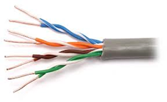
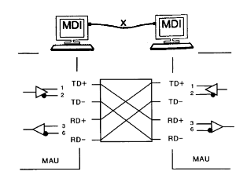
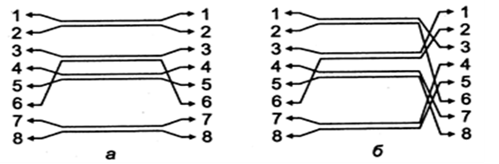
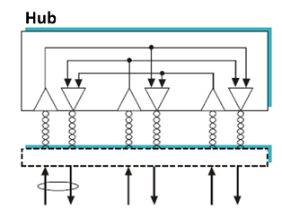

# Проектування промислових мереж на базі Ethernet

## 6.1. Загальні аспекти проєктування промислових мереж на базі Ethernet

Проєктування промислових мереж на базі Ethernet потребує врахування як технічних характеристик обладнання, так і організаційно-функціональних вимог до системи керування. На відміну від офісних мереж, де переважає несталий трафік з низькими вимогами до часу доставки, у промислових мережах часто необхідна гарантована детермінованість, надійність, безперервна робота і можливість ізоляції критичних сегментів.

Першим етапом проєктування є визначення структури виробничого процесу, який підлягає автоматизації. Це включає перелік вузлів (ПЛК, HMI, сервери, частотні перетворювачі, пристрої вводу-виводу), топологію розміщення обладнання, необхідні швидкості обміну і допустимі затримки. У разі наявності кількох незалежних зон керування варто передбачити логічне або фізичне розділення мережевих сегментів.

Далі обирається тип топології (зірка, кільце, дерево) відповідно до фізичного розташування об’єктів, вимог до резервування і структури керування. Основним способом комунікації є комутатори Ethernet, які об'єднують пристрої в локальні сегменти. При цьому важливо визначити, які з них мають бути керованими, які потребують PoE, скільки портів потрібно і чи необхідна підтримка VLAN.

Наступним кроком є планування адресного простору. Для невеликих систем часто використовують статичні IP-адреси, призначені вручну з внутрішнього діапазону. У більших системах застосовується поділ на підмережі, що полегшує ізоляцію трафіку і спрощує маршрутизацію. У разі потреби доступу до зовнішніх мереж або інтеграції з ІТ-системами використовуються маршрутизатори, шлюзи або міжмережеві екрани.

Особливу увагу слід приділити захисту мережі — як з точки зору фізичного доступу, так і логічної безпеки. Бажано обмежити широкомовні повідомлення, контролювати активність невідомих пристроїв, застосовувати VLAN, фаєрволи, а також протоколи діагностики (наприклад, LLDP) для виявлення топології.

Завершальним етапом є створення технічної документації: схема мережі, таблиця адресації, опис налаштувань комутаторів і маршрутизаторів, перелік використовуваного обладнання, опис політик безпеки. Усі ці матеріали мають бути доступними для обслуговуючого персоналу і легко оновлюватися при модифікаціях системи.

Таким чином, проєктування промислової Ethernet-мережі вимагає системного підходу, урахування особливостей об’єкта керування, правильного вибору обладнання і продуманого структурування трафіку для забезпечення стабільної, безпечної та масштабованої системи.

## 6.2. Особливості Ethernet

### Фізичний рівень 

На фізичному рівні Ethernet дозволяє використовувати різноманітні середовища передачі даних для кожної з яких є стандартна назва виду XBaseY, де X - бітова швидкість в Мбіт/с (10,100,1000...), Base – ключове слово (позначає немодульовану передачу), Y – умовне позначення середовища передачі і дальності зв’язку. Сьогодні найбільш вживаним є гігабітний Ethernet та 100 Мбітний Ethernet (промислове застосування) на витій парі, а також варіанти з оптоволоконним зв'язком.  

При використання витої пари пристрої підключають через роз’єми типу RJ-45. На пристроях використовують вилки, а на кабелях – розетки. Призначення контактів роз’єму мережного адаптеру (порт типу MDI) показане на рис.6.1. 

Рис.6.1. Призначення контактів роз’єму RJ-45.

Рис.6.2 Зовнішній вигляд зачищеного "хвоста" кабелю. 

Для створення з'єднання необхідної довжини відрізають кабель необхідної довжини і обжимають його з двох боків роз'ємами з використанням спеціальних інструментів, або замовляють обжатий кабель певної довжини. Після обжимання необхідно перевірити якість з використанням спеціальних інструментів (рис.6.3).   

рис.6.3. Інструмент для обжимання кабелю (ліворуч) та набір різноманітних інструментів для обжимання та тестування.

Для розуміння правил підключення розглянемо схему на базі 10BaseT та 100BaseTX, в якій показано порти пристроїв з точки зору приймачів та передавачів (на рис.6.4 показані трикутниками). Передавачі  - це перетворювачі, які за появи логічного сигналу з пристрою формують на його виході відповідний рівень сигналу за напругою, який можна передати на більшу відстань (100 м). Приймачі - навпаки, за появою фізичного сигналу на вході пристрою, видають на його плату логічної обробки логічний сигнал. У цьому типі мережі використовується тільки дві пари провідників які з'єднують між собою передавач одного пристрою та приймач іншого та навпаки. Кожен передавач підключається двома проводами до приймача іншого пристрою. Тому, якщо два пристрої підключаються безпосередньо (без комутатора та концентратора) їх треба з'єднувати навхрест.    

рис.6.4. Спрощена схема безпосереднього з'єднання портів пристроїв в Ethernet 10BaseT. 

Порти старих концентраторів або комутаторів мають тип MDIX, в яких сигнали Rx та Tx поміняні місцями.

рис.6.5. Спрощена схема з'єднання портів пристроїв в Ethernet 10BaseT через комутатори або коцентратори. 

Таким чином, при підключені пристрою з MDI (мережна карта) до MDIX (концентратор/комутатор) використовується "прямий кабель" (рис.6.7а), а при безпосередньому підключенні двох MDI – "перехресний кабель" (рис.6.7б).

 Рис.6.6. Схеми підключень пристроїв мережі Ethernet

Схема "прямого" та "перехресного" кабелю показана на рис.7 (a – пряме, б – перехресне).  

Рис.6.7. Схема "прямого" та "перехресного" кабелю 

При 4-х провідному підключенні (в Ethernet 10BaseT, 100BaseTX ) дві інші пари можуть не використовуватися. Є мережі які використовують їх для інших цілей. Наприклад PoE (Power over Ethernet) використовує їх для передачі живлення.  

Для Fast Ethernet 100BaseTX також використовується 4-х провідне підключення. А от в 100BaseT4, замість 2-х пар використовуються 4-ри пари проводів, де дві пари можуть працювати або в один або в другий бік (передачі або приймання) в залежності від навантаження, тому вони маркуються як `BI`.  У Ethernet 1000BaseT по кожній парі може відбуватися приймання і передача сигналу одночасно, забезпечуючи швидкість передачі 1 Гбіт/с (рис.6.8).

Рис.6.8. Схема з'єднання портів пристроїв в Ethernet 1000BaseT.

У будь якому випадку максимальна довжина кабелів між пристроями не може перевищувати 100 м.

### Концентратори та комутатори 

У найпростішій схемі мережі 10BaseT, які сьогодні практично не зустрічаються, центральний елемент зірки представляє собою активний елемент, який називається концентратором (**hub**, хаб). Кожна станція з’єднується з ним двома витими парами – для прийому і для передачі. Враховуючи що канали мають пару передавача і приймача, через яких ведеться підключення до високошвидкісної внутрішньої шини (а не напряму), він також має функції повторювача, що дозволяє збільшити відстань між вузлами до 200 м. Хоч фізично така схема представляє собою зірку, логічно вона є шиною, адже передача кожної станції приймається усіма іншими станціями. Такий обмін можливий тільки за використання напівдуплексного обміну, коли тільки один пристрій в мережі веде передачу свого кадру, а інші в цей час тільки отримують ці дані. Випадковий доступ пристроїв до передачі своїх кадрів в Ethernet також може призводити до колізій при одночасній передачі. Для вирішення колізій в Etehrnet на базі концентраторів використовується спеціальний метод CSMA/CD, який передбачає короткочасні конфлікти (колізії) та їх вирішення випадковим чином.

Рис.6.9. Підключення через концентратор. 

Концентратори можуть об’єднуватись в ієрархічну структуру із головного та проміжних хабів. Концентратори в комп’ютерних мережах на базі Ethernet практично вже не використовуються, замість них використовують комутатори.

Комутатори 2-го рівня (layer 2 **switch**), або просто "**комутатори**" працюють по іншому принципу. Кадр, який приходить на комутатор по одному порту, направляється тільки в той порт до якого підключений вузол-приймач (рис.6.10). Тобто комутатори 2-го рівня аналізують кадр, та по МАС-адресі приймача визначають куди необхідно його направити. Відбувається комутація між портами, тобто створюється канал, який не заважає створювати такі самі канали між іншими портами. Це в свою чергу виключає можливість колізії, тому немає необхідності в використанні алгоритму CSMA/CD. Поява таких комутаторів дала можливість працювати в дуплексному режимі (одночасної передачі та прийому між пристроями), що значно збільшило ефективність роботи Ethernet. В дуплексному режимі використовується такий же формат кадру МАС-стандарту.

Рис.6.10. Підключення через комутатор. 

Таким чином Ethernet на базі концентраторів організований через напівдуплексний зв'язок, а на базі комутаторів - дуплексний.

За способом передачі кадрів комутатори діляться на:

-  store-and-forward (з проміжним збереженням)– комутатор отримує з вхідного каналу весь кадр, аналізує його на наявність помилок і у випадку їх відсутності відправляє кадр на вихідний канал отримувача;

-  cut-through (наскрізний) – комутатор починає відправляти дані у вихідний порт призначення відразу, як тільки визначить МАС адресу отримувача, тобто без очікування кінця передачі та аналізу цілісності отриманого кадру; 

Вибір того, чи іншого комутатора залежить від протоколів верхніх рівнів, що базуються на Ethernet. Перший тип комутаторів працює більш повільно, однак відкидає пошкоджені кадри вже в момент їх отримання. 

Сучасні комутатори 2-го рівня можуть надавати ряд додаткових сервісів. Наприклад це комутатори з підтримкою технології VLAN, виділення пріоритетних портів, додаткова MAC фільтрація, IGMP snooping (потребує додаткової обробки на мережному рівні). Такий тип комутаторів потребує конфігурування, тому отримали назву **керованих комутаторів** (**managed switches**). Для конфігурування та керування керованими комутаторами можуть надаватися різні типи сервісів, наприклад WEB, SNMP. Тож комутатори діляться на некеровані (unmanaged), що не потребують конфігурування, та керовані (managed) логіка роботи яких залежить від конфігурування. 

Пристрої з Ethernet підтримують сумісність зі старими стандартами. Тобто, наприклад пристрій з 1Гбітним Ethernet може з'єднуватися з пристроєм, що підтримує 100BaseT4. Крім того вони можуть працювати як в дуплексному так і в напівдуплексному режимі.  На сьогоднішній день більшість телекомунікаційних пристроїв підтримують технологію **Auto-negotiation** (авто-переговори), що дозволяє автоматично налаштувати оптимальний зв’язок між пристроями. В момент ініціалізації зв’язку (при включенні або підключенні пристрою в мережі), по спеціальному протоколу пристрої домовляються про швидкість передачі та тип з’єднання (дуплекс/напівдуплекс). Авто-переговори дають можливість відмовитись від ручного налаштування мережних карт. Однак слід зазначити, що для використання технології авто-переговорів, карти пристроїв які зв’язуються, повинні її підтримувати, інакше можлива втрата кадрів або взагалі відсутність обміну.

Повсякмісне використання Ethernet в офісних будівлях, призвело до необхідності організації робочих місць розетками для підключення комп’ютерів до мережі. Таким чином при проектуванні виникала потреба в правильному плануванні кабельної системи будівлі, що включала в себе всі телекомунікаційні ланцюги (комп’ютерна мережа, телефон, аудіо, відео тощо). В результаті сумісної роботи комітетів ISO та IEC виник стандарт ISO/IEC 11801 на організацію універсальних структурованих кабельних системи (СКС) в офісних приміщеннях. 

### Адресація мережних карт

Для адресації мережних карт в мережі використовується 6-байтові **МАС**-адреси. Адреса як правило записується в 16-ковому форматі: наприклад `EC-F4-BB-83-B0-4E` або `EC:F4:BB:83:B0:4E`. Кожний мережний адаптер повинен мати прошиту в неї виробником унікальну МАС-адресу. Для відправки можна використовувати адресацію окремого вузла (індивідуальну), усіх вузлів (широкомовну), декількох вузлів (групову). Широкомовна адреса `FF-FF-FF-FF-FF-FF`.  

Унікальність адреси МАС досягається комбінацією: "адреса" виробника карти + номер карти (рис.6.11). Перші 3 байти виділені виробнику обладнання, видаються кординуючим комітетом IEEE, наприклад:

- `00:80:F4` -  Telemecanique,  
- `EC:F4:BB` – Dell Inc. 

За цими першими трьома байтами можна визначити виробника в Інтернет, наприклад на сайті https://macaddress.io/ . Наступні 3 байти – виробник виділяє на кожну свою карту. Унікальна (прошита) адреса називається також глобальною. Адміністратор може назначити адресу локально.  

Рис.6.11. Структура MAC адреси. 

Для підтримки керованих мостів та комутаторів IEEE випустила додатковий стандарт 802.1Q. Стандарт IEEE 802.1Q – забезпечує незалежний від виробника спосіб реалізації віртуальних мереж VLAN (Virtual bridged Local Area Network) за рахунок виділення частини портів комутатора в незалежні групи перемикання. Це дозволяє менеджеру мережі призначити окремі групи портів незалежним віртуальним мережам. Розділення між віртуальними мережами проходить по виділеним для цього полям кадру. 

Кадри VLAN можуть одночасно функціонувати з стандартними кадрами IEEE 802.3 та DIX. Використання VLAN потребує керованих елементів мережної інфраструктури - керовані мости, керовані комутатори, тощо.  

Рис.6.19. Приклад VLAN

### Принципи роботи комутаторів

Комутатор (switch) має чотири функції: навчання (Learning), широкомовна передача (Flooding), переадресування (Forwarding) та фільтрація(Filtering).

Комутатор приймає всі свої рішення на основі інформації, що міститься в заголовку кадру. Зокрема, комутатор використовуватиме MAC-адресу джерела та MAC-адресу призначення для прийняття рішень щодо передресування. Однією з функцій комутатора є створення таблиці MAC-адрес, зіставляючи кожен з його портів комутатора з MAC-адресою підключених пристроїв для подальшої переадресації.

Таблиця MAC-адрес спочатку порожня, і щоразу, коли комутатор щось отримує, він переглядає поле MAC-адреси джерела вхідного кадру. Він використовує MAC-адресу джерела та порт комутатора, на якому отримано кадр, для створення запису в таблиці MAC-адрес. Рано чи пізно, оскільки кожен підключений пристрій неминуче щось надсилає, комутатор матиме повністю заповнену таблицю MAC-адрес. Цю таблицю потім можна використовувати для швидкого пересилання кадрів відповідно до їх призначення.

Однак, незважаючи на наведений вище процес навчання, комутатор неминуче в якийсь момент отримає кадр, призначений для MAC-адреси, розташування якої комутатор не знає. У таких випадках єдиний варіант комутатора — просто скопіювати кадр і надіслати його на *всі* порти. Ця дія відома як Flooding (широкомовна передача). 

Широкомовна передача гарантує, що *якщо* передбачений пристрій існує і *якщо* він підключений до комутатора, він обов’язково отримає кадр. Звичайно, так само цей кадр отримає кожен інший пристрій, підключений до цього комутатора. І хоча це не ідеально, це абсолютно нормально. Мережевий адаптер кожного підключеного пристрою отримає кадр і перегляне поле MAC-адреси призначення. Якщо вони не є тим одержувачем, вони просто мовчки проігнорують кадр.

Проте, якщо вони *є* призначеним пристроєм, комутатор може бути задоволений, знаючи, що йому вдалося успішно доставити кадр. Крім того, коли призначений пристрій отримує кадр, буде згенеровано відповідь, яка, надіслана на комутатор, дозволить комутатору вивчити та створити таблицю MAC-адрес, що відображає цей невідомий пристрій на його порт комутатора.

В ідеалі, звичайно, комутатор матиме запис у своїй таблиці MAC-адрес для кожної MAC-адреси призначення, яку він зустріне. Коли це трапляється, комутатор пересилає кадр на відповідний порт комутатора. Існує три методи, за допомогою яких комутатор може пересилати кадри. Вони коротко описані нижче.

- **Store and Forward** – Комутатор копіює весь кадр (заголовок + дані) у буфер пам’яті та перевіряє кадр на наявність помилок перед пересиланням. Цей метод є найповільнішим, але забезпечує найкраще виявлення помилок і додаткові функції, наприклад визначення пріоритету певних типів трафіку для швидшої обробки.
- **Cut-Through** – Комутатор нічого не зберігає, а перевіряє лише необхідний мінімум для читання MAC-адреси призначення та пересилання кадру. Цей спосіб є найшвидшим, але не забезпечує виявлення помилок і можливості для додаткових функцій.
- **Fragment Free** – Цей метод є сумішшю двох попередніх. Комутатор перевіряє лише першу частину кадру (64 байти) перед пересиланням кадру. Якщо сталася помилка передачі, вона зазвичай помічається в перших 64 байтах. Таким чином, цей метод забезпечує «достатньо добре» виявлення помилок, одночасно збільшуючи швидкість і ефективність, уникаючи збереження всього кадру в пам’яті перед його пересиланням.

Сьогодні різниця у швидкості між цими трьома способами незначна, і більшість комутаторів працюють у режимі Store та Forward.

І, нарешті, остання функція комутатора — фільтрація. В основному ця функція стверджує, що комутатор ніколи не пересилатиме кадр назад через той самий порт, який отримав кадр, а відправляє саме туди, куди цей кадр призначений.  Рідко хост надсилає кдар зі своєю MAC-адресою, як адресою призначення. У будь-якому випадку, коли це трапляється, комутатор просто відкидає кадр.

Варто розуміти що звичайні комутатори не можна з'єднувати в петлі, наприклад паралельно двома кабелями, бо це неминуче приведе до перезавантаження мережі. 

### Кільцеві топології

Кільцеві топології використовуються у випадках, коли необхідна підвищена відмовостійкість мережі. На відміну від зіркоподібної структури, в якій вихід з ладу центрального комутатора призводить до втрати зв’язку всіх підлеглих пристроїв, кільцева топологія дозволяє зберегти працездатність мережі навіть при розриві в одному з сегментів. Це досягається завдяки механізмам автоматичного резервування каналу зв’язку.

Класичний Ethernet не підтримує замкнені кільця через проблему з широкомовними штормами. Щоб забезпечити працездатність такої структури, використовують спеціальні протоколи, які блокують один із сегментів кільця, а при розриві автоматично активують резервний шлях. Найпоширенішими протоколами для цього є STP (Spanning Tree Protocol), RSTP (Rapid Spanning Tree Protocol) та MRP (Media Redundancy Protocol). Перші два підтримуються багатьма офісними і промисловими комутаторами, однак мають довший час перемикання, тоді як MRP спеціально розроблений для промислових мереж і забезпечує час відновлення до 200 мс при кільці до 50 вузлів.

Кільцева топологія особливо корисна для розгалужених мереж АСКТП, які охоплюють великі виробничі площі, де встановлення центрального комутатора є недоцільним або занадто дорогим. В такому випадку використовуються керовані комутатори з підтримкою MRP, які з'єднуються послідовно, утворюючи кільце. Кожен вузол одночасно є частиною шляху до інших вузлів, що зменшує довжину кабельних трас і покращує обслуговуваність.

У практиці проектування важливо враховувати обмеження кільцевих топологій, зокрема максимальну кількість комутаторів у кільці, загальну затримку передачі, а також сумісність протоколів резервування між обладнанням різних виробників. У разі необхідності інтеграції кількох кілець або забезпечення доступу до SCADA/MES ззовні, кільцева структура може поєднуватися з зіркоподібною або ієрархічною топологією через проміжні маршрутизатори або магістральні комутатори.

 

Рис.6.20. Приклад мережі з кільцевою топологією

### Використання оптоволоконних зєднань

Оптоволоконні з’єднання застосовуються в промислових мережах у випадках, коли вита пара не забезпечує потрібної дальності або надійності. На відміну від мідних з’єднань, оптоволокно має значно менші втрати сигналу та не піддається електромагнітним завадам, що особливо важливо в умовах виробництва з великою кількістю електродвигунів, зварювального обладнання та частотних перетворювачів.

Оптоволоконні з’єднання доцільно використовувати при відстанях понад 100 метрів, оскільки це межа для типових Ethernet-з’єднань на мідній парі. У промислових умовах часто застосовуються одномодові або багатомодові волокна з роз’ємами SC, LC або ST. Одномодове волокно краще підходить для великих відстаней (до десятків кілометрів), тоді як багатомодове ефективне на коротших ділянках до 2 км, але з дешевшими передавачами.

Комутатори з оптоволоконними портами зазвичай мають SFP-слоти, в які встановлюються відповідні трансивери, що дозволяє обирати тип волокна та дальність передачі. При проектуванні слід враховувати не лише відстань, а й тип середовища, умови монтажу, допустимий радіус вигину кабелю та потребу в резервуванні. Також важливо враховувати стандарти інсталяції, зокрема вимоги до прокладання в лотках, захист від пилу та вологи, а також допустимі температурні діапазони.

Рис.6.21. Використання SFP-модулів

Оптоволоконні з’єднання особливо корисні для з'єднання віддалених ділянок, магістральних ліній між щитами, а також між будівлями або поверхами. Вони також можуть використовуватися в кільцевих топологіях для обмеження впливу завад і покращення електричної ізоляції між сегментами мережі, що важливо для уникнення проблем з потенціалами заземлення. У ряді випадків оптоволокно є єдиним варіантом, що відповідає вимогам до детермінованості в мережах реального часу.

## 6.3. Промисловий Ethernet

На сьогоднішній день практично все офісне обладнання можна об’єднати за допомогою технологій Internet/Intranet та мереж Ethernet. Серед переваг цих технологій можна виділити їх відкритість, популярність, доступність, швидкодію та постійний розвиток. Все це спонукало до пошуку рішень для їх використання при інтеграції організаційно-економічного рівня з рівнем АСКТП а також на самому рівні АСКТП в якості промислової мережі. 

Слід зазначити, що технології на базі TCP/IP (Intranet технології), які знаходяться на мережному та транспортному рівнях, не передбачають обов’язкову реалізацію нижніх рівнів на базі Ethernet. Для офісних систем використовуються і інші мережі. Однак промислові мережі не підтримували TCP/IP, тому для прозорої взаємодії АСКТП та верхніх рівнів керування використання Ethernet було найбільш перспективним. Це стало ще одним аргументом на користь використання Ethernet на рівні промислових мереж в КІСК.

Використання Ethernet на рівні АСКТП пов’язано з багатьма труднощами. Навіть на сьогоднішній день частина кваліфікованих фахівців в галузі автоматизації скептично ставляться до будь якої можливості використання Ethernet на рівні промислових мереж. Це перш за все пов’язано з особливостями самої технології Ethernet. Тим не менше на рівні промислових мереж використовувати Ethernet почали одночасно багато світових виробників. Всі вони постали перед вирішенням проблем, які пов’язані з зовсім не промисловим виконанням стандартних технологій Ethernet, зокрема:

-     забезпечення детермінованого часу обміну;

-     забезпечення синхронізованої у часі передачі між польовими засобами (наприклад пристроями PDS);

-     забезпечення ефективного і частого обміну даними процесу в реальному часі;

-     промислові умови експлуатації. 

Поряд з цим одночасно повинні були функціонувати стандартні технології Intranet. 

### Кабельні системи промислового виконання

Використання Ethernet у промисловій автоматизації привело до необхідності прокладки кабелів та розміщення мережного обладнання (концентратори, комутатори, мости, тощо) в промислових умовах експлуатації. Різні організації пропонували свої рішення в цьому напрямку під загальною назвою Industrial Ethernet. Ці рішення базуються на використанні особливих матеріалів та конструкції мережних елементів, а також кабельної структури. 

Серед найбільш вразливих місць кабельної структури звичайного Ethernet в промислових умовах експлуатації є використання з’єднання на базі RJ-45, що не підходить для промислового виконання, оскільки не задовольняє вимогам до умов експлуатації. Деякими організаціями в якості варіанту для кабельних систем промислового Ethernet пропонується використання модифікованого RJ-45, де з’єднання захищається герметичними ізолюючим корпусом (рис.6.22). Ще одним рішенням є заміна RJ-45 іншими типами з’єднувачів. В промисловості найкраще себе зарекомендували з’єднувачі типу М12, які мають ступінь захисту ІР67, а також стійкі до вібрацій та можуть працювати в широких температурних діапазонах. Для промислового Ethernet використовується 4-піновий варіант з’єднувача М12 з D-кодуванням (рис.6.23). Слід зазначити, що використовується тільки 2 виті пари замість 4-х. 

Рис.6.22. Модифіковані RJ-45 з’єднувачі

Рис.6.23. 4-піновий М-12 з’єднувач 

Для інтеграції систем керування виробництвом у загальну систему керування підприємством необхідно щоб кабельні системи промислового Ethernet входили у структуровані кабельні системи (СКС) підприємства. Загальні підходи до побудови СКС промислових будівель залишаються такими ж, однак відмінність умов експлуатації та специфіки побудови промислових систем автоматизації привела до появи стандарту ISO/IEC 24702. Стандарт розроблений з урахуванням наступних особливостей:

-        великі розміри території обслуговування поряд з дуже низькою (по офісним міркам) густиною розміщення розеток для підключення кінцевого активного обладнання;

-        складна електромагнітна обстановка;

-        жорсткі умови навколишнього середовища (кліматичні показники, механічні і хімічні впливи);

-        відсутність технічної необхідності у масовому застосуванні мережних пристроїв зі швидкостями передачі інформації вище 100 Мбіт/с;

-        потреба в підключенні до інформаційної системи контролерів, комутаторів, перетворювачів частоти та інших активних пристроїв, розміщених на різних рухомих механізмах;

-        висока ймовірність застосування активного обладнання для побудови різнорідних промислових мереж;

Таким чином  стандарти ISO/IEC 11801 та ISO/IEC 24702 описують можливі структури та мінімальну конфігурацію для прокладки СКС, вимоги до реалізації, продуктивності кабельних ліній, відповідності та процедур верифікації. Вимоги до планування кабельних ліній та їх монтаж визначаються стандартом ISO/IEC TR 14763-2 (Створення та експлуатація кабельних систем приміщень замовників. Частина 2. Планування та монтаж). 

Згідно ISO/IEC 11801 та ISO/IEC 24702 для СКС промислового виконання дозволяється використовувати конектори IEC 60603-7-x, IEC 61076-3-106 (варіанти 1 та 6) , 61076-3-117 (варіант 14) та IEC 61076-2-101 (4-х піновий М12 з D-кодуванням). В якості середовища передачі замість звичайних UTP кабелів рекомендують використовувати екрановані.

### Real Time Ethernet

Для функціонування Ethernet як промислової мережі, не є достатнім тільки промислове виконання мережних компонентів. До промислового Ethernet рівня датчиків та рівня контролерів висуваються такі саме вимоги та функції, як для інших промислових мереж, а саме:

Функції:

1. Обмін даними процесу в реальному часі.

2. Програмування та конфігурація вузлів.

3. Діагностика вузлів.

4. керування станом вузла.

5. Функції резервного переключення між вузлами мережі.

Вимоги:

1. Властивість детермінованості.

2. Завадостійкість та промислові умови експлуатації.

3. Надійність та живучість.

4. Простота, зручність інсталяції та обслуговування.

5. Можливість подачі живлення по кабельній системі мережі.

6. Вільна топологія.

Серед найбільш суттєвих недоліків класичного Ethernet є використання методу CSMA/CD, який виключає можливість повної детермінованості. З появою комутованого Ethernet, метод CSMA/CD вже не використовується для мереж, інфраструктура яких включає комутатори. Однак звичайні комутатори не забезпечують виділення реал-тайм повідомлень як високо пріоритетних і не можуть гарантувати своєчасну доставку даних. Крім того, при великому обсязі даних для передачі, вхідні буфери комутаторів можуть переповнятися, що може привести до втрати даних, що не припустимо. 

На сьогоднішній день є ряд рішень використання Ethernet в якості промислової мережі, в яких наведені вище проблеми та ряд інших вирішуються різними шляхами. Ці рішення доповнилися і модифікувалися організацією МЕК та увійшли до стандарту IEC 61784-2 під загальною назвою Ethernet реального часу - Real Time Ethernet (RTE). При розробці стандарту враховували щоб нові рішення, крім вимог до реального часу, одночасно б підтримували найбільш популярні протоколи, такі як TCP/IP, HTTP та FTP для легкої інтеграції польових засобів в єдину систему керування підприємством. Іншими словами мережі RTE, які визначені IEC 61784-2, повністю сумісні з існуючими системами на базі Ethernet TCP/IP і можуть функціонувати на одній і тій самій кабельній структурі. 

Кожне з RTE рішень, що увійшло в IEC 61784-2, має переваги перед іншим в тій чи іншій області використання. Для можливості вибору кінцевим користувачем тієї чи іншої технології, кожна з них характеризується фіксованим набором показників робочих характеристик (Performance Indicators RTE). Цими показниками характеризуються як можливості самої мережі, так і можливості вузлів та прикладних Процесів на RTE. Перші визначені стандартом, а останні виробниками обладнання. Слід зазначити, що більшість із показників робочих характеристик є взаємозалежними. Перерахуємо основні характеристики.

1. Час доставки (Delivery time) – максимальний час, який необхідний для доставки даних від одного прикладного Процесу до іншого, включаючи всі затримки в мережі. Вказуються дві величини: максимальний час доставки при відсутності помилок, та при одній помилці з повторенням передачі.   

2. Кількість RTE вузлів (Number of RTE end-stations) – максимальна кількість вузлів на мережі. 

3. Базова мережна топологія (Basic network topology) – одна, або комбінація із топологій: ієрархічна зірка, кільце, лінійна.  

4. Кількість комутаторів між кінцевими станціями (Number of switches between RTE end-stations) – максимально можлива кількість комутаторів між кінцевими станціями.  

5. Пропускна здатність для RTE (Throughput RTE) – загальна сума APDU даних в октетах/секунду (байт/секунду) , що може бути передана на один зв’язок.   

6. Ширина не-RTE смуги (Non-RTE bandwidth) – ширина смуги пропускання, яка може бути виділена під не-RTE обмін (для обміну типами сервісів, які не відносяться до даного рішення RTE, наприклад WEB, FTP, тощо.) Додатково визначається загальна ширина смуги пропускання. Показники Throughput RTE та Non-RTE bandwidth взаємозалежні.

7. Точність часової синхронізації (Time synchronization accuracy) – максимальне відхилення між годинниками двох будь-яких вузлів.

8. Точність не часово-базової синхронізації (Non-time-based synchronization accuracy) -  максимальний час тимчасового відхилення в мережі періодичного синхроімпульсу, на якому базуються періодичні операції.  

9. Час резервного відновлення (Redundancy recovery time) – максимальний час, який потрібний для повного відновлення операційного режиму після одиночного збою системи.  

Для полегшення вибору RTE системи, всі рішення в залежності від вимог до реального часу умовно поділяються на три класи:

1. Низький клас швидкості, для систем людино-машинного інтерфейсу. Характеризується порівняно низькою періодичністю обміну даними (порядку 100 мс), що задовольняє вимогам процесів відображення та супервізорного керування. Така швидкість може бути досягнута використовуючи стандартні протоколи TCP/IP.

2. Середній клас швидкості, для систем керування технологічним процесом (рівень ПЛК). Детермінований час обміну порядку 10 мс. Такі вимоги можуть бути досягнуті шляхом використання спеціальних протоколів та високошвидкісного надійного обладнання.

3. Високий клас швидкості, для керування рухом (системи позиціювання): для синхронізації декількох осей по мережі з часовим циклом менше 1мс необхідно щоб джиттер (час нарощування біту) не перевищував 1 мкс. Це може бути досягнуто тільки на мережах з бітовою швидкістю>100 Мбіт/с, модифікацією мережного обладнання та протоколом доступу до середовища.       

На рис.6.24 показані структури стеків протоколів для різних рішень. Загальне для всіх рішень – це використання спільної кабельної інфраструктури. Для побудови реал-тайм рішень використовуються три різні підходи. У першому підході (над TCP/IP) використовується прикладний протокол реального часу, який використовує протоколи TCP/UDP/IP. Другий підхід (над Ethernet) передбачає використання поряд з протоколами TCP/IP протоколів реального часу, які доступаються безпосередньо до Ethernet. Третій підхід (модифікація Ethernet) передбачає заміну комунікаційного обладнання Ethernet для забезпечення взаємодії деяких вузлів в мережі між собою в реальному часі. Слід нагадати, що всі підходи передбачають нормальне функціонування всіх інших (не реал-тайм) вузлів системи та їх протоколів на тій самій кабельній інфраструктурі.

 

Рис.6.24. Стеки протоколів різних рішень Industrial Ethernet

## 6.4. Використання стеку TCP/IP

Стек протоколів TCP/IP є основою для побудови як офісних, так і промислових комп’ютерних мереж. Він забезпечує уніфікований підхід до передачі даних між пристроями, незалежно від їхнього типу або призначення. В основі TCP/IP лежить модель взаємодії протоколів, де кожен рівень виконує певну функцію: фізичний рівень забезпечує передавання сигналу, мережевий (IP) — маршрутизацію, транспортний (TCP/UDP) — доставку, а прикладний — обробку даних конкретними сервісами.

У промислових мережах використання TCP/IP дозволяє інтегрувати ПЛК, SCADA, HMI, IIoT-пристрої, бази даних та хмарні сервіси в єдину інформаційну систему. Пристрої можуть спілкуватися між собою за допомогою стандартних протоколів, які працюють поверх TCP або UDP. Наприклад, OPC UA, Modbus TCP, EtherNet/IP, MQTT, HTTP, SNMP — усі вони базуються на стеку TCP/IP і використовують відповідні транспортні порти.

TCP забезпечує надійне з’єднання з підтвердженням доставки та контролем черговості пакетів. Це корисно для HMI, баз даних або історіанів. UDP, навпаки, є ненадійним, але швидким, і застосовується для протоколів, де важлива мінімальна затримка або передача потоків даних — наприклад, SNMP, відеопотоки або деякі типи телеметрії.

При проектуванні системи важливо враховувати особливості взаємодії протоколів TCP/IP з промисловим обладнанням. Наприклад, деякі пристрої можуть не підтримувати фрагментацію IP-пакетів або мати обмежену реалізацію стеку. Крім того, варто звертати увагу на використання статичних IP-адрес, планування портів, обмеження широкомовного трафіку, використання NAT і фаєрволів для ізоляції технологічної мережі.

Завдяки універсальності TCP/IP можлива побудова гібридних мереж, у яких локальні ПЛК і сенсори працюють в одному сегменті, а SCADA або аналітичні системи — в іншому, з доступом через маршрутизатор або шлюз. Це дозволяє відокремити критично важливі сегменти від некритичних, забезпечити кіберзахист і масштабованість мережі.

Таким чином, використання TCP/IP в промислових мережах забезпечує не лише сумісність з ІТ-рішеннями, але й відкриває можливості для гнучкої інтеграції, віддаленого моніторингу, аналітики та цифрових двійників, що особливо важливо в контексті Індустрії 4.0.

У промислових мережах маршрутизатори відіграють ключову роль у забезпеченні сегментації, безпеки та маршрутизації трафіку між різними мережевими сегментами або підмережами. Вони дозволяють відокремити критичні технологічні ділянки (наприклад, мережу ПЛК) від мереж SCADA, MES або корпоративного рівня. Така ізоляція знижує ризик поширення збоїв, обмежує трафік широкомовлення і дозволяє застосовувати різні політики безпеки та контролю доступу.

Маршрутизатори працюють на третьому рівні моделі OSI (мережевому) і забезпечують пересилання IP-пакетів між підмережами. Пристрої такого класу можуть бути як програмними (наприклад, Linux-маршрутизатори), так і апаратними (від спеціалізованих виробників, як-от Phoenix Contact, Moxa, Siemens, Hirschmann). Простіші моделі іноді називають індустріальними шлюзами (industrial gateway), проте в контексті TCP/IP вони фактично виконують ті самі функції, що й маршрутизатори.

Під час проектування варто визначити, де саме в мережі доцільно розмістити маршрутизатор. Якщо мережа має лише один сегмент і централізовану SCADA, маршрутизатор може бути непотрібним. Але вже при появі другого сегмента — наприклад, окремої виробничої лінії або зони безпечного обслуговування — його необхідність зростає. Крім того, маршрутизатори дозволяють реалізувати такі функції, як NAT (трансляція адрес), VPN-з’єднання для віддаленого доступу, VLAN trunking, фільтрацію трафіку за портами і протоколами (фаєрвол), моніторинг через SNMP або web-інтерфейс.

При підборі маршрутизатора потрібно враховувати такі параметри:

- кількість і тип інтерфейсів Ethernet (10/100/1000 Мбіт/с, SFP);
- наявність додаткових інтерфейсів (RS-232, RS-485, USB, LTE, Wi-Fi);
- підтримка стандартів безпеки (IPSec, OpenVPN, Firewall, VLAN);
- температурний діапазон та рівень захисту корпусу (IP30, IP40, IP67 для зовнішніх умов);
- можливість DIN-рейкового монтажу;
- підтримка протоколів керування (SNMP, Modbus TCP, REST API);
- сертифікації для промислового застосування (наприклад, для енергетики чи транспорту).

У більш складних конфігураціях використовують ієрархічну модель мережі, де нижній рівень (польовий) підключений до маршрутизатора або Layer-3-комутатора, який обробляє внутрішній трафік, а потім передає його вище. Це дозволяє масштабувати мережу, не перевантажуючи центральні вузли, та зменшити час відгуку в критичних процесах.

Таким чином, проектування мережі з використанням маршрутизаторів дозволяє гнучко керувати інформаційними потоками, забезпечити логічне розділення зон відповідно до вимог безпеки і обслуговуваності, а також інтегрувати промислові мережі в загальну ІТ-інфраструктуру підприємства.

## 6.5. Побудова схеми інформаційної структури для мереж Ethernet

На рис.6.26 показано функціонування системи, яка складається з трьох ПК та двох ПЛК, які підключені до Ethernet. Комп’ютери підключаються за допомогою вбудованих портів на материнській платі, ПЛК1 та ПЛК2 через інтегровані канали в процесорному модулі. Всі сервіси без винятку в даному випадку використовують протоколи ТСР/IP, тому до портів необхідно прив’язати адресу ІР (в даному випадку МАС адреса мало цікавить інтегратора).

Нижче прокоментовано слідування потоків. 

1-й потік. SCADA на ПК1 читає змінні з ПЛК2 використовуючи Modbus/TCP. Для цього в SCADA використовується відповідний драйвер, а ПЛК звісно підтримує цей протокол (наявність Ethernet в ПЛК не визначає присутність протоколу Modbus/ TCP). 

2-й потік. SCADA на ПК2 читає дані зі SCADA на ПК1 використовуючи технологію ОРС, яка в свою чергу базується на сервісах DCOM. Для цього SCADA на ПК2 має ОРС-клієнтський інтерфейс, а на ПК1 – ОРС-серверний. 

Рис.6.25. Приклад схеми інформаційної структури з Ethernet

3-й потік. SCADA на ПК1 записує дані в архів реляційної бази даних під назвою "DB1", в таблицю "Table4". Формат БД - SQL Server, управляється СУБД MS SQL Server 2000, обмін проводиться за допомогою технології OLE DB через відповідний провайдер даних.

4-й потік. У SCADA на ПК2 вбудований стандартний елемент ActiveX – Internet Explorer, за допомогою якого користувач може доступатися до WEB-сторінок. В даному випадку він може заглянути на WEB-сторінку ПЛК1, на якій є зображена мнемосхема з даними Т4. 

5-й потік аналогічний 4-му. В цьому випадку користувач доступається через WEB-сервер програми MES-системи, під назвою MES-Х, до архівних даних з БД1. 

У наступному прикладі (рис.1.11) кожен масив даних позначається з двох частин: ідентифікатора вузла та ідентифікатора масиву даних в межах вузла. Крім того, база даних "Sugar" показана як частина MS SQL Server. 5-й потік показує, що звернення Vijeo Citect Client йде до всіх даних БД. 

Рис.6.26. Приклад схеми інформаційної структури системи з Ethernet

## Запитання для самоперевірки

1. Чим промислова Ethernet-мережа відрізняється від офісної з точки зору вимог до трафіку та надійності?
2. Які фактори слід враховувати при виборі топології Ethernet-мережі?
3. Які переваги дає поділ промислової мережі на підмережі?
4. Які функції виконують керовані комутатори у промислових мережах?
5. Для чого використовується протокол LLDP у промисловому Ethernet?
6. Як виглядає призначення контактів у роз’ємі RJ-45 типу MDI?
7. У яких випадках застосовуються прямі, а у яких перехресні Ethernet-кабелі?
8. Чому комутатори 2-го рівня забезпечують дуплексний обмін, а концентратори — ні?
9. Що таке Auto-negotiation і для чого вона використовується?
10. Яка структура MAC-адреси і як можна визначити виробника пристрою за нею?
11. Що таке VLAN і які переваги він надає в промислових мережах?
12. Яка різниця між методами пересилання кадрів: store-and-forward, cut-through та fragment free?
13. У яких випадках доцільно застосовувати кільцеву топологію?
14. Як працює протокол MRP у кільцевих структурах Ethernet?
15. У чому переваги оптоволоконних з’єднань порівняно з мідними?
16. Які типи SFP-модулів застосовуються в промислових Ethernet-комутаторах?
17. Які переваги з’єднувачів типу М12 у промисловому Ethernet?
18. Які вимоги стандарту ISO/IEC 24702 щодо СКС для промислових будівель?
19. Які три класи реального часу виділяють у контексті Real Time Ethernet?
20. Які функції виконує маршрутизатор у промисловій Ethernet-мережі?
