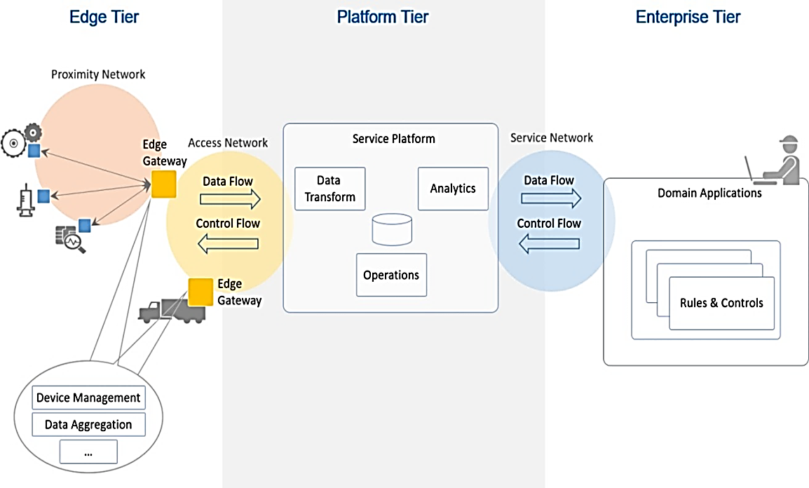
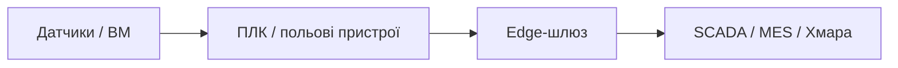
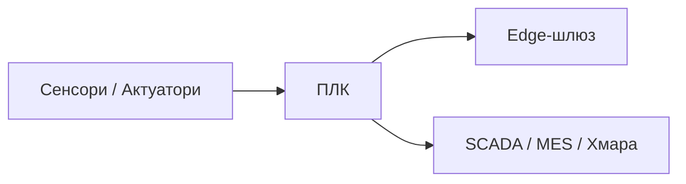
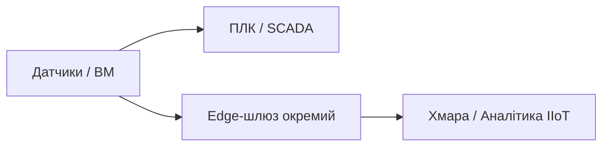
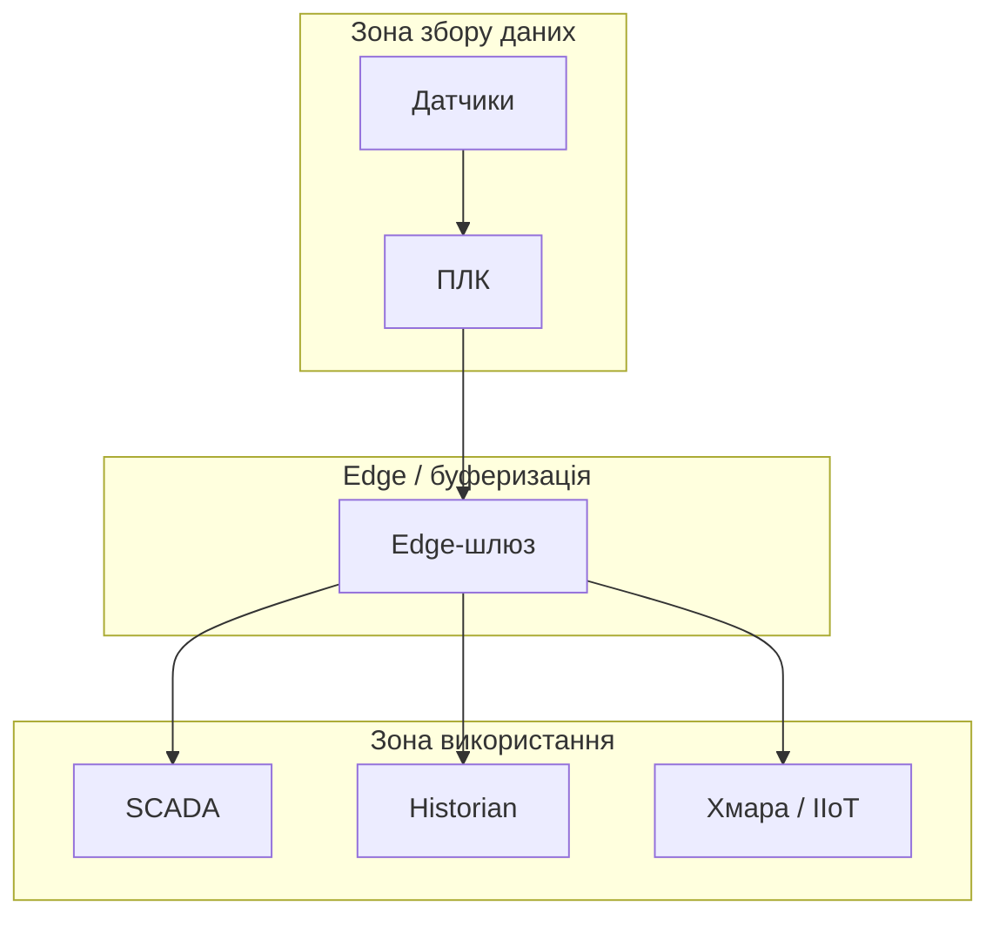

# 7. Проектування систем IIoT з використанням MQTT, HTTP та OPC UA

## 7.1 Особливості IIoT у контексті комп’ютерно-інтегрованих систем керування

### Відмінності від класичних SCADA/PLC-архітектур

Проєктування систем промислового Інтернету речей (IIoT) має низку особливостей, які відрізняють його від традиційного підходу до створення комп’ютерно-інтегрованих систем керування. На відміну від класичних АСКТП або SCADA-систем, орієнтованих на централізовану архітектуру з жорстко фіксованою топологією, системи IIoT розраховані на динамічну взаємодію великої кількості розподілених пристроїв, які можуть бути географічно розосередженими, тимчасово підключеними або керованими через хмарні сервіси.

Класична система керування зазвичай включає ієрархію з кількох рівнів (польовий, контролерний, операторський, MES), де чітко визначено межі відповідальності, способи обміну і підходи до побудови каналів зв’язку. У IIoT-системах межі між рівнями можуть бути розмитими: той самий пристрій може як збирати дані, так і передавати їх безпосередньо в аналітичну або керуючу систему поза межами традиційної архітектури SCADA.

Ще одна важлива особливість — зміщення акценту з інтеграції апаратного забезпечення на інтеграцію даних і сервісів. IIoT-системи орієнтовані на обробку та передавання значних обсягів телеметрії, їх інтеграцію у зовнішні бізнес-процеси, а також на забезпечення масштабованості, інтероперабельності й адаптивності до змін структури системи. Це вимагає нових підходів до архітектури, структурування даних, керування конфігурацією та безпекою.

Проєктування систем IIoT, таким чином, повинно передбачати більшу ступінь гнучкості, сервіс-орієнтовану архітектуру, підтримку різнорідних моделей взаємодії (подійно-орієнтованої, запит-відповідь, потокової), а також забезпечення сумісності з інформаційними стандартами вищих рівнів автоматизації.

З погляду архітектури, системи IIoT зазвичай будуються як багатошарові структури, де фізичні пристрої, контролери, сенсори та виконавчі механізми взаємодіють через шлюзи або edge-вузли з вищими рівнями системи, які можуть бути реалізовані як локально (on-premise), так і у вигляді хмарних сервісів. Типовим елементом стає проміжна ланка – edge-шлюз, який виконує попередню обробку, агрегацію та буферизацію даних, а також реалізує протокольну адаптацію між польовими шинами (наприклад, Modbus, CAN) і протоколами міжсистемної взаємодії.

На відміну від класичних систем, де модель взаємодії будується переважно на постійному опитуванні даних (polling), в IIoT застосовується подійно-орієнтована модель, де дані передаються лише за зміни або за розкладом, з метою мінімізації навантаження на мережу і зниження енергоспоживання. Це безпосередньо впливає на побудову інформаційної структури та вибір моделей обміну.

Зміна підходів до взаємодії та розміщення компонентів системи також впливає на методи керування конфігурацією та безпекою. Якщо в традиційних системах більшість параметрів налаштовуються локально або централізовано в межах однієї SCADA, то в IIoT системах часто потрібно реалізовувати механізми віддаленого керування конфігурацією, автоматичного оновлення та аутентифікації пристроїв у відкритому середовищі.

Особливої уваги набуває питання інтероперабельності між пристроями різних виробників. У класичних системах досягнення сумісності часто відбувається шляхом жорсткої уніфікації ПТЗ та стандартних драйверів, натомість у IIoT пріоритет надається використанню моделей даних, які дозволяють забезпечити структуровану, типізовану та самоописну інформацію. Саме це робить актуальним використання таких підходів, як інформаційні моделі OPC UA, типізація телеметрії або модель "розумних тегів".

Таким чином, при проєктуванні IIoT-систем основну увагу слід приділяти архітектурній гнучкості, підтримці масштабування, відмовостійкості, безпеці та формуванню прозорої інформаційної моделі, яка дозволяє ефективно інтегрувати дані як на рівні об'єкта керування, так і в рамках загальнокорпоративних цифрових платформ.

### Роль IIoT як підсистеми у складі КІСК

У межах цього розділу системи IIoT розглядаються не як відокремлені чи альтернативні до класичних SCADA/PLC-архітектур, а як підсистеми у складі комп’ютерно-інтегрованих систем керування (КІСК). Такий підхід відповідає сучасним практикам поступового впровадження цифрових технологій у промисловість, де IIoT-компоненти доповнюють традиційні рівні керування, забезпечуючи розширену телеметрію, аналітику, інтеграцію з хмарними сервісами та вищими рівнями інформаційної системи підприємства.

Це дозволяє зберігати стабільність критичних технологічних процесів, одночасно впроваджуючи нові сервіси для покращення видимості, обслуговування, адаптивності та оптимізації виробництва. Такий інтегрований підхід до проектування IIoT є базовим припущенням цього розділу.

У сучасній інженерній практиці для систем IoT (Internet of Things) вже існує низка стандартів, таких як ISO/IEC 30141, які задають референтні архітектури для побудови загальних IoT-систем. Натомість єдиного загальноприйнятого міжнародного стандарту для IIoT (Industrial Internet of Things) наразі не існує. Однак у промисловості використовуються визнані фреймворки, які фактично виконують роль таких стандартів. Серед них:

- IIRA (Industrial Internet Reference Architecture) від Industrial Internet Consortium;
- RAMI 4.0 (Reference Architecture Model for Industry 4.0) — європейський підхід, тісно пов'язаний з концепцією цифрових двійників;
- ISO/IEC 23247 — специфікація цифрового двійника для виробничих систем, сумісна з підходами IIoT;
- Edge Reference Architectures від провідних вендорів (Cisco, Intel, Microsoft, Amazon).

З огляду на це, архітектури IIoT зазвичай формуються як адаптації типових IoT-моделей, з урахуванням вимог промислових систем: потреби в детермінованості, стійкості до збоїв, підтримці реального часу, інтеграції з SCADA/PLC/MES-рівнями тощо.

Схема, наведена на рис.7.1, є прикладом такої адаптованої архітектури, що поєднує принципи IoT із практиками промислових систем керування. Вона ілюструє типову трирівневу структуру IIoT і може бути використана як основа при проєктуванні подібних підсистем у складі КІСК.



рис.7.1. Типова структура IIoT.

Типова архітектура системи IIoT будується як багаторівнева модель, що включає три основні рівні: Edge Tier, Platform Tier і Enterprise Tier. Кожен з них виконує специфічні функції в рамках загального потоку даних та керування.

1. Edge Tier (периферійний рівень)
   Тут зосереджені фізичні пристрої — датчики, виконавчі механізми, промислові контролери, а також edge-шлюзи. Шлюзи виконують збір, агрегацію та попередню обробку даних. У межах так званої Proximity Network дані збираються безпосередньо з об’єкта, а далі через Access Network передаються в платформу. На цьому рівні відбувається:
   - керування пристроями (Device Management),
   - агрегація даних (Data Aggregation),
   - реалізація зворотного зв’язку для керування (Control Flow).
2. Platform Tier (платформний рівень). Тут функціонує сервісна платформа, яка реалізує трансформацію даних, аналітику та операційні сервіси. Цей рівень забезпечує:
   - накопичення даних (операційні бази),
   - трансформацію (наприклад, нормалізацію даних до стандартного формату),
   - аналітичні сервіси (включно з ML, прогнозуванням),
   - підготовку даних до подальшого передавання в бізнес-рівень.
3. Enterprise Tier (рівень підприємства). Цей рівень охоплює доменні застосунки, які працюють з агрегованими й обробленими даними. Сюди входять:
   - MES, ERP, CMMS-системи,
   - панелі прийняття рішень,
   - модулі правил і політик (Rules & Controls),
   - користувачі, які взаємодіють із системою через інтерфейси.

Інформаційний потік (Data Flow) та керуючий потік (Control Flow) ідуть у двох напрямках на кожному рівні, забезпечуючи повноцінний зворотний зв'язок. Важливо, що саме з Edge рівня починається збір первинної телеметрії, і вже на Enterprise рівні — ухвалюються бізнес-рішення.\

## 7.3 Загальні принципи проєктування IIoT-підсистем

### Від уніфікації обладнання — до взаємодії через сервіси і дані

Традиційно проєктування систем керування в промисловості було зосереджено на уніфікації апаратних засобів — контролерів, датчиків, протоколів обміну, а також засобів програмування. Такий підхід передбачав обмежену кількість варіантів апаратної реалізації, централізовану конфігурацію та сувору прив’язку до обраної платформи. У цьому контексті основна задача проєктанта полягала у правильному виборі та поєднанні апаратно-програмних засобів, забезпеченні їх фізичної сумісності, узгодженості інтерфейсів та стабільної роботи у межах визначеної архітектури.

У системах IIoT акценти суттєво зміщуються. Уніфікація на рівні апаратного забезпечення втрачає свою визначальну роль — її замінює інтеграція сервісів і моделей даних, яка дозволяє поєднувати різнорідні компоненти через стандартизовані протоколи взаємодії. Важливішим за те, які саме пристрої використовуються, стає питання: які сервіси вони підтримують, які дані продукують, у якому форматі і як можуть бути типізовані.

Проєктант IIoT-системи повинен працювати не з «залізом», а з моделлю інформаційної взаємодії, у якій пристрої описуються в термінах наборів даних, об'єктів, подій, можливостей. При цьому важливо, щоб ці дані були структурованими, самодокументованими та доступними для зовнішніх систем. Такий підхід відкриває шлях до масштабованої інтеграції, повторного використання рішень, цифрових двійників та міжрівневої аналітики.

Таким чином, у центрі проєктування IIoT виявляється не конкретний пристрій, а його інформаційна модель та сервіси, які він реалізує. Це зумовлює зміну підходів до побудови архітектури, вибору засобів конфігурації та навіть опису вимог у технічному завданні.

### Роль edge-шлюзів у структурі IIoT

Edge-шлюзи є ключовим компонентом у типовій архітектурі IIoT. Вони виконують роль проміжної ланки між польовим рівнем (сенсори, виконавчі механізми, контролери) та платформним або корпоративним рівнями, де відбувається зберігання, обробка і використання даних. У класичних системах керування всі функції збирання і обробки сигналів концентрувалися в ПЛК або SCADA. Натомість в IIoT частина цих функцій переноситься ближче до місця виникнення даних, на edge-рівень.

Edge-шлюз здійснює збір даних із польових пристроїв через промислові протоколи (Modbus, CAN, EtherNet/IP тощо), обробляє їх локально (фільтрація, нормалізація, агрегація), виконує базову логіку або попередню аналітику і вже після цього передає підготовлену інформацію у вищі рівні системи через MQTT, HTTP або OPC UA. У деяких випадках edge-шлюз також виконує локальні функції керування у випадку втрати зв’язку з хмарою або MES.

Такі шлюзи проєктуються з урахуванням потреби в буферизації (наприклад, якщо передача у хмару відбувається періодично), автономній роботі, захисті даних та гнучкій конфігурації. Їхнє програмне забезпечення зазвичай базується на легких платформах (наприклад, Node-RED, Docker-контейнери, embedded Linux), що дозволяє легко змінювати логіку роботи та підтримувати віддалене оновлення.

З позицій проєктування КІСК edge-шлюз виступає не лише як апаратний вузол, а як **інформаційний і логічний елемент**, який слід включати в технічну структуру системи нарівні з ПЛК або сервером SCADA. У структурних схемах такі шлюзи слід прив’язувати до конкретних сегментів мережі, вказувати тип інтерфейсів, протоколи взаємодії, канали зв’язку та точки передачі даних. Якщо шлюз забезпечує перетворення моделі даних — наприклад, із тегів ПЛК у формат JSON чи OPC UA — це також слід зафіксувати в інформаційній структурі.

Існує кілька варіантів включення edge-шлюзів у структуру КІСК, кожен із яких має свої переваги та обмеження. Вибір конфігурації залежить від вимог до безпеки, швидкодії, ізольованості підсистем, дублювання каналів зв’язку та способу розгортання логіки керування.

1) Послідовна інтеграція.  У цьому варіанті edge-шлюз розташовується між польовими пристроями або контролерами і SCADA/MES-системою. Він виступає єдиним джерелом даних для вищих рівнів. Це дозволяє централізовано нормалізувати інформацію, застосовувати фільтри, виконувати попередню логіку. Однак така конфігурація є критичною з точки зору надійності: при відмові шлюзу може бути втрачено зв’язок зі всією верхньою частиною архітектури.



рис.7.2. Послідовна інтеграція Edge-шлюзу

2) Паралельна інтеграція. Тут edge-шлюз працює поряд із SCADA/PLC без втручання в основну систему. Наприклад, ПЛК надсилає дані одночасно і в SCADA, і в шлюз (Modbus, OPC UA або інші). Це дозволяє впровадити IIoT без впливу на існуючу інфраструктуру. Паралельна модель знижує ризики, спрощує налагодження та дозволяє незалежно тестувати нові сервіси.



рис.7.3. Паралельна інтеграція Edge-шлюзу

3) Окремі канали обміну. Шлюз може отримувати дані не від ПЛК, а безпосередньо від «розумних» сенсорів, вбудованих пристроїв або допоміжного обладнання. У такому випадку формується незалежна від класичної КІСК IIoT-гілка, яка має власну топологію, інтерфейси та зону безпеки. Це зручно для впровадження нових функцій (наприклад, вібраційного моніторингу), які не передбачались первинною архітектурою.



Під час проєктування важливо також враховувати питання фізичного та логічного **зонування**. Якщо edge-шлюз обслуговує декілька підсистем, або є частиною розподіленої структури, потрібно чітко фіксувати межі відповідальності — наприклад, які дані можуть передаватися у зовнішні мережі, які потребують шифрування, чи допускається зворотний зв'язок.

Вибір одного з варіантів інтеграції не є взаємовиключним — на об'єкті можуть співіснувати всі три конфігурації, кожна з яких відповідає своїм цілям.

### Означення зон відповідальності, обміну та безпеки

У процесі проєктування IIoT-підсистем важливо одразу визначити, які частини системи відповідають за збирання, обробку, зберігання, передачу та використання даних, а також хто має повноваження керувати тим чи іншим етапом обміну. Це дозволяє уникнути неузгодженостей у межах розподіленої архітектури та закласти основу для забезпечення кібербезпеки.

У системах, де взаємодіють SCADA, MES, edge-шлюзи, хмара, цифрові двійники або аналітичні модулі, зростає кількість логічних меж. Для кожної з них слід визначати:

- Зону відповідальності — хто керує налаштуванням, експлуатацією, моніторингом (наприклад, цеховий АСУ-персонал, ІТ-відділ, хмарний оператор);
- Зону обміну — які саме змінні (теги, параметри) передаються, з якою періодичністю, у якому напрямку;
- Зону безпеки — які механізми автентифікації, шифрування, обмеження доступу діють на межі.

Типово в IIoT-системах можна виділити щонайменше три логічні зони:

1. Зона збору даних (data acquisition zone).
    Містить датчики, виконавчі механізми, ПЛК, інтерфейси взаємодії з фізичними об’єктами. Тут формується первинна телеметрія.
    Відповідальність: інженери АСКТП, розробники КІСК.
    Безпека: фізичний захист обладнання, контроль доступу до портів.
2. Зона обробки й буферизації (edge zone).
    Включає edge-шлюзи, локальні вузли попередньої обробки, перетворення протоколів, агрегацію даних.
    Відповідальність: інтегратори IIoT, адміністратори шлюзів.
    Безпека: шифрування трафіку, фаєрволи, VPN, сертифікати.
3. Зона публікації/споживання даних (application zone).
    Це рівень SCADA, MES, аналітики, хмари або зовнішніх API. Тут дані використовуються для візуалізації, управління, архівування, машинного навчання тощо.
    Відповідальність: аналітики, ІТ-фахівці, оператори, бізнес-користувачі.
    Безпека: аутентифікація, авторизація, контроль доступу, моніторинг активності.



рис.7.4. Приклад зоні відповідальності

Під час проєктування важливо також встановити межі між зонами і означити, які протоколи, сервіси та об'єкти перетинають ці межі. Наприклад, якщо edge-шлюз передає дані через MQTT у хмару, потрібно враховувати, що він є точкою розмежування довіреної внутрішньої та відкритої зовнішньої зони, отже потребує додаткових механізмів безпеки.

Зонування також впливає на:

- організацію резервування й дублювання каналів;
- побудову журналювання подій (логів доступу, збоїв, підключень);
- вибір місця для реалізації логіки опрацювання подій (на edge чи в хмарі);
- визначення зон автономної роботи (на випадок втрати зв’язку з хмарою або SCADA).

На практиці доцільно формувати таблицю зон. Приклад наведений в таблиці 7.1.

Таблиця 7.1. Приклад зон відповідальності. 

| Вузол          | Відповідальний      | Тип обміну        | Протокол  | Рівень доступу | Кому передає |
| -------------- | ------------------- | ----------------- | --------- | -------------- | ------------ |
| ПЛК            | АСУ-персонал        | Поточні значення  | Modbus    | читання        | SCADA, Edge  |
| Edge-шлюз      | ІТ-відділ           | Агреговані дані   | MQTT      | читання/запис* | Хмара        |
| SCADA          | АСУ-персонал        | Візуалізація      | OPC UA    | читання/запис  | MES, архів   |
| Хмарний брокер | Сторонній провайдер | Аналітика / архів | MQTT/REST | лише читання   | MES          |

### Розподіл даних між традиційною системою керування та IIoT-підсистемою

Означення межі між тим, що залишається в класичній SCADA/PLC-архітектурі, і тим, що передається через IIoT-підсистему, є одним із ключових рішень при проєктуванні комп’ютерно-інтегрованої системи керування. Неправильне розміщення функцій або дублювання обміну можуть призвести до перевантаження мережі, порушення детермінованості або надмірної складності в конфігурації.

Традиційна система керування, як правило, відповідає за:

- оперативне керування об’єктом у режимі реального часу;
- виконання жорстко визначеної логіки ПЛК;
- реалізацію базових алгоритмів аварійного захисту;
- підтримання мінімально допустимої функціональності при збої зв’язку.

IIoT-підсистема, натомість, повинна обслуговувати задачі, які:

- не потребують суворого реального часу;
- орієнтовані на збирання телеметрії в аналітичних цілях;
- залучають вищі рівні автоматизації або зовнішні сервіси;
- реалізують додаткову, умовно необов’язкову функціональність (наприклад, моніторинг ефективності, віддалений аудит, цифровий двійник).

При проєктуванні рекомендується означити, які саме змінні або групи даних будуть:

- відображатися виключно в SCADA,
- надсилатися через MQTT або OPC UA у зовнішні сервіси,
- архівуватись у локальних historian-сховищах,
- дублюватися одночасно в кількох каналах (якщо це потрібно для надійності чи доступності).

Для цього доцільно формувати **інформаційну матрицю потоків**, яка фіксує:

- джерело і призначення даних;
- тип обміну (односторонній, двосторонній);
- відповідальний компонент;
- вимоги до актуальності, затримки, доступності, формату.

Таблиця 7.2. Приклад таблиці розподілу потоків даних

| Група змінних       | SCADA | Historian | IIoT | Примітки                              |
| ------------------- | ----- | --------- | ---- | ------------------------------------- |
| Температура Т1      | +     | +         | –    | критичне значення для керування       |
| Вібрація двигуна D2 | –     | –         | +    | IIoT-моніторинг стану                 |
| Витрата F3          | +     | +         | +    | дублюється для аналітики ефективності |
| Тривога AL01        | +     | –         | –    | лише в SCADA                          |
| Статистика партії   | –     | –         | +    | лише для MES/аналітики через MQTT     |

Особливо важливо не передавати через IIoT підсистему критично важливі змінні, від яких залежить безпека об’єкта або стабільність процесу, якщо ця підсистема не є частиною основної системи керування. У таких випадках передбачаються тільки операції читання, і тільки з обмеженої зони видимості.

У сучасній практиці часто використовується принцип: **SCADA керує — IIoT спостерігає**, хоча в деяких конфігураціях edge-рівень може частково виконувати й керувальні функції, особливо у випадках розподіленого об’єкта з локальним автономним циклом.

Додатково, під час проєктування варто означити політику дублювання даних. У низці сценаріїв одна й та сама змінна передається як у SCADA, так і в IIoT-підсистему, але це слід робити свідомо — лише у випадках, коли:

- обидві підсистеми мають незалежні функції;
- кожна з них має власне середовище збереження чи обробки (наприклад, SCADA архівує для внутрішнього аудиту, а IIoT — для хмари або ML-аналітики);
- є потреба у підвищенні надійності або часової розподіленості.

У таких випадках варто забезпечити чітке маркування джерела, версіювання або часову мітку (timestamp) даних, а також виключити конфлікти при злитті потоків у спільному середовищі (наприклад, у time-series базі).

Окремо варто розглянути сценарії з **буферизацією** — коли дані з об'єкта накопичуються локально (на edge-рівні), а потім передаються у IIoT-платформу порціями. Це дозволяє зменшити навантаження на канал, мінімізувати втрати при нестабільному зв’язку, а також уникати перевантаження хмарних служб. У такому випадку на етапі проєктування необхідно означити:

- глибину буфера;
- політику втрат (перезапис чи очікування);
- події, які тригерять передачу (таймер, поріг обсягу, команда зверху).

Ще одним аспектом є **переадресація або транзитна маршрутизація** даних: коли дані, зібрані однією підсистемою (наприклад, SCADA), використовуються для формування IIoT-потоку. Це часто реалізується у випадку, коли edge-шлюз не має прямого доступу до датчиків, але отримує необхідну інформацію через OPC UA або інший внутрішній API. У цьому випадку важливо:

- уникати збоїв при недоступності SCADA;
- не створювати циклів у логіці зчитування;
- мати контроль над тим, які саме змінні реплікуються.

## 7.4 Вибір протоколів і моделей обміну

### Протокольні рішення в IIoT-архітектурі

У проєктуванні IIoT-підсистем вибір протоколу передачі даних є не технічним, а архітектурним рішенням, яке впливає на весь подальший вигляд інформаційної структури, розміщення компонентів, механізми безпеки та режим експлуатації. Протоколи, такі як MQTT, HTTP та OPC UA, уже вивчалися у межах інших дисциплін. Тут важливо зрозуміти, як саме їх застосування впливає на проєктну логіку КІСК.

У межах розробки IIoT-підсистем проєктант має справу не з вибором одного найкращого протоколу, а з вибором відповідного до задачі й архітектурного контексту. MQTT, HTTP і OPC UA — це не рівноцінні альтернативи, а інструменти з різним призначенням. Кожен із них має свої переваги і обмеження, які проявляються лише в умовах конкретної реалізації.

Насамперед проєктант повинен означити модель обміну: чи буде вона подійно-орієнтованою, чи базуватиметься на циклічному опитуванні або запитах. Подійна модель передбачає передачу даних тільки у випадку зміни значення, настання події або за розкладом, що знижує навантаження на мережу. Запит-відповідь (наприклад, через HTTP або OPC UA Client/Server) передбачає ініціативу від споживача і добре підходить для агрегованих даних або вебінтерфейсів. У деяких випадках доцільна гібридна модель.

Під час вибору протоколу потрібно враховувати обмеження, що формуються зовнішнім середовищем. Зокрема, необхідно означити, чи буде доступний публічний (білий) IP для віддаленого вузла, чи буде він захований за NAT або файрволом, чи допускається ініціатива з боку зовнішнього сервісу. У більшості випадків IIoT-вузол працює у внутрішній мережі, а тому передбачено лише вихідні ініціативи. Саме тому MQTT, який дозволяє edge-пристроям самостійно ініціювати з’єднання з брокером, набув широкого поширення. HTTP також підтримує таку модель, якщо реалізується у формі POST-запитів до публічного API. HTTP добре підходить для доступу до готових REST-інтерфейсів, архівів, файлів або конфігурацій. Його слабке місце — відсутність зворотного каналу та необхідність відправника мати білу адресу, або працювати через проксі. Проте у поєднанні з WebSocket він перетворюється на повноцінний двобічний канал, особливо зручний для браузерів. OPC UA в класичній Client/Server-архітектурі потребує або білого IP для сервера, або використання проксі-серверів, тунелів або VPN.

Інше важливе питання — кількість відправників і одержувачів. Якщо проєкт передбачає передачу однієї змінної з edge-шлюзу в кілька хмарних сервісів, то необхідна підтримка мультиспоживання. MQTT і OPC UA PubSub це забезпечують. У HTTP-моделі потрібно дублювати запити. Якщо кілька споживачів зчитують одну й ту саму змінну з ПЛК через OPC UA, слід подбати про серверну підтримку кількох сесій, обмеження доступу, ізоляцію запитів та часову синхронізацію.

Критично важливим є питання підтримки типізації та структури даних. Якщо обмін здійснюється у форматі JSON, це дає гнучкість, але вимагає домовленості про імена полів, їхню послідовність, одиниці вимірювання тощо. OPC UA дозволяє пов’язати дані з інформаційною моделлю, а MQTT — передає лише повідомлення, формат яких визначається сторонньо. Тому вибір протоколу тісно пов'язаний із тим, як саме організована модель даних у проєкті.

Ще одним архітектурно важливим аспектом є врахування можливості масштабування і реалізації резервування. У системах IIoT, де обмін даними відбувається між десятками і сотнями вузлів, обраний протокол має підтримувати масштабування як за кількістю клієнтів, так і за обсягом трафіку.

У випадку MQTT реалізація масштабованості передбачає можливість горизонтального масштабування брокера (кластеризація, балансування тем), а також наявність кількох вузлів видавців або підписників з можливістю розподілу навантаження. Резервування може бути досягнуте шляхом дублювання брокерів, реалізації QoS-політик, повторних публікацій при збої каналу.

OPC UA у варіанті PubSub також дозволяє масштабування через розділення каналів на теми, використання декількох видавців або транспортів (наприклад, одночасно MQTT і UDP), але вимагає ручної координації структури повідомлень і контролю за дублюванням. У Client/Server-моделі масштабування складніше — потребує багатосесійної реалізації сервера та забезпечення відмовостійкості (наприклад, через Standby OPC UA Server або перехоплення клієнта на іншому вузлі).

HTTP зазвичай масштабують через API-шлюзи, кешування, балансувальники навантаження (reverse proxy), або застосування архітектури на основі мікросервісів. Проте більшість готових IIoT-рішень, побудованих на HTTP, орієнтовані на запит-відповідь і не передбачають подійної логіки, що може бути обмеженням.

Вибір протоколу і модель обміну впливають і на резервування: чи можливе дублювання даних через два різні канали, чи підтримується кешування на рівні edge-шлюзу, як поводиться підписник при втраті з'єднання, чи зберігаються повідомлення на брокері тощо.

Таблиця 7.3. Вибір протоколів в залежності від задачі

| Задача                                                       | Модель обміну      | Протокол             | Примітка                                | Масштабування / резервування                        |
| ------------------------------------------------------------ | ------------------ | -------------------- | --------------------------------------- | --------------------------------------------------- |
| Надсилання телеметрії в хмару                                | подійна            | MQTT                 | не потребує білого IP                   | підтримка QoS, кілька видавців, кластер брокера     |
| Вивантаження архіву або знімка                               | запит              | HTTP/REST            | централізоване API, може бути кешоване  | кешування, балансування запитів через проксі        |
| Паралельна доставка кільком споживачам                       | підписка           | MQTT, OPC UA PubSub  | мультиотримувачі, рознесення по каналах | публікація в кілька тем або через кілька брокерів   |
| Візуалізація в браузері  та постійний двосторонній обмін будь якими даними | постійне з'єднання | WebSocket            | зручно для мобільних інтерфейсів        | резервування через вебпроксі або дублювання потоків |
| Читання з ієрархічної моделі                                 | доступ до вузлів   | OPC UA Client/Server | потребує білого IP або тунелювання      | резервний OPC UA сервер, мультисесійність           |

У випадках, коли архітектура або корпоративна політика не дозволяє відкритий доступ до внутрішніх вузлів, для забезпечення взаємодії можуть застосовуватись VPN-канали. Використання VPN дозволяє приховати фізичне розташування вузлів, реалізувати безпечний тунель між підсистемами IIoT і зовнішніми сервісами, а також обійти обмеження NAT або відсутності білої IP-адреси.

З одного боку, це спрощує роботу з протоколами, які потребують зворотного доступу до вузла (наприклад, OPC UA Server), або дозволяє реалізувати повноцінний HTTP API без проксі. З іншого боку, VPN створює додаткове навантаження на маршрутизатори, потребує інфраструктури управління ключами, моніторингу з'єднань та резервування доступу. Крім того, при використанні публічних VPN-сервісів або неправильно сконфігурованих тунелів можуть виникати ризики витоку трафіку за межі довіреної мережі.

Тому рішення про використання VPN повинне бути проєктним і відповідати політикам безпеки об’єкта. Якщо VPN використовується, це впливає на вибір маршрутизаторів, розміщення брокерів і серверів, а також на наявність журналювання сесій і політику аутентифікації користувачів.

### Вплив протоколу на структуру проєкту

Обраний протокол обміну даними безпосередньо впливає на структуру IIoT-підсистеми, її топологію, розміщення функцій, вимоги до програмного забезпечення та інфраструктури безпеки. На відміну від класичних систем, де обмін часто обмежується внутрішньою мережею й жорстко заданими ролями (master/slave, client/server), в IIoT передбачається гнучка, масштабована взаємодія, яка має враховувати фізичну та логічну розподіленість вузлів.

Наприклад, використання MQTT передбачає наявність брокера, який виконує роль посередника між видавцями і підписниками. Це означає, що проєкт повинен включати або окремий брокер на підприємстві, або послугу в хмарі, яка стане точкою збору та маршрутизації повідомлень. Такий варіант дозволяє побудову розгалуженої топології з декількома незалежними видавцями, але вимагає уваги до політик доступу, авторизації тем і структури повідомлень.

У випадку HTTP/REST кожен endpoint (вузол) проєкту повинен бути або сервером (приймає запити), або клієнтом (ініціює з’єднання). Це накладає обмеження на топологію і безпосередньо пов’язане з тим, хто має білу адресу, як реалізовано NAT і чи підтримується зворотний зв'язок. Якщо REST API надає хмарний сервіс, то IIoT-вузол повинен бути клієнтом з виходом в Інтернет. Якщо ж API повинен бути всередині об’єкта — тоді сервер має бути у внутрішній мережі, а доступ до нього слід організовувати через VPN або зону DMZ.

Використання OPC UA в класичній Client/Server-моделі потребує наявності стабільного каналу між клієнтом і сервером, білого IP або проксі/тунелю, а також чіткого опису Nodeset-моделі на стороні сервера. У випадку OPC UA PubSub структура змінюється: виникає потреба у визначенні транспортного механізму (MQTT, UDP), конфігурації видавців, шаблонів повідомлень, імовірно — центрального брокера або сервісу реєстрації. Це дозволяє більшу гнучкість, але ускладнює початкову конфігурацію.

Крім того, вибір протоколу визначає, де буде зосереджена логіка керування потоками: у SCADA-сервері, edge-шлюзі, хмарному аналітичному модулі чи в брокері. Це впливає на призначення вузлів, резервування, трасування, вимоги до конфігурації та супроводу.

Таким чином, під час проєктування IIoT-підсистеми необхідно не лише зазначити протокол, але й означити, як саме він буде розгорнутий, хто з учасників виконує яку роль, які сервіси потребують розміщення, яка топологія і які вузли є критичними з точки зору з'єднання.

### Орієнтація на подійно-орієнтовану модель, типізацію даних, ресурсну модель

Один з найважливіших зсувів у підходах до проєктування IIoT-підсистем — це відхід від моделі постійного опитування у бік подійної логіки, орієнтованої на дії, зміни або порогові значення. У класичних системах керування взаємодія часто відбувається за принципом циклічного опитування: SCADA або MES періодично звертається до контролера, незалежно від того, чи відбулися зміни. Така модель передбачає постійне навантаження на мережу та обмежену масштабованість.

Натомість подійно-орієнтована модель, реалізована через MQTT, OPC UA PubSub або WebSocket, дозволяє передавати лише ті дані, які справді змінилися або вимагають реакції. Це зменшує обсяг трафіку, прискорює обробку та дозволяє формувати реактивні системи, здатні реагувати в режимі майже реального часу без перевантаження каналів.

З цим підходом нерозривно пов'язана **типізація даних** — передача не просто значень, а структурованих об’єктів із контекстом. У SCADA це часто обмежується «тегом» — ім’я, значення, одиниця виміру. У IIoT-житті дані мають додаткову семантику: тип пристрою, категорія події, статус достовірності, часовий штамп, ресурс до якого належать. Це відкриває шлях до узагальнених API, автоматичного підключення нових пристроїв, формування цифрових двійників, систем моніторингу, які не потребують ручного переналаштування при кожному зміненні конфігурації.

У більш просунутих реалізаціях застосовується **ресурсна модель**, у якій кожен вузол (наприклад, температура, режим, сигнал тривоги) розглядається як ресурс з унікальним шляхом, властивостями та підтримуваними операціями. Цей підхід, характерний для REST і OPC UA, дозволяє створювати прозору структуру доступу, масштабовану конфігурацію, а також розподілену взаємодію без жорсткого кодування адрес або тегів.

З погляду проєктування, орієнтація на подійність і типізацію дозволяє будувати систему, в якій кожен компонент описує себе, повідомляє про зміни, і може бути повторно використаний без суттєвої перебудови всієї архітектури. Це особливо важливо в умовах, коли кількість пристроїв, джерел даних і взаємодій постійно зростає.

Прикладом практичної реалізації семантичного підходу на основі MQTT є фреймворк **MQTT-SD (Semantic Distribution)**, який пропонує спосіб додавання структурованого контексту до публікацій у темах брокера. Його ідея полягає в тому, що пристрої, замість "плоских" повідомлень, передають типізовані об’єкти з описом сенсу, одиниць виміру, призначення змінної тощо. Це дозволяє побудувати більш узгоджену систему обміну між різнорідними пристроями, спростити агрегацію даних на брокері та забезпечити гнучку маршрутизацію повідомлень за семантичними критеріями.


## 7.5 Вимоги до інтероперабельності та моделей даних

#### Типізація даних і взаємна узгодженість між вузлами

Інтероперабельність — одна з основних вимог до IIoT-підсистем у складі КІСК. Якщо класичні системи будуються переважно з однорідного обладнання або з урахуванням заздалегідь відомих драйверів, то в IIoT-підході часто доводиться інтегрувати пристрої різних виробників, хмарні сервіси, SCADA та MES-рівень одночасно. Забезпечити їхню взаємодію на рівні даних без попереднього узгодження можливо лише у разі застосування спільних моделей даних та зрозумілої семантики.

Проєктант повинен означити, яка модель даних буде застосовуватись: чи передбачено фіксований перелік тегів із неформальною назвою, чи використовується інформаційна модель, яка описує структуру, типи, властивості та взаємозв’язки змінних. Наприклад, OPC UA Nodeset дозволяє описати вузли у вигляді об’єктів із визначеним типом, методом, статусом і супутніми метаданими. Такий опис може бути імпортований у SCADA, симульований у тестовому середовищі або автоматично синхронізований між рівнями.

Іншим підходом є застосування JSON-структур із чіткою схемою. Наприклад, кожне повідомлення має містити поля `timestamp`, `tag`, `value`, `unit`, `quality`, що дозволяє споживачеві інтерпретувати дані незалежно від джерела. У системах, де дані походять із кількох джерел, дуже важливо забезпечити сталу структуру та уникати неузгоджених трактувань.

Крім структури, потрібно також означити, як відбувається відображення змінних між різними рівнями. Наприклад, змінна `TEMP101` у ПЛК може відповідати полю `tempSensor1.value` у JSON або вузлу `ns=3;s="Device.Temp"` в OPC UA. Це відображення повинне бути задокументоване, а в ідеалі — реалізоване у вигляді експорту/імпорту з середовища PLC, SCADA, edge або MES.

Інтероперабельність включає і механізми виявлення доступних вузлів і змінних. Якщо у проєкті використовується OPC UA, то проєктант може реалізувати сервер Auto-Discovery, у якому клієнти самі знаходять вузли, доступні для зв’язку. Якщо використовується MQTT, аналогічну функцію може виконувати окрема тема з описом доступних тем і змінних, або семантична надбудова (як у MQTT-SD).

Варто також враховувати синхронізацію одиниць виміру, масштабів, допустимих діапазонів, форматів дати і часу — особливо якщо дані мають бути об’єднані у спільне сховище або порівняні між об’єктами.

Уся ця інформація повинна бути частиною інформаційної структури системи і відображатися у вигляді таблиць відповідності, схем мапування, описів структур повідомлень або OPC UA Nodeset.

Наприклад, замість `TEMP101 = 56.3` повідомлення може виглядати як:

```json
{
  "name": "tempSensor1",
  "value": 56.3,
  "unit": "°C",
  "timestamp": "2025-05-09T12:01:00Z",
  "quality": "good"
}
```

#### Використання інформаційних моделей

Одним зі способів забезпечити узгодженість є використання інформаційних моделей. OPC UA є найпоширенішим прикладом такого підходу: кожен вузол описується як об’єкт із означеним типом, атрибутами, методами, подіями. Ці об’єкти можуть бути організовані у вкладену структуру, і вузли можуть автоматично виявляти та використовувати їх.

У системах, які не використовують OPC UA, також можна застосовувати схожі підходи — наприклад, використовувати JSON Schema, ECLASS, SAREF, або власну модель даних, яка документує структури повідомлень. У таких моделях описуються допустимі поля, типи, значення за замовчуванням, залежності між атрибутами.

Інформаційна модель дозволяє реалізувати принцип самодокументованої взаємодії: вузол, який надає дані, одночасно повідомляє, що це за дані, як їх інтерпретувати, і як з ними працювати.

#### Пов’язаність із логікою функціонування об’єкта

Інтероперабельність має не лише забезпечити технічну взаємодію, але й відповідати реальній структурі об’єкта керування. Всі змінні повинні мати прив’язку до фізичних або логічних елементів об’єкта: апаратів, трубопроводів, одиниць обладнання, функціональних вузлів. Це означає, що під час проєктування інформаційної структури слід означити, до якого об’єкта або функції належить кожна змінна.

Наприклад, замість абстрактного `PUMP01_STATUS` варто використовувати структуру на кшталт:

```json
{
  "unit": "PUMP01",
  "function": "status",
  "value": "running",
  "timestamp": "..."
}
```

Або в OPC UA — вузол `ns=4;s="Unit.PUMP01.Status"` як частина дерева вузлів, що відображає структурну модель об’єкта. Це дозволяє формувати візуалізацію, аналітику й керування не за списком змінних, а за логічною схемою об’єкта.

Крім того, така прив’язка забезпечує простежуваність і дає змогу використовувати моделі повторно — наприклад, однакова структура для кожного насоса, резервуара або приводу. Це значно полегшує масштабування системи та її супровід.

Цей підхід до відображення даних як частини логіки об’єкта особливо ефективний, якщо в основі інформаційної структури використано рольову модель устатковання або інші підходи до функціонального структурування, що розглядалися у темі 3. У таких моделях змінні прив’язуються не до окремих пристроїв, а до функцій і ролей, які ці пристрої виконують — наприклад, "вимірювання витрати основного продукту", "сигналізація аварії приводу", "керування контуром рівня".

Відповідно, інформаційна модель IIoT-підсистеми може будуватись як розширення цієї рольової моделі, в якій кожна функціональна роль має власний набір параметрів, подій і команд. Це дозволяє уникнути дублювання змінних, полегшує створення шаблонів для типових об’єктів, і забезпечує простежуваність змінних у межах усієї системи.

Таким чином, зв’язок між змінними, функціями об’єкта і їх представленням у IIoT-підсистемі повинен бути означений на етапі проєктування й зафіксований у документації інформаційної структури.


### 7.6 Керування конфігурацією та безпекою

У системах IIoT, які є розподіленими за природою, питання конфігурації та безпеки є не допоміжними, а конструктивно важливими — такими, що впливають на спосіб побудови архітектури та прийняття рішень на етапі проєктування.

На відміну від класичних систем SCADA/PLC, де зміна конфігурації зазвичай відбувається централізовано через інтерфейс інженера, в IIoT-підсистемах конфігурація може бути розосереджена. Часто edge-вузли, шлюзи, брокери MQTT, OPC UA-сервери або HTTP API мають власні механізми налаштування, які не пов’язані з єдиним інженерним середовищем. Це означає, що проєктант повинен означити не тільки саму конфігурацію, а й спосіб її розповсюдження, оновлення, резервування та захисту.

Конфігурація може зберігатися в локальних файлах (JSON, XML), у централізованій базі (наприклад, через REST API), або бути частиною прошивки пристрою. Важливо передбачити, чи можна її змінювати без зупинки пристрою, як забезпечити її цілісність, як виявити сторонні втручання. При наявності десятків або сотень вузлів необхідне масштабоване рішення: шаблони конфігурацій, централізоване поширення змін, віддалене оновлення.

З погляду безпеки, ключовими вимогами є:

- автентифікація вузлів і користувачів (паролі, сертифікати, токени);
- авторизація доступу (визначення прав читання/запису, доступу до тем або методів);
- шифрування даних у каналі (TLS/SSL для MQTT, HTTPS, OPC UA Secure Channel);
- захист конфігурації від зміни (перевірка підпису, контроль версії);
- обмеження за IP, VLAN, NAT, фаєрволами.

Слід означити політику оновлення програмного забезпечення вузлів: як і коли відбувається оновлення edge-шлюзів, чи є перевірка сумісності конфігурацій, чи передбачене повернення до попередньої версії. Для хмарних компонентів — як забезпечується відповідність політикам безпеки підприємства.

Також потрібно передбачити механізми виявлення аномалій у конфігурації: наприклад, надмірна кількість підписників, спроба запису в тему, що має бути тільки для читання, порушення шаблону структури повідомлень. Такі функції зазвичай реалізуються на рівні брокера, API-шлюзу або логічного контролера в SCADA/MES.

Керування конфігурацією та безпекою в IIoT — це не окреме завдання, а вбудований компонент проєктної моделі. Без нього неможливо забезпечити масштабованість, керованість і стійкість до змін у часі. Тому в технічному проєкті мають бути окремо означені:

- засоби конфігурації;
- формат, місце і спосіб її збереження;
- механізм оновлення;
- політика доступу;
- модель загроз і засоби протидії.

### 7.7 Типові шаблони інтеграції IIoT

У процесі проектування IIoT-підсистем можна виділити кілька типових шаблонів інтеграції, які часто застосовуються в промисловості. Знання цих шаблонів дозволяє ефективно вирішувати завдання інтеграції та забезпечувати масштабованість систем.

1. Дзеркальне підключення до ПЛК. У цьому шаблоні IIoT-вузол (наприклад, edge-шлюз) зчитує ті ж самі змінні, що і SCADA, без втручання в логіку керування. Він виступає спостерігачем, надсилаючи дані до хмари або локального сховища для аналітики. Такий підхід дозволяє модернізувати існуючі КІСК без зміни їхньої архітектури.

2. Локальна агрегація та передача в хмару. Edge-шлюз збирає дані з кількох джерел (ПЛК, датчики, REST API), обробляє їх локально (фільтрація, нормалізація) та передає у зовнішні сервіси. Це забезпечує зменшення трафіку та підвищення надійності системи.

3. Вебінтерфейс через HTTP/REST або WebSocket. Реалізація легкого HMI-доступу до IIoT-вузлів через вебінтерфейс дозволяє обслуговуючому персоналу здійснювати моніторинг та діагностику обладнання віддалено, використовуючи мобільні пристрої або браузер.

4. Інтеграція через OPC UA як інформаційна шина. Використання OPC UA як спільного інформаційного шару дозволяє SCADA та IIoT-компонентам працювати з єдиною моделлю об'єкта у вигляді дерева вузлів. Це забезпечує прозорість структури даних та підвищує рівень повторного використання.

5. Інтеграція через MQTT з використанням стандартів, таких як Sparkplug B. Застосування MQTT разом зі стандартом Sparkplug B дозволяє забезпечити структуровану передачу даних між пристроями та хмарними сервісами. Це сприяє уніфікації семантики даних та спрощує інтеграцію різнорідних систем.

6. Гібридна інтеграція з використанням Apache Kafka. Використання Apache Kafka як платформи для обробки потокових даних дозволяє об'єднувати дані з різних джерел (OPC UA, MQTT, REST) та забезпечувати їхню обробку в реальному часі. Такий підхід сприяє масштабованості та гнучкості системи.

У реальних проєктах ці шаблони можуть комбінуватися. Наприклад, один edge-шлюз може реалізовувати агрегацію та публікацію в MQTT, надавати REST API для мобільного застосунку та одночасно виступати OPC UA-сервером для SCADA.

При проєктуванні важливо не тільки вибрати шаблон, а й означити його межі:

- що є джерелом даних;
- хто виконує маршрутизацію;
- де відбувається агрегація;
- які протоколи використовуються;
- який вузол є кінцевим споживачем.


## Запитання для самоперевірки

1. У чому полягає головна відмінність IIoT-систем від класичних SCADA/PLC-архітектур?
2. Які функції виконує edge-шлюз у структурі IIoT-системи?
3. Які три рівні типово включає архітектура IIoT за моделлю Edge–Platform–Enterprise?
4. Які завдання виконує Edge Tier у IIoT-архітектурі?
5. Для чого використовується Platform Tier у IIoT-системах?
6. Що включає Enterprise Tier і які приклади систем на цьому рівні?
7. Чим подійно-орієнтована модель обміну даними відрізняється від циклічного опитування?
8. Які три основні варіанти інтеграції edge-шлюзів у КІСК розглянуто в лекції?
9. Що таке зона відповідальності в контексті IIoT-підсистем?
10. Які три типові логічні зони виділяють у IIoT-системах?
11. Яка функція зонування в контексті безпеки та обміну даними в IIoT?
12. Як розподіляються функції між класичною SCADA-системою і IIoT-підсистемою?
13. Яка інформація має бути включена до інформаційної матриці потоків при проєктуванні IIoT?
14. У яких випадках доцільно дублювати змінні між SCADA і IIoT-системою?
15. Які протоколи найчастіше використовуються у IIoT, і які моделі обміну вони підтримують?
16. Чим відрізняються MQTT, HTTP та OPC UA щодо масштабування і резервування?
17. Який вплив вибору протоколу обміну даними має на структуру IIoT-підсистеми?
18. Чому типізація даних і інформаційна модель є критичними для інтероперабельності в IIoT?
19. Наведіть приклад повідомлення в форматі JSON з типізованою структурою для сенсора температури.
20. Які типові шаблони інтеграції IIoT виділяються в інженерній практиці?