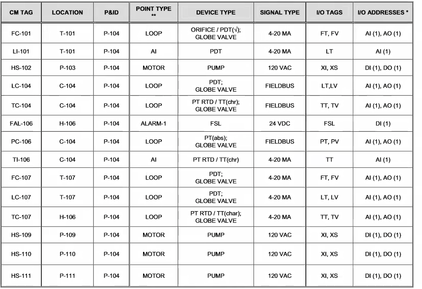
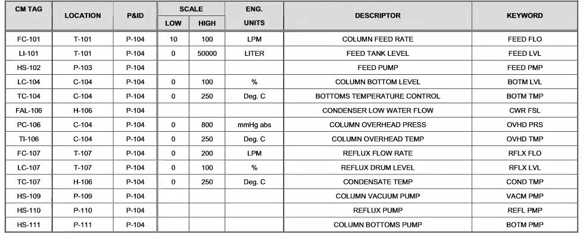
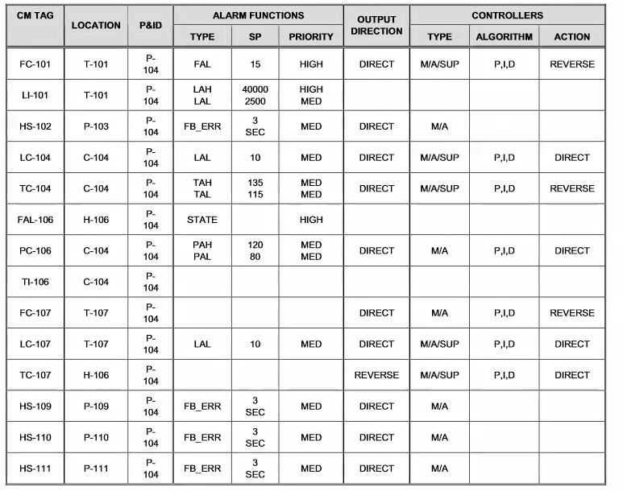
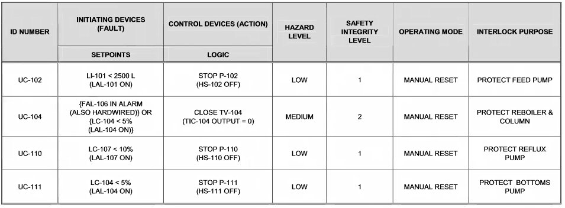
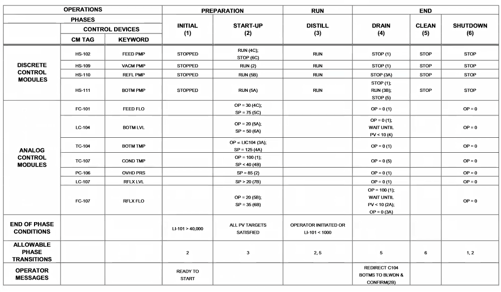
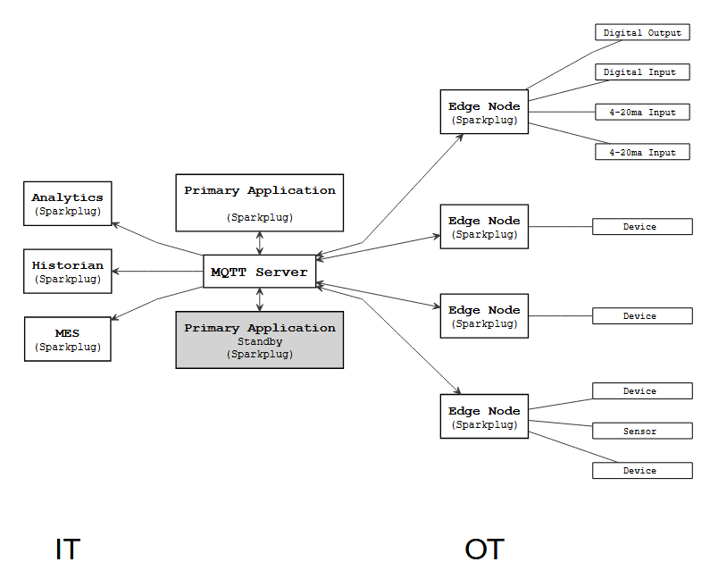
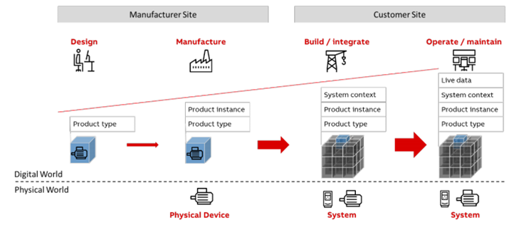

# 8. Стандарти та кращі практики проектування КІСК

## 8.1. Документування функціональності та архітектури керування за методологією ISA-5.6

У практиці проєктування систем керування важливу роль відіграє не лише графічне подання або позначення пристроїв, а й формальне представлення функціональної структури системи — тобто того, як організовано логіку керування, які дії виконує система, як відбувається взаємодія між модулями. Методологія, запропонована у стандарті ISA-5.6, пропонує чітку процедуру поетапного документування архітектури системи керування, особливо у випадках гнучких модульних установок із повторюваними одиницями (reactor, dryer, column тощо) або періодичними процесами.

Першим кроком у проєктуванні є поділ об’єкта на технологічні одиниці та лінії обробки (trains). Таке подання дозволяє реалізувати принцип поділу обладнання на класи, де для кожного класу можна створити типову структуру керування, яка надалі багаторазово застосовується для різних екземплярів. Подібний підхід суттєво зменшує витрати на впровадження й мінімізує помилки при конфігуруванні, адже дозволяє повторно використовувати готові шаблони.

На основі опису процесу, P&ID та індексу приладів формується Специфікація функціональних вимог (FRS), яка складається з чотирьох ключових елементів: бази даних (таблиця тегів), матриці блокувань, матриці послідовностей і опису HMI. Кожен з цих елементів документує окремий аспект логіки або реалізації. База даних — це систематизована таблиця, яка містить інформацію про всі точки введення/виведення, тип сигналу, обробку сигналу, пов’язане обладнання, адреси, одиниці виміру, налаштування тривог і параметри контролерів. Вона виконує роль ядра для інших елементів специфікації.

Матриця блокувань слугує засобом фіксації логіки міжприладового блокування — наприклад, взаємозв’язку між датчиком рівня та виконавчим клапаном із зазначенням умов блокування та відповідних дій. Таке документування надзвичайно важливе для перевірки безпеки функціонування, а також для проходження аудитів чи сертифікації.

Матриця послідовностей описує динаміку — тобто, які фази, стани або дії виконує обладнання в процесі, у якому порядку, з якими умовами початку та завершення. Її можна адаптувати для як безперервного, так і періодичного процесу. При цьому вона може мати різні рівні деталізації: від оглядового (що зручно на етапі узгодження вимог) до повного, з точним описом кожного кроку й значення параметрів.

Останнім елементом є визначення HMI — як з точки зору графіки, так і з точки зору безпеки доступу та повідомлень. Тут стандарти ISA-5.5 і рекомендації щодо рівнів доступу допомагають створити зручний і безпечний інтерфейс для оператора.

Таким чином, методологія ISA-5.6 забезпечує узгоджене, стандартизоване і багаторазово придатне подання логіки керування. Вона поєднує графічне, табличне й функціональне подання, дозволяючи ефективно співпрацювати різним групам — від інженерів з автоматизації до операторів та фахівців з технічного обслуговування.

Для ілюстрації того, як стандарт ISA-5.6 може бути застосований до безперервних процесів, розглянемо приклад ректифікаційної колони. Цей приклад є спрощеним ілюстративним варіантом, який не охоплює всі аспекти безпеки та керування, але демонструє структуру документування.

На першому етапі створюється база даних тегів (рис), де зазначено всі пристрої, що відображені на P&ID. У таблиці вказується тип кожного пристрою (аналоговий, дискретний), його зв’язок із модулями керування, адреси введення/виведення, шкала сигналів, одиниці виміру, повні й скорочені описи для HMI, тривоги, типи контролерів і логіка їх дії.  Наприклад, для контролю рівня в колоні використовується аналоговий датчик з рівнем тривоги «HiHi» і діапазоном 0–100%. Параметри тривог, типи дії контролера (пряма або зворотна), алгоритм (ПІ, ПІД), рівень доступу до зміни параметрів — усе це фіксується в таблиці, яка є основою для конфігурації ПЛК або DCS.








рис.8.1. Таблиці бази даних

Далі формується матриця блокувань (рис), яка описує дії при виникненні критичних ситуацій. Наприклад, коли рівень у живильному резервуарі падає нижче 2500 літрів, зупиняється насос подачі. Це, своєю чергою, запускає подальші блокування: відключення пари до колони та зупинку нижнього насоса. Інші приклади включають вимкнення рефлюксного насоса при наднизькому рівні в барабані або зупинку ребойлера при втраті охолодження. Блокування можуть бути скинуті вручну, проте логіка побудована так, щоб уникнути автоматичного повторного запуску після усунення причини без прямої дії оператора.



рис.8.2. Таблиці блокувань

Наступним етапом є побудова матриці послідовності (рис.). У безперервному процесі кількість фаз зазвичай обмежена: підготовка (Preparation), запуск (Startup), дистиляція (Distill), злив (Drain) і завершення (End). Фаза запуску особливо складна, оскільки включає три паралельні гілки: налаштування ребойлера і нижнього насоса, запуск верхньої частини колони і запуск системи подачі. Тільки після завершення всіх трьох шляхів система переходить у фазу стабільної роботи.

Формат таблиці дозволяє задати не лише порядок виконання дій, але й умови завершення кожного кроку. Дії включають відкриття/закриття клапанів, перевірку сигналів, подачу повідомлень оператору, контроль параметрів. Якщо система не отримує зворотного сигналу про виконання, вона не переходить до наступної дії. Візуалізація паралельних кроків у вигляді діаграми дозволяє розробити цілісну послідовність перед формуванням логіки в ПЛК або SCADA.

Фази типу Drain також деталізуються за кроками, які виконуються послідовно або паралельно, залежно від підтвердження станів. Робочі параметри заносяться безпосередньо в таблицю URS, без окремої матриці рецептів.

Цей приклад демонструє, як можна структуровано й послідовно описати логіку керування навіть для складної установки. Завдяки методології ISA-5.6 така документація може бути повторно використана, автоматизована і легко адаптована до будь-якої платформи автоматизації.



рис.8.3. Матриці послідовностей

- База даних має бути центральним елементом проєкту, на якому ґрунтуються всі теги, сигнали, тривоги, логіка керування і HMI.
- Уся логіка блокувань повинна бути чітко зафіксована на ранніх етапах проєктування, окремо від логіки керування.
- Послідовності операцій доцільно описувати у вигляді фаз і кроків з конкретними умовами переходу, враховуючи можливість паралельного виконання.
- Необхідно передбачити ручне втручання оператора, зокрема механізми скидання блокувань через окремі перемикачі.
- Уся документація має бути підготовлена у форматі, придатному як для друку, так і для машинної обробки, що забезпечує масштабованість і повторне використання.
- Вимоги до HMI потрібно формалізувати на етапі розробки функціональних вимог, а не залишати на реалізацію, щоб уникнути помилок і неузгодженостей.

## 8.2. Стандартизовані моделі даних та протокольні розширення для IIoT

У сучасних IIoT-системах дані передаються між великою кількістю розподілених пристроїв, шлюзів, SCADA-систем, хмарних платформ та зовнішніх сервісів. Але передача даних як таких — лише частина задачі. Не менш важливо забезпечити, щоб ці дані були структурованими, однозначними та самоописними. Без цього будь-яка нова інтеграція вимагатиме ручного конфігурування, адаптації до форматів, вивчення структури топіків та призначення змінних. Це суперечить самій ідеї масштабованого IIoT. Саме тому з’являється потреба у стандартизованих моделях даних, які забезпечують інтероперабельність між вузлами на рівні змісту повідомлень, а також у протокольних розширеннях, які визначають структуру тем, типізацію обміну і логіку взаємодії пристроїв у мережі.

Серед можливих підходів можна виділити кілька напрямів. Деякі орієнтовані на розширення MQTT-протоколу шляхом стандартизації структури тем і навантаження повідомлень, інші фокусуються на моделюванні пристроїв і їхніх властивостей з боку формальної онтології. Треті — створюють узгоджені схеми даних на основі XML, JSON-LD або RDF. Таблиця нижче узагальнює основні типи підходів:

| Категорія                      | Приклади                                         |
| ------------------------------ | ------------------------------------------------ |
| MQTT-засновані надбудови       | Sparkplug B, MQTT-SD, власні JSON-формати        |
| Моделі пристроїв               | Eclipse Vorto, AASX (Asset Administration Shell) |
| Семантичні формати             | JSON-LD, RDF, WoT Thing Description (W3C)        |
| Промислові інформаційні моделі | OPC UA Companion Specs, AutomationML, B2MML      |

Для цілей комп’ютерно-інтегрованих систем керування, особливо у випадках використання SCADA, Node-RED, MQTT-брокерів та edge-шлюзів, найбільш релевантними виглядають саме MQTT-розширення. Серед них два підходи заслуговують на окрему увагу — Sparkplug B і MQTT-SD.

Перший із них, [Sparkplug B](https://www.eclipse.org/tahu/spec/sparkplug_spec.pdf), є де-факто промисловим стандартом у контексті використання MQTT у SCADA-системах. Він розроблений для типових промислових сценаріїв: від моніторингу до керування, від побудови топології до зворотного зв’язку. У Sparkplug B чітко регламентовано структуру тем, набір типів повідомлень, механізм виявлення вузлів і навіть те, як саме передаються змінні. Топіки мають структуру з фіксованими сегментами, наприклад:  `spBv1.0/group_id/NDATA/edge_id/device_id`, а самі повідомлення кодуються у форматі Protocol Buffers і містять набір змінних типу Metric, де кожна має ім’я, тип, значення, timestamp і деякі додаткові атрибути. Усе це дозволяє відмовитися від ручного опису структури даних — SCADA-система сама «бачить», які вузли в мережі активні, які змінні вони публікують, у якому форматі й чи підтримують керування.

Типова архітектура SCADA/IIoT-системи, реалізованої з використанням MQTT та моделі Sparkplug B, передбачає централізовану передачу всіх повідомлень через MQTT-брокер. Брокер не виконує ніякої логіки обробки даних, а лише пересилає повідомлення між учасниками — як на стороні технологічного рівня (OT), так і на стороні інформаційних систем (IT). Вся логіка інтерпретації, структуризації, синхронізації станів і формування команд реалізована в кінцевих учасниках — edge-вузлах, SCADA-додатках, historian-системах тощо.

Вузли типу Edge Node виступають у ролі проміжної ланки між фізичними пристроями (датчиками, контролерами, виконавчими механізмами) та MQTT-мережею. Вони збирають дані з пристроїв і публікують їх у брокер у форматі повідомлень Sparkplug B — таких як повідомлення народження (NBIRTH), регулярні оновлення (NDATA), повідомлення про завершення сесії (NDEATH), а також приймають керувальні команди (NCMD). Edge-вузол відповідає не лише за пересилання значень, а й за підтримку сесійного стану: якщо вузол зник з мережі, система має це виявити автоматично і оновити модель.

SCADA-додаток, який підтримує Sparkplug B, підписується на відповідні теми MQTT та зчитує повідомлення від усіх активних вузлів. Він формує у себе повну уявну модель всієї системи, включно з пристроями, їхніми змінними, поточним станом, доступністю. У випадку втрати зв’язку SCADA отримує повідомлення DDEATH або помічає відсутність оновлень, і реагує відповідним чином. За потреби вона може ініціювати команду керування, яка буде опублікована у відповідну тему типу CMD і спрямована назад на Edge.

Окремо варто згадати про підтримку резервної SCADA. Усі учасники системи можуть бути підписані на ті самі топіки, але лише один виконує активне управління, тоді як інший перебуває в режимі standby і готовий до переходу в активний режим у разі потреби. Це забезпечується як логікою MQTT (наприклад, збережені повідомлення, QoS), так і сесійною природою Sparkplug.

Нарешті, інфраструктура дозволяє інтегрувати пристрої, що не підтримують MQTT або Sparkplug безпосередньо. Такі пристрої підключаються через шлюзи, які виступають у ролі edge-вузлів. Вони виконують необхідну трансляцію протоколів (наприклад, з Modbus або OPC UA) у формат Sparkplug B, що дозволяє зберегти уніфіковану модель обміну.

Таким чином, ця архітектура демонструє спосіб, у який можна побудувати SCADA-систему, орієнтовану на подієвий обмін, з використанням лише брокера MQTT як центрального елемента — без необхідності у прямому з’єднанні між вузлами, з повною підтримкою самовиявлення, стану та уніфікованого обміну даними.



рис. 8.4. MQTT SCADA Infrastructure

Особливістю Sparkplug B є наявність чітких повідомлень «народження» (BIRTH) та «смерті» (DEATH) вузла або пристрою. Це дає змогу автоматично виявляти появу нових вузлів і їхню втрату. Комунікація не обмежується лише передачею даних — специфікація також передбачає структуру команд (CMD), які можна надсилати до пристроїв. Такий підхід дозволяє реалізовувати повноцінний двобічний обмін у рамках строгої моделі.

Sparkplug B особливо добре підходить для тих систем, де важливі детермінованість, просте налаштування, відстеження стану вузлів і підтримка з боку SCADA/IIoT-платформ. Проте він має і свої обмеження. Формат Protocol Buffers складніший у реалізації, ніж звичний JSON, а семантична інформація про змінні — такі як одиниці виміру, межі, типи об’єкта — або відсутня, або реалізована неформально.

На противагу цьому, підхід MQTT-SD орієнтований на семантику. Тут дані описуються не просто як набір імен і значень, а як повноцінні RDF- або JSON-LD-об’єкти, де змінні мають посилання на онтології, типи, одиниці виміру, обмеження, зв’язки з іншими об’єктами. MQTT-SD не є формальним стандартом, але активно просувається як основа для інтеграції з Web of Things. Пристрої, що підтримують MQTT-SD, публікують метаінформацію у фіксованих топіках (`/.well-known/...`), яку може зчитати будь-який клієнт і на її основі сформувати карту доступних змінних, сервісів та подій.

Основною перевагою MQTT-SD є гнучкість і орієнтація на самодокументовану інформацію. Водночас ця ж гнучкість ускладнює впровадження — стандартів форматування більше, потреба в парсингу RDF/JSON-LD висока, а підтримка в SCADA-системах практично відсутня. Тому MQTT-SD більше пасує для тих систем, де важливою є інтеграція з онтологіями, відкритими платформами чи цифровими двійниками.

У практичному проєктуванні КІСК найбільш доцільно орієнтуватися на Sparkplug B як технічно зріле, промислово підтримуване рішення, що забезпечує не лише структурованість даних, а й механізм автоматичної інтеграції пристроїв у SCADA/IIoT-підсистему. У випадках, коли пріоритетом є гнучка семантика й зв’язок з цифровими моделями, MQTT-SD може виступати як доповнення або альтернатива.

## 8.3. Інформаційні моделі та обмін інженерними даними

### Необхідність стандартизації

У сучасних комп’ютерно-інтегрованих системах керування дані про структуру об’єкта, склад обладнання, зв’язки між компонентами, логіку керування та візуалізацію все частіше зберігаються й обробляються в цифровому вигляді. Тому при проєктуванні КІСК важливо від самого початку враховувати не лише те, як буде реалізоване керування, а й те, як опис системи буде передаватися між інженерними середовищами — CAD, CAE, SCADA, DCS, HMI, системами верифікації та цифровими двійниками. В іншому разі доведеться дублювати введення, підтримувати кілька джерел правди або вдаватися до ручних трансформацій, що веде до помилок і втрат часу.

Щоб уникнути цього, доцільно застосовувати стандартизовані формати для опису структури та функціональності систем, які дозволяють переносити дані між інженерними інструментами автоматично або напівавтоматично. Серед таких стандартів, що мають безпосереднє відношення до КІСК:

- IEC 61360 — модель словника елементів даних (базовий рівень опису властивостей)
- IEC 62714 (AutomationML) — формат обміну інженерними даними
- IEC 62424 (CAEX) — структура ієрархій та топології для систем автоматизації
- PLCopen XML — обмін моделями поведінки ПЛК
- ECLASS Advanced — словник технічних властивостей
- OPC UA Companion Specifications — приклад формалізованої моделі для обміну між пристроями
- ISO 15926 — обмін даними про об’єкти в процесній інженерії
- AML→MTP конвертери — підготовка модулів виробництва для plug-and-produce

Застосування цих форматів дозволяє реалізувати концепцію цифрового ядра системи керування, яке може бути використане на всіх етапах — від проєктування до експлуатації.

### IEC 61360: словникова модель для опису властивостей об'єктів

Стандарт IEC 61360 означує структуру словника елементів даних, які використовуються для формального опису властивостей промислових об'єктів — таких як датчики, приводи, клапани, контролери та інші технічні компоненти. Цей стандарт лежить в основі Common Data Dictionary (CDD) Міжнародної електротехнічної комісії (IEC) і широко застосовується як основа для побудови семантичних моделей у таких форматах як ECLASS Advanced, AutomationML і OPC UA Companion Specifications.

Модель IEC 61360 дозволяє описувати властивість (наприклад, «номінальна напруга» або «вихідний сигнал») як окремий об’єкт, що має:

- унікальний ідентифікатор;
- однозначно визначене ім’я та опис;
- тип значення (наприклад, ціле, дійсне число, текст);
- одиниці виміру (наприклад, вольти, міліметри, градуси Цельсія);
- допустимий діапазон значень, іноді також правила перетворення.

На практиці це дозволяє системам автоматизації або цифровим двійникам не лише знати, що пристрій має параметр «максимальний тиск», а й розуміти, як його інтерпретувати, відображати, перевіряти та порівнювати. Наприклад, якщо два різні виробники надали властивість «номінальна напруга» з посиланням на той самий ID у IEC 61360, система може автоматично вважати ці властивості еквівалентними без додаткових перетворень.

У середовищі AutomationML посилання на IEC 61360 (через ECLASS або інші словники) використовуються для опису властивостей вузлів обладнання, що забезпечує семантичну узгодженість між структурною моделлю та значеннями параметрів. У свою чергу, OPC UA може використовувати ці ж визначення як основу для побудови своїх інформаційних моделей у runtime.

Для проєктування КІСК це означає, що всі властивості пристроїв можуть бути описані уніфіковано, незалежно від виробника чи системи — що критично при інтеграції, автоматичному виявленні пристроїв, створенні HMI або формуванні баз даних параметрів.

### IEC 62424 (CAEX): модель структури автоматизованої системи

Стандарт IEC 62424 описує формат CAEX (Computer Aided Engineering Exchange) — універсальну модель для представлення структури, ієрархії та зв’язків в автоматизованих системах. CAEX використовується як основа структурної частини у AutomationML, де означує топологію установки, модулі обладнання, функціональні компоненти, порти та з’єднання між ними.

CAEX базується на XML та орієнтований на опис класів і екземплярів об'єктів. У структурі CAEX можна означити, наприклад:

- що установка складається з п’яти блоків;
- що кожен блок містить модулі обладнання;
- що модуль має свої змінні, порти і взаємодії з іншими модулями.

Типова модель включає поняття:

- SystemUnitClass — описує клас об'єктів (наприклад, "насос 3 кВт");
- InstanceHierarchy — фактична структура системи з об'єктами і вкладеними підоб'єктами;
- InternalElement — екземпляри класів;
- InterfaceClass — описує інтерфейси для з'єднання між елементами;
- RoleClass — означує призначення елементів у загальній ієрархії.

На відміну від чистих P&ID або EPLAN-схем, CAEX дозволяє створити машиночитну модель, яку можна трансформувати в логіку керування, перевіряти на структурну узгодженість або використовувати як вихідну точку для автоматичної генерації частини SCADA, HMI або конфігурації PLC.

CAEX також дозволяє вбудовувати посилання на властивості (наприклад, з IEC 61360 або ECLASS), що робить можливим об’єднання структурного подання з параметричним і семантичним. Завдяки цьому, в AutomationML структурна частина будується саме на CAEX — а вже логіка керування додається через PLCopen XML, а візуальні чи геометричні властивості — через COLLADA.

Для КІСК застосування CAEX дає змогу на ранньому етапі проєктування створити уніфіковану цифрову структуру системи, яку потім можна узгоджено розвивати в напрямку програмування, моделювання, цифрового двійника, формування специфікацій або експлуатаційної документації.

### PLCopen XML як формат передачі логіки керування

Формат PLCopen XML є поширеним стандартом для обміну програмною логікою між різними середовищами програмування ПЛК. Він був розроблений організацією PLCopen у рамках IEC 61131-3 і дозволяє описувати програмні блоки, змінні, типи даних, автомат станів, функціональні блоки та інші елементи керування у вигляді структурованого XML-документа.

Основна перевага PLCopen XML полягає в тому, що він є незалежним від конкретного виробника — таким чином, розроблену логіку можна перенести з одного середовища в інше (наприклад, із Codesys до TIA Portal або інструменту експорту з AutomationML). Це забезпечує гнучкість, повторне використання програмних компонентів і можливість зберігання логіки у системах управління життєвим циклом, версіонування або командної розробки.

У контексті AutomationML, PLCopen XML застосовується для опису поведінки керованих об’єктів, зокрема модулів керування (Control Modules) або фаз у періодичних процесах. Його можна прив’язати до структурних елементів CAEX — наприклад, вузол обладнання має відповідний POU (Program Organization Unit), в якому описана логіка керування цим вузлом.

Типові елементи, які описуються у PLCopen XML:

- оголошення змінних (вхід, вихід, локальні)
- типи даних і структури
- програмні блоки (функції, функціональні блоки, програми)
- тіло програм — у вигляді ST (Structured Text), LD (Ladder), FBD (Function Block Diagram)
- переходи в автоматах станів

Для КІСК застосування PLCopen XML дозволяє стандартизовано описати логіку керування, пов’язати її з фізичною структурою об’єкта (через CAEX/AutomationML) і передавати цю логіку в різні середовища реалізації без втрати інформації.

Ось приклад коду в форматі PLCopen XML, який описує простий функціональний блок керування клапаном залежно від рівня у резервуарі:

```xml
<project xmlns="http://www.plcopen.org/xml/tc6_0200">
  <types>
    <dataTypes/>
    <pous>
      <pou name="ValveControl" pouType="functionBlock">
        <interface>
          <inputVars>
            <variable name="Level">
              <type><REAL/></type>
            </variable>
          </inputVars>
          <outputVars>
            <variable name="OpenValve">
              <type><BOOL/></type>
            </variable>
          </outputVars>
        </interface>
        <body>
          <ST>
            <![CDATA[
              IF Level < 500.0 THEN
                OpenValve := TRUE;
              ELSE
                OpenValve := FALSE;
              END_IF;
            ]]>
          </ST>
        </body>
      </pou>
    </pous>
  </types>
</project>
```

- `pou name="ValveControl"` — функціональний блок для ПЛК
- `Level` — аналоговий вхід (рівень у мм)
- `OpenValve` — логічний вихід (вмикання клапана)
- Усередині тіла блоку (section `<ST>`) розміщено код на Structured Text — він виконує просте порівняння рівня з порогом 500 мм і відповідно відкриває або закриває клапан.

Такий блок може бути автоматично імпортований у середовище, яке підтримує PLCopen XML (наприклад, Codesys), і пов’язаний із структурою об’єкта в AutomationML через імена змінних і тегів.

### AutomationML як міжплатформний формат обміну

AutomationML (Automation Markup Language) — це відкритий формат для обміну інженерними моделями між різними системами, який об’єднує опис топології, логіки, графіки та властивостей устаткування. Його призначення — забезпечити узгоджену передачу інформації між CAD/CAE-інструментами та середовищами автоматизації (SCADA, PLC IDE тощо), мінімізуючи дублювання введення та втрати інформації.

AutomationML базується на модульній структурі. Основу становить формат CAEX (IEC 62424), який описує ієрархію об’єкта, структуру вузлів, атрибути та зв’язки. Для опису логіки керування в AutomationML використовується PLCopen XML — формат для опису програмованих блоків, автоматів, змінних, параметрів ПЛК. Графічна інформація, якщо необхідна, передається через COLLADA (наприклад, для 3D-візуалізації HMI або симуляцій).

У стандарті AutomationML також передбачено механізм прив’язки властивостей до елементів структури, які можуть бути імпортовані з словників, сумісних з IEC 61360 або ECLASS. Це дозволяє уніфіковано визначати, наприклад, що певний вузол є «трифазним інвертором» із номінальною напругою 400 В і потужністю 7.5 кВт, без розбіжностей у трактуванні.

AutomationML широко використовується в інженерних середовищах Siemens, EPLAN, COMOS, Beckhoff тощо. Його підтримують як для експорту, так і для імпорту, що робить його ефективним каналом передачі моделей між середовищами електротехнічного проєктування, ПЛК-програмування та HMI-редагування.

Для КІСК це означає, що один раз створивши модель об’єкта — з ієрархією, тегами, зв’язками — її можна використовувати як вихідну точку для конфігурування програмованих контролерів, SCADA-вузлів, систем сигналізації, а також інтеграції з цифровим двійником. Це забезпечує структурованість, повторне використання та спрощення супроводу систем.

Ось приклад структури моделі вузла КІСК у форматі AutomationML з установкою резервуар із датчиком рівня та електромагнітним клапаном для вузла керування подачею. Модель описує вузол, що складається з:

- резервуара (`Tank1`), який є обладнанням верхнього рівня
- датчика рівня (`LT101`) — аналоговий вхід
- електромагнітного клапана (`SV101`) — дискретний вихід
- модуля керування (`CM101`), який реалізує просту логіку: якщо рівень нижче мінімального — відкрити клапан

Умовна CAEX-структура AutomationML (спрощено, у стилі XML):

```xml
<InstanceHierarchy Name="ControlSystem">
  <InternalElement Name="Tank1" Role="Equipment">
    <InternalElement Name="LT101" Role="Sensor.Level">
      <Attribute Name="MeasurementRange" Value="0..3000 mm" />
      <Attribute Name="SignalType" Value="4-20 mA" />
    </InternalElement>
    <InternalElement Name="SV101" Role="Actuator.Valve">
      <Attribute Name="ControlType" Value="On/Off" />
      <Attribute Name="SignalType" Value="24V DC" />
    </InternalElement>
    <InternalElement Name="CM101" Role="ControlModule">
      <Attribute Name="Logic" Value="IF LT101 < 500 THEN OPEN SV101" />
    </InternalElement>
  </InternalElement>
</InstanceHierarchy>
```

Прив'язка властивостей (IEC 61360 / ECLASS)

- `LT101`:
  - Клас: "LevelSensor"
  - Властивість: "measuringRange" → `3000 mm`
  - Одиниці: `millimetre`
- `SV101`:
  - Клас: "SolenoidValve"
  - Властивість: "controlType" → `discrete`
  - Напруга керування: `24 V DC`

PLCOpen XML (фрагмент):

```xml
<POU Name="CM101" Type="FunctionBlock">
  <Interface>
    <InputVariable Name="Level">
      <Type><REAL/></Type>
    </InputVariable>
    <OutputVariable Name="ValveOpen">
      <Type><BOOL/></Type>
    </OutputVariable>
  </Interface>
  <Body>
    <ST>ValveOpen := Level < 500.0;</ST>
  </Body>
</POU>
```

Така модель, описана в AutomationML, може бути передана з інженерної системи (наприклад, EPLAN або COMOS) до середовища програмування ПЛК (наприклад, TIA Portal або Codesys), де автоматично згенеруються змінні, адресація, частина логіки. Після цього ця ж модель може бути використана для створення шаблонів HMI або документації.

У той час як AutomationML застосовується для опису структури, властивостей і поведінки системи на етапі проєктування, стандарт OPC UA реалізує ці ж моделі на етапі виконання — в реальному часі. Зокрема, OPC UA Companion Specifications дозволяють формалізовано описати типи об’єктів, їхні властивості, змінні, методи та зв’язки у вигляді ієрархії вузлів OPC UA-серверів.

Companion-специфікації можуть бути створені для конкретних типів пристроїв (наприклад, насосів, датчиків, контролерів), галузей (верстати, пакувальні лінії) або платформ. Їхньою метою є те, щоб різні виробники описували функціональність своїх пристроїв за єдиною моделлю, що спрощує автоматичне виявлення, інтеграцію та обмін даними.

У контексті AutomationML OPC UA виступає як середовище, де ця модель «оживає». Типовий робочий цикл такий: під час інженерного проєктування формується структура об’єкта у форматі AutomationML з властивостями (із CAEX, IEC 61360, ECLASS), а під час розгортання ці об’єкти автоматично або напівавтоматично відображаються у простір адрес OPC UA. Це забезпечує як інтероперабельність, так і узгодженість між проєктом і виконанням.

Таким чином, OPC UA Companion Specifications дозволяють замкнути цикл між описом і реалізацією КІСК, забезпечуючи формально узгоджену модель даних у проєктній, реалізаційній та експлуатаційній фазах.

### ISO 15926 як основа для обміну інженерними даними в процесній промисловості

Стандарт ISO 15926 призначений для уніфікованого представлення інформації про об’єкти промислової інфраструктури протягом усього їхнього життєвого циклу — від проєктування і монтажу до експлуатації та виведення з експлуатації. Він був розроблений для потреб великих процесних галузей (нафтогазова, хімічна, енергетична) і має на меті забезпечити безперервність даних між різними етапами та учасниками проєкту.

На відміну від AutomationML, який фокусується на описі структури й логіки керування в межах автоматизації, ISO 15926 охоплює вищий рівень — специфікації обладнання, паспортні дані, топологічні зв’язки між об’єктами, історію змін, просторове розташування. Його модель даних базується на онтологічному підході (RDF/OWL) і дозволяє не лише передавати значення, але й формалізовано описувати семантику понять, властивостей і їхніх зв’язків.

Стандарт поділений на частини. Наприклад:

- Part 2 — загальна інформаційна модель
- Part 4 — базовий референс-довідник обладнання і властивостей
- Part 7–10 — формати обміну (наприклад, шаблони RDF, XML)

У контексті КІСК ISO 15926 може бути використаний:

- як засіб інтеграції між інженерними базами даних (наприклад, CAD ↔ CMMS)
- як формат опису об’єктів для цифрового двійника або платформи керування активами
- як джерело або приймач структурованих властивостей (property sets) для обладнання

При інтеграції з AutomationML або OPC UA, ISO 15926 може служити вищим шаром, що визначає концепти та типи об’єктів, які потім реалізуються у вигляді конкретних вузлів, змінних або сигналів.

Таким чином, для складних КІСК, особливо в об’єктах з тривалим життєвим циклом і великою кількістю учасників проєкту, ISO 15926 забезпечує інфраструктуру для сталого, формально описаного й масштабованого обміну інженерними даними.

Застосування згаданих стандартів у сукупності дає змогу сформувати узгоджене цифрове представлення КІСК, яке поєднує:

-  структурну ієрархію (CAEX),
-  логіку поведінки (PLCopen XML),
-  семантику властивостей (IEC 61360, ECLASS),
-  сценарії виконання (OPC UA),
-  можливість міжплатформного обміну (AutomationML)
-  інтеграцію в корпоративні чи міжорганізаційні системи (ISO 15926).

 Такий підхід формує основу для реалізації цифрових двійників, модульного інжинірингу та керування життєвим циклом промислових систем.

Окремо варто зазначити, що в контексті модульного виробництва (наприклад, згідно з концепцією MTP — Module Type Package), AutomationML використовується як формат джерела для автоматичної генерації опису модулів у вигляді MTP-файлів. Це забезпечує plug-and-produce-інтеграцію модулів у SCADA та DCS-системи з мінімальними зусиллями з боку інтегратора.

## 8.4. Моделе-орієнтоване проектування і використання цифрових двійників 

Моделе-орієнтоване проєктування (Model-Based Design, Model-Based Systems Engineering — MBSE) — це сучасна інженерна практика, яка передбачає використання формальних моделей як основного артефакту на всіх етапах життєвого циклу системи: від аналізу вимог до реалізації, верифікації, експлуатації та супроводу.

У контексті КІСК це означає, що проєктувальник створює не окремі креслення, таблиці або опис логіки, а цілісну модель системи, яка:

- описує архітектуру системи (структурні зв’язки, модулі, інтерфейси),
- включає функціональні моделі (наприклад, у вигляді автоматів станів, блок-схем, SFC),
- містить властивості об’єктів, їхні параметри, типи сигналів, логіку керування,
- може бути використана для симуляції, перевірки або автоматичної генерації коду.

Для КІСК модельно-орієнтоване проєктування дозволяє:

- забезпечити єдине джерело істини — всі групи (CAD, PLC, SCADA, HMI, валідація) працюють з однією моделю;
- зменшити кількість помилок, що виникають через розбіжності між етапами проєкту;
- використовувати моделі повторно, наприклад, модуль керування насосом може бути імпортований у 20 об’єктів без змін;
- створювати конфігураційні шаблони для автоматичної генерації частин проєкту;
- прив’язувати моделі до цифрового двійника, щоб мати цілісну зв’язну інженерну систему.

Модельно-орієнтоване проєктування стає основою для інтеграції цифрового двійника, керування життєвим циклом, стандартизації архітектури та автоматизації проєктного процесу в КІСК. 

У контексті проєктування комп’ютерно-інтегрованих систем керування цифровий двійник — це не просто 3D-візуалізація або емуляція. Це формалізоване уявлення про структуру, функціональність і поведінку об’єкта керування, що синхронізується або узгоджується з його фізичним аналогом. Відтак, цифровий двійник уже на етапі проєктування може відігравати роль джерела істини, інтеграційної платформи, середовища моделювання та верифікації.

Цифровий двійник дозволяє відстежувати, які саме об’єкти входять до складу системи, в якому вони стані, які властивості мають, які взаємозв’язки між ними встановлені. Він також містить опис логіки — як у вигляді послідовностей, так і у вигляді автоматів станів, сценаріїв чи параметризованих алгоритмів. Завдяки цьому вже на ранніх етапах можна перевірити: чи узгоджена поведінка системи з очікуваннями, які можуть бути граничні ситуації, як працюватиме система при збої датчика або втраті зв’язку.

Для реалізації цифрового двійника у КІСК найчастіше використовують такі інструменти й підходи:

- опис структури системи за допомогою CAEX (IEC 62424) або AutomationML;
- семантична специфікація властивостей пристроїв на основі IEC 61360 або ECLASS;
- формалізована логіка керування у вигляді PLCopen XML;
- опис функцій і зв’язків у стандарті OPC UA, включно з Companion Specifications;
- використання середовищ типу Node-RED, Codesys, SIMIT, Factory I/O для симуляції або тестування;
- інтеграція з моделями процесу, реалізованими у вигляді ODE, логіки переходів, таблиць станів або зворотних зв’язків.

Окреме місце займають цифрові двійники технологічних модулів, які створюються згідно з підходом MTP (Module Type Package), де логіка, змінні, сигнали, служби та документація пакуються в самодостатній модуль із описом на основі AutomationML та OPC UA.

У практиці проєктування цифровий двійник можна використовувати не лише для тестування, але й для:

- автоматичного генерування шаблонів HMI;
- перевірки конфліктів сигналів і блокувань;
- сценарного тестування без реального обладнання (SIL-симуляція);
- накопичення історії змін (інженерний цифровий слід);
- поетапної збірки системи з верифікацією сумісності на кожному кроці.

Ідеально, коли цифровий двійник починає формуватися ще на етапі функціонального моделювання і потім доповнюється на кожному рівні — від архітектури до конкретних адрес сигналів у ПЛК. Це забезпечує не лише узгодженість, а й багаторазове використання елементів системи, скорочення часу на інтеграцію та підвищення якості проєктних рішень.

Ось приклад (рис.8.5), як цифровий двійник розвивається впродовж життєвого циклу об’єкту, навіть за межами організації. У виробничих системах виробник може додати новий тип продуктів до каталогу типів. Споживач обирає типи продуктів, які він хотів би замовити, з каталогу, та розміщує замовлення. Продукт виготовляється та доставляється до споживача. Тим часом споживач може застосувати різні інструменти для інженерного та віртуального введення в експлуатацію, щоб налаштувати продукт, визначити його параметри та подивитись на взаємодію з іншими продуктами на своєму заводі. Коли реальний продукт доставляється до споживача, він монтується, налаштовується і запускається в експлуатацію. Під час експлуатації продукт може потребувати різного обслуговування. Інформація, отримана під час обслуговування, може надалі використовуватися споживачем для уточнення його наступних замовлень. Виробник може бути поінформований про виявлені у продукті проблеми та використати це для подальшого покращення якості своєї продукції. 

 

Рис. 8.5. Цифровий двійник зменшує розмір інформаційних сховищ

Цей простий приклад показує інформаційний потік через границю між виробником та споживачем. На сьогодні цей потік у значній мірі порушений. Наприклад, у компанії можуть бути різні інструменти для вибору, налаштування та віртуального введення в експлуатацію, що не дуже добре взаємодіють між собою та не можуть обмінюватися інформацією. Оперативна інформація по продукту може оброблятися в його програмному забезпеченні; дані про обслуговування зберігаються у відповідних базах даних та відділені від процесу вибору продукту. Навіть якщо існує домовленість про надання часткової оперативної інформації та даних про обслуговування виробникові, вона все одно розкидана по базах даних та спеціалізованому програмному забезпеченні. Її складно вчасно, дешево та без втрат зібрати до купи. 

## 8.5 Використання систем автоматизованого проєктування у проєктуванні КІСК

У проєктуванні комп’ютерно-інтегрованих систем керування системи автоматизованого проєктування (САП) відіграють ключову роль, дозволяючи інтегрувати графічні, структурні, параметричні й функціональні подання об’єкта в єдиному середовищі. На відміну від загального CAD, САП для КІСК підтримують специфіку керування: ієрархію устаткування, структуру сигналів, типи контролерів, формат маркування приладів, а також здатні формувати специфікації, схеми, таблиці адрес і навіть експортувати моделі в середовище SCADA або ПЛК.

У проєктуванні КІСК доцільно вживати термін «система автоматизованого проєктування» (САП), а не «система автоматизованого проєктування робочої документації» (САПР), оскільки САП охоплює не лише створення креслень, а й формування структурної, логічної, параметричної та семантичної моделі системи, генерацію таблиць вводу/виводу, тегів, специфікацій і даних для ПЛК та SCADA. На відміну від САПР, які здебільшого орієнтовані на графіку, САП працюють з інженерною інформацією в цифровій формі, слугуючи основою для інформаційної моделі, цифрового двійника та автоматичного налаштування елементів КІСК.

Використання САП у КІСК слід розглядати не лише як засіб креслення схем, а як інструмент формування цифрової структури системи, яка може бути далі використана як джерело даних для конфігурування, верифікації, автоматичного генерування коду або візуалізації. Серед типових завдань, які виконуються в САП при проєктуванні КІСК:

- побудова структурної схеми системи (ієрархія устаткування, модулі керування);
- створення електричних схем, схем автоматизації, схем з'єднань і сигналів;
- автоматичне формування маркувань, адрес, кабельних журналів, специфікацій обладнання;
- генерація таблиць вводу/виводу, бази даних тегів, таблиць параметрів;
- експорт у формати для інших середовищ (наприклад, AutomationML, OPC UA NodeSet, Excel, PDF, CAEX).

Сучасні САП, такі як EPLAN Electric P8, COMOS, SEE Electrical, AUTOCAD Electrical, CAE Phoenix Contact Project Complete, AUCOTEC Engineering Base, надають модульні рішення, які включають бібліотеки пристроїв, підтримку стандартів позначень (наприклад, IEC 81346), інтеграцію з PLM-системами й підтримку інженерних стандартів.

Особливу цінність має можливість експорту з САП у формат AutomationML, що дозволяє створювати цифрову модель системи, сумісну з іншими середовищами — наприклад, для передачі у SCADA (через OPC UA), у ПЛК (через PLCopen XML), або для автоматичної генерації HMI.

У контексті КІСК використання САП сприяє:

- зменшенню кількості помилок завдяки автоматичному контролю узгодженості;
- повторному використанню шаблонів і типових рішень;
- прискоренню узгодження проєктів через зрозумілі та зв’язані подання;
- уніфікації підходів до маркування, адресації та звітності;
- формуванню повної цифрової структури системи — бази для цифрового двійника.

Таким чином, САП не є лише засобом креслення — це частина інженерного середовища, яке дозволяє втілювати кращі практики модульного проєктування, інформаційного моделювання й конфігураційного керування в КІСК.

Серед САП, що найширше застосовуються для проєктування КІСК, EPLAN Electric P8 вирізняється глибокою підтримкою специфіки автоматизації. У системі реалізовано моделювання сигналів та логіки: можна призначати типи вводу/виводу (AI, DI, AO, DO), задавати адресацію для ПЛК, формувати таблиці змінних і автоматично створювати списки тегів, що потім експортуються до SCADA або середовища програмування ПЛК (TIA Portal, Codesys). Підтримується структура за принципами IEC 81346 — з іменуванням функціональних, розташувальних і виробничих об’єктів. Також реалізовано прив’язку пристроїв до бібліотек виробників, перевірка узгодженості схеми (cross-reference), автоматичне формування списків кабелів, клемників, адрес, а також формування специфікацій обладнання. Інтеграція з EPLAN Preplanning дозволяє спочатку сформувати функціональну структуру системи керування, а потім автоматично створити схеми на її основі. Усе це дозволяє використовувати EPLAN як джерело цифрової моделі для подальшого експорту в CAEX, AutomationML або формування MTP.


## Запитання для самоперевірки

1. Які ключові компоненти входять до Специфікації функціональних вимог за методологією ISA-5.6?
2. Що таке матриця блокувань, і для чого вона використовується в проєктуванні?
3. Як у матриці послідовності відображаються паралельні гілки дій?
4. Яку роль відіграє база даних тегів у структурі документації за ISA-5.6?
5. Що означає подання HMI у контексті ISA-5.6?
6. Для чого призначено стандарт Sparkplug B у IIoT-системах?
7. Що таке повідомлення NBIRTH, NDATA, NDEATH у Sparkplug B?
8. У чому полягає перевага MQTT-SD над класичним MQTT у контексті семантики?
9. Що таке Companion Specification в OPC UA, і яке її призначення?
10. Які формати даних забезпечують семантичну сумісність у IIoT-системах?
11. Яку функцію виконує IEC 61360 у системах проєктування?
12. Що таке CAEX, і яку роль він виконує у структурі AutomationML?
13. Яка відмінність між SystemUnitClass і InstanceHierarchy у моделі CAEX?
14. Що описує формат PLCopen XML, і чим він корисний для КІСК?
15. Як AutomationML поєднує CAEX, PLCopen XML та інші формати?
16. У чому відмінність AutomationML і ISO 15926 щодо обміну інженерними даними?
17. Для чого використовується стандарт OPC UA у середовищі виконання КІСК?
18. Яку роль відіграє цифровий двійник у проєктуванні КІСК?
19. Що таке модельно-орієнтоване проєктування і яку перевагу воно дає?
20. Чим відрізняється САП від САПР у контексті проєктування КІСК?