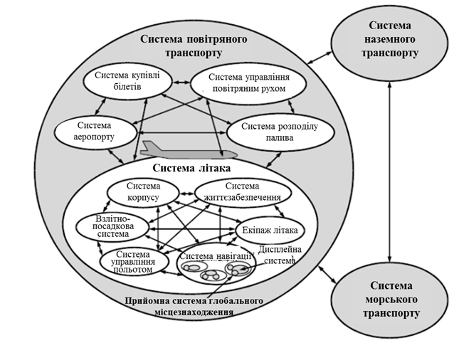
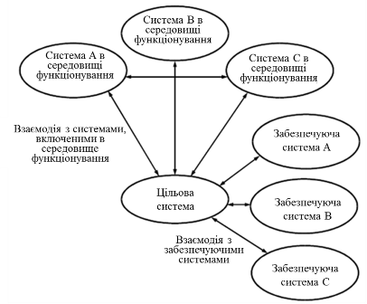

## Тема 1.Системний підхід

Розглянемо систему з точки зору стандарту ДСТУ ISO/IEC 15288:2005 "Інформаційні технології. Системна інженерія. Процеси життєвого циклу системи". ***Система*** (system) - це комбінація взаємодіючих елементів, організованих для досягнення однієї або декількох поставлених цілей.

Сприйняття та визначення конкретної системи, її архітектури та системних елементів залежить від інтересів і обов'язків спостерігача. Система, яка становить інтерес для однієї особи, може розглядатися іншою особою як елемент розглянутої ним системи. І навпаки, вона може розглядатися як частина зовнішнього середовища системи, що представляє інтерес для третьої особи.

На рис. 1.1 представлена множина прикладів сприйняття системи літака і його експлуатаційного середовища. На рисунку проілюстровані наступні аспекти:

-           важливість певних меж, які впливають на формування значущих потреб і практичних рішень;

- ієрархічне сприйняття фізичної структури системи;

- об'єкт будь-якого рівня ієрархічної структури може розглядатися як система;

- система включає повністю інтегровану, певну множину підлеглих систем;

- характерні властивості на кордоні системи виникають в результаті взаємодії між системними елементами;

- люди можуть розглядатися як зовнішні користувачі стосовно системи (наприклад, екіпаж літака по відношенню до навігаційної системи) і як елементи в рамках системи (наприклад, екіпаж літака по відношенню до самого літака);

- система може розглядатися як окремий, ізольований від зовнішнього середовища об'єкт (тобто як продукт), або як упорядкований набір функцій, здатних взаємодіяти з навколишнім середовищем (тобто як набір послуг).

Якими б не були кордони системи, концепції і моделі для них є універсальними і дозволяють практикуючим фахівцям пов'язувати або адаптувати окремі приклади життєвих циклів зі своїми системними принципами. 

Взаємозв’язок (взаємодія) між системами проводиться через ***інтерфейси***. 

У стандарті ISO/IEC 15288:2005 люди розглядаються і як користувачі і як елементи системи. У першому випадку користувач є одержувачем результатів функціонування системи. У другому випадку людина є оператором, який виконує задані системні функції. Таким чином, людина одночасно або поперемінно може виступати як в якості користувача, так і елемента системи.

Рис.1.1. Стандартне представлення системи літака в середовищі його використання з точки зору системного підходу (фрагмент ISO/IEC 15288:2005)

Умовна особа (людина або організація), роль якої по відношенню до системи визначається її інтересами, називається ***зацікавленою особою*** (***stakeholder***).

Виділяючи систему із зовнішнього світу, спостерігач часто виділяє в зовнішньому світі інші системи, з якими взаємодія ця система. Щоб відрізняти ту систему, яка цікавить спостерігача від інших систем, в ISO/IEC 15288:2005 її прийнято називати ***цільовою системою*** (***system-of-interest***). Роль інших систем в зовнішньому світі відносно цільової системи можуть бути також уточнені: забезпечуючи система, система в середовищі функціонування. 

***Системи в середовищі функціонування (system in operational environment)*** – це ті системи, які безпосередньо зв’язані з виконанням цільовою системою своїх функцій в процесі її функціонування. Взаємозв’язок систем в середовищі функціонування з цільовою системою проводиться через інтерфейси. 

***Забезпечуючими системами*** (***еnabling system***) – називають системи, які забезпечують створення, розвиток, функціонування і утилізацію цільової системи протягом її життєвого циклу.   Протягом життєвого циклу цільової системи потрібні спеціальні послуги від систем, які не є безпосередньою частиною середовища функціонування. Кожна з таких систем забезпечує частину (наприклад, стадію) життєвого циклу цільової системи. Такими системами можуть бути, наприклад, системи проектування, виробництва складових цільової системи, системи навчання, системи обслуговування цільової системи і т.д. Поняття забезпечуючої системи тісно зв’язано з життєвим циклом цільової системи.   

Рис.1.2. Система що розглядається, середовище функціонування і забезпечуючі системи (фрагмент ISO/IEC 15288:2005)

**Питання для самоконтролю.**

1. Що таке система з точки зору стандарту ДСТУ ISO/IEC 15288:2005?

2. Від чого залежить визначення системи? Поясніть це на прикладі.

3. Як проводиться взаємозв’язок між системами?

4. Поясніть поняття зацікавлена особа.

5. Що таке цільова система?

6. Як виділяються інші системи відносно цільової системи?

Література: [1, 5]

<-- [Вступ](vstup.md)

--> [2. Автоматизовані системи](lec2.md)