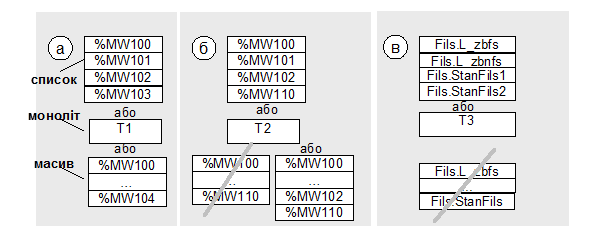

[Зміст](README.md)

## Тема 12. Масиви даних 

З точки зору схеми функціональної структури ***масиви даних*** або ***блок даних*** – це відображення аргументів функцій в конкретній базі даних, конкретного вузла системи. Кожний інформаційний потік починається та закінчується масивом даних. Масивами даних можуть бути змінні бази даних контролера, змінні бази даних реального часу SCADA, записи в базах даних і т.д., які як правило об’єднані (згруповані) між собою по принципу: один масив даних спільний для одного інформаційного потоку. Таке об’єднання дозволяє графічно наглядно представити весь процес обміну.

Масиви даних розміщуються в базах даних програмно-технічного засобу. Під базою даних розуміється виділена структурна одиниця даних. Фізично масиви даних можуть являти собою пам’ять контролера або його частини, виділені для обміну змінні програми або її частини, дисковий простір тощо. Для ідентифікації розміщення даних необхідно показати їх в складі засобу в порядку їх вкладеності:

*засіб -> програма -> частина програми (база даних) -> масив даних*

Для ідентифікації складових масивів даних, в них вказуються назви змінних, або групи змінних, таблиці змінних, таблиці, масиви, записи тощо. Є декілька способів показати склад масивів. Перший спосіб – відобразити масив ***у вигляді списку***, тобто як повний перелік одиничних даних однакового формату (рис.5 – верхні блоки). Цей універсальний спосіб дає змогу побачити всі елементи з даного масиву без додаткової уточнюючої інформації. Такий спосіб рекомендується використовувати тільки при зображенні невеликої кількості даних в масиві, наприклад для засобів PDS, RIO. Кожний елемент списку можна доповнити символьним ідентифікатором, який уточнює його призначення.

Менше місця на схемі займає ***монолітний*** спосіб, тобто використання унітарного позначення масиву (рис.1.5 – середні блоки). Тоді весь масив позначається одним унікальним для цієї схеми ідентифікатором, який розшифровується (розписується) в текстовій частині, наприклад в описі масивів інформації або/та в переліку вхідних і вихідних сигналів/даних. Цей спосіб рекомендується використовувати для позначення таблиць баз даних SCADA/HMI, ПО рівня MES, СУБД. При присутності одних і тих самих змінних в декількох інформаційних потоках, вони повторюються в різних масивах, що не видно на основній схемі. При необхідності перехресні (стосовно потоків) дані можна виділити в окремі масиви як у монолітному вигляді так і в вигляді списку, або показувати зв’язок між монолітними масивами.   

Рис.1.5. Приклади зображення масивів даних: а, б – в ПЛК; в – в SCADA. 

Деякі дані можна представити у ***вигляді розірваного масиву*** з першим та кінцевим елементом. Таке зображення можливе у випадку, коли термінальні елементи (перший та останній в масиві) повністю визначають весь склад масиву даних. На рис.1.5 показані рекомендовані зображення масивів. Для ситуації (а) можливі всі три варіанти, оскільки змінні нумеруються і розміщені без розриву по номеру. Якщо існує розрив в номерах, слід вказати ключові номери елементів, як наприклад, на рис.1.5 (б). Такий спосіб зображення масиву рекомендується для даних ПЛК, RIO, PDS. 

Всі ці способи можна комбінувати. Наприклад, для змінних контролера найбільш підходить вигляд розірваного масиву, для тегів SCADA – список або моноліт. Для останніх вигляд розірваного масиву не підходить, оскільки дані між термінальними елементами не можна однозначно ідентифікувати (рис.1.5(в). 

**Питання для самоконтролю.**

1. Що таке масиви даних в інформаційній структурі?

2. Що можуть собою представляти масиви даних?

3. Що необхідно вказати на схемі інформаційної структури для однозначної ідентифікації даних?

4. Якими способами на схемі інформаційної структури можна графічно зобразити склад масиву даних? 

5. Поясніть в яких випадках і чому доречно зображати масив даних  вигляді списку.

6. Поясніть в яких випадках і чому доречно зображати масив даних вигляді моноліту.

7. Поясніть в яких випадках і чому доречно зображати масив даних вигляді розірваного масиву.

Література: [4]

<-- [11. Задачі і елементи схеми інформаційної структури](lec11.md)

--> [13. Інформаційні потоки](lec13.md)