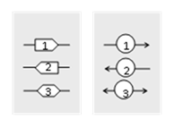
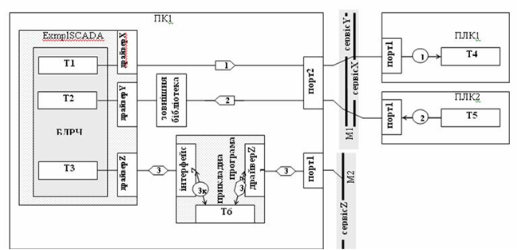

[Зміст](README.md)

## Тема 13. Інформаційні потоки

Мережні інформаційні потоки зображуються у вигляді лінії, на якій вказується його номер. Для уточнення інформації про інформаційний потік, номер може бути вписаний в певну геометричну фігуру. Фігура може вказувати на тип сервісу, який використовується з боку даних. Наприклад, для Клієнт-Серверних моделей сервісів, з боку Клієнту (той, хто ініціює запит) можна вказати фігурну стрілку, яка вказує на напрямок передачі даних, а з боку Серверу – круг зі стрілками (рис.1.6). При двосторонньому обміні (читання/запис однакових змінних), при використанні одного і того ж сервісу, два і більше потоки можна умовно об’єднувати в один. При цьому зі сторони Клієнта вказується двостороння фігурна стрілка, а в текстовій частині інформація уточнюється. 

Рис.1.6. Приклади зображення 

На схемі вказуються ***комунікаційні сервіси***, якими послуговуються інформаційні потоки. Якщо сервіси однозначно визначаються протоколом, то вказується протокол обміну. Як правило необхідно вказувати прикладні сервіси і відповідно прикладні протоколи. Для спрощення в контексті правил побудови буде використовуватись слово "сервіс" а не "протокол". 

Кожний потік починається з масиву даних. Початком потоку умовно можна вважати бік його ініціювання. Далі в порядку слідування потоку вказуються комунікаційні засоби програмного забезпечення, що відповідають за обмін, тобто його інтерфейсна частина (драйвери пристроїв, бібліотеки обміну і т.д.). Якщо ці складові приховані від розробника системи і вважаються внутрішньою закритою складовою програмно-технічного засобу, то її вказувати не потрібно. Вказуються необхідно тільки ті частини програмного забезпечення, які неоднозначні і можуть бути замінені на альтернативні. 

На рис.1.7 показані три типові випадки (не повний перелік) слідування інформаційних потоків від масиву даних до зовнішнього порту комп’ютера. Всі вони послуговуються умовними інтерфейсними каналами прикладної програми, які будемо називати ***драйверами***. Для кожного драйверу можуть існувати настройки, які інколи необхідно уточнювати або на схемі, або в текстовій частині. Як мінімум на схемі потрібно показувати дійсну або умовну назву цього каналу.

Перший інформаційний потік починається з масиву даних Т1. Для передачі даних по мережі М1 використовується «драйверХ», який являється інтерфейсною частиною прикладної програми ExmplSCADA. У даному випадку достатньо вказати тільки цей інтерфейс, можливо з деякими уточненнями. Якщо всі дані передаються через єдиний інтерфейс, який не можливо змінити, то «драйверХ» не вказується, оскільки інших варіацій бути не може.

Інколи драйвер прикладної програми використовує проміжну бібліотеку (програму, драйвер). Причому ім’я бібліотеки або її тип може відрізнятися. Для прикладу, якщо на рис.1.7 «драйверY» – це реалізація ОРС-клієнтського інтерфейсу, то необхідно вказати також ОРС-Сервер для реалізації потрібного протоколу мережі. В цьому випадку бібліотеку просто показують на шляху слідування потоку в "розриві". 

Рис.1.7. Приклад проходження інформаційних потоків

При необхідності, в проміжній бібліотеці (програмі, драйвері) можна деталізувати внутрішню структуру. Наприклад, при використанні ОРС з декількома реалізованими протоколами обміну необхідно вказати який з них використовується даним інформаційним потоком (йде через нього), та основні комунікаційні дані цього драйверу. У деяких випадках необхідно показати внутрішні дані цієї програми, через який проходить обмін. На рис.1.7 інформаційний потік 3 проходить через таку програму. Програма "розриває" потік, тому він реалізовується у вигляді двох потоків 3k та 3s. Всередині показаний допоміжний масив даних Т6. 

При необхідності, на шляху проходження потоку, після програмного забезпечення, драйверів, бібліотек вказуються адреси станцій (вузлів) на мережі та логічні канали або порти, які є інтерфейсними для програмно-технічного засобу. ***Логічний канал*** являється відображенням фізичного каналу, а його маркування залежить від реалізації та типу ПЗ. У загальному випадку логічний канал може мати вигляд:

*ідентифікатор_модуля **.** ідентифікатор_каналу*

Ідентифікація модуля та каналу залежить від реалізації і повинна бути однозначною та зрозумілою. Приклади:

-     "CPU.Modbus" або "CPU.0" або "0.0" або "0.Modbus" можуть бути для інтегрованого каналу з назвою "Modbus" (0-й порт) в процесорний модуль (0-й модуль);

-     "CP343-1.LAN" – порт Ethernet на модулі CP343-1, якщо такий модуль тільки один в конфігурації, або "CP343-1(3).LAN" якщо таких модулів декілька і необхідний знаходиться на 3-му місці;

-     "Port3", "COM1", "LAN" - інтегровані канали пристрою з унікальною назвою;    

Логічні канали повинні мати унікальний ідентифікатор в межах пристрою.  

***Адреса***(-си) можуть прив’язуватися до логічних каналів. У випадках, коли на одному логічному каналі знаходиться декілька адрес, на шляху інформаційного каналу вказується та, яка для нього використовується. Коли канал використовується декількома драйверами (якщо таке можливо), адреси не прив’язуються до каналу, а прив’язуються до драйверу.

Після каналу всі потоки об’єднуються в одну ***інформаційну шину***, що являє собою використання єдиного комунікаційного сервісу, яким вони користуються. Одна мережа (фізична) та протокол може підтримувати декілька сервісів (протоколів). Інформаційні шини не обов’язково повинні відповідати сервісам протоколу одного рівня (наприклад прикладного), але повинні однозначно вказати чим "користуються" інформаційні потоки.

Інформаційний потік закінчується аналогічно, як і починався. Тому "початок" потоку є умовним і не обов’язково починається зі сторони клієнта.

**Питання для самоконтролю.**

1. Яким чином на інформаційній структурі можна графічно зобразити інформаційний потік?

2. Як на інформаційному потоці можна показати тип сервісу, яким він послуговується з боку даних?

3. Як на інформаційному потоці можна показати сервіс, яким він послуговується? Що таке інформаційна шина?

4. Як на інформаційній структурі показуються інтерфейсні канали, якими послуговуються інформаційні потоки?

5. Як на інформаційній структурі показується логічний канал пристрою? Як він може ідентифікуватися? 

6. Яким чином вказуються адреси вузлів? Як вони прив’язуються до логічних каналів та драйверів?

Література: [4]

<-- [12. Масиви даних](lec12.md)

--> [14. Побудова схеми інформаційної структури для мереж Modbus Serial](lec14.md)

