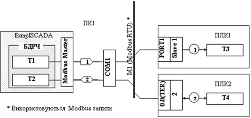
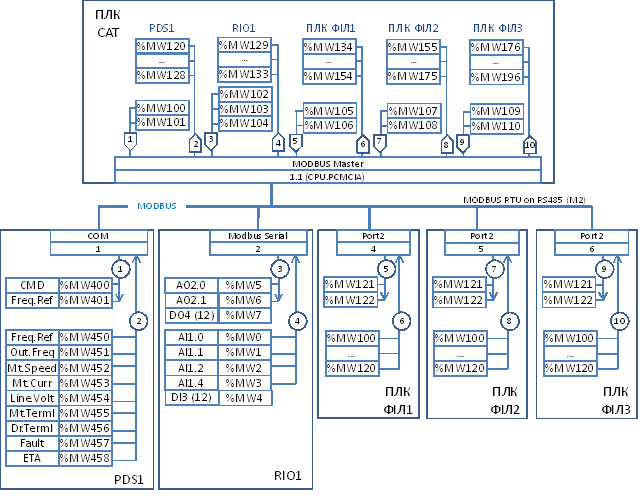

[Зміст](README.md)

## Тема 14. Побудова схеми інформаційної структури для мереж Modbus Serial

Виконання схеми розглянемо на прикладі (рис.1.8). Комп’ютер під’єднується до шини Modbus RTU через СОМ-порти. Для операційної системи ПК не важливо, чи це реалізація інтерфейсу RS-232, чи RS-485 в послідовному режимі, чи USB як емулятор СОМ-порта. Для неї це завжди буде СОМ-порт з певним номером. Оскільки при настройці драйверу необхідно вказати номер порту, його треба показати на інформаційному потоці. Також необхідно вказати який саме тип драйверу Master чи Slave використовується. При використанні драйверу Slave треба також вказати адресу.

У мережі Modbus RTU в більшості випадків використовуються стандартні Modbus-запити читання/запису регістрів/бітів, однак в багатьох реалізаціях доступні інші типи сервісів. Різні сервіси при необхідності можна показувати різними інформаційними шинами. Для спрощення схеми можна показувати тільки сервіс "Modbus запити", або "Modbus", або "MBAP", або у вигляді зноски (рис.1.8). 

Рис.1.8. Приклад інформаційної структури системи з Modbus RTU

ПЛК на шині може бути як Ведучим, так і Веденим. На рис.1.8 ПЛК1 та ПЛК2 являються Веденими. Адреса Веденого прив’язується до логічного каналу контролера. В ПЛК1 логічний канал адресується як PORT1 (наприклад контролер TWIDO). В ПЛК2 адресація йде за принципом номер_модуля.номер_каналу (наприклад TSX Micro), тобто з’єднання з Modbus RTU проводиться через 0-й канал 0-го модуля (TER - термінальний порт). Адреса Ведених для двох ПЛК для прикладу показана по різному: слово "slave" може вказуватись а може бути присутній тільки номер Веденого. 

У наступному прикладі (рис.1.9) Modbus RTU використовується не тільки для зв’язку між ПЛК та ПК а також в якості мережі вводу/виводу (рівень датчиків та розподіленої периферії). При зображенні масиву змінних у вигляді списку або розірваного масиву, необхідно показати змінні згідно Modbus моделі (області даних 1x,0x,3x,4x). Однак для зручності інтерпретації їх в системі ПЛК Premium (Master), Holding Registers на пристроях позначені як %MW. На перетворювачі частоти PDS1 та засобі розподіленого вводу/виводу RIO1 масив даних представлений у вигляді списку, де кожний елемент є змінна Modbus, відображена на конкретну змінну пристрою. На Ведучому вузлі (ПЛК САТ) над масивами даних показане позначення Ведених, де розміщені джерела даних. 

Рис.1.9. Приклад інформаційної структури системи з Modbus RTU

**Питання для самоконтролю.**

1. Що необхідно визначити в масиві даних для інформаційної структури мережі Modbus?

2. Що необхідно вказати на інформаційній шині для інформаційної структури мережі Modbus?

3. Що необхідно вказати в інтерфейсній частині засобів для інформаційної структури мережі Modbus?  

Література: [4]

<-- [13. Інформаційні потоки](lec13.md)

--> [15. Побудова схеми інформаційної структури для мереж Ethernet](lec15.md) 