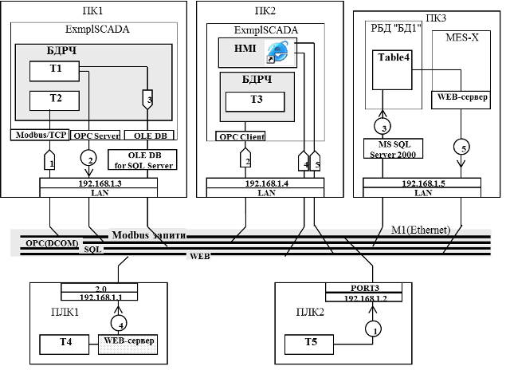
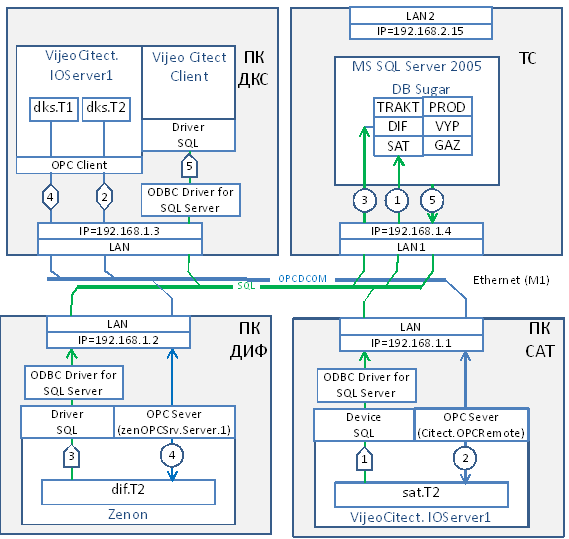

[Зміст](README.md)

## Тема 15. Побудова схеми інформаційної структури для мереж Ethernet

На рис.1.10 показано функціонування системи, яка складається з трьох ПК та двох ПЛК, які підключені до Ethernet. Комп’ютери підключаються за допомогою вбудованих портів на материнській платі, ПЛК1 та ПЛК2 через інтегровані канали в процесорному модулі. Всі сервіси без винятку в даному випадку використовують протоколи ТСР/IP, тому до портів необхідно прив’язати адресу ІР (в даному випадку МАС адреса мало цікавить інтегратора).

Нижче прокоментовано слідування потоків. 

1-й потік. SCADA на ПК1 читає змінні з ПЛК2 використовуючи Modbus/TCP. Для цього в SCADA використовується відповідний драйвер, а ПЛК звісно підтримує цей протокол (наявність Ethernet в ПЛК не визначає присутність протоколу Modbus/ TCP). 

2-й потік. SCADA на ПК2 читає дані зі SCADA на ПК1 використовуючи технологію ОРС, яка в свою чергу базується на сервісах DCOM. Для цього SCADA на ПК2 має ОРС-клієнтський інтерфейс, а на ПК1 – ОРС-серверний. 

Рис.1.10. Приклад схеми інформаційної структури з Ethernet

3-й потік. SCADA на ПК1 записує дані в архів реляційної бази даних під назвою "DB1", в таблицю "Table4". Формат БД - SQL Server, управляється СУБД MS SQL Server 2000, обмін проводиться за допомогою технології OLE DB через відповідний провайдер даних.

4-й потік. У SCADA на ПК2 вбудований стандартний елемент ActiveX – Internet Explorer, за допомогою якого користувач може доступатися до WEB-сторінок. В даному випадку він може заглянути на WEB-сторінку ПЛК1, на якій є зображена мнемосхема з даними Т4. 

5-й потік аналогічний 4-му. В цьому випадку користувач доступається через WEB-сервер програми MES-системи, під назвою MES-Х, до архівних даних з БД1. 

У наступному прикладі (рис.1.11) кожен масив даних позначається з двох частин: ідентифікатора вузла та ідентифікатора масиву даних в межах вузла. Крім того, база даних "Sugar" показана як частина MS SQL Server. 5-й потік показує, що звернення Vijeo Citect Client йде до всіх даних БД. 

Рис.1.11. Приклад схеми інформаційної структури системи з Ethernet

**Питання для самоконтролю.**

1. Що необхідно вказати на інформаційній шині для інформаційної структури мережі Ethernet?

2. Що необхідно вказати в інтерфейсній частині засобів для інформаційної структури мережі Ethernet?

3. Назвіть приклади сервісів і протоколів, які використовується для побудови інтегрованих АСУ на базі Ethernet? Яким чином вони показуються на інформаційній структурі системи? 

Література: [4]

<-- [14. Побудова схеми інформаційної структури для мереж Modbus Serial](lec14.md)

--> [16. Побудова схеми інформаційної структури для CANOpen](lec16.md)