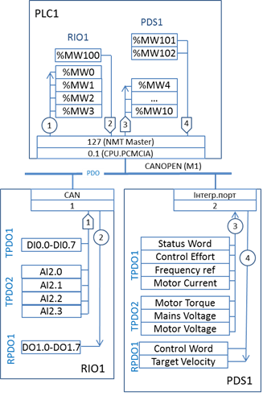

[Зміст](README.md)

## Тема 16. Побудова схеми інформаційної структури для CANOpen

На прикладному рівні CANOpen, для обміну даними процесу можуть використовуватися два типи сервісів: PDO та SDO. Тому на інформаційній структурі в якості інформаційної шини необхідно показати який саме тип сервісу використовується. 

Масиви даних процесу, які приймають участь в обміні, показуються окремо для кожного PDO/SDO. Наповнення масиву даних для PDO співпадає з PDO-Відображенням (PDO Mapping), а номер TPDO чи RPDO вказується як назва цього масиву. Можна також вказати COB-ID для кожної пари зв’язаних PDO. Якщо в якості NMT-Ведучого є ПЛК, в якості масиву даних вказується діапазон змінних, який пов’язаний з TPDO або RPDO.  

Для обміну великим обсягом даних процесу можуть використовуватись SDO. В цьому випадку у вигляді масиву даних вказуються об’єкти SDO (номери та COB-ID), а в якості його наповнення – перелік назви об’єктів та їх Index/ SubIndex, які переносяться цим SDO. Слід зауважити, що SDO використовується для конфігурації вузлів, однак на схемі мережних інформаційних потоків немає сенсу вказувати цей SDO-обмін.

На рис.1.12 показаний приклад схеми інформаційної структури системи з використанням мережі CANOpen, де NMT Ведучим є TSX Premium, RIO1 – Advantys STB, PDS1 – Altivar71. Для реалізації всіх потоків використовуються сервіси PDO, що зображено відповідною інформаційною шиною. 

 В прикладі потоки 2,3, та 4 ініціюються PLC1: 2-й та 4-й – це запис при зміні значення, 3 – читання шляхом передачі запиту RTR. Перший потік ініціюється RIO1, оскільки передача значення TPDO починається по зміні його значення в RIO1. Тому ці потоки мають відповідне зображення на схемі.

Враховуючи відсутність можливості явного конфігурування PDO в NMT-Ведучому, та відсутності динамічного зв’язування PDO, на схемі біля масивів змінних відсутня ідентифікація PDO в PLC1. 

Рис.1.12. Приклад схеми інформаційної структури системи з CANOpen

**Питання для самоконтролю.**

1. Що необхідно визначити в масиві даних для інформаційної структури мережі CANopen?

2. Що необхідно вказати на інформаційній шині для інформаційної структури мережі CANopen?

3. Що необхідно вказати в інтерфейсній частині засобів для інформаційної структури мережі CANopen?  

Література: [4]

<-- [15. Побудова схеми інформаційної структури для мереж Ethernet](lec15.md)

--> [17. Побудова схеми інформаційної структури для Profibus](lec17.md)