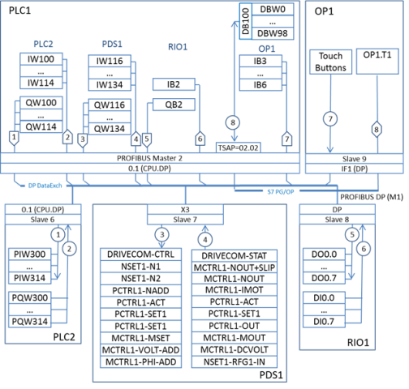

[Зміст](README.md)

## Тема 17. Побудова схеми інформаційної структури для Profibus

На прикладному рівні (на "рівні профілів") в Profibus можливе використання різних типів сервісів, що необхідно показати на схемі інформаційної структури. Для обміну процесними даними можуть використовуватись циклічний (Data-Exchange) та ациклічний DP-обмін даними, обмін типу Видавець-Абонент, обмін FMS-повідомленнями. Крім того на цій же мережі можуть підтримуватись інші сервіси, які не визначені в стандартах Profibus. Наприклад в програмно-технічних засобах Siemens та VIPA підтримуються Siemens-сумісні S7-функції обміну (до них також відносяться PG/OP-сервіси) та S5-функції (SEND/RECEIVE). Таким чином на одній мережі можуть бути зображені декілька інформаційних шин.

Вхідні та вихідні дані, що приймають участь в обміні показуються відповідно як окремі масиви даних. В наповненні масиву даних вказується джерело даних для даного вузлу (змінні, номера входів або виходів, назва параметру, тощо). 

Для клієнт-серверного типу обміну циклічними та ациклічними даними процесу, позначення клієнтської та серверної сторони співпадає з загальноприйнятими. Для обміну Видавець-Абонент, номера потоків в фігурних стрілках можна вказувати з боку Видавця а можна з боку Ведучого. В будь якому випадку позначення необхідно описати.   

При необхідності, на схемі інформаційних потоків можна окремо виділяти групи SYNC/FREEZE, консистентність даних, тощо. 

На рис.1.13 наведена схема інформаційної структури для системи з PROFIBUS DP. Всі пристрої, крім OP1 (операторська панель Siemens TP 177B), обмінюються даними з Ведучим з використанням циклічного DP-обміну Data-Exchange. На графічному зображенні даний сервіс показаний як "DP DataExch". Враховуючи, що в даному обміні процес Ведучого являється Клієнтом, саме з його боку показаний бік ініціювання обміну. 

Вузол OP1 є DP-Веденим на шині (операторські панелі можуть бути і Ведучими шини). Дана панель використовує DP сервіси тільки для відправки Ведучому (PLC1) номеру нажатої клавіші на сенсорному екрані панелі (режим Direct Keys). Для цього в області входів PLC1 виділяється 4-ри байти (IB3-IB6), де буде зберігатися стан 32 клавіш панелі. Зчитування та запис значень для змінних Tag1-Tag50 операторська панель проводить з використанням S7 функцій зв’язку, зокрема сервісів PG/OP. 

S7-комунікації являються стандартним типом зв’язку між ПЛК Siemens S7-200, S7-300/400 та засобами ЛМІ від Siemens. Вони базуються на клієнт-серверному обміні зі встановленням з’єднання. З’єднання можуть бути наперед конфігурованими або без попередньої конфігурації. В будь якому випадку Клієнт та Сервер організують з’єднання через транспортні адреси TSAP. Адреса TSAP складається з 2-х байтів: 1 байт – ресурс з’єднання (Connection Resource), 2 байт – шасі та слот модуля з’єднання (Rack/Slot). Для PG та OP з’єднань зарезервовані спеціальні ресурси з’єднання: PG =1 та OP=2, тому при використанні цих серверних ресурсів, попередньо конфігурувати з’єднання не потрібно. Виходячи з вищесказаного, для налаштування S7 зв’язку, при конфігурації панелі необхідно крім адреси DP-вузла вказати шассі (=0) та слот (=2), де знаходиться центральний процесор PLC1, який є його партнером по зв’язку. Враховуючи що панель використовує ОР ресурс, серверний TSAP для зв’язку ОР1-PLC1 буде дорівнювати TSAP=02.02. Клієнтський TSAP в даному випадку виділяється в ОР1 самостійно, тому його вказувати при конфігуруванні не потрібно. 

Слід звернути увагу, що на схемі інформаційної структури 8-й потік, що реалізований з використанням PG/OP сервісів ініціюється з боку операторської панелі ОР1, оскільки вона являється клієнтом.

Рис.1.13. Приклад схеми інформаційної структури системи з PROFIBUS

**Питання для самоконтролю.**

1. Що необхідно визначити в масиві даних для інформаційної структури мережі Profibus?

2. Що необхідно вказати на інформаційній шині для інформаційної структури мережі Profibus?

3. Що необхідно вказати в інтерфейсній частині засобів для інформаційної структури мережі Profibus?  

Література: [4]

<-- [16. Побудова схеми інформаційної структури для CANOpen](lec16.md)