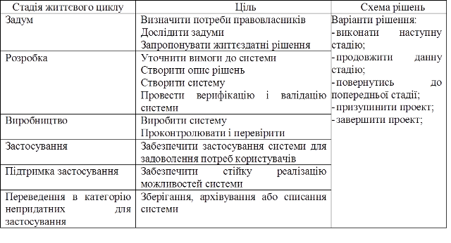

[Зміст](README.md)

## Тема 3. Життєвий цикл систем згідно ISO/IEC 15288:2005.

***Життєвий цикл системи*** (***system life cycle***) – період часу, протягом якого розвивається система, змінюючи свій стан, починаючи від замислу і закінчуючи списанням. Слід розрізняти життєвий цикл системи і життєвий цикл проекту. 

***Стадія життєвого циклу*** – період в межах життєвого циклу системи, що відноситься до стану системного опису або безпосередньо до самої системи. Стадії відносяться до періоду значного просунення системи і досягнення запланованих термінів протягом життєвого циклу. Вони можуть перекривати одна одну, можуть застосовуватися для побудови структур, за допомогою яких процеси життєвого циклу використовуються для моделювання безпосередньо життєвого циклу.

Не зважаючи на різницю в життєвих циклах різних систем, існує базовий набір стадій життєвого циклу, які складають повний життєвий цикл будь-якої системи. Кожна стадія має певну ціль і вклад в повний життєвий цикл і розглядається при плануванні і виконанні життєвого циклу системи. 

У таблиці 1 представлені приклади стадій життєвого циклу, які найбільш часто зустрічаються. У таблиці відображені принципові цілі кожної з стадій і можливі варіанти рішень, що використовуються для управління досягненнями і ризиками, пов'язаними з розвитком системи протягом життєвого циклу. Організації проходять стадії життєвого циклу різними способами, усуваючи протиріччя між стратегією здійснення бізнесу та стратегією зменшення ризиків. Паралельне проходження стадій або їх проходження в різному порядку може призвести до форм життєвого циклу з абсолютно різними характеристиками. Часто в якості альтернативних варіантів використовуються ***послідовна***, ***інкрементна*** або ***еволюційна*** форми життєвого циклу; в окремих випадках можуть бути розроблені комбінації цих форм.

*Таблиця 1. Приклад стадій, їх цілей і основних схем рішень* 

 

Вибір і розробка організацією конкретних форм життєвого циклу залежать від ряду факторів, включаючи бізнес-контекст, природу і складність системи, стабільність вимог, технологічні можливості, потреба в різних системних можливостях в часі та наявність бюджетних коштів і ресурсів.

Аналогічно тому, як всі системні елементи здійснюють внесок у систему як у єдине ціле, так і кожна стадія життєвого циклу повинна враховуватися на будь-який інший її стадії. Таким чином, залучені сторони в життєвому циклі повинні координувати свої дії і кооперуватися один з одним протягом усього життєвого циклу. Синергія стадій життєвого циклу і сторін, що вкладають кошти в реалізацію функціональностей на цих стадіях, є необхідною для успішного здійснення проектних заходів. Тісний зв'язок і, по можливості, єднання проектних команд, різних функцій і організацій, відповідальних за інші стадії життєвого циклу, призводять до логічності та узгодженості життєвого циклу.

У різних стадіях життєвого циклу можуть приймати участь різні організації. Тим не менше, кожна з цих стадій керується організацією, яка відповідає за дану стадію, при цьому велику увагу треба приділяти розгляду доступної інформації по планам та рішенням життєвого циклу, прийнятим на попередніх стадіях. Аналогічним чином організація, відповідальна за цю стадію, веде записи прийнятих рішень і припущень, які відносяться до наступних стадій в даному життєвому циклі.  

Стадії життєвого циклу створюють структуру робіт для деталізованого моделювання життєвих циклів системи при використанні процесів життєвого циклу системи. ***Процес*** – сукупність взаємозв’язаних і взаємодіючих видів діяльності, які перетворюють входи у виходи. Процеси і дії життєвого циклу відбираються, відповідним чином налаштовуються і використовуються протягом стадії життєвого циклу для повного задоволення цілей і результатів на цій стадії. 

***Модель життєвого циклу*** – структурна основа процесів і дій, яка відноситься до життєвого циклу, яка також слугує в якості загального посилання для встановлення зв’язків та взаєморозуміння сторін. 

Стандарт ISO/IEC 15288:2005 визначає множину процесів, названих процесами життєвого циклу, за допомогою яких може бути змодельований життєвий цикл системи. 

Процеси життєвого циклу системи поділяються на чотири групи процесів:

1) процеси угоди;

- a)   процеси придбання, використовувані організаціями для придбання продукції або отримання послуг;

- b)  процеси поставки, використовувані організаціями для поставок продукції або надання послуг.

2) процеси підприємства (забезпечення проектів);

- a)   процес управління середовищем підприємства;

- b)  процес управління інвестиціями;

- c)   процес управління процесами життєвого циклу системи;

- d)  процес управління ресурсами;

- e)   процес управління якістю.

3) проектні процеси;

- a)   процес планування проекту;

- b)  процес оцінки проекту;

- c)   процес контролю проекту;

- d)  процес прийняття рішень;

- e)   процес управління ризиками;

- f)   процес управління конфігурацією;

- g)   процес управління інформацією.

4) технічні процеси

- a)   процес визначення вимог зацікавлених осіб;

- b)  процес аналізу вимог;

- c)   процес проектування архітектури;

- d)  процес реалізації елементів системи;

- e)   процес комплексування;

- f)   процес верифікації;

- g)   процес передачі;

- h)  процес валідації;

- i)    процес функціонування;

- j)    процес технічного обслуговування;

- k)  процес вилучення та списання.

***Процеси угоди*** визначають дії, необхідні для досягнення угоди між двома організаціями. У результаті здійснення процесу придбання забезпечуються умови для ведення справ з постачальником продукції, використовуваної як діючою системою та службами її підтримки, так і елементами системи, що розробляється в рамках проекту. У результаті процесу поставки забезпечуються умови для управління проектом, результатом якого є продукт або послуга, що поставляються стороні яка придбає.

***Процеси підприємства*** управляють здатністю організації набувати і поставляти продукцію або послуги за допомогою запуску проектів, їх підтримки та контролю. Процеси підприємства забезпечують ресурси та інфраструктуру, необхідні для здійснення проектів, і гарантують досягнення цілей і виконання зобов'язань організації за угодами. Ці процеси не розглядаються як вичерпна сукупність бізнес-процесів, які уможливлюють стратегічне управління діяльністю організації.

***Проектні процеси*** використовуються для встановлення та виконання планів, оцінки фактичних досягнень і просувань проекту у відповідності з планами і для контролю виконання проекту аж до його завершення. Окремі процеси проекту можуть здійснюватися в будь-який момент життєвого циклу і на будь-якому рівні ієрархії проектів як у відповідності з проектними планами, так і з урахуванням непередбачених обставин. Рівень точності і формалізації, з якою здійснюються процеси проекту, залежить від складності самого проекту і проектних ризиків. 

***Технічні процеси*** використовуються для визначення вимог до системи, перетворення цих вимог в ефективний продукт, що дозволяє здійснювати, при необхідності, стійке відтворення цього продукту, використовувати його для забезпечення необхідних послуг, підтримувати забезпечення цими послугами і видаляти продукт, коли він вилучається з обігу. Технічні процеси визначають сукупність робіт, які дозволяють у рамках завдань підприємства та проекту оптимізувати прибуток і зменшувати ризики, що виникають внаслідок прийняття технічних рішень та здійснення відповідних дій. 

**Питання для самоконтролю.**

1. Що таке життєвий цикл системи?

2. Що таке стадія життєвого циклу системи?

3. З яких стадій частіше всього складається життєвий цикл автоматизованих систем? Які цілі при цьому досягаються?

4. Які форми життєвого циклу проекту ви знаєте? Від чого залежить вибір форми?

5. Поясніть що таке процес життєвого циклу?

6. Які групи процесів життєвого циклу Ви можете назвати?

7. Розкажіть про призначення процесів кожної групи. 

Література: [5]

 <-- [2. Автоматизовані системи](lec2.md) 

--> [4. Життєвий цикл автоматизованих систем згідно ГОСТ 34.601-90](lec4.md)