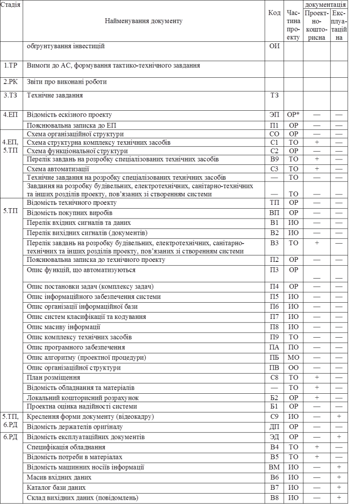

[Зміст](README.md)

## Тема 5. Розробка документації на стадіях створення автоматизованих систем

**Стандарт на види, тип та комплектність документів на АС.** На стадіях життєвого циклу автоматизованої системи, розробляється ряд документів, які зводяться в певний вид документації. Правила створення документації на АС регламентується міждержавним стандартом ***ГОСТ 34.201-89*** "Виды, комплектность и обозначение документов при создании автоматизированных систем". ***Робоча документація на АС*** – частина документації на АС, яка необхідна для виготовлення, будівництва, монтажу та наладки автоматизованої системи в цілому, а також програмно-технічних, програмно-методичних комплексів та компонентів технічного, програмного та інформаційного забезпечення, що входять в систему. 

**Документи на види забезпечення.** Створення АС об’єкта управління проводиться за документами наступних видів забезпечення:

Технічне забезпечення АС (***ТО***) – сукупність технічних засобів системи та експлуатаційної документації, здатних забезпечити функціонування системи в повному обсязі.

Інформаційне забезпечення АС (***ИО***) – набір документів та даних, які вміщують: перелік і характеристики змінних, які відображають фактичний стан об’єкта управління та автоматизованої системи; опис правил класифікації та кодування інформації та її груп; опис масивів вхідної та вихідної інформації; форми документів, відеокадрів, які використовуються в системі.

Математичне забезпечення (***МО***) – сукупність методів, моделей та алгоритмів, які використовуються в системі. МО реалізується у вигляді програм спеціального ПО.

Програмне забезпечення АС (***ПО***) – сукупність програм та експлуатаційної програмної документації, необхідних для реалізації АС при використанні технічного забезпечення системи. ***Загальне програмне забезпечення*** – частина програмного забезпечення, яка: поставляється в комплексі з засобами обчислювальної техніки; придбається на ринку програмних продуктів. ***Спеціальне програмне забезпечення*** – частина програмного забезпечення, яка розробляється спеціально при створенні даної системи для реалізації основних та додаткових функцій АС. Це програмне забезпечення створюється на базі загального ПО.

***Організаційне забезпечення*** (***ОО***) – опис структур АС, інструкції оперативному персоналу, на основі яких персонал повинен функціонувати в складі автоматизованого технологічного комплексу.

Перелік найменувань документів, що розробляються та їх комплектність на систему та її частини повинен бути визначений в технічному завданні на створення автоматизованої системи (підсистеми). 

**Комплектність та види документів по стадіям створення АС.** Види документів по стадіям створення АС, відповідно до типу забезпечення зведені в таб.2. 

*Таблиця.2. Види документів, що створюються по стадіям створення*

*ОР – загальносистемні рішення

Вимоги до складу та змісту документації на АС наведені в методичних вказівках ***РД 50-34.698-90***. 

**Питання для самоконтролю.**

1. Що таке робоча документація?

2. За документами яких видів забезпечення проводиться розробка АС?

3. Які види документів розробляються на кожній із стадій робіт по створенню АС?

Література: [1-4]

<-- [4. Життєвий цикл автоматизованих систем згідно ГОСТ 34.601-90](lec4.md)

--> [6. Функціональна інтеграція](lec6.md)