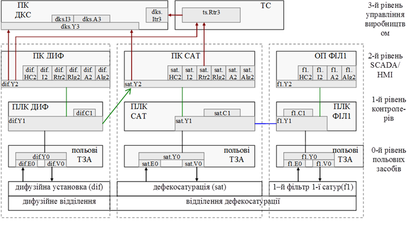
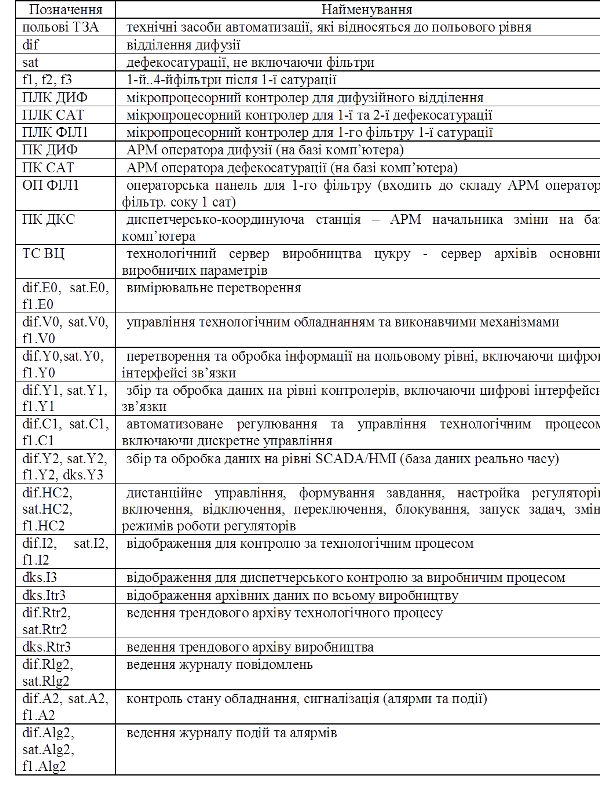
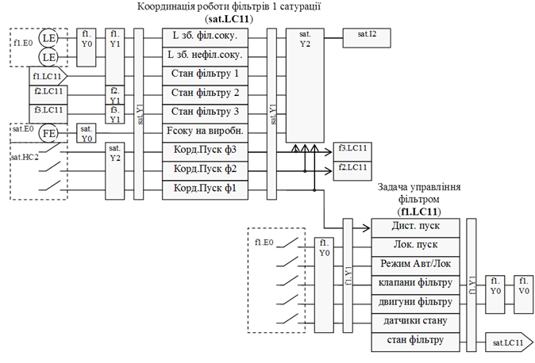

[Зміст](README.md)

## Тема 7. Розробка функціональної структури

Функціональна структура створюється на основі вихідних даних, які являють собою викладені характеристики об’єкту та вимог до нього. Характеристика функціональної структури повинна включати схему функціональної структури та опис автоматизованих функцій. Функції, що повинні виконуватися системою, розбивають на декілька взаємопов’язаних інформаційними зв’язками під-функцій, враховуючи їх реалізацію на окремих технічних засобах. Ці функції та інформаційні зв’язки показуються на функціональній структурі. Схема функціональної структури виконується в довільній формі. Згідно ГОСТ 24.210-82 та РД 50-34.698.90 вона включає:

-     елементи функціональної структури ІАС (підсистем АС); автоматизовані функції та (або) задачі (комплекси задач); сукупність дій (операцій), які виконуються при реалізації автоматизованих функцій тільки технічними засобами (автоматично) або тільки людиною;

-     інформаційні зв’язки між елементами та з зовнішнім середовищем та короткою вказівкою змісту повідомлень та (або) сигналів, які передаються по зв’язкам, та при необхідності, зв’язки інших типів;

-     деталізовані схеми частин функціональної структури (при необхідності).

Схему загальної функціональної структури інтегрованої АСУ виробництвом рекомендується показувати зі збереженням функціональної ієрархічності рівнів управління. Наприклад: 0-й (нижній) рівень – рівень польових засобів, 1-й – рівень контролерів, 2-й рівень – рівень SCADA/HMI, 3-й рівень – рівень управління виробництвом (рис.1.3). 

Рис.1.3. Фрагмент прикладу функціональної структури інтегрованої АСУ виробництвом цукру

До схеми функціональної структури додається таблиця умовних позначень, приклад показаний в таб.3.      

*Таблиця 3. Таблиця умовних позначень до прикладу схеми функціональної структури.*

    

Інформаційні зв’язки (інформаційні потоки) між функціями та задачами можна показувати у вигляді стрілок, які вказують на напрямок передачі інформації, або без стрілок, якщо інформація передається в обидва боки. Інформаційні зв’язки можна помітити цифрами, для подальшого посилання на них в текстовій частині.

Функції на схемах можна об’єднувати по загальному функціональному призначенню, даючи їм позначення, наприклад, згідно функціональної ознаки на схемах автоматизації.

Для рівня польових ТЗА можна виділити загалом три типи функцій: вимірювання або первинне перетворення (E); реалізація управляючих дій з використанням виконавчих механізмів (V); інші типи перетворення (Y). Усі інші функції можна буде вказати та деталізувати на схемах автоматизації.

 Функції рівня контролерів можна виділити в дві групи: автоматичного управління (C), включаючи функції дискретного управління; збір та обробка даних на рівні контролерів (Y), включаючи цифрові інтерфейсні зв’язки. При необхідності включаються інші групи функцій (наприклад сигналізація A, архівування R, тощо). 

Для рівня SCADA/HMI та диспетчерського управління, всі функції виділені в такі групи: збір та обробка даних реально часу (Y), дистанційне управління та зміна режимів роботи з ЛМІ (HC), відображення на засобах ЛМІ (I), ведення трендового архіву (Rtr), ведення журналу повідомлень (Rlg), ведення журналу подій та алармів (Alg), сигналізація (А).

Кожній з підсистем рекомендується давати унікальне позначення, наскрізне для всього проекту (dif, sat, f1). Враховуючи, що кожна підсистема функціонально складається з 3-х рівнів, групу функцій зручно позначати з комбінації: підсистема + функціональна група + функціональний рівень.  

Набір функцій кожного рівня для конкретної системи може відрізнятись. Так, наприклад, при використанні вбудованих регуляторів в перетворювачах частоти або RIO, на польовому рівні бажано показати ці групи функцій літерою “C”, в використання вторинних показуючи приладів - літерою “I”, пристроями байпасного управління - “HC”, і т.п. 

Деталізовані схеми частин функціональної структури, наприклад окремі взаємопов’язані функції, які є результатом декомпозиції загальних функцій, можна показати окремо, наприклад у вигляді блочної моделі інформаційних потоків (рис.1.4).

Рис.1.4. Фрагмент функціональної схеми координованого управління роботою фільтрів 1-ї сатурації

**Питання для самоконтролю.**

1. Які документи використовуються для представлення функціональної структури АС?

2. Які елементи включає функціональна структура?

3. З яких елементів складається схема функціональної структури АС?

4. Як можна представити елементи на схемі функціональної структури?

5. Яким чином на схемі функціональної структури можна показати ієрархічний рівень, підсистему, тип функції?

Література: [1-4]

<-- [6. Функціональна інтеграція](lec6.md)

--> [8. Опис функцій, що автоматизуються](lec8.md)