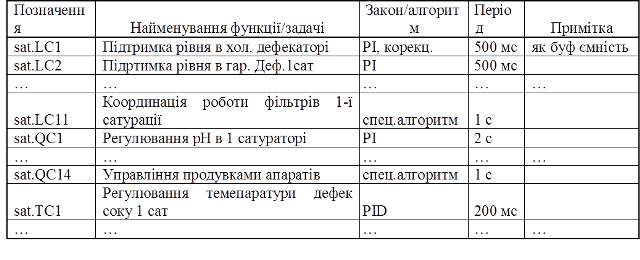
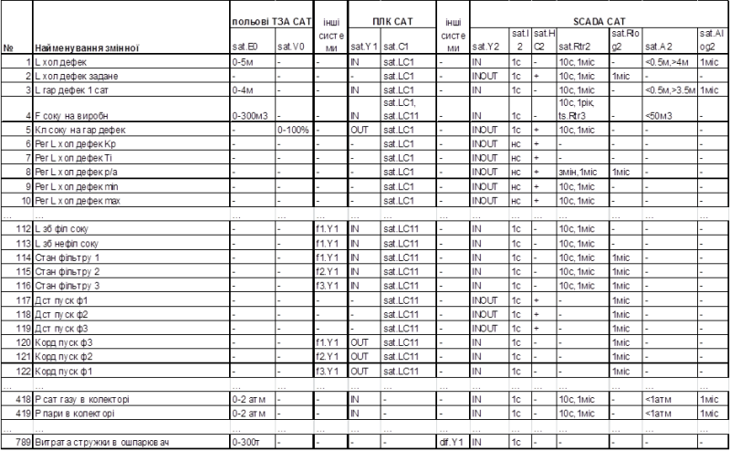
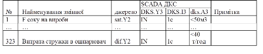
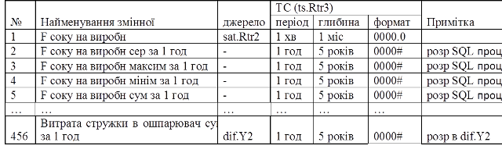

[Зміст](README.md)

## Тема 8. Опис функцій, що автоматизуються

У текстовій частині в описі автоматизованих функцій (П3) пояснюється та уточнюється схема функціональної структури. Зокрема необхідно вказати:

-     перелік функцій/задач та вимоги до періодичності та тривалості їх виконання (беруться з ТЗ);

-     перелік сигналів та даних, які формують інформаційні зв’язки між функціями/задачами;

-     вимоги до періодичності відновлення сигналів та даних на входах функцій/задач. 

Перелік функцій/задач та вимог до них, а також перелік даних можна  розробляти у вигляді таблиць, які зручно доробляти до відомостей конкретного розділу проекту. Таблиці рекомендується розробляти в електронному вигляді (наприклад Excel), для зручності оперування даними (групування, фільтрація тощо). Нижче приведений приклад виконання таких таблиць. 

Загальний перелік функцій АСУТП приводиться в таблиці умовних позначень до схеми функціональної структури. Ряд з цих функцій є узагальнюючими, зміст яких необхідно розкрити. Перелік функцій, які автоматизуються вказується ще на стадії «Технічне завдання. У цьому випадку функції переносяться з ТЗ і уточнюються. У прикладі на рис.1.3 функція «sat.C1» являє собою об’єднання всіх функцій та задач, які виконуються в ПЛК САТ. Приклад фрагменту переліку цих функцій/задач з вказівкою вимог до періодичності виклику та закону регулювання наведений в таблиці 4. 

*Таблиця 4.Перелік функцій та задач управління ПЛК САТ (sat.С1).* 

Ряд функцій АСУТП доречно наводити в контексті змінних процесу. Під ***змінними процесу\*** можна вважати всі вимірювальні, управляючі, конфігураційні канали, які поєднують між собою декілька функцій на різних вузлах. У таб.5 показаний приклад фрагменту переліку змінних для АСУТП САТ. 

*Таблиця.5. Приклад переліку змінних для АСУТП САТ*

Тут кожний запис являє собою окрему змінну, а поля – функції, та уточнення до їх виконання стосовно даної змінної. Враховуючи, що в даному прикладі на польовому рівні використовуються тільки вимірювання та реалізація управляючих дій, для них доречно вказати окремі поля з уточненням по діапазону. Більш детальне уточнення цих та інших функцій (наприклад перетворення «sat.Y0») доречно вказати при розробці схеми автоматизації. Для ПЛК САТ вказані два поля: функція «sat.Y1», де вказується напрямок передачі сигналу; функція «sat.C1», де вказується позначення контуру(-ів) та алгоритму(-ів), де задіяна дана змінна. 

У наведеному прикладі змінні наводяться послідовно відповідно до контуру, що зручно при виділенні для кожного контуру додаткових параметричних змінних алгоритму (Sp, Kp, Ti, Td, тощо). Враховуючи, що джерелом змінних може бути інша підсистема, в прикладі виділене однойменне поле, де вказується позначення функції-джерела. 

Для SCADA САТ, в якості полів вказуються всі функції, які використовуються: для «sat.Y2» вказується напрямок передачі даних; для «sat.I2» – періодичність оновлення на екрані оператора ("нс" – тільки при виклику вікна конфігурації контуру); для «sat.HC2» - можливість операторського управління; для «sat.Rtr2» - періодичність та глибина запису в трендовому архіві; для «sat.Rlog2» - глибина архіву повідомлень; для «sat.A2» - умови спрацювання алярмів; «sat.Alog2» - глибина архіву аварійних повідомлень. «-» в полях означає відсутність використання функції. 

Для функцій інтегрованої АСУ виробництвом наводяться тільки ті функції, які стосуються області проектних робіт з деталізацією інформаційної взаємодії і не наводяться в переліку функцій та змінних АСУТП основного відділення. У прикладі (див. рис.1.3) до них можна віднести функції вузла ПК ДКС та ТС. Ці функції зручно представляти в контексті змінних. 

У таб.6 показаний приклад фрагменту переліку змінних для SCADA ДКС, а у таб.7 для СУБД ТС. Уточнення до функцій SCADA ДКС зроблено по принципу таб.5. Для функції ведення архіву СУБД ТС, крім періодичності та глибини можна вказати формат запису. У прикладі, ведення архіву для змінної «F соку на виробн» передбачено вести ресурсами архівного трендового серверу SCADA SAT (sat.Rtr2), а «Витрата стружки в ошпарювач» ресурсами драйверу СУБД РЧ. У першому випадку статистичні дані для запису в архів ТС розраховуються засобами СУБД (SQL процедур). 

 *Таблиця 6.Перелік змінних для SCADA ДКС.* 

 

*Таблиця 7.Перелік змінних для СУБД ТС.*

 

**Питання для самоконтролю.**

1. Що необхідно вказати в описі автоматизованих функцій?

2. Яку інформацію можна вказати в переліку функцій та задач АС?

3. Поясніть поняття змінних процесу.

4. Яку інформацію доцільно вказувати в переліку змінних процесу для АСУТП?

5. Де доречно показувати функціональне призначення змінних процесу на польовому рівні АСУТП?

6. Як в переліку змінних АСУТП можна показати контур?

7. Які функції доречно описувати на рівні інтегрованої АСУ виробництвом? 

8. Яку інформацію бажано показати в переліку змінних інтегрованої АСУ виробництвом? 

Література: [1-4]

<-- [7. Розробка функціональної структури](lec7.md)

--> [9. Система ідентифікації](lec9.md)