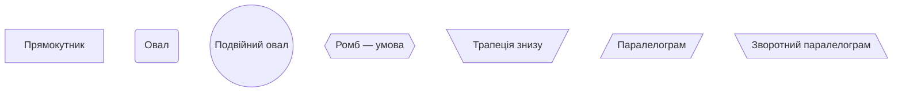
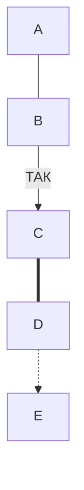
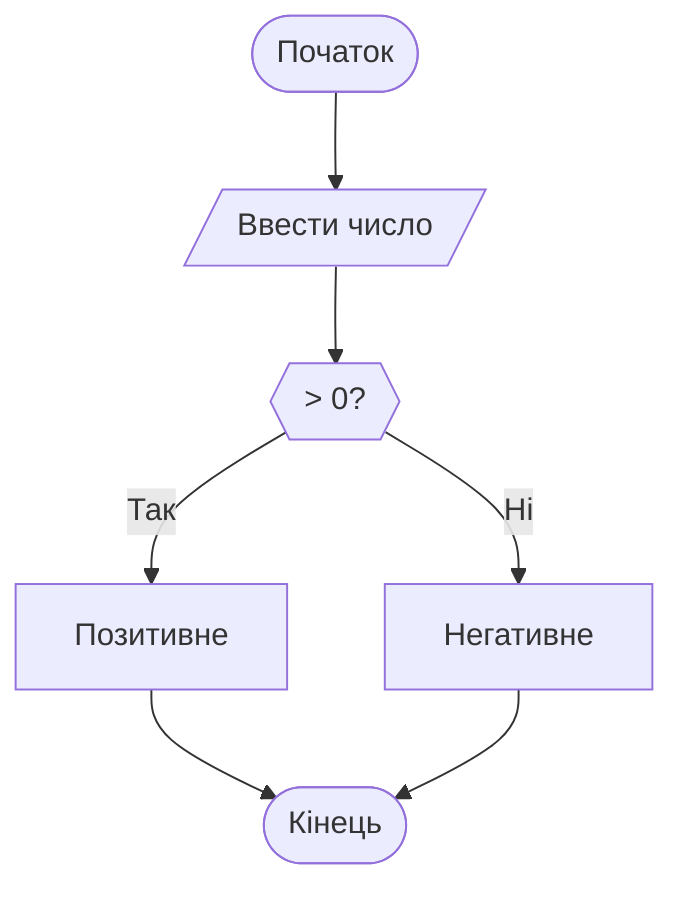

Ось адаптований і компактний переклад основ синтаксису блок-схем (**flowchart**) у Mermaid, придатний для практичного використання:

------

## Flowchart у Mermaid: короткий довідник

### 1. Оголошення схеми

```
flowchart TD
```

- `TD` — напрям зверху вниз (інші: `LR`, `RL`, `BT`).

------

### 2. Вузли (nodes)

```
    A[Прямокутник]
    B(Овал)
    C((Подвійний овал))
    D{{Ромб — умова}}
    E[\Трапеція знизу/] 
	F[/"Паралелограм"/]
    G[\Зворотний паралелограм\]
```




### 3. Зв’язки (arrows)



------

### 4. Текст у вузлах

```mermaid
A["Багаторядковий<br>текст"]
B["**Жирний** <i>Курсив</i>"]
```

> Можна вставляти HTML або Markdown (обмежено).

------

### 5. Приклади умов



------

### 6. Поради

- Назви вузлів (A, B, ...) — ідентифікатори, не відображаються.
- Не використовуйте пробіли в ID (`A B` — помилка, `A_B` — ок).
- Щоб уникнути колізій — додавайте префікси (`step1`, `step2_yes` тощо).

------

### 7. Де тестувати:

- https://mermaid.live
- Підтримується у VSCode, Obsidian, GitHub Docs тощо.

------

Можу доповнити прикладами шаблонів або завдань — хочеш?